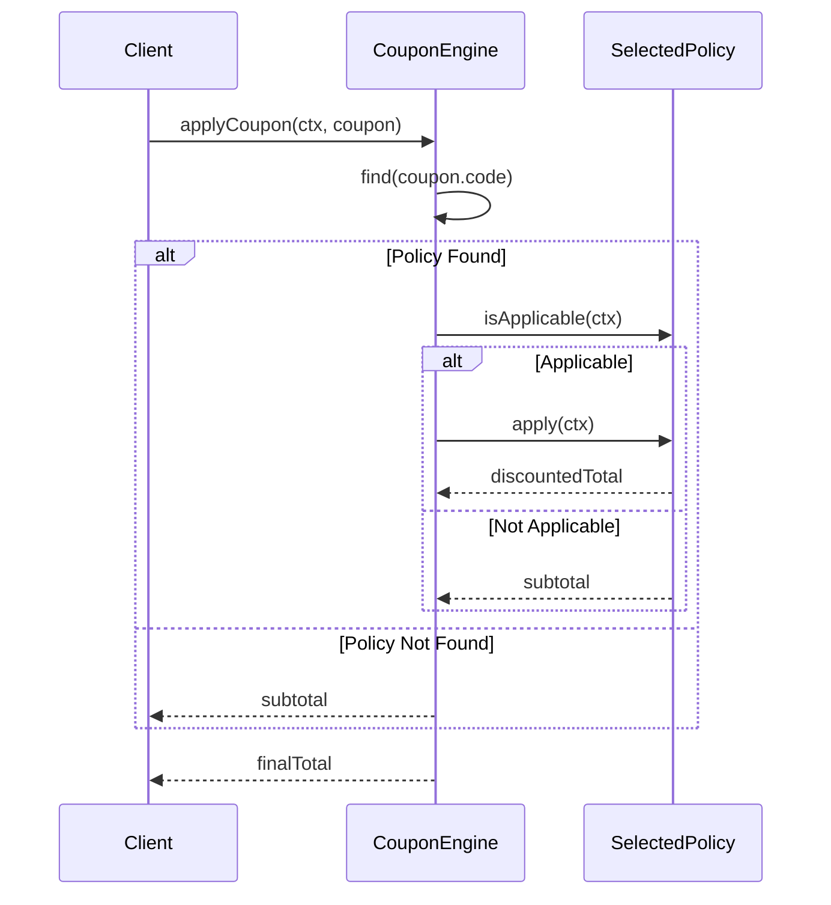

# 第13章：OCPの王道：戦略パターンで差し替え🧠🔁

## この章でできるようになること🎯💖

* **if / switch が増殖する“未来の地獄”**を回避できるようになる😵➡️😌
* 「割引（クーポン）ルール」を **“追加するだけ”** で増やせるようにする🧩✨
* **差し替え口（Strategy）** を作って、変更コストを小さくする💪🌱


---

## 2026ちょいメモ🗒️✨（いま周りはこんな感じ）

* TypeScript は npm 上で **5.9.3** が latest として表示されてるよ📌 ([npm][1])
* テストは Vitest が人気で、npm 上では **4.0.16** が latest 表示だよ🧪⚡ ([npm][2])
* TypeScript は **6.0 が 5.9 と 7.0（ネイティブ版）をつなぐ“橋渡し”**になる方針が出てるよ🔮 ([Microsoft for Developers][3])

（でもね、この章の“設計の考え方”はバージョンが変わってもずっと使えるよ☺️🫶）

---

## まずは“よくある地獄”を見てみよ👀💥（if/switch増殖）

「クーポン種類が増えるたびに switch を編集する」やつ…あるある😇

```ts
// ❌ 悪い例：割引が増えるたびにここを編集するハメに…
type CouponType = "NONE" | "STUDENT" | "RAINY" | "PERCENT10";

export function calcTotalWithCoupon(
  subtotal: number,
  couponType: CouponType,
  isStudent: boolean,
  isRainy: boolean,
): number {
  switch (couponType) {
    case "NONE":
      return subtotal;

    case "STUDENT":
      if (!isStudent) return subtotal; // 条件が増えるとさらに複雑に…
      return Math.max(0, subtotal - 300);

    case "RAINY":
      if (!isRainy) return subtotal;
      return Math.max(0, subtotal - 200);

    case "PERCENT10":
      return Math.max(0, Math.floor(subtotal * 0.9));

    default:
      return subtotal;
  }
}
```

### これ、何がつらいの？😵‍💫🌀

* クーポンが増えるたびに **既存コードを“修正”** する（OCP的にしんどい）🚧
* 既存ケースを壊しやすい（「雨の日割」直したら「学割」が死ぬ…とか）💣
* テストも「でっかい関数」に寄りがちで、追加がしんどくなる🧪💦

---

## OCPの王道💎：「差し替え口」を作る＝Strategy（戦略）パターン🧠🔁

ポイントはこれ👇✨

> **「割引の“やり方”を1つのクラス（またはオブジェクト）に閉じ込める」**
> そして **一覧から選んで使う**（差し替える）🎛️

---

## 今回のミニ題材☕️📦（Campus Café）

* 注文の小計 `subtotal` がある
* クーポンが来たら割引する
* クーポン種類は今後増える（学割・雨割・セット割・期間限定…）😎🎟️

---

## Step1：まず「Strategyの型」を作る🧩✨

```ts
export type OrderContext = {
  subtotal: number;
  isStudent: boolean;
  isRainy: boolean;
};

export type Coupon = {
  code: string; // 例: "STUDENT" / "RAINY" / "PERCENT10"
};

export interface CouponPolicy {
  readonly code: string;
  isApplicable(ctx: OrderContext): boolean;
  apply(ctx: OrderContext): number; // 割引後の合計を返す（0未満は禁止）
}
```

---

## Step2：クーポンごとに「実装を分ける」🧱✨

```ts
export class StudentDiscountPolicy implements CouponPolicy {
  readonly code = "STUDENT";

  isApplicable(ctx: OrderContext): boolean {
    return ctx.isStudent;
  }

  apply(ctx: OrderContext): number {
    return Math.max(0, ctx.subtotal - 300);
  }
}

export class RainyDiscountPolicy implements CouponPolicy {
  readonly code = "RAINY";

  isApplicable(ctx: OrderContext): boolean {
    return ctx.isRainy;
  }

  apply(ctx: OrderContext): number {
    return Math.max(0, ctx.subtotal - 200);
  }
}

export class Percent10OffPolicy implements CouponPolicy {
  readonly code = "PERCENT10";

  isApplicable(_: OrderContext): boolean {
    return true;
  }

  apply(ctx: OrderContext): number {
    return Math.max(0, Math.floor(ctx.subtotal * 0.9));
  }
}
```

---

## Step3：「選んで使う側」を小さく作る🎛️✨（ここが差し替え口の司令塔）

```ts
export class CouponEngine {
  constructor(private readonly policies: readonly CouponPolicy[]) {}

  applyCoupon(ctx: OrderContext, coupon: Coupon | null): number {
    if (!coupon) return ctx.subtotal;

    const policy = this.policies.find(p => p.code === coupon.code);
    if (!policy) return ctx.subtotal; // 未知クーポンは無視（運用でよくある）

    if (!policy.isApplicable(ctx)) return ctx.subtotal;

    return policy.apply(ctx);
  }
}
```




### ここが気持ちいいところ🥹💖

* クーポン追加＝**新しいクラスを足すだけ**🧩
* `switch` に触らないから、既存ロジックを壊しにくい🛡️
* テストも「クーポン単位」で書ける✅

---

## Step4：「登録（一覧に並べる）」を1か所に寄せる📌✨

OCPで大事なのは、**“変更が起きる場所”を1か所に隔離する**ことだよ😊
（この“登録場所”は、追加時に触ってOKな場所として割り切るのがコツ💡）

```ts
// composition root っぽい場所（例: app.ts とか）
const engine = new CouponEngine([
  new StudentDiscountPolicy(),
  new RainyDiscountPolicy(),
  new Percent10OffPolicy(),
] as const);
```

---

## テスト🧪✨（Vitest例）

「学割は学生のときだけ効く」みたいに、**1ポリシー＝1テスト**が超やりやすいよ💖

```ts
import { describe, it, expect } from "vitest";
import { CouponEngine } from "./CouponEngine";
import { StudentDiscountPolicy, RainyDiscountPolicy, Percent10OffPolicy } from "./policies";

describe("CouponEngine", () => {
  const engine = new CouponEngine([
    new StudentDiscountPolicy(),
    new RainyDiscountPolicy(),
    new Percent10OffPolicy(),
  ]);

  it("STUDENT は学生なら -300", () => {
    const total = engine.applyCoupon(
      { subtotal: 1000, isStudent: true, isRainy: false },
      { code: "STUDENT" },
    );
    expect(total).toBe(700);
  });

  it("STUDENT は学生じゃないなら適用されない", () => {
    const total = engine.applyCoupon(
      { subtotal: 1000, isStudent: false, isRainy: false },
      { code: "STUDENT" },
    );
    expect(total).toBe(1000);
  });
});
```

---

## “追加が楽”を体験しよ🎉✨（新クーポンを増やす）

例：**「朝割（MORNING）」：午前なら -150** を追加したい☀️🥐

やることは👇だけ！

1. `MorningDiscountPolicy` を新規作成
2. 登録リストに 1 行足す

既存の `StudentDiscountPolicy` や `RainyDiscountPolicy` は **一切いじらない**💎
→ これが OCP のおいしいところ😋✨

---

## TypeScriptでの“Strategy”はクラスじゃなくてもOK🙆‍♀️💡（関数戦略）

軽めに書きたいときは、こういう「オブジェクト戦略」でもアリだよ🌸

```ts
type CouponPolicy2 = {
  code: string;
  isApplicable(ctx: OrderContext): boolean;
  apply(ctx: OrderContext): number;
};

const studentPolicy: CouponPolicy2 = {
  code: "STUDENT",
  isApplicable: ctx => ctx.isStudent,
  apply: ctx => Math.max(0, ctx.subtotal - 300),
};
```

「小さく始めたい」ならこっち、
「将来ロジックが太りそう」ならクラス、みたいに選ぶといいよ☺️🎛️

---

## AI拡張（Copilot / Codex）に頼むときの“勝ちテンプレ”🤖✨

そのまま投げやすい指示だよ〜🫶

* 「`CouponPolicy` を実装する `MorningDiscountPolicy` を追加して。`OrderContext` に `hour` を足して、午前中だけ -150 にして。既存ファイルの変更は最小にして」🧠
* 「Vitest で `MORNING` のテストを2本（適用される/されない）追加して」🧪
* 「未知の `coupon.code` のときは小計を返すテストも追加して」🛡️

💡最後にこれだけは人間がチェックしてね👇

* **0未満にならない？**（`Math.max(0, ...)`）
* **“登録場所”以外を触ってない？**（OCP崩壊してない？）
* **条件（isStudent/isRainy）がポリシー内に閉じてる？**（Engineが太ってない？）

---

## ミニ課題📝✨（やってみよ〜！）

1. `PERCENT20`（20%オフ）を追加してみよう🎟️
2. 「雨の日＋学割」のように *複数クーポン* を扱いたいとしたら、Engineをどう変える？🤔
3. `switch` 版から Strategy 版にしたときのメリットを、友達に1分で説明してみて🎤💖

---

次の章（第14章）は「抽象化しすぎ注意⚠️」だから、この章のうちに **“差し替え口が気持ちいい感覚”** をつかめると最高だよ〜🥰✨

[1]: https://www.npmjs.com/package/typescript?utm_source=chatgpt.com "TypeScript"
[2]: https://www.npmjs.com/package/vitest?utm_source=chatgpt.com "vitest"
[3]: https://devblogs.microsoft.com/typescript/progress-on-typescript-7-december-2025/?utm_source=chatgpt.com "Progress on TypeScript 7 - December 2025"
