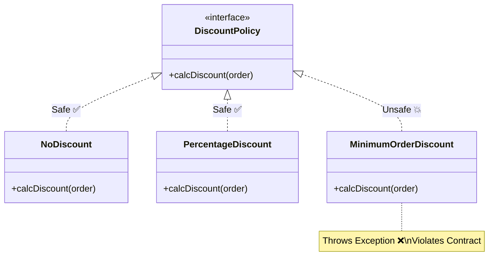

# 第16章：LSP（置換可能性）ってなに？🔁🧩

「**同じ型（親）として扱えるなら、どの実装（子）に差し替えても“壊れない”**」…これがLSPだよ〜😊
設計の世界では **“差し替え可能であること＝安心して拡張できること”** なので、めちゃ大事🔥

ちなみに本日時点だと TypeScript は **5.9.3 が Latest**（安定版の最新）だよ🆕✨ ([GitHub][1])
（この章の内容はバージョンに強く依存しないけど、型まわりの改善は続いてるよ〜！）


---

## 1. この章でできるようになること🎯💖

* LSPを **「差し替えても壊れない約束」** として説明できる🗣️✨
* 「型は合ってるのにバグる😇」の正体がわかる🔍💥
* TypeScriptで **LSP違反を“テストで検知”** する基本が身につく✅🧪
* 「例外投げる実装」「意味が変わる実装」を見抜ける👀⚡

---

## 2. LSPを一言でいうと？🧸🔁


> **“親のつもりで使ったとき、子に変えても期待が崩れないこと”** 💡✨

LSPは、型の互換（代入できる/できない）よりも **“振る舞いの互換”** を気にする考え方だよ🧠
もともとの厳密な定義は「親で成り立つ性質が子でも成り立つべき」という “行動的サブタイプ” の考え方に基づいてるよ📚 ([cs.cmu.edu][2])

---

## 3. TypeScriptでLSPが“ややこしく見える”理由😵‍💫🌀


TypeScriptの型の互換は **構造的（structural）** だよね。
つまり「名前（クラス名）じゃなくて、**メンバーの形（shape）** が合えばOK」になりやすいの🧩 ([TypeScript][3])

だから…

* ✅ **型は合う（コンパイル通る）**
* ❌ **でも振る舞いが違って壊れる**

が普通に起きる😇💥
ここでLSPが効いてくるよ〜！

---

## 4. LSPのコアは「契約（約束）」📜🤝✨

親（インターフェース/基底クラス）が提供するのは、ざっくり言うと **契約** だよ💍✨

### よくある「契約の破り方」3点セット📛💥


1. **前提条件を厳しくする**（親より“うるさくなる”）😤
2. **結果の保証を弱くする**（親より“雑になる”）😵
3. **例外を増やす/意味を変える**（呼び出し側が想定できない）💣

このへんは “前提条件・事後条件・不変条件” の話として定番だよ📘 ([ウィキペディア][4])

---

## 5. ミニ題材：Campus Café の「割引」☕️🎟️✨


「注文合計に割引を適用する」ってよくあるよね😊
ここで **DiscountPolicy を差し替え可能** にしていくよ〜！

### 5.1 まずは契約（interface）を作る🧾✨

```ts
// src/domain/money.ts
export type Money = number;

// src/domain/order.ts
export type Order = {
  subtotal: Money; // 税抜き合計でも税込でもOK。ここでは「合計」として扱うよ
};

// src/domain/discount/discountPolicy.ts
import type { Money } from "../money";
import type { Order } from "../order";

export interface DiscountPolicy {
  /**
   * 契約（ここが超重要！）
   * - 必ず 0 以上の割引額を返す
   * - 割引額は注文合計を超えない
   * - 例外を投げない（= 呼び出し側が安心して使える）
   */
  calcDiscount(order: Order): Money;
}
```

ポイントは「コメントの契約」だよ📜✨
（型だけじゃ“振る舞い”までは表せないから、契約を言葉 + テストで固める💪）

---

## 6. OKな実装例（置換しても壊れない）✅😊

```ts
// src/domain/discount/noDiscount.ts
import type { DiscountPolicy } from "./discountPolicy";
import type { Order } from "../order";

export class NoDiscount implements DiscountPolicy {
  calcDiscount(_order: Order): number {
    return 0;
  }
}

// src/domain/discount/percentageDiscount.ts
import type { DiscountPolicy } from "./discountPolicy";
import type { Order } from "../order";

export class PercentageDiscount implements DiscountPolicy {
  constructor(private readonly rate: number) {} // 例: 0.1 = 10%

  calcDiscount(order: Order): number {
    const raw = order.subtotal * this.rate;
    const discount = Math.max(0, raw);
    return Math.min(discount, order.subtotal);
  }
}
```

この2つは、どっちに差し替えても呼び出し側が困らない👍✨

---

## 7. LSP違反の例（型は合うのに壊す）😈💥


### 7.1 「条件を満たさないと例外」←これ超ありがち🥶

```ts
// src/domain/discount/minimumOrderDiscount.ts
import type { DiscountPolicy } from "./discountPolicy";
import type { Order } from "../order";

export class MinimumOrderDiscount implements DiscountPolicy {
  constructor(
    private readonly minimum: number,
    private readonly amount: number
  ) {}

  calcDiscount(order: Order): number {
    if (order.subtotal < this.minimum) {
      // 💥 LSP違反：親の契約（例外を投げない）を破ってる
      throw new Error("注文が最低金額に届いてません");
    }
    return Math.min(this.amount, order.subtotal);
  }
}
```

呼び出し側が `DiscountPolicy` を信じて使った瞬間に落ちる😇
これが **「差し替えたら壊れる」** の代表例だよ💣



---

## 8. “LSPを守れる”ように直そう🛠️✨

「最低金額に届かなかったら割引ゼロ」でいいよね？😊
だったら例外じゃなくて **0 を返す** のが契約に合う✅

```ts
// src/domain/discount/minimumOrderDiscount.ts
import type { DiscountPolicy } from "./discountPolicy";
import type { Order } from "../order";

export class MinimumOrderDiscount implements DiscountPolicy {
  constructor(
    private readonly minimum: number,
    private readonly amount: number
  ) {}

  calcDiscount(order: Order): number {
    if (order.subtotal < this.minimum) {
      return 0; // ✅ 契約を守る：落とさない
    }
    return Math.min(this.amount, order.subtotal);
  }
}
```

これで **NoDiscount / PercentageDiscount / MinimumOrderDiscount** を
どれに変えても “同じ前提で呼べる” になったよ〜🎉✨

---

## 9. LSPは「テスト」で守るのが最強🧪🛡️✨


TypeScriptは構造的型付けだから、**型だけでLSPは保証できない**の。([TypeScript][3])
だから **契約テスト** を作って「差し替えてもOK」を自動チェックするよ✅

```ts
// test/discountPolicy.contract.test.ts
import { describe, it, expect } from "vitest";
import type { DiscountPolicy } from "../src/domain/discount/discountPolicy";
import { NoDiscount } from "../src/domain/discount/noDiscount";
import { PercentageDiscount } from "../src/domain/discount/percentageDiscount";
import { MinimumOrderDiscount } from "../src/domain/discount/minimumOrderDiscount";

type Order = { subtotal: number };

const policies: DiscountPolicy[] = [
  new NoDiscount(),
  new PercentageDiscount(0.1),
  new MinimumOrderDiscount(1000, 200),
];

const samples: Order[] = [
  { subtotal: 0 },
  { subtotal: 500 },
  { subtotal: 1000 },
  { subtotal: 5000 },
];

describe("DiscountPolicy contract (LSPチェック) 🔁🧩", () => {
  it("どの実装でも例外を投げない🥹", () => {
    for (const p of policies) {
      for (const o of samples) {
        expect(() => p.calcDiscount(o)).not.toThrow();
      }
    }
  });

  it("割引額は 0〜subtotal の範囲に収まる🎯", () => {
    for (const p of policies) {
      for (const o of samples) {
        const d = p.calcDiscount(o);
        expect(d).toBeGreaterThanOrEqual(0);
        expect(d).toBeLessThanOrEqual(o.subtotal);
      }
    }
  });

  it("割引後合計がマイナスにならない💰", () => {
    for (const p of policies) {
      for (const o of samples) {
        const d = p.calcDiscount(o);
        const total = o.subtotal - d;
        expect(total).toBeGreaterThanOrEqual(0);
      }
    }
  });
});
```

このテストが通る限り、**どの DiscountPolicy に差し替えても大丈夫**って自信が持てる💪✨
これがLSPの実戦感だよ〜🔥

---

## 10. ちょい豆知識：関数型の「差し替え」もLSPっぽい🧠🧷

LSPはクラスだけじゃなく、**関数の型**にも出てくるよ〜！
TypeScriptには `strictFunctionTypes` で「関数引数のチェックがより厳密になる」話があるんだけど、これは安全性（置換の事故を減らす）に関係するよ🧯✨ ([TypeScript][5])

細かい理屈はこの章では深入りしないけど、合言葉だけ👇

* ✅ **戻り値は“同じか、より具体的（狭く）”でもOK**
* ✅ **引数は“同じか、より受け入れる（広く）”が安全**

「差し替えるときに、呼び出し側が困らない方向へ」って覚えると◎😊

---

## 11. AI（Copilot / Codex）に頼るときのコツ🤖🧠✨

AIは実装案を出すの得意だけど、**契約を破るコード**も平気で出してくるよ😇💥
だからおすすめはこれ👇

### おすすめプロンプト例💬✨

* 「`DiscountPolicy` の契約を満たす **contract test** をVitestで書いて」🧪
* 「この実装、例外投げてるけど **LSP的に問題ある？** 修正案3つ」🔍
* 「割引額が `0..subtotal` に収まることをテストで保証したい」🎯

そして最後は **人間が採用判断** するのが勝ち筋だよ👩‍💻✨

---

## 12. まとめ（この章の持ち帰り）🎁💖

* LSPは「親のつもりで使ったら、子に変えても壊れない」🔁✨
* TypeScriptは構造的型付けだから、**型OK＝LSP OK ではない**🧩 ([TypeScript][3])
* 契約（コメント）＋契約テスト（同じテストを全部の実装に当てる）で守る🧪🛡️
* 「例外を増やす」「意味を変える」は赤信号📛🚨

---

## 13. ミニ課題（提出用）📚✨

### 課題A（やさしめ）😊

`PercentageDiscount(0.2)` を追加して、契約テストが全部通ることを確認✅🎉

### 課題B（実戦）🔥

「平日だけ割引」みたいな `WeekdayDiscount` を作ってみて、
**例外を投げず**、**0..subtotal** を守って、契約テストを通してね📅🎟️✨

### 課題C（観察力）👀

わざとLSP違反を1個作って（例：割引が subtotal を超える / 例外投げる）、
契約テストが落ちるのを確認して、直して復活させてみて〜😈➡️😇✨

---

次の第17章は「**LSP違反の典型パターン集**」で、あるある地雷をまとめて踏みに行くよ👣💥（そして回避する😎✨）

[1]: https://github.com/microsoft/typescript/releases "Releases · microsoft/TypeScript · GitHub"
[2]: https://www.cs.cmu.edu/~wing/publications/LiskovWing94.pdf?utm_source=chatgpt.com "A behavioral notion of subtyping"
[3]: https://www.typescriptlang.org/docs/handbook/type-compatibility.html?utm_source=chatgpt.com "Documentation - Type Compatibility"
[4]: https://en.wikipedia.org/wiki/Liskov_substitution_principle?utm_source=chatgpt.com "Liskov substitution principle"
[5]: https://www.typescriptlang.org/docs/handbook/release-notes/typescript-2-6.html?utm_source=chatgpt.com "Documentation - TypeScript 2.6"
