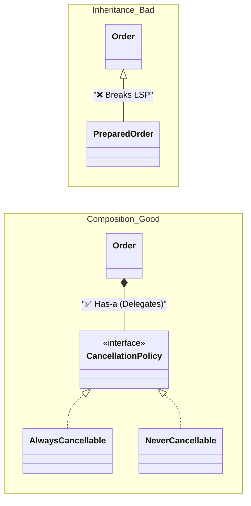

# 第18章：LSPの解決：継承より合成（合体だ！）🧱🤝

この章はね、**「継承で“それっぽく”作ったら、あとで爆発した…💥」**を回避する回だよ😊
ポイントはひとつ！

✅ **“〜である(is-a)” じゃなくて “〜を持つ(has-a)” で組み立てる（＝合成 / Composition）** 🧩✨


---

## 1. この章でできるようになること🎯✨

* **LSP違反を起こしやすい“危険な継承”**を見抜ける👀⚠️
* 継承で作った設計を、**合成（部品の組み合わせ）**に直せる🔧🧱
* 「差し替えても壊れない」形に寄せる考え方が身につく🛡️😊

---

## 2. まず確認：なんで継承がLSPを壊しやすいの？😵‍💫


LSPって「**親として使えるなら、子も同じように使えなきゃダメ**」だよね🔁✨

ところが継承って、こうなりがち👇

* 親クラスが「できる」前提で持ってる機能を
* 子クラスが「やっぱ無理🥺」って **例外投げたり / 無視したり**する

これ、**置換できてない**からLSP違反💥

---

## 3. 例題：注文キャンセルでLSPが崩れるやつ📦💣


「注文(Order)はキャンセルできるよね？」って気持ちで、こう書いちゃう例👇

```ts
// ❌ ありがちな継承設計（LSPが割れやすい）
class Order {
  constructor(public readonly id: string) {}

  cancel() {
    // キャンセル処理（在庫戻す、返金する、など）
    console.log(`[${this.id}] canceled`);
  }
}

class PreparedOrder extends Order {
  override cancel() {
    // 😇 「調理済みだからキャンセル不可！」という現実…
    throw new Error("Prepared order cannot be canceled.");
  }
}

function cancelOrder(order: Order) {
  // 「Orderならキャンセルできる」前提で呼んでる
  order.cancel();
}

cancelOrder(new Order("A-001"));          // ✅ OK
cancelOrder(new PreparedOrder("B-002"));  // 💥 実行時に例外！
```

はい、これが **LSP違反あるある**📛
`cancelOrder` は `Order` を受け取ってるのに、**子を入れたら壊れる**…😇

---

## 4. 解決の基本：継承をやめて「キャンセルできるか」を部品にする🧱🤝

ここで出番なのが **合成（Composition）**！✨
注文そのものを継承で増やすんじゃなくて、

✅ **注文(Order)が“キャンセルのルール”を持つ**（has-a）
✅ **ルールを差し替える**（Strategy）

って感じにするよ🎯



---

## 5. 解決策A：Strategyで「キャンセル方針」を合成する🎛️✨


### 5-1. まず “方針” の口（インターフェース）を作る🧩

```ts
type CancelResult =
  | { ok: true }
  | { ok: false; reason: string };

interface CancellationPolicy {
  cancel(orderId: string): CancelResult;
}
```

### 5-2. 「キャンセルOK」「キャンセルNG」の部品を作る🧱

```ts
class AlwaysCancellable implements CancellationPolicy {
  cancel(orderId: string): CancelResult {
    console.log(`[${orderId}] canceled ✅`);
    return { ok: true };
  }
}

class NeverCancellable implements CancellationPolicy {
  constructor(private readonly reason: string) {}

  cancel(orderId: string): CancelResult {
    console.log(`[${orderId}] cancel rejected ❌`);
    return { ok: false, reason: this.reason };
  }
}
```

### 5-3. Orderは “方針を持つ” だけ（合成！）🤝

```ts
class Order {
  constructor(
    public readonly id: string,
    private readonly cancellationPolicy: CancellationPolicy,
  ) {}

  cancel(): CancelResult {
    return this.cancellationPolicy.cancel(this.id);
  }
}
```

### 5-4. 使う側は “Orderを差し替えても壊れない” 🎉

```ts
function cancelOrder(order: Order) {
  const result = order.cancel();

  if (!result.ok) {
    console.log(`キャンセルできなかったよ🥺 理由: ${result.reason}`);
  }
}

const newOrder = new Order("A-001", new AlwaysCancellable());
const prepared = new Order("B-002", new NeverCancellable("調理済みだからだよ🍳"));

cancelOrder(newOrder);  // ✅
cancelOrder(prepared);  // ✅（例外で壊れない！）
```

**ポイント**💡

* “キャンセルできない注文” を **別クラスとして継承で表現しない**
* 「できない」を **例外で表現しない**（置換性が割れやすい💥）
* “ルール” を **差し替え可能な部品**にしておく🧩✨

---

## 6. 解決策B：Stateで「注文の状態」を合成する🧠🧱（さらに強い）


キャンセル以外にも「支払い」「調理」「受け渡し」…って増えてくると、
Strategyより **State（状態オブジェクト）** がスッキリしやすいよ😊

```ts
type OrderActionResult =
  | { ok: true }
  | { ok: false; reason: string };

interface OrderState {
  cancel(orderId: string): OrderActionResult;
}

class CreatedState implements OrderState {
  cancel(orderId: string): OrderActionResult {
    console.log(`[${orderId}] canceled ✅`);
    return { ok: true };
  }
}

class PreparedState implements OrderState {
  cancel(orderId: string): OrderActionResult {
    return { ok: false, reason: "調理済み🍳" };
  }
}

class Order {
  constructor(
    public readonly id: string,
    private state: OrderState,
  ) {}

  cancel(): OrderActionResult {
    return this.state.cancel(this.id);
  }

  // 状態遷移（例）
  markPrepared() {
    this.state = new PreparedState();
  }
}
```

✅ 「状態が増える未来」にめちゃ強い💪✨
（しかも **継承の爆発**を回避できるよ🔥）

---

## 7. 「継承 vs 合成」迷ったときの判断基準🧭✨


### 継承が向いてるのはこんな時👇

* 本当に “〜である(is-a)” が自然（例：`AdminUser is-a User`）
* 親の契約（やること・できること）が **子でも必ず守れる**
* 親の設計が **今後ほぼ変わらない**（ここ大事！）

### 合成が向いてるのはこんな時👇

* 「できる／できない」が状況で変わる（状態・制約・条件）😵
* 子クラスで **例外投げたくなってきた**⚠️
* `override` が増えて **親の意味が薄れてきた**
* “種類” より “振る舞い” を増やしたい（差し替えたい）🔁✨

---

## 8. AI（Copilot/Codex系）に手伝わせるコツ🤖🧠✨


合成に直すとき、AIにはこう頼むと強いよ👍

* 「この継承設計、LSP違反になりそう。**Strategy（またはState）で合成に直して**」
* 「**例外を投げない設計**にして、代わりにResult型で返して」
* 「呼び出し側の変更が最小になるように（API互換に寄せて）」

そして最後に必ずこれ👇

✅ **“元のユースケースが壊れてないか” を自分で確認**🔍
（AIはそれっぽく書くけど、契約がズレてることあるよ〜⚠️）

---

## 9. ミニ課題（手を動かそう）📝✨

### 課題1：LSP違反をわざと作る😈

* `Order` を継承した `PreparedOrder` で `cancel()` を `throw` してみて💥
* 呼び出し側が壊れるのを確認👀

### 課題2：Strategyで直す🧱

* `CancellationPolicy` を作って

  * `AlwaysCancellable`
  * `NeverCancellable`
    を実装してみよう✨

### 課題3：Stateで拡張🧠

* `CreatedState / PaidState / PreparedState` を作って
  `cancel()` の結果が状態で変わるようにしてみよう🔁

---

## 10. まとめ🎀✨（今日の合言葉！）

🎯 **「継承で種類を増やす」より「合成で振る舞いを組み立てる」**
これがLSPを守る近道だよ〜🧱🤝✨

### 最終チェックリスト✅

* 子クラスで `throw` や「何もしない」が出てきてない？⚠️
* “できない” を **例外**で表現してない？💥
* “振る舞い” を **部品（Strategy/State）**に分離できそう？🧩
* 差し替えても呼び出し側が壊れない？🔁🛡️

---

## （ちょい最新メモ）いまのTypeScript周辺の動き🧠✨

* TypeScript は **5.9 系のリリースノート**が公開されていて、`import defer` などの新要素が入ってるよ📦✨ ([TypeScript][1])
* そして Microsoft の公式ブログでは、**TypeScript 6.0 を“橋渡し”として、7.0（ネイティブ実装）へ進む**話が出てるよ🚀 ([Microsoft for Developers][2])
* テストは Vitest が引き続き強くて、**Vitest 4.0 で Browser Mode が安定化**した流れもあるよ🧪✨ ([Vitest][3])

---

次の第19章は、この「差し替えOKな設計」を **型とテストでガチガチに守る回**になるよ🛡️✅
この章のコードをベースに、**“同じテストが全部の実装で通る”**をやるとめちゃ気持ちいいよ〜😆🎉

[1]: https://www.typescriptlang.org/docs/handbook/release-notes/typescript-5-9.html?utm_source=chatgpt.com "Documentation - TypeScript 5.9"
[2]: https://devblogs.microsoft.com/typescript/progress-on-typescript-7-december-2025/?utm_source=chatgpt.com "Progress on TypeScript 7 - December 2025"
[3]: https://vitest.dev/blog/vitest-4?utm_source=chatgpt.com "Vitest 4.0 is out!"
