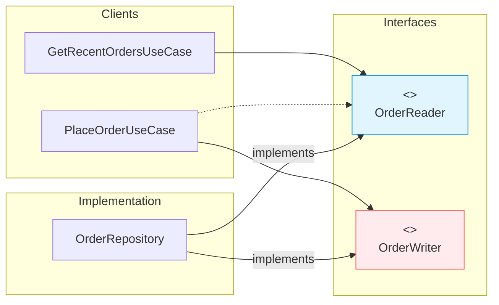

# 第21章：ISPの分割テク（役割ごとに薄く）🧻✨

〜Read/Write分離・Query/Command分離で「依存を軽く」するよ〜😊🌸


---

## 1. この章でできるようになること 🎯✨

* 「でっかい interface（全部入り）」を見て、**分割の軸**を思いつけるようになる🧠💡
* **Read/Write 分離**（読むだけ / 書くだけ）を、Repositoryで自然にできる📚✍️
* **Query/Command 分離**（取得 / 更新）を、UseCaseの設計に落とし込める🔁✨
* 「依存する側（呼ぶ側）」が、**必要最小限だけ**依存するようにできる🪶😊

---

## 2. まずは超ざっくり：ISPって何がうれしいの？🧸✨

ISP（Interface Segregation Principle）は、ひとことで言うと…

> **使わない機能まで依存させない**（持たせない）✂️💖


### ありがちな地獄🔥

* `Repository` なのに、読む・書く・検索・削除・集計・CSV出力・キャッシュ…ぜんぶ入ってる😵‍💫
* 「読むだけ」の機能なのに、`save()` とか `delete()` にも依存してる
  → テストでモックしなきゃいけないメソッドが増えてしんどい🥲🧪
* 実装クラスも「全部実装しなきゃ」でつらい😭

### ISPのゴール🌈

* 依存が軽い → **変更に強い**💪✨
* テストが楽 → **最小のモックでOK**✅
* 実装が楽 → **必要な契約だけ守ればいい**🎯

---

## 3. 分割テク①：Read/Write 分離（読む用・書く用）📚✍️✨

これは超強い定番！Repositoryで特に効くよ😊

### ダメ例：全部入り Repository（肥大化）📛

```ts
export interface OrderRepository {
  findById(id: string): Promise<Order | null>;
  findRecent(limit: number): Promise<Order[]>;
  save(order: Order): Promise<void>;
  delete(id: string): Promise<void>;
  exists(id: string): Promise<boolean>;
}
```

この `OrderRepository` に、**読むだけの画面**も、**書くだけの処理**も、ぜんぶ依存しちゃう😵‍💫

---

### ✅ 分割例：読み取り用 / 更新用に分ける 🧻✨


```ts
export interface OrderReader {
  findById(id: string): Promise<Order | null>;
  findRecent(limit: number): Promise<Order[]>;
  exists(id: string): Promise<boolean>;
}

export interface OrderWriter {
  save(order: Order): Promise<void>;
  delete(id: string): Promise<void>;
}
```

これで、たとえば「注文履歴を見る」UseCaseは `OrderReader` だけでOK📚✨
「注文確定」UseCaseは `OrderWriter` を使う（必要なら Reader も使う）✍️✨



---

### ⭐ “依存する側” を薄くする（ここが主役！）👑✨


#### 注文履歴（読むだけ）UseCase

```ts
export class GetRecentOrdersUseCase {
  constructor(private readonly orderReader: OrderReader) {}

  async execute(limit: number) {
    return this.orderReader.findRecent(limit);
  }
}
```

読むだけなのに `save()` をモック…みたいなのが消える！🎉
テストもシンプル🧪✨

---

## 4. 分割テク②：Query / Command 分離（取得と更新を混ぜない）🔁✨

ここは「設計の考え方」を一段レベルアップさせるやつ〜😊🌟

### CQS（Command–Query Separation）って考え方🧠


* **Query**：状態を変えずに「情報を返す」
* **Command**：状態を変える（基本「返さない」か、返しても “結果” だけ）
  この考え方が有名だよ📘✨ ([ウィキペディア][1])

さらに大きな設計として CQRS（読み取りと更新をシステム的に分ける）もあるよ〜🧩✨ ([Kurrent - event-native data platform][2])
（この章では “小さめに” 使う感じでOK😊）

---

### ✅ まずはメソッドを「混ぜない」練習🧸✨

#### やりがち（Queryなのに更新しちゃう）📛

```ts
// ❌ 履歴を取るだけのはずが、ついでに閲覧回数を更新してる…！
async getOrderAndIncrementViewCount(id: string): Promise<Order | null> {
  const order = await this.repo.findById(id);
  if (order) {
    order.viewCount++;
    await this.repo.save(order);
  }
  return order;
}
```

これ、呼ぶ側からすると「取得」のつもりなのに副作用がある😵‍💫


バグの温床〜〜〜😭💥

#### ✅ 分ける（Query / Command）✨

```ts
// Query: 取得だけ
async getOrder(id: string): Promise<Order | null> {
  return this.orderReader.findById(id);
}

// Command: 更新だけ
async incrementOrderViewCount(id: string): Promise<void> {
  const order = await this.orderReader.findById(id);
  if (!order) return;

  order.viewCount++;
  await this.orderWriter.save(order);
}
```

呼ぶ側も意図が明確で、テストも分けやすい🧪✨
「取得しただけなのにDBが更新される」みたいな事故が減るよ🚑💖

---

## 5. 分割テク③：用途（ユースケース）で分ける 🎯✨

「読む/書く」以外でも、**利用者（クライアント）ごと**に分けるのが強いよ😊

### 例：注文の “集計” だけ欲しい人📊

履歴画面が欲しいのは「注文一覧」だけじゃなくて、「売上集計」もあるかも！

```ts
export interface OrderStatsReader {
  sumTotalPriceByDay(date: string): Promise<number>;
  countOrdersByDay(date: string): Promise<number>;
}
```

`OrderReader` と `OrderStatsReader` を分けると、
一覧画面に集計メソッドが混ざって太るのを防げるよ🧻✨

---

## 6. TypeScriptならではの “薄くする道具” 🧰✨


### 6-1. `Pick` / `Omit` で「既存interfaceから切り出す」✂️

「いきなり全部書き直すのめんどい🥲」って時の味方！

```ts
export interface OrderRepository {
  findById(id: string): Promise<Order | null>;
  findRecent(limit: number): Promise<Order[]>;
  save(order: Order): Promise<void>;
  delete(id: string): Promise<void>;
  exists(id: string): Promise<boolean>;
}

export type OrderReader = Pick<OrderRepository, "findById" | "findRecent" | "exists">;
export type OrderWriter = Pick<OrderRepository, "save" | "delete">;
```

移行がめちゃスムーズになるよ🚀✨

---

### 6-2. 実装クラスは「複数interfaceを実装してOK」🤝

```ts
export class InMemoryOrderRepository implements OrderReader, OrderWriter {
  private readonly map = new Map<string, Order>();

  async findById(id: string) {
    return this.map.get(id) ?? null;
  }

  async findRecent(limit: number) {
    return Array.from(this.map.values()).slice(0, limit);
  }

  async exists(id: string) {
    return this.map.has(id);
  }

  async save(order: Order) {
    this.map.set(order.id, order);
  }

  async delete(id: string) {
    this.map.delete(id);
  }
}
```

UseCase側は薄い interface だけ見てるから、差し替えも楽ちん🎭✨

---

### 6-3. `satisfies` で「余計に型を潰さずに」契約チェック✅✨

`satisfies` は「型の条件を満たしてるか」確認しつつ、値の具体性も保ちやすい便利機能だよ🧠💎 ([betterstack.com][3])

```ts
const orderReaderMock = {
  findById: async (_id: string) => null,
  findRecent: async (_limit: number) => [],
  exists: async (_id: string) => false,
} satisfies OrderReader;
```

モック作る時にかなり気持ちいい😊✨

---

## 7. ハンズオン：Campus Caféで Repository を分割しよう☕️📦✨

### Step 0：状況（Before）😵‍💫

* `OrderRepository` が肥大化
* `GetRecentOrdersUseCase` が `save/delete` まで依存してる

### Step 1：Reader/Writer を作る✂️

* `OrderReader` と `OrderWriter` を定義
* まずは `Pick` で切り出しでもOK✨

### Step 2：UseCaseのコンストラクタを差し替える🔁

* 履歴系UseCase → `OrderReader` だけ受け取る
* 注文確定UseCase → `OrderWriter`（必要ならReaderも）

### Step 3：テストが軽くなったのを体験する🧪🎉

* 履歴UseCaseのテスト：読む系だけモック
* 注文確定UseCase：書く系だけモック or インメモリ実装でOK

---

## 8. よくある失敗あるある⚠️（ここ大事！）

### 8-1. 分けすぎて迷子🌀


* interface が細かすぎて、どれ使うの？状態に
  → **“クライアント視点”**で割るとちょうどよくなるよ😊

### 8-2. 「とりあえず IRepository」みたいに抽象が雑😇

* 抽象名が広すぎると、すぐ肥大化する
  → `OrderReader / OrderWriter` みたいに、**用途が名前に出る**のが◎✨

### 8-3. Queryなのに副作用（更新）が混ざる💥

* 取得しただけで状態が変わるのは、追跡が地獄
  → CQS意識で分けると事故減るよ ([ウィキペディア][1])

---

## 9. AI活用（Copilot / Codex系）で爆速にするコツ🤖✨

### 使えるお願いテンプレ📝

* 「このinterface、クライアントごとに分割案を出して。Read/WriteとQuery/Commandも候補に入れて」
* 「分割後の命名案と、UseCase側の依存の置き換えも提案して」
* 「分割しすぎを避けるための、最小構成案もください」

### 最後は人間がチェック👀✨

* 「誰が使うの？」（クライアントは誰？）
* 「その人に不要なメソッド混ざってない？」
  この2つだけでも品質上がるよ😊🌸

---

## 10. まとめ（今日の持ち帰り）🎁✨

* ISPのコツは **“必要な人に必要な分だけ”** 🧻💖
* 強い分割軸はこれ👇

  * **Read / Write 分離**📚✍️
  * **Query / Command 分離**🔁✨（CQSの考え方 ([ウィキペディア][1])）
  * **用途（ユースケース）分離**🎯
* TypeScriptでは `Pick/Omit` や `satisfies` がめっちゃ便利🧰💎 ([betterstack.com][3])

---

## 次章の予告👀✨（第22章）

次はこの分割テクを、**通知まわり（Email/アプリ通知/ログ）**に当てて、
「必要な通知だけ依存する」設計にしていくよ〜🔔📦💖

準備はOK？😊🎉

[1]: https://en.wikipedia.org/wiki/Command%E2%80%93query_separation?utm_source=chatgpt.com "Command–query separation"
[2]: https://www.kurrent.io/cqrs-pattern?utm_source=chatgpt.com "A Beginner's Guide to CQRS - Kurrent"
[3]: https://betterstack.com/community/guides/scaling-nodejs/typescript-as-satisfies-type/?utm_source=chatgpt.com "TypeScript as vs satisfies vs Type Annotations"
