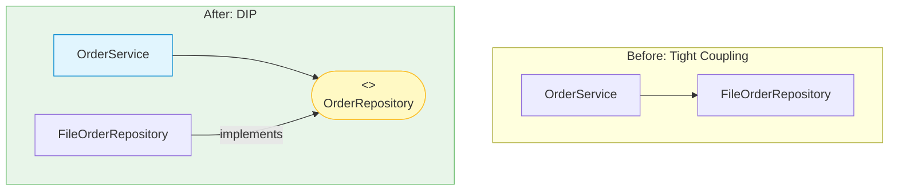

# 第23章：DIP（依存性逆転）入門（偉い人に依存しない）🙅‍♀️👑

## この章でできるようになること🎯💖

* 「DIPってなに？」を自分の言葉で説明できる😊🗣️
* **“変更に弱い依存”** を見つけて、「あ、これDIPチャンスだ！」って気づける👀⚡
* **インターフェース（抽象）** を使って、依存の向きをキレイに整えられる🧼✨
* テストがラクになる理由を体感できる✅🧪


---

## まずはミニ物語☕️📦✨（Campus Café）

Campus Caféの注文アプリで、こんな未来が来たとするね👇

* 保存先が「ファイル」→「DB」→「クラウド」って変わるかも…💾➡️🗄️➡️☁️
* 通知が「メール」→「アプリ通知」→「LINE連携」になるかも…📧➡️📱➡️💬
* でも、**注文の重要ロジック（合計・割引・注文確定）** は、なるべく揺らしたくない🥹🧡

ここで役立つのが **DIP（依存性逆転）** だよ〜！🌈

---

## DIPってなに？ざっくり一言で🍡

**「大事なロジック（上位）が、細かい実装（下位）に振り回されないようにする考え方」** だよ😊👑


もう少しだけ正確に言うと👇

* 上位（例：注文確定・料金計算みたいな“ルール”）
* 下位（例：DB・ファイル・外部APIみたいな“手段”）

この2つがあるときに、**上位が下位を直接つかみにいく**と、未来の変更で地獄になりがち😇🔥
だから **「上位も下位も、間にある“約束（抽象）”に依存しよう」** ってするのがDIPだよ✨

---

## ありがちなDIP違反（Before）😵‍💫💥

「注文を保存するだけ」なのに、OrderServiceが保存の詳細をガッツリ知ってるパターン👇


```ts
// OrderService.ts
import { writeFile } from "node:fs/promises";

type Order = { id: string; total: number };

export class OrderService {
  async placeOrder(order: Order) {
    // ✅ここが本当にやりたい上位ロジック（注文確定）
    // …いろいろチェックしたり、割引計算したり…

    // ❌保存の詳細（ファイル形式やパス）を上位が握ってる
    await writeFile(`./data/orders/${order.id}.json`, JSON.stringify(order), "utf-8");
  }
}
```

### これ、何がツラいの？😢

* 保存先をDBにしたい → **OrderServiceを修正**（上位が巻き込まれる）🌀
* テストしたい → ファイルI/Oが混ざる → **テストが遅い＆めんどい**🐢💦
* 保存形式や場所が変わる → **注文ロジックまで一緒に変更**になりがち😇

---

## DIPで目指す形（After）🧩✨

ポイントはこれ👇
**上位が“保存のやり方”を知らない**。知ってるのは「保存できること」だけ😊🧡

### 依存の向き（イメージ）🧠➡️🧠


* Before：上位（注文） → 下位（ファイル保存）へ依存
* After ：上位（注文） → 抽象（保存できる約束）へ依存
  　　　　　下位（ファイル保存） → 抽象（約束を実装）へ依存



---

## Step1：上位がほしい“約束（抽象）”を作る📝✨

OrderServiceが欲しいのは「注文を保存できること」だけ。じゃあそれをインターフェースにしよ〜😊


```ts
// OrderRepository.ts（上位ロジック側に置くイメージ）
export type Order = { id: string; total: number };

export interface OrderRepository {
  save(order: Order): Promise<void>;
}
```

> コツ💡：このインターフェースは「保存の都合」じゃなくて、**上位が欲しい形**で決めるのが気持ちいいよ👑✨

---

## Step2：上位ロジックは“約束”だけに依存する🤝💖

```ts
// OrderService.ts
import type { Order, OrderRepository } from "./OrderRepository.js";

export class OrderService {
  constructor(private readonly repo: OrderRepository) {}

  async placeOrder(order: Order) {
    // ✅上位のルールだけに集中できる
    // 例：入力チェック、割引計算、注文確定の流れ…

    await this.repo.save(order); // ✅「保存できる」だけ信じる
  }
}
```

OrderServiceの気持ち：「保存？知らん！でも保存できる人（repo）お願いね🥺🙏」って感じ😂

---

## Step3：下位（詳細）は“約束”を実装する🔧💾


ファイル保存版を作ってみるね👇

```ts
// FileOrderRepository.ts（下位：詳細）
import { mkdir, writeFile } from "node:fs/promises";
import type { Order, OrderRepository } from "./OrderRepository.js";

export class FileOrderRepository implements OrderRepository {
  constructor(private readonly dir = "./data/orders") {}

  async save(order: Order): Promise<void> {
    await mkdir(this.dir, { recursive: true });
    await writeFile(`${this.dir}/${order.id}.json`, JSON.stringify(order), "utf-8");
  }
}
```

---

## Step4：最後に“組み立てる場所”で合体させる🧱✨


アプリの入口（main）で「じゃあ今日はファイル保存で！」って決める感じ😊

```ts
// main.ts（組み立て担当）
import { OrderService } from "./OrderService.js";
import { FileOrderRepository } from "./FileOrderRepository.js";

const repo = new FileOrderRepository();
const service = new OrderService(repo);

await service.placeOrder({ id: "o-001", total: 1200 });
```

ここまでで、もうDIPの“おいしいところ”出てるよ〜！🍰💕

---

## DIPのご褒美①：テストが爆速＆ラクになる🏎️💨✅


ファイル保存を使わずに、**偽物（Fake）** を差し込めるのが最高なの🥹✨

```ts
// OrderService.test.ts（Vitest想定）
import { describe, it, expect } from "vitest";
import { OrderService } from "./OrderService.js";
import type { Order, OrderRepository } from "./OrderRepository.js";

class FakeOrderRepository implements OrderRepository {
  saved: Order[] = [];
  async save(order: Order) {
    this.saved.push(order);
  }
}

describe("OrderService", () => {
  it("注文が保存される", async () => {
    const fakeRepo = new FakeOrderRepository();
    const service = new OrderService(fakeRepo);

    await service.placeOrder({ id: "o-999", total: 500 });

    expect(fakeRepo.saved).toHaveLength(1);
    expect(fakeRepo.saved[0].id).toBe("o-999");
  });
});
```

* ファイルもDBもいらない🙅‍♀️
* テストが速い🐇💨
* 失敗の原因が分かりやすい🔍✨

---

## DIPのご褒美②：変更のダメージが小さくなる🛡️✨


たとえば保存先をDBにしたくなったら？

* OrderService ✅そのまま
* OrderRepository ✅そのまま
* DB用のRepository実装を追加して、mainで差し替えるだけ🎉

これが「重要ロジックを守る」ってことだよ👑💖

---

## 「DIPっぽい匂い」チェックリスト👃💥

次のどれかが出てきたら、DIPを疑ってOK〜！🙆‍♀️✨

* 上位のクラスが `fs` / DBクライアント / 外部SDK を直接importしてる📦💦
* 上位の中に `new Sql...()` とか `new Aws...()` がゴロゴロしてる🧱😵
* テストで「モック地獄」になってる（しかも遅い）🧟‍♀️
* “詳細の変更”のせいで、上位のファイルまで修正してる🌀

---

## DIPとDIの違い（ここ超大事）🧠✨

* **DIP**：考え方（原則）📏
* **DI** ：実装テク（やり方）💉
* **DIコンテナ**：道具（自動で注入してくれるやつ）🧰

この章は **DIP（どう設計するべきか）** に集中！
次の章で **DI（どう注入するか）** をがっつりやるよ〜💖

---

## ちょこっと最新メモ📰✨（2026の空気感）

* 現時点で npm の `typescript` 最新は **5.9.3** だよ（リリース情報ベース）📦✨ ([npm][1])
* 5.9では Node向け設定として `--module node20` のような安定オプションも入ってるよ🧩 ([typescriptlang.org][2])
* さらに、TypeScriptは **6.0 / 7.0 を2026年初頭〜に向けて** 進んでる（高速化の流れが強い）🚀 ([InfoWorld][3])

（DIP自体はバージョンで変わらないけど、「モジュール境界を意識する設計」は今どきほど効くやつだよ〜😊）

---

## ミニ課題（Campus Café）☕️📘✨

### 課題A：保存先差し替えを想定してDIP化してみよ🎯

1. `OrderService` の中に保存処理があるなら、全部どかす✂️
2. `OrderRepository` を作る📝
3. `FileOrderRepository` を実装する💾
4. `main` で組み立てる🧱

✅ゴール：OrderServiceが **保存の詳細を一切知らない** 状態にする😊✨

### 課題B：テストでFake差し込み✅🧪

* `FakeOrderRepository` を作って
* `placeOrder()` が `save()` を呼んだことを検証してね🎉

---

## AI（Copilot/Codex系）に頼るコツ🤖💡

そのまま「DIPにして！」だと、変な抽象化を盛られがち😂💦
おすすめの聞き方はこれ👇

* 「この `OrderService.ts` を **最小差分** でDIPにしたい。`OrderRepository` を導入して、`main` で組み立てる形にして」🧩
* 「**テストが書きやすい** 形にしたい。Fake実装でテスト例も出して」🧪
* 「抽象化は必要最小限で。interfaceは増やしすぎないで」✋

最後は必ず、あなたが「依存の向き」だけ確認すれば勝ち👑✨

---

## まとめ🌸🎉

* DIPは「大事なロジックを、詳細変更から守る」ための原則🛡️
* 上位は下位に直接依存しない。**“約束（抽象）”に依存**する🤝
* 下位（詳細）が、その約束を実装する🔧
* テストがラク＆変更が怖くなくなる✅✨

次章（第24章）は、いよいよ **DI（注入のやり方）** を手を動かしてやるよ〜💉🤖💖
（DIコンテナの話も、軽く触れるね！）

---

もしよければ、いまの「Campus Café」のコード（Orderまわり）を貼ってくれたら、**DIP違反ポイントの赤ペン添削**もできるよ〜🧑‍🏫🖍️✨

[1]: https://www.npmjs.com/package/typescript?utm_source=chatgpt.com "TypeScript"
[2]: https://www.typescriptlang.org/docs/handbook/release-notes/typescript-5-9.html?utm_source=chatgpt.com "Documentation - TypeScript 5.9"
[3]: https://www.infoworld.com/article/4100582/microsoft-steers-native-port-of-typescript-to-early-2026-release.html?utm_source=chatgpt.com "Microsoft steers native port of TypeScript to early 2026 ..."
[](https://www.slideserve.com/liseli/software-design-principles?utm_source=chatgpt.com)
