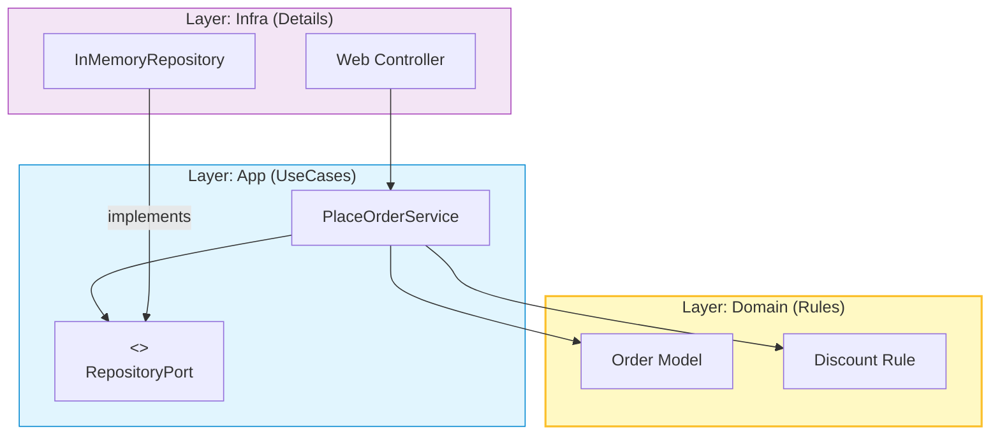

# 第26章：卒業制作① 仕様づくり＆土台設計（設計のスタートライン）🧠📐

この章は「**作り始める前に、勝ち筋を作る**」回だよ〜☕️📦
最初に土台をちょっとだけ丁寧に作ると、あとで機能追加してもグチャらない🥹✨


---

### 0) 2026-01-10 時点の “いまどき” メモ 🗓️🆕

* VS Code は **2025年12月版（v1.108）** が **2026-01-08** リリースで、Copilot まわりに **Agent Skills** みたいな “拡張しやすい仕組み” が増えてるよ🤖📚 ([Visual Studio Code][1])
* TypeScript は **5.9 のリリースノート**が公開されてて、`--module node20` みたいな Node 寄りの改善や、型推論＆パフォ改善も進んでるよ🧩⚡️ ([TypeScript][2])
* Node.js は **24 系が LTS（Krypton）** に入り、**2028年4月末**まで更新が続く想定だよ🟢🔒 ([Node.js][3])
* Copilot は “プロンプトをファイル化して再利用する” みたいな運用が推されてきてるよ📝🔁 ([GitHub][4])

---

# この章のゴール🎯✨（成果物つき）

最後にこれが揃ってたら勝ち〜🥳🎉

* ✅ **仕様メモ**（ユーザーストーリー + 受け入れ条件）📝
* ✅ **変更点リスト**（増えそう・変わりそうを先に洗い出し）🔮
* ✅ **モジュール境界の下書き**（domain / app / infra）✂️📦
* ✅ **フォルダ骨組み & “差し替え口” の interface**（DIP の入口）🚪🧩
* ✅ **最小ユースケース**（PlaceOrder の形だけでも OK）🧪✨

---

# 1) まず「作るもの」を1つ決める☕️📦（悩みすぎ禁止！）

卒業制作は、題材がシンプルなほど SOLID を当てやすいよ😊✨
ここでは例として **Campus Café 注文アプリ**で進めるね☕️

### 題材の条件（SOLID向きチェック✅）

* 変更が起きそう：割引が増える🎟️／支払いが増える💳／通知が増える🔔
* ルールがある：合計金額、税、端数処理、在庫など🧾
* 外部がある：DB、メール、決済 API（最初は in-memory でOK）🌱

---

# 2) 仕様は「ユーザーストーリー」で書く👩‍🎓📝✨

“機能一覧”よりも、ストーリーで書くと迷子になりにくいよ🥹🧭

## テンプレ（コピペOK）📋

* **As a**（誰として）
* **I want**（何がしたい）
* **So that**（何のために）

さらに **受け入れ条件（Acceptance Criteria）** を3つくらい付けると強い💪✨

### 例：注文できる📦

* As a 学生として
* I want 商品を選んで注文したい
* So that お会計ができる

**受け入れ条件✅**

* 商品IDと個数を指定すると、注文が作られる
* 合計金額が計算される
* 注文が保存される（最初はメモリ保存でOK）

---

# 3) 「未来の変更点」を先に洗い出す🔮🧠✨（ここがSOLIDの当てどころ！）

SOLID は “綺麗にする魔法”じゃなくて、**変化しそうな場所を守る技**だよ🛡️✨

## 変更点リスト（例）📝

* 🎟️ 割引が増える：学割／雨の日／セット割
* 💳 支払いが増える：現金／クレカ／PayPay 的なもの
* 🔔 通知が増える：メール／アプリ通知／ログだけ
* 🗄️ 保存先が変わる：メモリ → ファイル → DB
* 🧾 税・端数処理が変わる：切り捨て／四捨五入／店ルール

---

# 4) モジュール境界を “3つ” に切る✂️📦✨


迷ったらこの3つでOKだよ〜😊

* **domain**：ルール（料金計算・割引適用・注文の整合性）🧠
* **app**：やりたいこと（注文する／支払う／通知する）🎬
* **infra**：外部（保存・メール・決済などの具体）🌍

## 依存の向き（超大事）➡️

`domain` ← `app` ← `infra` じゃなくて…
**domain がいちばん偉い**から、**外部の都合を知らない**のが理想👑✨

イメージ👇

* app は「保存して」「通知して」って **お願い**する（interface で）🙏
* infra が「はい、私がやります」って **実装**する🛠️



---

# 5) フォルダ骨組み（最初はこれでOK）📁✨

```text
src/
  domain/
    money.ts
    order.ts
    discount/
      discount-policy.ts
  app/
    ports/
      order-repository.ts
      notifier.ts
    place-order.ts
  infra/
    inmemory/
      inmemory-order-repository.ts
    console/
      console-notifier.ts
  main.ts
```

---

# 6) “差し替え口” を interface で作る🚪🧩（DIPの入口だよ💡）

ここがあるだけで、後から DB でも API でも差し替えできる🎉

## app/ports/order-repository.ts 🗄️

```ts
export type OrderId = string;

export interface OrderRepository {
  save(order: { id: OrderId; totalYen: number }): Promise<void>;
  findById(id: OrderId): Promise<{ id: OrderId; totalYen: number } | null>;
}
```

## app/ports/notifier.ts 🔔

```ts
export interface Notifier {
  notify(message: string): Promise<void>;
}
```

---

# 7) domain は「ルールだけ」置く🧠✨（外部は見ない！）

## domain/money.ts 💴

```ts
export class Money {
  private constructor(private readonly yen: number) {}

  static yen(amount: number): Money {
    if (!Number.isInteger(amount) || amount < 0) throw new Error("Money must be a non-negative integer (yen).");
    return new Money(amount);
  }

  add(other: Money): Money {
    return Money.yen(this.yen + other.yen);
  }

  multiply(n: number): Money {
    if (!Number.isInteger(n) || n < 0) throw new Error("Multiplier must be a non-negative integer.");
    return Money.yen(this.yen * n);
  }

  value(): number {
    return this.yen;
  }
}
```

## domain/discount/discount-policy.ts 🎟️

```ts
import { Money } from "../money";

export interface DiscountPolicy {
  apply(total: Money): Money;
}
```

## domain/order.ts 📦

```ts
import { Money } from "./money";
import { DiscountPolicy } from "./discount/discount-policy";

export type OrderItem = { priceYen: number; quantity: number };

export class Order {
  constructor(
    public readonly id: string,
    private readonly items: OrderItem[],
  ) {
    if (items.length === 0) throw new Error("Order must have at least one item.");
  }

  total(policy: DiscountPolicy): Money {
    const raw = this.items
      .map(i => Money.yen(i.priceYen).multiply(i.quantity))
      .reduce((a, b) => a.add(b), Money.yen(0));

    return policy.apply(raw);
  }
}
```

---

# 8) app は「段取り」担当🎬✨（UseCase）

## app/place-order.ts 🛒

```ts
import { Order } from "../domain/order";
import { DiscountPolicy } from "../domain/discount/discount-policy";
import { OrderRepository } from "./ports/order-repository";
import { Notifier } from "./ports/notifier";

export class PlaceOrder {
  constructor(
    private readonly repo: OrderRepository,
    private readonly notifier: Notifier,
    private readonly discount: DiscountPolicy,
  ) {}

  async execute(input: { orderId: string; items: { priceYen: number; quantity: number }[] }) {
    const order = new Order(input.orderId, input.items);

    const total = order.total(this.discount).value();

    await this.repo.save({ id: input.orderId, totalYen: total });
    await this.notifier.notify(`注文OK！ orderId=${input.orderId}, total=${total}円 🎉`);
  }
}
```

---

# 9) infra は「具体担当」🛠️✨（まずは in-memory でOK）

## infra/inmemory/inmemory-order-repository.ts 🧺

```ts
import { OrderRepository } from "../../app/ports/order-repository";

export class InMemoryOrderRepository implements OrderRepository {
  private store = new Map<string, { id: string; totalYen: number }>();

  async save(order: { id: string; totalYen: number }): Promise<void> {
    this.store.set(order.id, order);
  }

  async findById(id: string): Promise<{ id: string; totalYen: number } | null> {
    return this.store.get(id) ?? null;
  }
}
```

## infra/console/console-notifier.ts 🖥️🔔

```ts
import { Notifier } from "../../app/ports/notifier";

export class ConsoleNotifier implements Notifier {
  async notify(message: string): Promise<void> {
    console.log(message);
  }
}
```

---

# 10) main.ts が “合体場所” 🧩✨（Composition Root）

ここだけは「全部知っててOK」な特別ゾーンだよ😎

## main.ts 🧶

```ts
import { PlaceOrder } from "./app/place-order";
import { InMemoryOrderRepository } from "./infra/inmemory/inmemory-order-repository";
import { ConsoleNotifier } from "./infra/console/console-notifier";
import { DiscountPolicy } from "./domain/discount/discount-policy";
import { Money } from "./domain/money";

class NoDiscount implements DiscountPolicy {
  apply(total: Money): Money {
    return total;
  }
}

async function main() {
  const repo = new InMemoryOrderRepository();
  const notifier = new ConsoleNotifier();
  const discount = new NoDiscount();

  const placeOrder = new PlaceOrder(repo, notifier, discount);

  await placeOrder.execute({
    orderId: "order-001",
    items: [
      { priceYen: 480, quantity: 1 },
      { priceYen: 250, quantity: 2 },
    ],
  });
}

main().catch(e => {
  console.error(e);
  process.exitCode = 1;
});
```

---

# 11) AI の使い方（この章向け）🤖📝✨

## 使うと強い場面ベスト3🏆

* ① ユーザーストーリーを整える📝
* ② 変更点リストを増やす🔮
* ③ interface 名・責務の相談（SRPの助け）✂️

### そのまま使えるプロンプト例💬

* 「この仕様をユーザーストーリーにして。受け入れ条件も3つずつお願い😊」
* 「Campus Café 注文アプリで、将来増えそうな変更点を20個出して。分類もして🙏」
* 「この class の責務が多い気がする。分割案とファイル構成を提案して🧩」

---

# 12) （おまけ）“プロジェクト専用の指示書” を置くと更に楽🤖📚

VS Code の最近のリリースで、Copilot に **Agent Skills** を読ませる仕組みが入ってきてるよ（実験的）🧪
`.github/skills` に `SKILL.md` を置くと、必要に応じてチャットの文脈にロードされる感じ✨ ([Visual Studio Code][1])

たとえば SKILL.md に「domain は外部 import 禁止」「app は ports 経由」みたいなルールを書いておくと、AIが脱線しにくくなるよ〜🧠🧷

---

# 13) ミニ課題🎁（提出物）

今日の提出はこれだよ〜📮✨

* ✅ ユーザーストーリー 5本（各：受け入れ条件3つ）
* ✅ 変更点リスト 15個（割引/支払い/通知/保存 などに分類）
* ✅ フォルダ骨組み作成 + interface（Repository/Notifier）
* ✅ `main.ts` で1回だけ動く（ログが出たらOK🎉）

---

# 14) チェックリスト✅✨（できてたら合格！）

* [ ] domain が infra を import してない🧼
* [ ] app は ports（interface）に依存してる🧩
* [ ] infra は interface を実装してる🛠️
* [ ] main.ts に “合体” が寄ってる🧶
* [ ] 変更点リストがある（未来の拡張ポイントが見えてる）🔮

---

次の第27章は、この土台に **割引追加🎟️／支払い追加💳／通知追加🔔** を入れて、SOLID を “当てながら伸ばす” 実戦パートだよ〜🔥🧸

[1]: https://code.visualstudio.com/updates "December 2025 (version 1.108)"
[2]: https://www.typescriptlang.org/docs/handbook/release-notes/typescript-5-9.html "TypeScript: Documentation - TypeScript 5.9"
[3]: https://nodejs.org/en/blog/release/v24.11.0 "Node.js — Node.js 24.11.0 (LTS)"
[4]: https://github.com/features/copilot/whats-new "See what’s new with GitHub Copilot · GitHub"
