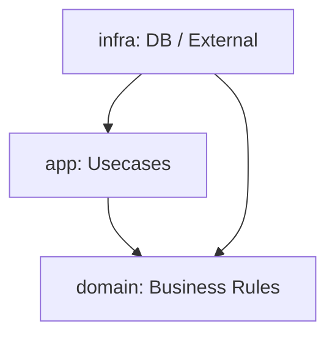

# 第28章：卒業制作③ 仕上げ＆設計レビュー（Before/Afterで強くなる）🏁🔍✨

## この章のゴール 🎯✨

* 自分のプロジェクトを見て、**「なぜこの設計が良い（/微妙）なのか」**を言葉で説明できるようになるよ🗣️💖
* 仕上げとして、**動く・壊れにくい・説明できる**の3点セットで提出できる状態にするよ📦✅✨


---

## まずは“仕上げモード”に切り替えよう 🔧🧊

卒業制作の終盤でいちばん事故るのが「最後に機能を増やして全部ガタガタ」😭💥
なのでこの章は **追加より“整える”が主役**だよ🧼✨

やることは大きく5つ👇

1. 品質チェックを自動化して通す ✅🤖
2. SOLID観点でレビューする 🔍📚
3. Before/Afterを言語化する 👃➡️🌸
4. READMEと図を整える 📝🗺️
5. 提出セットを作る 📦🎓

---

## 1) 品質チェック（最低ライン）を“全部グリーン”にする ✅🟢

この章の最初に、**毎回同じコマンドで確認できる状態**にしようね💪✨

### 1-1. 「通すべきチェック」セット 🎁

* 型チェック：TypeScript（現在の安定版は 5.9 系だよ）📘✨ ([Microsoft for Developers][1])
* テスト：Vitest（4.0 が大きな節目になってるよ）🧪✨ ([vitest.dev][2])
* 実行環境：Node.js は v24.12.0 が Latest LTS 表示（安定運用向け）だよ🟩 ([Node.js][3])
* エディタ：VS Code 1.108（2026-01-08 リリース）🧠✨ ([Visual Studio Code][4])

### 1-2. まずはコマンドを揃える（例）🧰✨

パッケージスクリプトをこんな感じに揃えると超ラクだよ🥹💕

```json
{
  "scripts": {
    "dev": "tsx src/main.ts",
    "build": "tsc -p tsconfig.json",
    "typecheck": "tsc -p tsconfig.json --noEmit",
    "test": "vitest run",
    "test:watch": "vitest",
    "test:coverage": "vitest run --coverage",
    "lint": "eslint .",
    "format": "prettier . -w",
    "check": "npm run typecheck && npm run lint && npm run test"
  }
}
```

✅ 目標：最後に **npm run check** を叩いたら全部OK！🎉
ここが “卒業制作の最終ゲート” だよ🚪✨

---

## 2) 設計レビュー：SOLIDチェックシートで点検しよう 🔍✅

ここからが本番！🔥
「感覚で良さそう」じゃなくて、**観点で確認**していくよ🧠✨

### 2-1. SRP（単一責任）チェック 🌷

✅ 質問：

* このクラス（/関数）って、**変更理由が1個**って言える？🤔
* “計算”と“保存”と“通知”が1つに混ざってない？🍲💥

📝 ありがち改善：

* PriceCalculator（計算）
* OrderRepository（保存）
* Notifier（通知）
  みたいに分けて、**名前で責務が伝わる**状態にする✨📛

---

### 2-2. OCP（拡張に開く）チェック 🚪✨

✅ 質問：

* 割引や支払いが増えたとき、**既存コードをゴリゴリ修正**する設計になってない？😭
* “追加したい場所”が **1か所**に集まってる？🎯

📝 ありがち改善：

* if/switch 増殖 → Strategy（差し替え）へ🔁✨
* 「追加＝新しいクラスを1個作る」で済むのが理想だよ🎉

---

### 2-3. LSP（置換可能性）チェック 🔁🧩

✅ 質問：

* 同じ interface を実装してるのに、片方だけ例外多発してない？💥
* “同じテスト”が全実装で通る？🧪✅

📝 最強テク：

* 「実装ごとにテストを書く」じゃなくて
  **“契約テスト（共通テスト）”**を作ると強いよ💪✨

---

### 2-4. ISP（インターフェース分離）チェック ✂️🧻

✅ 質問：

* interface がデカすぎて、使わないメソッド持たされてない？😵‍💫
* Read/Write や用途ごとに分けられてる？📚✍️

📝 ありがち改善：

* OrderRepository（巨大）
  → OrderReader / OrderWriter に分割✨

---

### 2-5. DIP（依存性逆転）チェック 🧲✨

✅ 質問：

* 重要ロジック（domain/app）が、DBや外部API（infra）に直接依存してない？😢
* 依存の向きが「上位 → 下位」になってない？➡️⬇️

📝 ありがち改善：

* 上位は interface に依存
* 下位がそれを実装
* 注入（DI）でつなぐ💉✨

---

## 3) Before/After を“提出用のストーリー”にする 👃➡️🌸📖


卒業制作の最後は「動くコード」だけじゃなくて、
**設計の成長が伝わる説明**がめっちゃ強いよ🎤✨

### 3-1. Before/Afterの作り方（超おすすめ）📸

* Before：初期の“ニオイ強め”版（巨大クラス/if地獄）👃💥
* After：SOLID適用後（責務分離/差し替え可能）🌸✨

できれば、Git のコミットで

* chore: add tests
* refactor: extract price calculator
* refactor: introduce discount strategy
  みたいに残ってると最高📌✨

---

## 4) README を“採点者に優しい”形に仕上げる 📄💗

README は「作品の顔」だよ😳✨
読む人が迷子にならないように、テンプレで整えよう🧭

### 4-1. READMEテンプレ（そのまま使ってOK）📝

```md
# Campus Café 注文アプリ（卒業制作）

## 概要
- 何ができるアプリか
- どういう目的で作ったか

## できること（機能）
- 注文できる
- 割引が適用される（例：学割/雨の日割）
- 支払い方法を差し替えられる
- 通知手段を差し替えられる

## セットアップ
1) npm install
2) npm run check
3) npm run dev

## コマンド一覧
- npm run check : 型/ lint / テストをまとめて実行
- npm run test  : テスト
- npm run dev   : 実行

## 設計（ざっくり図）
- src/domain : ルール
- src/app    : ユースケース
- src/infra  : 保存や外部連携

## SOLID をどこで使った？
- SRP：〜〜
- OCP：〜〜
- LSP：〜〜
- ISP：〜〜
- DIP：〜〜

## 今後の改善案
- 例：UI追加、永続化をDBに、通知手段追加 etc
```

---

## 5) “図”を1枚入れるだけで、提出物が急にプロっぽくなる 🗺️✨

図があると、設計の説明が一気に伝わるよ🥰
おすすめは Mermaid（READMEで描けるやつ）✨

### 5-1. 依存の向き（DIP）を見せる図（例）⬆️⬇️

````md

````

ポイントはこれ👇

* app/domain は「抽象（interface）」に依存してて
* infra がそれを実装して差し込まれてる
  …って説明できると強いよ💪✨

---

## 6) AI拡張を“最後の味方”にする使い方 🤖🧡（でも暴走注意⚠️）

最後のレビューは AI がめっちゃ便利！ただし **丸投げ禁止**だよ〜🥹💦

### 6-1. おすすめプロンプト集（コピペOK）📋✨

#### A) SOLIDレビューしてもらう 🔍

```text
このプロジェクトをSOLID観点でレビューして！
SRP/OCP/LSP/ISP/DIPそれぞれで
「問題っぽい点」「改善案」「改善の優先順位」を短く箇条書きで。
変更は小さめのステップに分けて提案してね。
```

#### B) “危ない差分”を止める（安全運転）🚗💨

```text
次のリファクタ案のうち、バグを生みやすい手順を指摘して。
最小のコミット単位で、安全に進める順番も提案して。
```

#### C) READMEを整える 📄✨

```text
このプロジェクトのREADMEを改善したい。
「初見の人が迷わない構成」にして、必要な見出し案を作って。
```

✅ コツ：AIに出させたら
「テスト通る？」「差分は小さい？」「意図は説明できる？」を人間がチェック👀✅✨

---

## 7) 最終提出セット（このチェックが全部OKなら卒業🎓🎉）✅

### 7-1. 提出チェックリスト 🧾✨

* ✅ npm run check が通る（型・lint・テスト）
* ✅ 主要ユースケースが動く（注文→合計→保存→通知）📦🔔
* ✅ 差し替えポイントが最低1つある（割引 or 支払い or 通知）🔁
* ✅ SOLIDを「どこで」「なぜ」使ったか README に書けてる📝
* ✅ 図が1枚ある（依存の向き or モジュール構成）🗺️
* ✅ Before/After の変化を説明できる👃➡️🌸

---

## 8) ミニ課題（この章の“提出物”）🎁✨

### 課題A：設計レビューシートを作る 📝

SOLIDごとに、各1〜2行でOKだよ😊

* SRP：このクラスは〇〇だけ担当。△△は別クラスへ
* OCP：割引は Strategy で追加可能
* LSP：共通テストが全実装で通る
* ISP：用途別 interface に分割
* DIP：domain/app は抽象だけを参照、infra が実装

### 課題B：READMEを完成させる 📄✨

テンプレを埋めて、図も貼る！

### 課題C：2分発表メモを作る 🎤

* 何を作った？
* どこが変更に強い？
* SOLIDで一番効いたのはどれ？（理由）

---

## 最後に：この章を終えたあなたが強い理由 💪💖

ここまでやると、ただの「動くコード」じゃなくて
**“伸ばせるコード”**になってるよ🌱✨
そしてそれを **説明できる**のが、いちばん強い🎤🔥

次は、もし時間があれば

* GitHub Actionsで npm run check を自動化🤖✅
* もう1つ差し替えポイント追加🔁
  あたりをやると、作品の完成度がググッと上がるよ🎓🌈✨

[1]: https://devblogs.microsoft.com/typescript/announcing-typescript-5-9/?utm_source=chatgpt.com "Announcing TypeScript 5.9"
[2]: https://vitest.dev/blog/vitest-4?utm_source=chatgpt.com "Vitest 4.0 is out!"
[3]: https://nodejs.org/en "Node.js — Run JavaScript Everywhere"
[4]: https://code.visualstudio.com/updates?utm_source=chatgpt.com "December 2025 (version 1.108)"
