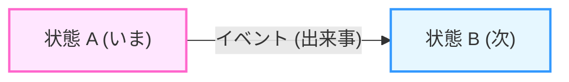
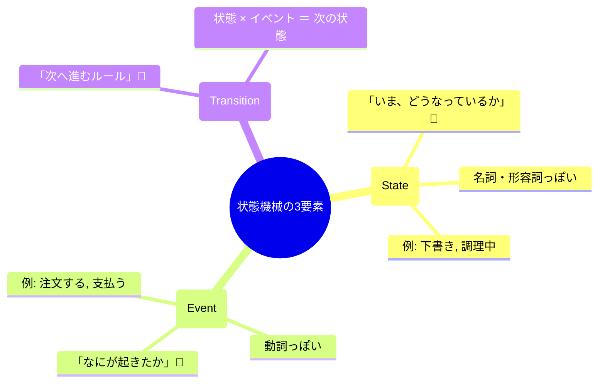
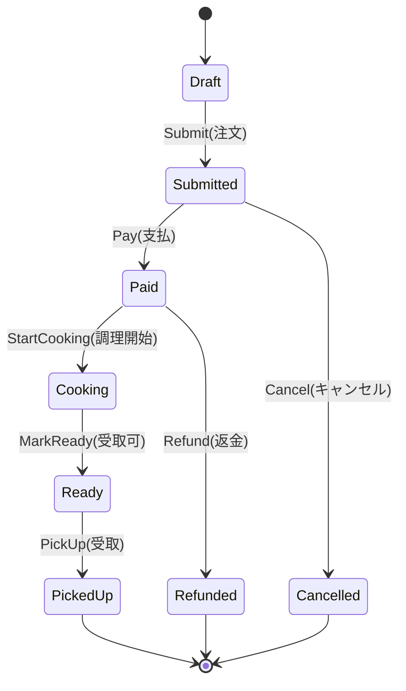

# 第01章：部：まず“状態機械の考え方”に慣れる（1〜4章）🌱😊

この章は「状態機械って、結局なに？🤔」をスッキリさせて、**図・表・コード**の3つで説明できる入口を作る回だよ〜😊🌸
（ちなみに2026年1月時点だと、C# 14 は .NET 10 対応で、Visual Studio 2026 で試せるよ〜🛠️✨） ([Microsoft Learn][1])

---

## 1章のゴール（ここまでできたら勝ち🏆✨）

この章を終えると、あなたは👇ができるようになるよ😊💖

1. **状態（State）／イベント（Event）／遷移（Transition）**を、自分の言葉で説明できる📘✨
2. 題材（学食モバイル注文🍙📱）を、**「一言」**で状態機械っぽく説明できる🗣️✨
3. 同じ内容を、**ミニ遷移表（表）**と**ミニ遷移図（図）**に落とせる🗺️📊

---

## 状態機械ってなに？🤖✨（超ざっくり）





状態機械（State Machine）は、ひとことで言うと…

> **「いま何の状態か」をはっきりさせて、起きた出来事で次の状態に進むルールを決める道具**🔁✨

つまり、プログラムを
**“気分（ifの条件）” で動かす**んじゃなくて、
**“状態とルール” で動かす**感じ😊🧠✨

---

## なんで必要なの？（いきなり結論😵‍💫→😌✨）

アプリって、だいたいこういう悩みに育つの…👇💥

* 「このボタン、今押していいんだっけ？」😵‍💫
* 「支払い済みなのにキャンセルできちゃった…」😱
* 「条件が増えて if/else が迷路…」🌀
* 「仕様の説明ができない（担当者が変わると地獄）」🫠

状態機械はこれを、**“仕様として見える形”**にしてくれるのが強い💪✨
（表と図がそのまま仕様書になるイメージ📘🗺️）

---

## まずは主役3人を覚えよう👩‍🎓✨


ここが本章のいちばん大事ポイントだよ〜🌟




### ① 状態（State）🏷️


「いま、どういう段階？」を表すもの😊
例：**Draft（下書き）**、**Paid（支払い済）**、**Cooking（調理中）** 🍳✨

✅ コツ：状態は「名詞・形容詞っぽい」ことが多いよ（〜中、〜済、〜待ち）🎀

---

### ② イベント（Event）📣

「何が起きた？」または「何をした？」を表すもの😊
例：**Submit（注文する）**、**Pay（支払う）**、**Cancel（キャンセルする）** 💳🚫

✅ コツ：イベントは「動詞っぽい」ことが多いよ（押す、送る、確定する）🏃‍♀️✨

---

### ③ 遷移（Transition）➡️

「この状態でこのイベントが起きたら、次はここ！」というルール😊
例：Draft + Submit → Submitted ✅✨

---

## 題材（学食モバイル注文🍙📱）を“状態機械の言葉”にしてみる


ここから一気にイメージ作るよ〜🎨✨

### 状態の例（State）🏷️

* Draft（下書き）📝
* Submitted（注文済）📨
* Paid（支払い済）💳
* Cooking（調理中）🍳
* Ready（受け取り可）📣
* PickedUp（受取済）🙌
* Cancelled（キャンセル）🚫
* Refunded（返金済）💰

### イベントの例（Event）📣

* Submit（注文する）🛒
* Pay（支払う）💳
* StartCooking（調理開始）🔥
* MarkReady（受け取り可にする）✅
* PickUp（受け取る）🙌
* Cancel（キャンセルする）🚫
* Refund（返金する）💰

---

## 3つの表現で説明してみよう（文章・表・図）✨

この講座の軸はここだよ〜📌💖
同じ仕様を、**文章／表／図／コード**へ “行ったり来たり” できるようになるのが目標😊✨

---

### ① 文章（まずは一言🗣️✨）

例（見本）👇

> 「注文は下書きから始まり、注文確定→支払い→調理→受け取り、という順で進む。途中で条件を満たせばキャンセルや返金にも分岐する」🍙✨

🎯 **演習（あなたの番）**

* 学食注文の流れを、**30文字〜60文字**くらいで一言にしてみてね📝💕

  * 例：「下書き→注文→支払い→調理→受け取り（条件でキャンセル）」みたいに🎀

---

### ② 表（ミニ遷移表📊✨）


「今の状態 × 起きたイベント → 次の状態」を書くと、抜け漏れが減るよ😊✨

例（超ミニ）👇

| 現在の状態     | イベント   | 次の状態              | OK？                   |
| --------- | ------ | ----------------- | --------------------- |
| Draft     | Submit | Submitted         | ✅                     |
| Draft     | Pay    | （なし）              | ❌（注文してないのに支払いは変だよね）😅 |
| Submitted | Pay    | Paid              | ✅                     |
| Paid      | Cancel | （なし or Refunded?） | ⚠️（ここは仕様で決める！）🧠      |

ポイントは **❌や⚠️も“仕様として書く”**ことだよ〜🚫✨
「できない」を決めるのが、バグ予防の神ポイント👼💖

---

### ③ 図（ミニ遷移図🗺️✨）


矢印で描くと、理解が爆速になるやつ😊🚀



Draft 📝

　└─(Submit🛒)→ Submitted 📨
　　　　　　└─(Pay💳)→ Paid ✅

図はラフでOKだよ〜✏️💕
「手書きで読める」が最強👑✨

---

### ④ コード（“状態機械っぽい形”をチラ見せ👀✨）


この章では「完成実装」はまだやらないけど、
**“状態とイベントを分けて考える”**雰囲気だけ掴もうね😊🌸

```csharp
public enum OrderState
{
    Draft,
    Submitted,
    Paid,
    Cooking,
    Ready,
    PickedUp,
    Cancelled,
    Refunded
}

public enum OrderEvent
{
    Submit,
    Pay,
    StartCooking,
    MarkReady,
    PickUp,
    Cancel,
    Refund
}
```

ここで大事なのは「分岐を書いた」ことじゃなくて、
**“状態とイベントが別物として定義された”**ことだよ😊✨
（本格的な遷移処理は後半で気持ちよく作るよ〜🔧🚀）

---

## つまずきやすいポイント（先に潰す💥→😌）

### 「状態」と「イベント」がごっちゃになる問題🌀

迷ったらこの質問してみてね👇✨

* 状態：**いまどうなってる？**（静止画📸）
* イベント：**なにが起きた？**（動画🎥）

例：

* 「支払い済」→ 状態✅
* 「支払う」→ イベント✅

---

## 今日の演習セット（10〜15分でOK⏱️💕）

### 演習A：全体フローを一言で🗣️

* 30〜60文字でOK📝
* 「→」を使ってもOK✨

### 演習B：これは状態？イベント？クイズ🎯

次を分類してみてね👇（S/Eで書けばOK😊）

1. 調理中🍳
2. 受け取る🙌
3. 注文済📨
4. 返金する💰
5. 受け取り可📣

### 演習C：ミニ遷移表を埋める📊

* Draft + Submit → ？？？
* Submitted + Pay → ？？？
* Paid + StartCooking → ？？？

（答えはこの章の中にあるよ😉✨）

---

## AI活用（Copilot / Codex）🤖📝✨：第1章の使いどころ


ここ、めっちゃ相性いいよ〜💞
「理解したつもり」を、**自分の言葉に直す**のが目的😊✨

### ① “自分の言葉”で要約させるプロンプト🪄

例👇

* 「状態機械を、初心者向けに“30秒で説明”して。専門用語は最低限で、例は学食注文で。」
* 「状態(State)とイベント(Event)の違いを、間違えやすいポイント付きで説明して。」

👉 出てきた文章をそのまま覚えないで、**あなたの言葉に言い換える**のがゴールだよ💖

### ② あなたの“一言説明”を添削させる🧑‍🏫🤖

* 「次の一言説明が分かりやすいか採点して。改善案を3つ（短い/普通/丁寧）で出して。」
* 「初心者が誤解しそうな点を指摘して、修正案も出して。」

---

## まとめ🎀✨（この章で持ち帰るもの）

* 状態機械は **状態** と **イベント** と **遷移** のルール📘✨
* 同じ仕様を **文章→表→図（→コード）**に変換できると強い🗺️📊
* 「できない遷移」も仕様として書くと、バグが減る🚫✨
* AIは “要約” より **言い換え＆添削** が特に効く🤖💞

次の第2章では、いよいよプロジェクトを作って「状態を表示するだけ」を動かして、地に足つけるよ〜🪟🛠️✨

---

やってみよ〜😊💕
まずは **演習A（一言説明）**、ここに書いてくれたら、可愛く（でもちゃんと実務っぽく）添削するよ📝🌸

[1]: https://learn.microsoft.com/en-us/dotnet/csharp/whats-new/csharp-14 "What's new in C# 14 | Microsoft Learn"