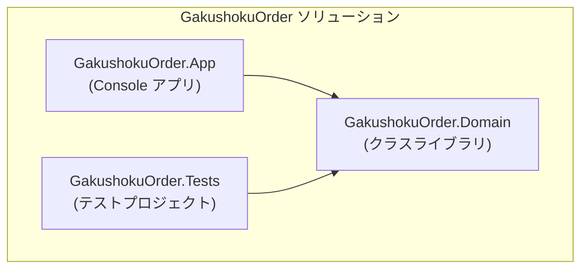
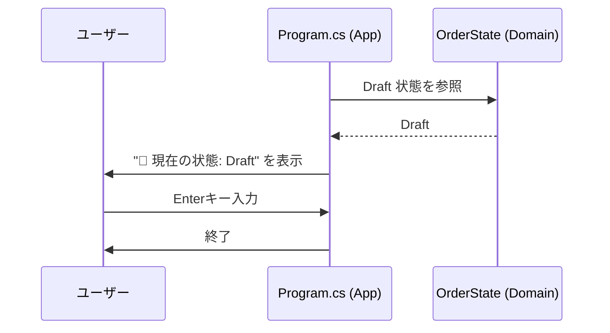

# 第02章：部：仕様を“表と図”で固める（5〜10章）🗺️📊

〜「迷わず動かせる土台」を作る章だよ〜😊💕

---

## 0) この章のゴール🎯✨

この章が終わったら、次ができるようになります👇✨

* Visual Studio で「ソリューション＋複数プロジェクト」を作れる🧩
* Console アプリを起動して「状態を表示するだけ」を動かせる✅
* テストプロジェクトを作って、テスト実行までできる🧪
* つまずいても最低限セルフ救助できる（チェック観点つき）🧯✨

（この後の章で“状態機械”を安心して育てるための下地だよ〜🌱）

---

## 1) まず「バージョンの整合」を意識する🧠✨（ここ超だいじ！）

C# 14 は .NET 10 でサポートされるよ、って明記されてるので、まずここを軸に揃えるのが安心です😊✨ ([Microsoft Learn][1])
そして Visual Studio 2026 には .NET 10 SDK が含まれるよ、という案内もあります。([Microsoft Learn][1])
.NET 10 の配布状況（Preview/RC など）はダウンロードページで確認できます。([Microsoft][2])

---

## 2) 最低限いれるもの（Visual Studio ルート）🧩✨

### 2-1) Visual Studio 2026 のインストール🧰


* インストール中に「ワークロード（Workload）」を選ぶ画面が出ます👀
* Console / Library / Test を回すだけなら、まずは **“.NET系の開発ワークロード”** が入ってればOKです🙆‍♀️

  * Visual Studio はワークロード経由で .NET も入ることがあるし、個別コンポーネントから特定バージョンを入れられるよ、という説明もあります。([Microsoft Learn][3])

> 💡迷ったら：
> 「.NET の開発ができるやつ」＋「テストが作れるやつ」って覚え方でOK😊
> （この講座は最初 Console で進めるから、まずそこが動けば勝ち！🏆✨）

---

## 3) 動作確認：`dotnet` が使えるかチェック✅🧪


Windows のターミナル（PowerShell など）で確認します🖥️✨

```text
dotnet --info
dotnet --list-sdks
```

* `--list-sdks` に .NET 10 系が見えてたらまずOK🙆‍♀️✨
* もし .NET 10 が見えないなら、.NET 10 SDK を入れる（ダウンロードページから）で解決することが多いよ〜💡 ([Microsoft][2])

---

## 4) Visual Studio で “講座用の最小構成” を作る📦✨





今回の題材は「学食モバイル注文」🍙📱なので、ソリューション名もそれっぽくします😊

### 4-1) 構成（この章で作るやつ）🧱

* `GakushokuOrder.App`（Console）🖥️
* `GakushokuOrder.Domain`（Class Library）📚
* `GakushokuOrder.Tests`（Unit Test）🧪

> 💡この分け方の気持ち：
> App は「動かす場所」、Domain は「ルール置き場」、Tests は「安心の保険」だよ🫶✨

### 4-2) 作り方（GUI手順）🖱️✨


1. Visual Studio を起動
2. **新規作成** → **空のソリューション（Blank Solution）** を作る

   * 名前：`GakushokuOrder`
3. ソリューションを右クリック → **追加** → **新しいプロジェクト**

   * Console：`GakushokuOrder.App`
   * Class Library：`GakushokuOrder.Domain`
   * Test：`GakushokuOrder.Tests`（xUnit / MSTest どれでもOK。ここでは例として xUnit を想定🧪）

### 4-3) 参照をつなぐ（App → Domain）🔗✨


* `GakushokuOrder.App` を右クリック
  → **参照の追加**
  → `GakushokuOrder.Domain` にチェック✅

これで App から Domain の型が使えるようになるよ〜🎉

---

## 5) 演習：Consoleで「状態を表示するだけ」を動かす✅✨

### 5-1) Domain に「状態」を置く（最小）📚

`GakushokuOrder.Domain` に `OrderState.cs` を作って👇

```csharp
namespace GakushokuOrder.Domain;

public enum OrderState
{
    Draft,       // 下書き
    Submitted,   // 注文
    Paid,        // 支払い
    Cooking,     // 調理中
    Ready,       // 受け取り可
    PickedUp,    // 受取済
    Cancelled,   // キャンセル
    Refunded     // 返金済
}
```

### 5-2) App で表示する🖥️✨

`GakushokuOrder.App` の `Program.cs` をこんな感じに👇

```csharp
using GakushokuOrder.Domain;

var state = OrderState.Draft;

Console.WriteLine("🍙 学食モバイル注文");
Console.WriteLine($"📌 現在の状態: {state}");

Console.WriteLine("✅ Enterで終了だよ〜");
Console.ReadLine();
```




### 5-3) 実行✅


* Visual Studio 上で **起動（Ctrl+F5）** すると Console が出ます🎉
* `📌 現在の状態: Draft` が出たらクリア✅✨

---

## 6) テストが走るか確認🧪✨（ここまでできると強い！）


`GakushokuOrder.Tests` にテストを1本だけ置いて、通るか見ます😊

```csharp
using Xunit;
using GakushokuOrder.Domain;

public class SmokeTests
{
    [Fact]
    public void Draft_is_a_valid_state()
    {
        var state = OrderState.Draft;
        Assert.Equal(OrderState.Draft, state);
    }
}
```

### 実行方法（どっちでもOK）💡

* Visual Studio：**テスト** → **すべてのテストを実行** 🧪
* もしくはターミナルで：

```text
dotnet test
```

---

## 7) つまずきポイント集🧯✨（ありがち！）

### 7-1) `dotnet` が見つからない💥

* .NET SDK が入ってない or PATH が通ってない可能性
* まず .NET 10 SDK のページから入れ直すのが早いよ〜🧩 ([Microsoft][2])

### 7-2) テストが見つからない😢

* テストフレームワークのプロジェクトになってない
* まずは「テスト用テンプレから作ったか？」を確認🧪
* それでもダメなら `dotnet test` を先に試す（VS側の表示問題を切り分け）🔍

### 7-3) Copilot が出てこない🤖💭

* Visual Studio 側は Copilot の状態（有効/無効/未インストールなど）を表示・管理できる案内があります。([Microsoft Learn][4])
* 拡張の導入手順は GitHub 公式にもまとまってるよ。([GitHub Docs][5])

---

## 8) （補助）VS Code でやる場合の最小手順🛠️✨

VS Code は **C# Dev Kit** を入れるのが近道です😊
C# Dev Kit は C# 拡張と連携して、ソリューション管理やテスト体験も持ってきてくれるよ〜🧩✨ ([Visual Studio Code][6])

* VS Code を入れる
* 拡張機能で **“C# Dev Kit”** を入れる
* フォルダ（または `.sln`）を開く
* `dotnet --list-sdks` で .NET 10 がいるか確認✅

---

## 9) AI活用コーナー：手順書を“自動で”作る📋🤖✨

この章の目的どおり、「手順書化」して未来の自分を助けよう〜🫶💕

### おすすめプロンプト（Copilot Chat / Codex向け）💬✨

* 「このソリューション構成（App/Domain/Tests）を、Visual Studioで作る手順を“初心者向けチェックリスト”にして。ミスりやすい点も添えて」
* 「dotnet コマンドだけで同じ構成を作る手順も併記して（Windows向け）」
* 「つまずきポイント（dotnetが無い、テストが見えない等）の原因候補と確認コマンドを表にして」

そして出てきたものを `docs/setup.md` に貼る📌✨
→ これだけで、次章以降の集中力が上がるよ〜😊💖

---

## 10) この章のクリア条件✅🎉

最後にチェック〜📝✨

* [ ] `dotnet --list-sdks` に .NET 10 系が出る
* [ ] Console が起動して `現在の状態: Draft` が表示される
* [ ] テストが1本以上走って成功する
* [ ] `docs/setup.md`（手順書）ができた（短くてOK！）

---

次の第3章は、わざと **if文地獄** を体験して「状態機械が必要になる瞬間」を味わうよ😵‍💫🔥
準備できたらいこ〜！💪✨

[1]: https://learn.microsoft.com/en-us/dotnet/csharp/whats-new/csharp-14?utm_source=chatgpt.com "What's new in C# 14"
[2]: https://dotnet.microsoft.com/en-US/download/dotnet/10.0?utm_source=chatgpt.com "Download .NET 10.0 (Linux, macOS, and Windows) | .NET"
[3]: https://learn.microsoft.com/en-us/dotnet/core/install/windows?utm_source=chatgpt.com "Install .NET on Windows"
[4]: https://learn.microsoft.com/en-us/visualstudio/ide/visual-studio-github-copilot-install-and-states?view=visualstudio&utm_source=chatgpt.com "Manage GitHub Copilot installation and state"
[5]: https://docs.github.com/copilot/managing-copilot/configure-personal-settings/installing-the-github-copilot-extension-in-your-environment?utm_source=chatgpt.com "Installing the GitHub Copilot extension in your environment"
[6]: https://code.visualstudio.com/docs/languages/csharp?utm_source=chatgpt.com "Installing C# support"