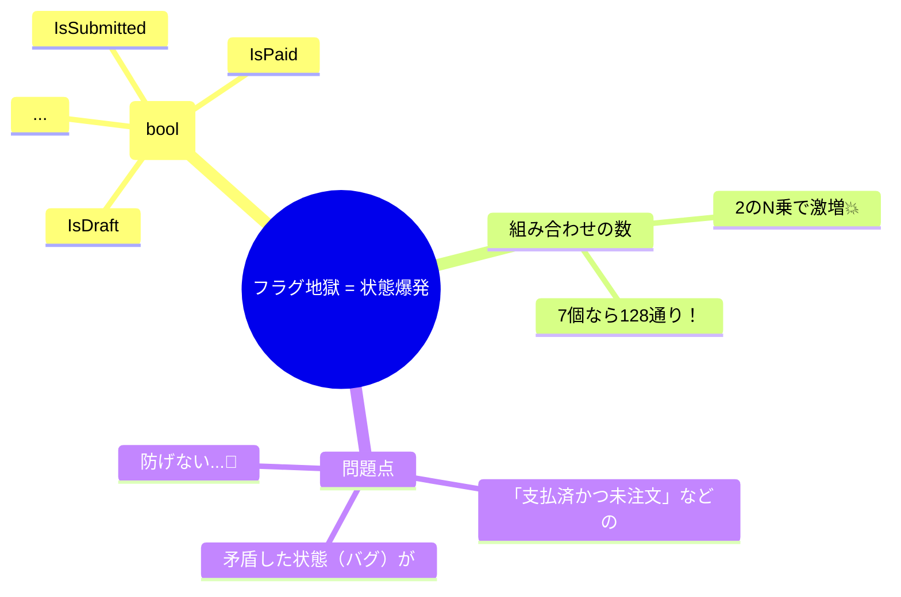
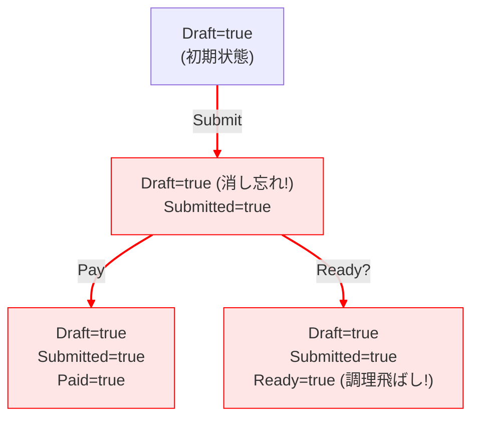

# 第03章：部：副作用を整理して“設計っぽく”する（11〜14章）🧹✨

> 今日はあえて「よくあるダメ実装」を作って、**どこで破綻するか**を体で覚える章だよ〜🧨
> ここでしんどさを味わうほど、次の章以降がスッと入る…！🥹✨

（最新メモ🧠）2026年1月20日時点では、.NET 10 は 2025年11月11日にリリースされ、LTSとしてサポートされます。公式のサポート表では .NET 10 の最新パッチは 10.0.2（2026年1月13日）で、サポート終了は 2028年11月14日とされています。([Microsoft][1])
C# 14 の新機能は Visual Studio 2026 または .NET 10 SDK で試せる、と公式ドキュメントに明記されています。([Microsoft Learn][2])

---

## この章のゴール🎯✨

終わったらこうなってればOK💮

* 「フラグ（bool）だらけの実装」が **なぜ壊れやすいか** を説明できる🗣️
* 学食注文フローを if/else で書いて、**破綻点を3つ** 見つけられる🔎
* 「次は状態機械でやりたい…」って心から思える😇🔥

---

## まず結論：フラグ地獄の正体👻





boolフラグを増やすと、状態の組み合わせが爆発します💥

* フラグが7個なら、組み合わせは **2^7 = 128通り**😵‍💫
* でも実際にあり得るのは、そのうちのほんの一部
* 残りは **「矛盾状態（バグ状態）」** として普通に作れてしまう…🧨

例：

* 「ReadyなのにCookingじゃない」🍳❓
* 「CancelledなのにPickedUp」🛑➡️📦（は？ってなるやつ）
* 「RefundedなのにPaidじゃない」💸❓



---


## 演習①：わざと“if文地獄版”を作ろう😵‍💫🔥

### 1) クラスを作る（フラグ乱立バージョン）🚩🚩🚩

下のコードをそのまま貼って実行してみてね（わざとツッコミどころ多め）😇


```csharp
using System;

public sealed class OrderIfHell
{
    // 状態を bool で持つ（←今日の主役：地獄の入口）
    public bool IsDraft { get; private set; } = true;
    public bool IsSubmitted { get; private set; }
    public bool IsPaid { get; private set; }
    public bool IsCooking { get; private set; }
    public bool IsReady { get; private set; }
    public bool IsPickedUp { get; private set; }
    public bool IsCancelled { get; private set; }
    public bool IsRefunded { get; private set; }

    public DateTime? PaidAt { get; private set; }
    public int? PaidAmount { get; private set; }

    public void Submit()
    {
        if (IsCancelled)
        {
            Console.WriteLine("❌ Cancel済みなのでSubmitできません");
            return;
        }

        if (IsSubmitted)
        {
            Console.WriteLine("⚠️ もうSubmit済みです");
            return;
        }

        // Draft→Submitted のつもり
        IsSubmitted = true;

        // ⚠️ わざと：IsDraftを落とし忘れる（矛盾の種🌱）
        Console.WriteLine("✅ Submitしました");
    }

    public void Pay(int amount)
    {
        if (!IsSubmitted)
        {
            Console.WriteLine("❌ まだ注文してないのに支払いはできません");
            return;
        }

        if (IsCancelled)
        {
            Console.WriteLine("❌ Cancel済みなので支払いできません");
            return;
        }

        if (IsPaid)
        {
            Console.WriteLine("⚠️ 二重決済っぽいです（もうPaid）");
            return;
        }

        IsPaid = true;
        PaidAt = DateTime.Now;
        PaidAmount = amount;

        Console.WriteLine($"✅ Payしました amount={amount}");
    }

    public void StartCooking()
    {
        if (!IsPaid)
        {
            Console.WriteLine("❌ 未払いなので調理開始できません");
            return;
        }

        if (IsCooking)
        {
            Console.WriteLine("⚠️ もう調理中です");
            return;
        }

        if (IsCancelled)
        {
            Console.WriteLine("❌ Cancel済みなので調理開始できません");
            return;
        }

        IsCooking = true;
        Console.WriteLine("🍳 調理開始しました");
    }

    public void MarkReady()
    {
        // ⚠️ わざと：Cookingチェックが弱い（Readyだけ先に立てられる芽🌱）
        if (!IsPaid)
        {
            Console.WriteLine("❌ 未払いなのでReadyにできません");
            return;
        }

        if (IsReady)
        {
            Console.WriteLine("⚠️ もうReadyです");
            return;
        }

        IsReady = true;
        Console.WriteLine("📣 Readyになりました");
    }

    public void PickUp()
    {
        if (!IsReady)
        {
            Console.WriteLine("❌ Readyじゃないので受け取れません");
            return;
        }

        if (IsCancelled)
        {
            Console.WriteLine("❌ Cancel済みなので受け取れません");
            return;
        }

        IsPickedUp = true;
        Console.WriteLine("📦 受け取り完了しました");
    }

    public void Cancel()
    {
        if (IsCancelled)
        {
            Console.WriteLine("⚠️ もうCancel済みです");
            return;
        }

        // ⚠️ よくある：条件が増えるほどここが育っていく…
        if (IsPickedUp)
        {
            Console.WriteLine("❌ 受け取った後はキャンセルできません");
            return;
        }

        IsCancelled = true;
        Console.WriteLine("🛑 Cancelしました");
    }

    public void Refund()
    {
        if (!IsCancelled)
        {
            Console.WriteLine("❌ CancelしてないのでRefundできません");
            return;
        }

        if (!IsPaid)
        {
            Console.WriteLine("❌ 支払いがないのでRefundできません");
            return;
        }

        if (IsRefunded)
        {
            Console.WriteLine("⚠️ もうRefund済みです");
            return;
        }

        IsRefunded = true;

        // ⚠️ わざと：Paidを落とす？落とさない？が曖昧（仕様が混ざるやつ）
        Console.WriteLine("💸 Refundしました");
    }

    public void Dump(string title)
    {
        Console.WriteLine($"--- {title} ---");
        Console.WriteLine($"Draft={IsDraft}, Submitted={IsSubmitted}, Paid={IsPaid}, Cooking={IsCooking}, Ready={IsReady}, PickedUp={IsPickedUp}, Cancelled={IsCancelled}, Refunded={IsRefunded}");
        Console.WriteLine();
    }
}

public static class Program
{
    public static void Main()
    {
        var o = new OrderIfHell();

        o.Dump("初期");

        o.Submit();
        o.Dump("Submit後");

        o.Pay(800);
        o.Dump("Pay後");

        // ここ、順序を変えるとどうなる？😈
        o.MarkReady();
        o.Dump("Ready後");

        o.StartCooking();
        o.Dump("Cooking後");

        o.Cancel();
        o.Dump("Cancel後");

        o.Refund();
        o.Dump("Refund後");

        o.PickUp();
        o.Dump("PickUp後");
    }
}
```

---

## 演習②：破綻点を3つ探す🔎🧨（この章のメイン！）


上のコード、**実行ログとDump**を見ながら、次のどれかを最低3つ見つけてね🫶

### 破綻点候補（見つけやすい順）🎯


* ✅ **矛盾状態が作れる**：Draft と Submitted が両方 true のまま…😇
* ✅ **順序依存バグ**：Ready を先に立てられる（Cooking前なのにReady）🍳❌📣
* ✅ **キャンセル後の扱いがグチャる**：CancelしたのにReadyやCookingが残る/残らない問題🌀
* ✅ **仕様が増えると修正箇所が増殖**：Cancel条件、Pay条件、PickUp条件…あちこちに同じ話が散らばる💣
* ✅ **例外ケースが“穴”として残る**：「Cancel後にPickUp」みたいな変な順を完全に塞ぐのが大変😵‍💫

### 提出用メモの書き方（超おすすめ）📝✨

* 破綻点A：どういう手順で起きた？（例：Pay→Ready→StartCooking）
* 破綻点B：なにが“おかしい状態”？（例：Ready=true なのに Cooking=false）
* 破綻点C：直そうとするとどこを触る？（例：MarkReadyとStartCookingとCancel…）
* そして最後に一言：**「つらい！」**（大事）🥹🔥

---

## 「if文地獄」チェックリスト✅👀（このサイン出たら危険）

当てはまるほど、状態機械が恋しくなるよ💘

* 状態が bool フラグで3つ以上ある🚩🚩🚩
* 「本当は同時に成り立たない状態」がコード上は成り立つ😇
* 1つ仕様追加するだけで、複数メソッドを修正する羽目になる🛠️
* 条件が増えて、if がネストして読めなくなる🧵🧵
* “禁止の理由”が散らばって、仕様が見えない🫥

---

## ここまでのオチ（次の章への伏線）🎬✨

今日やったのは、

> 「**現在の状態**」が1個に決まってないから、
> 「矛盾」も「抜け漏れ」も「分岐爆発」も起きちゃう

っていう体験でした😵‍💫

次の章以降で、これを

* 現在状態を **1つにする**（enumとか）
* イベント（操作）を受け取って
* 遷移を **表/図/ルール** で管理する

みたいに整えていくよ🗺️📊✨

---

## AI活用（この章）🤖🕵️‍♀️✨

Copilot / Codex に、こう聞くとめちゃ効くよ！

### 1) バグりやすい箇所レビューしてもらう🔍

* 「この OrderIfHell クラス、状態の矛盾が起きるパターンを5つ挙げて。手順付きで」

### 2) “壊れるテスト手順”を作らせる🧪

* 「このクラスを壊す操作シーケンスを10個作って。各シーケンスの期待と実際のズレも書いて」

### 3) “修正したくなる誘惑”を可視化する💣

* 「仕様追加：Cancelは調理開始前のみOK、ReadyはCooking後のみOK。修正箇所と影響範囲を列挙して」

※ポイント：AIの指摘は便利だけど、**最後に自分でDump見て納得する**のが勝ち筋だよ〜🫶✨

---

## 今日のミニ課題（超大事）🎒💖

### ✅ 提出物（自分メモでOK）

* 破綻点を3つ（手順＋おかしい理由＋直すならどこ？）📝
* 「if文地獄のつらさ」一言コメント🥹🔥

---

必要なら、あなたの“破綻点メモ3つ”を貼ってくれたら、
次の章に行く前に「それ、状態機械だとどう解決できるか」もセットで優しく整理するよ😊🫶✨

[1]: https://dotnet.microsoft.com/en-us/platform/support/policy?utm_source=chatgpt.com "The official .NET support policy"
[2]: https://learn.microsoft.com/en-us/dotnet/csharp/whats-new/csharp-14?utm_source=chatgpt.com "What's new in C# 14"