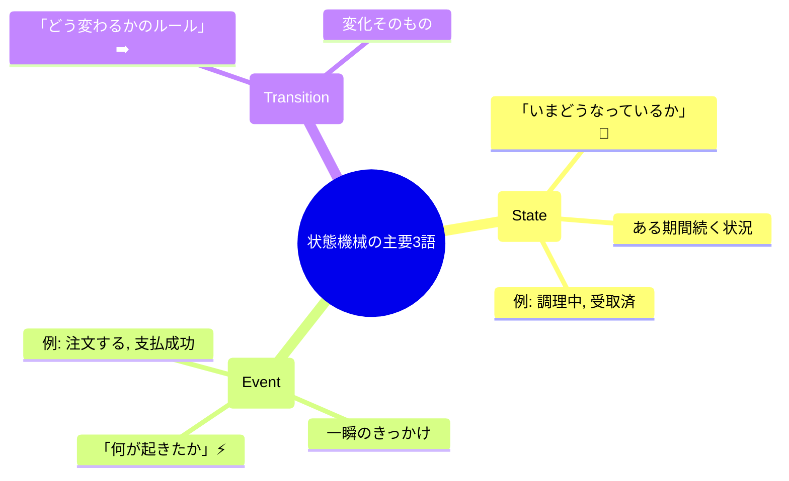
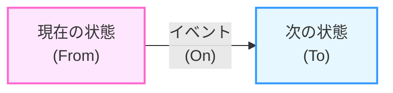

# 第04章：部：まずは動かす（実装v1）→賢くする（15〜18章）🔧🚀

この章は「状態機械の単語が怖くなくなる」がゴールだよ〜😊🫶
ここで詰まらなければ、5章以降（状態/イベントの抜き出し、遷移表づくり）がめちゃスムーズになるよ🚀💕

---

## 1) この章でできるようになること🎯✨

授業が終わるころには、あなたはこう言えるようになるよ👇😊

* 「**状態（State）**は“いまのステータス”だよ」📌
* 「**イベント（Event）**は“起きたこと/やったこと”だよ」📣
* 「**遷移（Transition）**は“状態が変わるルール”だよ」➡️✨
* さらに「いまの状態＋イベント → 次の状態」を**日本語で読み上げ**できる🗣️🌟

---

## 2) まずは3語だけ！超かんたん定義🌱

### ✅ 状態（State）ってなに？🧊





**ある期間つづく “いまの状況”** のことだよ😊
例：

* 調理中🍳（しばらく続く）
* 受取済📦（その状態として残る）
* 下書き📝（編集してる間ずっと）

> 見分けコツ💡
> 「**〜中 / 〜済 / 〜待ち**」みたいな言葉は状態になりやすいよ✨

---

### ✅ イベント（Event）ってなに？⚡

**一瞬で起きる “きっかけ”** のことだよ😊
例：

* 注文する🛒（押した瞬間）
* 支払う💳（操作）
* 支払い成功✅（結果として発生）
* 受け取る📦（行為）

> 見分けコツ💡
> 「**〜する / 〜した / 〜された / ボタン押した**」はイベントになりやすいよ✨

---

### ✅ 遷移（Transition）ってなに？➡️

**イベントが来たときに、状態がどう変わるか**のルールだよ😊
基本形はこれ👇✨



* **（いまの状態）＋（イベント）→（次の状態）**

  例：
* Draft（下書き）＋ Submit（注文する） → Submitted（注文済）📝➡️🛒➡️✅

> 超重要ポイント💎
> **「状態」そのものじゃなくて、変化のルールが“遷移”**だよ〜！

---

## 3) 題材「学食モバイル注文」に当てはめる🍙📱✨

### 状態（State）例 🧾

* Draft（下書き）📝
* Submitted（注文済）🛒
* Paid（支払い済）💳✅
* Cooking（調理中）🍳
* Ready（受け取り可）📣
* PickedUp（受取済）📦
* Cancelled（キャンセル）🚫
* Refunded（返金済）💰

### イベント（Event）例 📣

* Submit（注文する）🛒
* Pay（支払う）💳
* StartCooking（調理開始）🍳
* FinishCooking（調理完了）✅🍳
* PickUp（受け取る）📦
* Cancel（キャンセルする）🚫
* Refund（返金する）💰

### 遷移（Transition）例 ➡️

* Draft + Submit → Submitted 📝➡️🛒➡️✅
* Submitted + Pay → Paid 🛒➡️💳➡️✅
* Paid + StartCooking → Cooking ✅➡️🍳
* Cooking + FinishCooking → Ready 🍳➡️📣
* Ready + PickUp → PickedUp 📣➡️📦

---

## 4) 初学者が混乱しがちなポイントあるある😵‍💫💦

### あるある①：「支払い」は状態？イベント？💳

* 「支払う」👉 **イベント**（やること）
* 「支払い済」👉 **状態**（結果としてのステータス）

**動詞っぽい＝イベント**、**〜済＝状態**が鉄板だよ😊✨

---

### あるある②：「調理完了」は状態？イベント？🍳✅

ここは少し悩みやすい！

* 「調理が完了した（完了通知が来た）」👉 **イベント**（一瞬）
* 「受け取り可（Ready）」👉 **状態**（しばらく続く）

つまり、
**FinishCooking（イベント）で Ready（状態）へ遷移** がキレイ✨

---

### あるある③：「遷移」と「処理」を混ぜちゃう💥

遷移はあくまで **状態が変わるルール**。
「レシート発行🧾」とか「通知送信📩」みたいな**処理**は、基本はこの章では脇に置いてOK🙆‍♀️
（11章で“アクション”として超きれいに整理するよ🎬✨）

---

## 5) 命名のコツ（迷いが減るよ）🏷️✨

### 状態名（State）🧊

* **名詞/形容詞/過去分詞っぽく**：Draft, Paid, Ready, Cancelled
* “期間が続く姿”を表す✨

### イベント名（Event）⚡

* **動詞っぽく**：Submit, Pay, Cancel, Refund
* “一瞬のきっかけ”を表す✨

### 遷移（Transition）➡️

* 「From + Event → To」で書く
* 人に説明するときは、これでOK👇

  * 「（下書き）で（注文する）と（注文済）になる」🗣️✨

---

## 6) 演習①：これは状態？イベント？クイズ🎯💖

次を「状態🧊」か「イベント⚡」に分けてね😊
（直感でOK！あとで答え合わせ✨）

1. 受け取り可📣
2. 支払いボタンを押した👆
3. 返金済💰
4. 注文を送信した🛒
5. 調理中🍳
6. 調理が完了した✅
7. キャンセル理由を入力した📝
8. 注文がキャンセルされた🚫
9. 支払いに失敗した❌
10. 受け取った📦

**答え**✅
1 状態🧊 / 2 イベント⚡ / 3 状態🧊 / 4 イベント⚡ / 5 状態🧊
6 イベント⚡ / 7 イベント⚡ / 8 状態🧊（Cancelled という結果）
9 イベント⚡（失敗通知） / 10 イベント⚡（受け取り行為）

> 8が「状態」なのがポイントだよ〜！
> 「キャンセル“された”」は一瞬の出来事にも見えるけど、業務的には **Cancelled という状態として残る**のが普通だから状態に置くと扱いやすいよ😊✨

---

## 7) 演習②：遷移を“日本語で3本”書いてみよう📝➡️

下を埋めてみてね😊（答えは1つじゃないよ✨）

1. （＿＿＿＿）で（＿＿＿＿）すると（＿＿＿＿）になる
2. （＿＿＿＿）で（＿＿＿＿）すると（＿＿＿＿）になる
3. （＿＿＿＿）で（＿＿＿＿）すると（＿＿＿＿）になる

例：

* 「注文済で支払うと支払い済になる」🛒➡️💳➡️✅

---

## 8) 演習③：コードで“遷移を読み上げる”ミニ実装🖥️✨

ここではまだ「動く状態機械」を完成させないよ😊
**用語に慣れる**ために、「遷移」をコードの形で見るだけ👀✨

```csharp
using System;

enum OrderState
{
    Draft,
    Submitted,
    Paid,
    Cooking,
    Ready,
    PickedUp,
    Cancelled,
    Refunded
}

enum OrderEvent
{
    Submit,
    Pay,
    StartCooking,
    FinishCooking,
    PickUp,
    Cancel,
    Refund
}

readonly record struct Transition(OrderState From, OrderEvent On, OrderState To);

class Program
{
    static void Main()
    {
        var samples = new[]
        {
            new Transition(OrderState.Draft,     OrderEvent.Submit,       OrderState.Submitted),
            new Transition(OrderState.Submitted, OrderEvent.Pay,          OrderState.Paid),
            new Transition(OrderState.Paid,      OrderEvent.StartCooking, OrderState.Cooking),
            new Transition(OrderState.Cooking,   OrderEvent.FinishCooking,OrderState.Ready),
            new Transition(OrderState.Ready,     OrderEvent.PickUp,       OrderState.PickedUp),
        };

        foreach (var t in samples)
        {
            Console.WriteLine($"{t.From} + {t.On} -> {t.To}");
        }
    }
}
```

出力がこうなったらOK😊✨

* Draft + Submit -> Submitted
* Submitted + Pay -> Paid
* …みたいに「用語が形になって見える」感じがつかめれば勝ち🎉

---

## 9) AI活用：例を10個つくって分類練習🤖🧠✨

### やること（おすすめ手順）💡

1. AIに「学食注文っぽい例」を10個作らせる
2. それを「状態/イベント」に分類させる
3. **分類理由も1行**で言わせる（ここ大事！）

### そのまま使えるプロンプト例🪄

```text
学食モバイル注文の題材で、「状態(State)」と「イベント(Event)」の例をそれぞれ10個ずつ出して。
各項目に「なぜ状態なのか / なぜイベントなのか」を1行で説明して。
最後に、紛らわしい例を3つ挙げて、両方の解釈を書いて。
```

> コツ😊✨
> AIの分類は便利だけど、ときどき「業務的に自然じゃない切り方」をすることもあるよ。
> 迷ったら **“期間が続くなら状態 / 一瞬ならイベント”** に戻ればOK🧭💕

---

## 10) まとめ（この章の合格ライン）✅💖

次の3つがスラスラ言えたら、もう第4章クリア🎉✨

* 状態＝**しばらく続くステータス**🧊
* イベント＝**一瞬のきっかけ**⚡
* 遷移＝**状態＋イベント→次状態のルール**➡️

そして、今後の章で使う土台は「これ」だよ👇💎
**“用語を日本語で読み上げられる＝理解できてる”**🗣️✨

---

### （最新情報メモ🧷）

この章の内容は、いまの .NET 10 / C# 14 でもそのまま通用する基本概念だよ😊✨（C# 14 は .NET 10 対応、Visual Studio 2026 で扱えるよ）([Microsoft Learn][1])

---

次は第5章で「要求から“状態”を抜き出すコツ」へ行くよ〜🏷️😊
その前に、上のクイズをあなたの言葉で **“なぜそれ？”** まで説明できたら完璧💯💖

[1]: https://learn.microsoft.com/en-us/dotnet/csharp/whats-new/csharp-14?utm_source=chatgpt.com "What's new in C# 14"