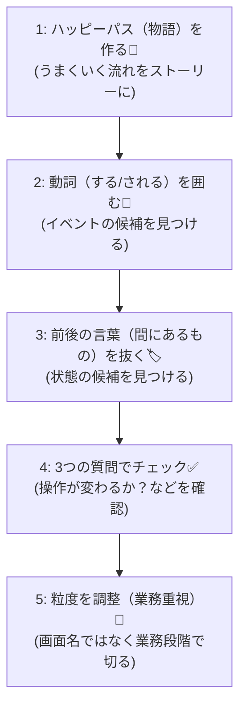
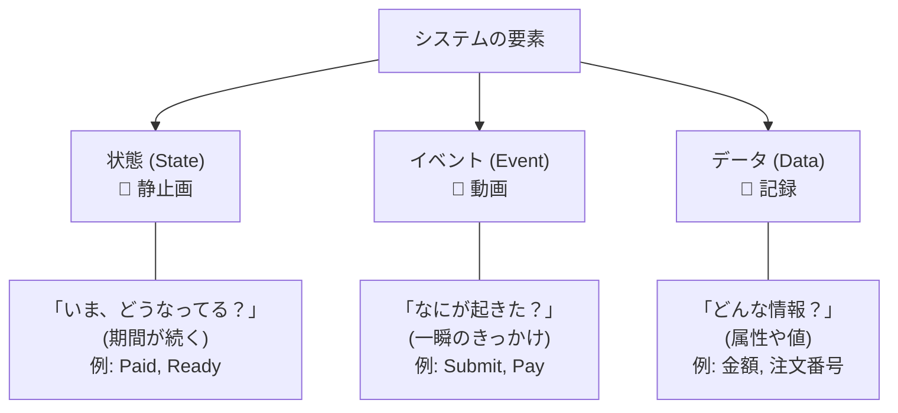

# 第05章：部：失敗の扱い・ログ・テスト（19〜23章）🧪📜

（題材：学食モバイル注文 🍙📱）

---

1. この章のゴール🎯✨
   この章が終わったら、あなたはこうなれます👇💖

・要求文（仕様っぽい文章）から「状態候補」を7〜10個くらい安定して拾える
・状態名が「画面名ブレ」「ふわっとブレ」しにくくなる
・次章（イベント抽出📣）につながる “状態⇄イベント” の見分けができる

---

2. まず超大事：状態ってなに？（ここで迷子になりがち😵‍💫）
   状態（State）はひとことで言うと…

「イベント（何かが起きる🫳）とイベントの間にある、システムの“落ち着いたモード”」です✨

たとえば注文が
Draft（下書き） → Submitted（送信済） → Paid（支払済）
って進むのは、

・「送信ボタンを押す」＝イベント
・「支払いが完了する」＝イベント
その間に “いま注文はどの段階？” を表すのが状態です😊

---

3. 状態を抜き出す“鉄板手順”🧠✨（5ステップ）
   ここからが本編！この手順が一番ラクで強いです💪😺

ステップ1：要求を「ハッピーパス（普通にうまくいく流れ）」にする🍀

まずは要求を、1本のストーリーにします📝

例（ざっくり）
・注文を作る
・送信する
・支払う
・調理される
・受け取る

この時点では雑でOK！✨
「流れ」が見えれば勝ちです👍

---

ステップ2：動詞を丸で囲む＝イベント候補📣⭕
要求文の中で「する」「される」「起きる」を拾います😊

例：
・Submit（送信する）
・Pay（支払う）
・StartCooking（調理開始）
・MarkReady（受け取り可にする）
・PickUp（受け取る）
・Cancel（キャンセルする）
・Refund（返金する）

ここでのコツ💡
・ユーザー操作だけじゃなくて、厨房側・決済側で“起きる事実”もイベント候補に入れてOK👌

---

ステップ3：イベントの“前後”に残る言葉＝状態候補🏷️✨
イベントが「動き」なら、状態は「いまこうなってる」です😊

イベントを時系列に並べると、その“間”に自然に状態が出てきます👇

・（作成中）→ Submit → Submitted
・Submitted → Pay → Paid
・Paid → StartCooking → Cooking
・Cooking → MarkReady → Ready
・Ready → PickUp → PickedUp

状態名は “形容詞っぽい / 過去分詞っぽい / 〜中っぽい” と相性いいです💖
（Draft / Submitted / Paid / Cooking / Ready みたいな✨）

---

ステップ4：状態っぽいかチェックする3つの質問✅✅✅
候補が出たら、これでふるいにかけます🧺✨

A）この状態になると「できる操作」が変わる？
→ 変わるなら状態っぽい💡
例：Paid になったら Cancel ができない、みたいに

B）この状態はしばらく“保たれる”？
→ 一瞬で終わるならイベント寄りかも
例：「決済API呼び出し」そのものは状態じゃなくイベント寄り
（ただし “待ちがある” なら Processing みたいな中間状態にしてOK👌）

C）同時に2つ成立しない？（排他的？）
→ 1つの注文が「Paid かつ Cancelled」みたいに並立しないなら状態としてキレイ✨
（並立するなら“フラグ/属性”の可能性⚠️）

---

ステップ5：粒度調整（ここが設計っぽい！）🧁✨
初心者が一番ハマるのがここ😵‍💫💦

「画面」じゃなくて「業務の段階」で切るのがコツです🏷️😊

よくある“画面状態”の罠👇
・「支払い画面」
・「確認画面」
・「完了画面」

これ、UIが変わったら崩れやすいんです😿
代わりに、業務として意味がある段階👇
・Submitted（注文が確定して店側に届いた）
・Paid（お金が確定した）
・Cooking（店が作ってる）
・Ready（受け取りOK）

UIは変わっても、業務の段階は残りやすい✨ これが強いです💪💖

---

4. “状態・イベント・データ”の見分けミニ表📘✨

| 種類          | ざっくり言い方    | 例（学食注文）                        |

| ----------- | ---------- | ------------------------------ |
| 状態(State)   | 「いまこうなってる」 | Draft / Paid / Ready           |
| イベント(Event) | 「これが起きた」   | Submit / PaySucceeded / PickUp |
| データ(Data)   | 「持ってる情報」   | 合計金額 / 支払方法 / 注文番号             |

超ミニ判定💡
・「〜した」→イベントっぽい
・「〜中／〜済」→状態っぽい
・「〜は◯◯円」→データっぽい

---

5. 今回の題材で、まず出したい“状態候補”例（7〜10個）🍙✨
   この章の演習で狙うのはこのくらい👇（一例だよ😊）

① Draft（下書き）
② Submitted（送信済）
③ PaymentProcessing（決済処理中）※“待ち”があるなら
④ Paid（支払済）
⑤ Cooking（調理中）
⑥ Ready（受け取り可）
⑦ PickedUp（受取済）
⑧ Cancelled（キャンセル済）
⑨ Refunded（返金済）
⑩ Expired（期限切れ）※時間ルールを入れるなら

ポイント💡
・“Processing系”は、外部API待ちがあるときに登場しやすいです⏳⚡
・返金（Refunded）は「キャンセルした＝返金済」じゃないケースがあるなら分けると安全🛡️

---

6. 演習：要求文から状態を抜き出してみよう📝🎮
   次の要求を読んで、状態候補を7〜10個出してね😊✨
   （紙でもメモ帳でもOK✍️）

演習用の要求（ミニ仕様）
・ユーザーは注文を作成して、内容を編集できる
・注文を送信すると、店舗に注文が届く
・送信後、ユーザーは支払いを行う。支払いは外部決済で、完了まで時間がかかることがある
・支払い完了後、店舗は調理を開始する
・調理が完了すると、受け取り可能になる
・受け取り後は完了扱い
・送信後でも、調理開始前ならキャンセルできる
・支払い済みでキャンセルした場合、返金処理が必要
・一定時間受け取られない場合、期限切れになることがある

やること（手順）

1. 動詞（する/される）に丸：イベント候補📣⭕
2. “いまこうなってる” を抜く：状態候補🏷️
3. 状態ごとに「できる操作」が変わるか確認✅

提出物（この章のゴール成果物）📦✨
・状態一覧（7〜10個）
・各状態の説明（1行ずつ）
・その状態で許される操作（2〜4個でOK）

---

7. よくあるミス集😵‍💫💥（先に潰しとこ！）
   ミス1：データを状態にしちゃう
   例：「クレカ払い状態」「500円状態」
   → 支払方法・金額はだいたい“データ”です💳

ミス2：「エラー」を状態にしちゃう
例：「Error」
→ だいたいは“イベント失敗”か“結果（失敗理由）”で扱うのがスッキリ✨
（例外：本当に復旧手順が違うならエラー状態もアリ）

ミス3：「画面名」で状態を作る
→ UI変更で壊れやすい😭
“業務の段階”に寄せると安定します💖

ミス4：粒度が細かすぎる
→ 状態が増えるほど、後で遷移表が大変に😵‍💫
まずは「操作が変わるところ」だけ分けるのがおすすめ✨

---

8. AIの使いどころ🤖✨（第5章版）
   ここ、めっちゃ時短できます😊💖

(1) 状態候補のたたき台を出してもらう📝
プロンプト例：
・「以下の要求から、状態候補を10個まで列挙して。各状態に1行説明も付けて。状態名は英語のPascalCaseで」
・「状態とイベントとデータを分類して、表にして」

(2) “画面状態っぽさ”チェックをしてもらう🕵️‍♀️
プロンプト例：
・「この状態一覧、UI依存になってるものがあれば指摘して、業務状態の言い換え案を出して」

(3) 状態名のブレ修正（命名統一）🧼✨
プロンプト例：
・「状態名のトーンを統一して。過去分詞/形容詞/〜ing で揃えて。意味が重複してるものがあれば統合案も」

注意⚠️（ここだけ覚えてたらOK）
AIの案は“候補”として強いけど、最終決定は「操作が変わるか？」で判断すると事故りにくいです✅

---

9. ちょい最新メモ（2026のC#まわり）🪄✨
   今回の教材の前提でもあるけど、C# 14 は .NET 10 でサポートされてて、Visual Studio 2026 で試せます😊
   （＝言語機能的にも新しめでOK） ([Microsoft Learn][1])
   .NET 10 の “What’s new” も公開されています ([Microsoft Learn][2])

---

10. 次章へのつなぎ🔗📣
    第5章で「状態」が出せたら、次は第6章で「イベント」をキレイに揃えます✨
    コツは今日やった通り、

・動詞＝イベント
・状態は“いまこうなってる”
で分けること😊💖

---

おまけ：1分セルフチェック✅💖
・状態名を見て「いま注文は◯◯です」って自然に言える？
・状態ごとに “できる操作” が変わる？（変わらないなら統合候補）
・「画面名」になってない？（なってたら業務段階に言い換え）

---

この章の演習、もしあなたが作った「状態候補リスト」を貼ってくれたら、
・重複してるのどれ？
・粒度ちょうどいい？
・命名の統一どうする？
を一緒に添削できるよ〜😊🫶✨

[1]: https://learn.microsoft.com/en-us/dotnet/csharp/whats-new/csharp-14?utm_source=chatgpt.com "What's new in C# 14"
[2]: https://learn.microsoft.com/en-us/dotnet/core/whats-new/dotnet-10/overview?utm_source=chatgpt.com "What's new in .NET 10"