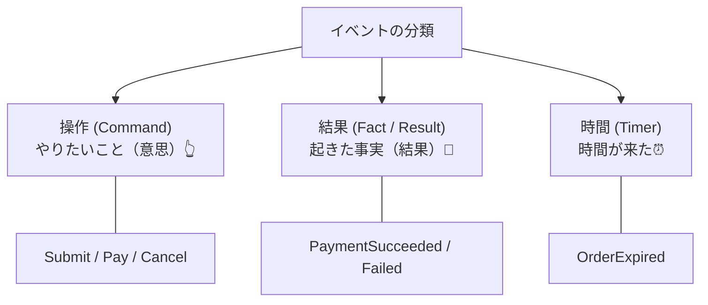
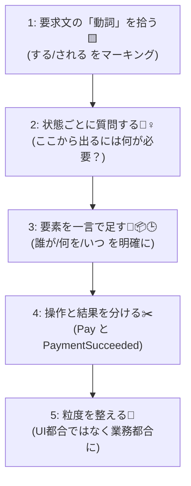

# 第06章：部：実務の壁（async・並行・時間・保存）（24〜28章）🧱⚡

（題材：学食モバイル注文🍙📱）

---

## 0) この章のゴール🎯✨

この章が終わると、あなたは…👇

* 要求文から「状態を動かすきっかけ＝イベント」をスラスラ抽出できる😊
* イベント名がブレにくい命名ルールを作れる🧠✨
* 「そのイベントに何の入力（引数）が必要？」を自然に決められる🧾✅

次の第7章で「遷移表📊」を作るための、超重要な土台だよ〜！💪💖

---

## 1) そもそもイベントってなに？🤔💡

状態機械でいうイベントは、めっちゃシンプルに言うと…

**「状態を動かす“きっかけ”」**だよ📣✨

* ユーザーがボタンを押した
* 支払いAPIから結果が返ってきた
* 店員さん（キッチン）が調理開始にした
* 時間切れになった

こういう「何かが起きた！」がイベント😊

---

## 2. 初学者が迷わない！イベントの分類🧺✨

イベントは、まずこの3つに分けるとラクだよ〜！🫶

1. **操作（Command）**：やりたいこと（意思）👆

   * 例：`SubmitOrder`（注文する） / `RequestCancel`（キャンセルしたい）

2. **結果（Fact / Result）**：起きた事実（結果）📩

   * 例：`PaymentSucceeded`（支払い成功） / `PaymentFailed`（支払い失敗）

3. **時間（Timer）**：時間が来た⏰

   * 例：`OrderExpired`（支払い待ち期限切れ）

※「操作」と「結果」を分けるのがめちゃ大事！
“押した”＝成功とは限らないからね🥺💦

---

## 3. 抜き出し手順：5ステップでいこう🪜✨

### ステップ1：要求文の「動詞」を黄色マーカー🟨✍️

要求（ユーザーストーリーや仕様書）から、状態を動かしそうな動詞を拾うよ！

* 注文する、支払う、キャンセルする、調理開始する、受け取る…など

### ステップ2：「状態ごと」に“入る/出る”を質問する🙋‍♀️

第5章で作った状態一覧を見ながら👇

* 「Draft から Submitted に行くには、何が起きる？」
* 「Paid から Cooking に行くには、何が起きる？」

この質問が強い💪✨（抜け漏れが減るよ）

### ステップ3：「誰が/何を/いつ」を一言で足す👤📦🕒

イベントの説明が一文で言えるようにする！

* 誰が：学生？システム？店員？決済会社？
* いつ：ボタン押下時？API応答時？締切時？
* 何を：支払い？キャンセル？調理開始？

### ステップ4：「操作」と「結果」を分ける✂️✨

例：支払い

* 操作：`Pay`（支払う）
* 結果：`PaymentSucceeded` / `PaymentFailed`

こうしておくと、非同期やリトライにも強くなるよ〜！⏳🔁

### ステップ5：粒度を整える（UIイベントに寄せすぎない）🧼✨

**NG例**：`PayButtonClicked`（UIに寄りすぎ）😵‍💫
**OK例**：`PayRequested` or `Pay`（やりたいこと）😊

「画面の都合」じゃなくて「業務の都合（注文業務）」に寄せるのがコツだよ🏷️✨

---

## 4) 命名のコツ：このルールだけでだいぶ勝てる🏆✨

初学者向けの“安全ルール”いくよ〜！📘💕

### ✅ ルールA：操作（Command）は「動詞＋目的語」

* `SubmitOrder`（注文を送信）
* `Pay`（支払う）
* `RequestCancel`（キャンセル申請）
* `PickUp`（受け取る）

### ✅ ルールB：結果（Fact/Result）は「何が起きたか」

* `OrderSubmitted`（注文が送信された）
* `PaymentSucceeded` / `PaymentFailed`
* `CancelAccepted` / `CancelRejected`
* `RefundIssued`（返金が発行された）

### ✅ ルールC：イベント名に“状態名”を入れすぎない

例：`MoveToPaid` みたいなのは避けがち（遷移先が固定に見えてしまう）🙅‍♀️
結果イベントはOK（`PaymentSucceeded` は実質 Paid に近いけど「事実」だから）👌

---

## 5) 「イベントに必要な入力（引数）」の決め方🧾✨

イベントの入力って、要するに…
**「その処理に必要な情報セット」**だよ📦

### ✅ 最低限の考え方（まずこれだけ）

* **どの注文？**：`OrderId`（必須）
* **誰が？**：`ActorId`（学生ID・店員IDなど）
* **何を？**：金額、品目、決済手段、受け取りコード…
* **あとで追える？**：`RequestId` / `CorrelationId`（ログ用）📜✨

### 💳 支払い系の入力テンプレ

* `OrderId`
* `Amount`（金額）
* `PaymentMethod`（手段）
* `PaymentTransactionId`（外部決済の取引ID）
* （強い）`IdempotencyKey`（二重処理防止🔁）

### ❌ 入れすぎ注意（初心者がやりがち）

* 画面表示用の文言
* UIの座標とかクリック位置
* 「どう表示するか」用のデータ
  → それはUI層の仕事になりやすいよ〜🥺

---

## 6) 題材でやってみよ！イベント候補リスト🍙📱✨

### 6-1) まずは“要求っぽい文”を置くね📝

例：

* 学生は下書き状態で商品を追加できる
* 注文を送信すると、内容が固定される
* 支払いを開始できる（外部決済）
* 支払い成功で注文は確定
* 調理開始/完了は店員が更新
* 受け取り時に完了にできる
* 調理開始前ならキャンセルできる
* キャンセル後に返金が発生することがある
* 支払い待ちが一定時間続いたら期限切れになる

### 6-2) ここからイベントを抜く（例）📣✨

| 種類 | イベント名例             | だれが起こす？   | 代表的な入力（引数）                                             |
| -- | ------------------ | --------- | ------------------------------------------------------ |
| 操作 | `AddItem`          | 学生👩‍🎓   | `OrderId`, `MenuItemId`, `Qty`                         |
| 操作 | `SubmitOrder`      | 学生👩‍🎓   | `OrderId`                                              |
| 操作 | `Pay`              | 学生👩‍🎓   | `OrderId`, `Amount`, `PaymentMethod`, `IdempotencyKey` |
| 結果 | `PaymentSucceeded` | 決済API📩   | `OrderId`, `PaymentTransactionId`, `PaidAt`            |
| 結果 | `PaymentFailed`    | 決済API📩   | `OrderId`, `ReasonCode`                                |
| 操作 | `StartCooking`     | 店員👩‍🍳   | `OrderId`, `StaffId`                                   |
| 操作 | `MarkReady`        | 店員👩‍🍳   | `OrderId`, `ReadyAt`                                   |
| 操作 | `PickUp`           | 店員 or 学生✅ | `OrderId`, `PickupCode`                                |
| 操作 | `RequestCancel`    | 学生👩‍🎓   | `OrderId`, `Reason`                                    |
| 結果 | `CancelAccepted`   | システム✅     | `OrderId`                                              |
| 結果 | `CancelRejected`   | システム🚫    | `OrderId`, `ReasonCode`                                |
| 結果 | `RefundIssued`     | 決済/会計📩   | `OrderId`, `RefundTransactionId`, `Amount`             |
| 時間 | `OrderExpired`     | タイマー⏰     | `OrderId`, `ExpiredAt`                                 |

この表ができると、第7章の「遷移表📊」が爆速で作れるよ〜！🚀✨

---

## 7) ミニ演習（手を動かすよ〜！）🎮✍️

### 演習A：イベント抽出（10分）⏱️

次の問いに答えてね👇

1. Draft→Submitted にするイベントは？
2. Submitted→Paid に関係するイベントを「操作」と「結果」に分けて列挙してね
3. Cancel は「いつでもOK？」ダメなら、Reject系イベント（結果）も作ってみよう🚫

### 演習B：イベント辞書を作る（テンプレ）📘✨

下を埋めるだけでOK！

* イベント名：
* 種類（操作/結果/時間）：
* 一言説明：
* 起こす人（Actor）：
* 必要入力（引数）：
* 失敗しうる？（あるなら ReasonCode は？）：

### 演習C：状態？イベント？クイズ🎯

* `Paid` → 状態？イベント？
* `PaymentSucceeded` → 状態？イベント？
* `Cooking` → 状態？イベント？
* `StartCooking` → 状態？イベント？

（答え：Paid/Cooking は状態、PaymentSucceeded/StartCooking はイベント😊）

---

## 8) つまずきポイントあるある😵‍💫→こう直す！🧯✨

* **「押した＝成功」にしちゃう**
  → 操作と結果を分ける！（`Pay` と `PaymentSucceeded`）💳📩
* **イベント名がブレる（日本語・英語・略語混在）**
  → 命名ルールを1枚に固定して、辞書に書く📘
* **UIの都合がイベント名に混ざる**
  → “業務の言葉”に寄せる（`PayButtonClicked` は卒業🎓）
* **引数が多すぎて地獄**
  → 「遷移判断に必要？」「後で追跡に必要？」だけ残す🧠✨

---

## 9) AI活用コーナー🤖✨（第6章：イベント入力（引数）を出させる🧾）

AIに手伝わせると、ここはめっちゃ早くなるよ〜！🚀
（Visual Studio では Copilot の“エージェント”や右クリックのアクション等も増えてきてるよ📌） ([The GitHub Blog][1])

### ✅ おすすめプロンプト（コピペでOK）🪄

1. **イベント候補を列挙させる**
   「以下の要求から、状態機械のイベント候補を“操作/結果/時間”に分類して、イベント名を英語（PascalCase）で提案して。題材は学食モバイル注文。」

2. **イベントごとの引数候補を出させる（本命）**
   「イベント一覧がある。各イベントについて、(1)最小限の必須引数、(2)あると便利な引数（ログ/追跡用）を分けて提案して。二重処理の観点（Idempotency）も入れて。」

3. **過不足チェック**
   「このイベント一覧で抜け漏れや重複がないかチェックして。特に“操作と結果が混ざってる箇所”を指摘して、修正案を出して。」

### ✅ AIの答えを採用する前のチェック3点✅✅✅

* その引数、**遷移判断に必要？**
* それ、**UI表示の都合じゃない？**
* 失敗パターン（Reject/Failed）が必要なのに、成功しか作ってない？

---

## 10) まとめ🌸

* イベント＝状態を動かす「きっかけ」📣
* まずは **操作/結果/時間** に分類すると迷わない🧺
* 「操作」と「結果」を分けると、現実の失敗や非同期に強い⏳💪
* 引数は「遷移判断に必要＋追跡に必要」から逆算🧾✨

ちなみにC# 14 は .NET 10 でサポートされ、最新の Visual Studio 2026 などで試せるよ〜（言語機能も更新されてる） ([Microsoft Learn][2])

---

次はいよいよ **第7章：遷移表📊✨（最重要）** だよ！
第6章で作った「イベント一覧」が、そのまま縦軸/横軸に入ってくるから、ここまでやると勝ち確😊🎉

[1]: https://github.blog/changelog/2025-12-03-github-copilot-in-visual-studio-november-update/ "GitHub Copilot in Visual Studio — November update - GitHub Changelog"
[2]: https://learn.microsoft.com/ja-jp/dotnet/csharp/whats-new/csharp-14 "C# 14 の新機能 | Microsoft Learn"