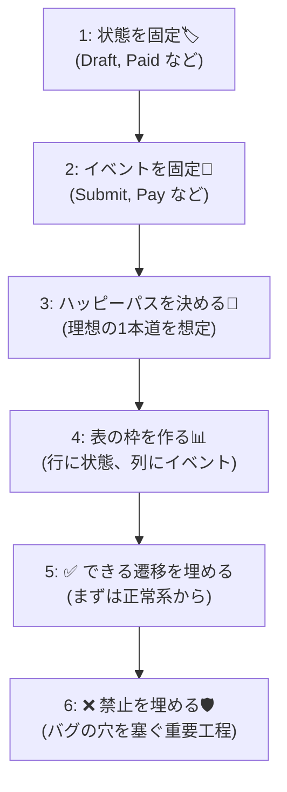
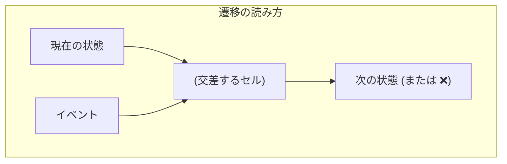

# 第07章：部：発展＆実戦投入（29〜30章）🚀🎓

（学食モバイル注文の題材でいくよ〜🍙📱）

---

## 7.1 この章のゴール🎯✨

この章が終わったら、こんな状態になってるのが理想だよ😊💖

* ✅ 「**今の状態 × 起きたイベント → 次の状態**」を、表でサクッと書ける
* ✅ 抜け漏れ（＝バグの種🌱）を表で見つけられる
* ✅ “できる/できない” を仕様として言語化できる（✅/❌がハッキリ！）
* ✅ 表から、次章の「状態遷移図🗺️」にスムーズにつなげられる

---

## 7.2 遷移表ってなに？（超ざっくり）😺📊


遷移表はね、**掛け算九九**みたいなものだよ〜🧮✨

* 行：**いまの状態（Current State）**
* 列：**イベント（Event）**（ボタン押した・支払い完了した、みたいな「起きたこと」）
* セル：**次の状態（Next State）** または **禁止（❌）**

つまり：

> 「この状態のときに、このイベントが来たら、どうなるの？」を全部埋めた表✅

これがあると、**if文地獄😵‍💫🔥**がスッ…と静かになるの。ほんとに。笑

---

## 7.3 まずは“表の書き方ルール”を決めちゃう🧾✨

遷移表って、書き方がブレると途端に読みにくくなるから、最初にルール固定しよ😊

おすすめのセル表現👇

* `→ Paid` みたいに **次状態だけ書く**（まずはシンプル）
* 禁止は `❌`（あとで理由コードを足してもOK：例 `❌(E_ALREADY_PAID)`）
* 迷ったら空欄にしないで `？` にする（空欄は「見落としたのか判断不能」になりがち😇）

---

### 7.4 作り方：6ステップで完成させるよ🧩✨



### ステップ1：状態を固定する🏷️

まずは状態一覧。ここでは分かりやすく、代表だけでいくね（あとで増やしてOK）😊

* `Draft`（下書き）📝
* `Submitted`（注文済）📮
* `Paid`（支払い済）💳
* `Cooking`（調理中）🍳
* `Ready`（受け取り可）📣
* `PickedUp`（受取済）✅
* `Cancelled`（キャンセル）🛑
* `Refunded`（返金済）💸

### ステップ2：イベントを固定する📣

イベントは「ユーザー操作 or システムで起きた事実」だよ✨

* `Submit`（注文確定）
* `Pay`（支払い実行）
* `StartCooking`（調理開始）
* `MarkReady`（できた！）
* `PickUp`（受け取り）
* `Cancel`（キャンセル）
* `Refund`（返金処理）

### ステップ3：ハッピーパス（理想ルート）を1本決める🌈

まずはこれを表に通すと、作るのが超ラク💖

`Draft → Submitted → Paid → Cooking → Ready → PickedUp`

### ステップ4：表の“枠”を作る📊

行に状態、列にイベントを置くよ！

### ステップ5：まずは✅だけ埋める（できる遷移）

ハッピーパス + 明らかに自然なものから埋めてOK😊

### ステップ6：残りを❌で埋める（禁止を仕様化）

ここが大事！！🔥
禁止を埋める＝**抜け漏れ潰し**だから、バグが減るよ〜🛡️✨

---

## 7.5 遷移表（まずは“学習用の完成例”）📊✨



「最初から全部」だと圧が強いので😇、まずは完成例を見てから、次の演習で空欄埋めしよ🎮✨

| 現在状態＼イベント | Submit      | Pay    | StartCooking | MarkReady | PickUp     | Cancel      | Refund     |
| --------- | ----------- | ------ | ------------ | --------- | ---------- | ----------- | ---------- |
| Draft     | → Submitted | ❌      | ❌            | ❌         | ❌          | → Cancelled | ❌          |
| Submitted | ❌           | → Paid | ❌            | ❌         | ❌          | → Cancelled | ❌          |
| Paid      | ❌           | ❌      | → Cooking    | ❌         | ❌          | ❌           | → Refunded |
| Cooking   | ❌           | ❌      | ❌            | → Ready   | ❌          | ❌           | → Refunded |
| Ready     | ❌           | ❌      | ❌            | ❌         | → PickedUp | ❌           | → Refunded |
| PickedUp  | ❌           | ❌      | ❌            | ❌         | ❌          | ❌           | ❌          |
| Cancelled | ❌           | ❌      | ❌            | ❌         | ❌          | ❌           | → Refunded |
| Refunded  | ❌           | ❌      | ❌            | ❌         | ❌          | ❌           | ❌          |

> ポイント💡：この表は「学習用に単純化」してるよ😊
> たとえば現実だと「Refundできる条件」や「Cancelできる条件」は、次の章（ガード条件🛡️）でちゃんと厳密化していくよ〜✨

---

## 7.6 演習：空欄埋めゲーム🎮✨（めっちゃ大事）

次はあなたの手で“表を作れる”状態にするよ💪💖

### ルール

* `？` のところを `→ 次状態` か `❌` で埋める
* 迷ったら「ユーザーにそれを許すと事故る？😵」で考える

| 現在状態＼イベント | Submit      | Pay    | StartCooking | MarkReady | PickUp     | Cancel      | Refund     |
| --------- | ----------- | ------ | ------------ | --------- | ---------- | ----------- | ---------- |
| Draft     | → Submitted | ❌      | ❌            | ❌         | ❌          | → Cancelled | ❌          |
| Submitted | ❌           | → Paid | ❌            | ❌         | ❌          | → Cancelled | ❌          |
| Paid      | ❌           | ❌      | → Cooking    | ❌         | ❌          | ？           | → Refunded |
| Cooking   | ❌           | ❌      | ❌            | → Ready   | ❌          | ？           | → Refunded |
| Ready     | ❌           | ❌      | ❌            | ❌         | → PickedUp | ？           | → Refunded |

✅ **埋めたらチェック！**

* PaidでCancelできたら…「支払い済なのにキャンセル？」って混乱しない？🤔
* CookingでCancelできたら…厨房が地獄にならない？🍳💥
* ReadyでCancelできたら…作ったのに！？ってならない？😇

### 解答例（学習用）📝✨

* `Paid` の `Cancel` → ❌
* `Cooking` の `Cancel` → ❌
* `Ready` の `Cancel` → ❌

（※ただし「現実の運用では例外的に…」はあり得るので、そのときは**ガード条件**や**例外ルール**として明文化するよ✨）

---

## 7.7 “矛盾チェック”のやり方（ここがプロっぽい✨）🔍

遷移表ができたら、次のチェックをするだけで完成度が一気に上がるよ📈💖

### ✅チェックリスト（超実戦）

1. **決定性**：同じセルに「次状態が2つ」になってない？（ブレる仕様はバグる😵）
2. **網羅性**：起こり得るイベントに `？` が残ってない？
3. **到達可能性**：その状態、そもそも到達できる？（幽霊状態👻）
4. **出口があるか**：ずっと抜けられない状態ない？（ハマり状態🕳️）
5. **終端の定義**：終端（PickedUp/Refunded）に入ったら基本は動かない？
6. **禁止が妥当**：❌が「気分」じゃなくて説明できる？（理由が言えるの大事🧾）
7. **同じ意味の状態が混ざってない**：SubmittedとPaidの境界が曖昧だと事故る💥
8. **イベント名が動詞になってる**：Pay/Submitみたいに行動が想像できる？
9. **例外が混ざってない**：例外処理は「例外として別枠」にしたほうが見やすいこと多い✨
10. **表と文章が一致**：表でOKなのに文章でダメ、みたいな二重人格になってない？😇

---

## 7.8 AI活用：遷移表の“矛盾探し”をやらせよう🤖🔍✨

AIはこの章、めちゃ強い相棒だよ💖（人間が見落とす「表の穴」を見つけがち！）

### Copilot / Codex に投げると良いお願い例💬

```text
この状態一覧とイベント一覧で遷移表を作りました。
1) 矛盾（同じイベントで次状態がブレる等）
2) 到達不能な状態
3) 行き止まり状態
4) 禁止遷移の不自然さ
をチェックして、指摘と改善案をください。

状態: Draft, Submitted, Paid, Cooking, Ready, PickedUp, Cancelled, Refunded
イベント: Submit, Pay, StartCooking, MarkReady, PickUp, Cancel, Refund
遷移表:（ここに表を貼る）
```

### 追加でおすすめ💡（かなり効く）

* 「禁止遷移に**理由コード案**を付けて」って頼む
* 「ユーザー向けメッセージ案も3段階で」って頼む（短い/普通/丁寧）💬✨

---

## 7.9 よくあるつまずきポイント（先回りで潰す🧯）

* 😵「Cancel と Refund の違いがあいまい」
  → Cancel＝注文を取り消す、Refund＝お金を戻す。**状態として分ける**とブレにくいよ💖
* 😵「Cooking中の扱いが曖昧」
  → 現実の運用（厨房）に引っ張られるので、まずは **仕様として禁止に寄せる**のが安全🛡️
* 😵「全部❌にしちゃって進まない」
  → まずはハッピーパスを通して、あとから禁止を埋めるのがコツ🌈✨

---

## 7.10 この章の“提出物”（自分用でOK）📦✨

* ✅ 状態一覧（1行説明つき）
* ✅ イベント一覧（入力があるならメモ）
* ✅ 遷移表（`？`ゼロ！）
* ✅ “禁止遷移ベスト5” と、その理由（1行）🧾

---

## 次章予告🗺️✨（第8章）

次は、この遷移表を **状態遷移図**にするよ✏️😊
図にすると、「説明力」が一気に上がって、チーム開発っぽさが出る〜💖

---

## おまけ：この教材の“最新”メモ🆕✨

* C# 14 は **Visual Studio 2026 / .NET 10 SDK** で試せるよ（公式）😊 ([Microsoft Learn][1])
* .NET 10 は 2025年11月にリリースされていて、LTS枠の扱いだよ（公式）💡 ([Microsoft][2])

---

この章、ここまでできたらかなり強いよ〜💪💖
次に「あなたの表（案）」を貼ってくれたら、私が **仕様の穴🔍** を一緒に探して、より実務っぽく整えるのもできるよ😊✨

[1]: https://learn.microsoft.com/en-us/dotnet/csharp/whats-new/csharp-14?utm_source=chatgpt.com "What's new in C# 14"
[2]: https://dotnet.microsoft.com/en-us/platform/support/policy/dotnet-core?utm_source=chatgpt.com "NET and .NET Core official support policy"