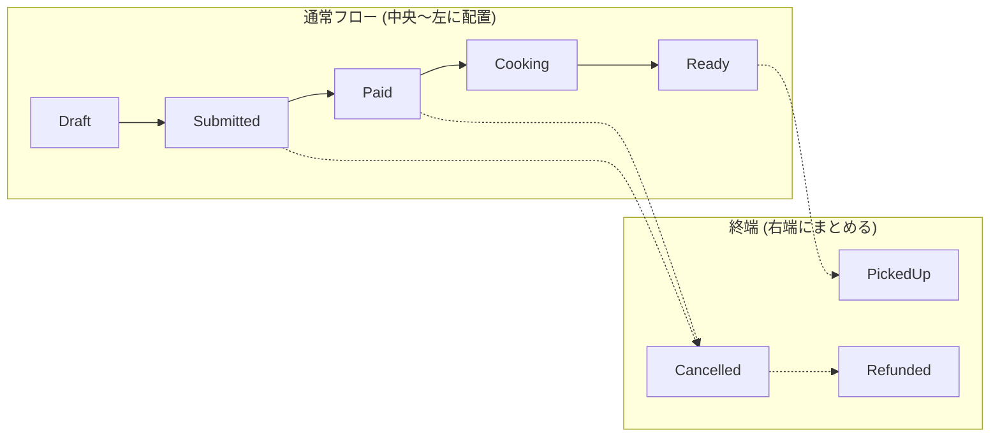
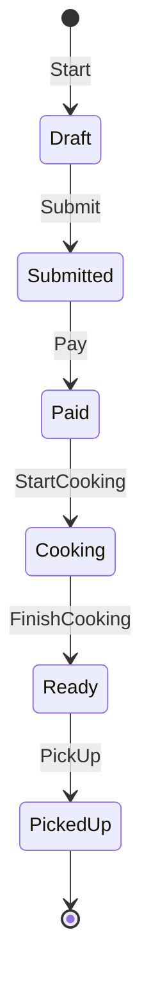
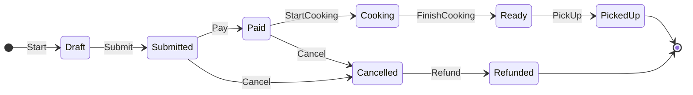

# 第8章：状態遷移図を描く（理解が爆速）🗺️✨

この章は「第7章で作った遷移表」を **“一目でわかる地図🗺️”** に変換する回だよ〜！
状態遷移図があると、仕様の説明・レビュー・実装の相談がめちゃラクになる😊💕

---

## 1) この章のゴール（できるようになること）🎯✨

* 遷移表（現在状態×イベント→次状態）を見て、**状態遷移図に変換**できる✏️🗺️
* 図がゴチャついたときに、**見やすく整えるコツ**がわかる🧹✨
* 図と表と文章がズレないように、**チェック手順**を持てる✅🔍

成果物はこれ👇

* READMEに貼れる **状態遷移図（Mermaid or PlantUML or 画像）** 📝📌
* 図を説明する **短い文章（3〜8行）** ✍️💬

---

## 2) 状態遷移図って、結局なにが嬉しいの？😳💡

遷移表は「正確さ最強」だけど、初見だと脳が疲れる…😵‍💫
状態遷移図は「理解の速さ最強」なの✨

* 👀 パッと見で「全体の流れ」「例外ルート」が分かる
* 🧑‍🤝‍🧑 口頭で説明しやすい（仕様共有が速い）
* 🔎 抜け・矛盾を見つけやすい（線が変だと気づける）

---

## 3) まずは“描き方の型”を覚えよう📐✨（最短で上達するやつ）

### 型A：まずは「主線（ハッピーパス）」だけ描く🌈

例：Draft → Submitted → Paid → Cooking → Ready → PickedUp
いきなり全部描くと散らかるから、**主線だけ**でOK🙆‍♀️✨

### 型B：次に「分岐（キャンセル/返金など）」を足す🌿

主線に枝を足すイメージ🌳✨
例：Submitted → Cancelled、Cancelled → Refunded など

### 型C：最後に「見た目」を整える🧹

* なるべく **左→右**（または上→下）に流す➡️⬇️
* 線の交差を減らす（交差は理解の敵😵‍💫）
* “終わり”の状態をまとめる（Cancelled / PickedUp / Refunded）🏁

---

## 4) おすすめの描き方は3つ🧰✨（どれでもOK）

### ① READMEにそのまま貼れる：Mermaid（最推し）🧜‍♀️📝

* GitHubのMarkdownは `mermaid` ブロックで図を描けるよ（version確認もできる）📌 ([GitHub Docs][1])
* Mermaidの状態遷移図は `stateDiagram-v2` を使うよ〜（開始/終了は `[*]`） ([メルメイド][2])
* さらに、Visual Studio 2026 のMarkdownエディタでもMermaidがプレビュー表示できるようになってるよ✨ ([Microsoft Learn][3])

### ② UMLっぽくキレイ：PlantUML 🌿

* 状態遷移図をテキストで書ける（UMLの定番） ([PlantUML.com][4])

### ③ 手で編集したい：diagrams.net（draw.io）🖱️

* 図をPNG/SVGで書き出せる（エクスポート手順あり） ([draw.io][5])

---

## 5) 実践：遷移表 → 図に変換しよう✏️🗺️

ここからは **作業手順そのまま** いくね！👩‍💻✨

### Step 1：状態を「3グループ」に仕分ける🧺

* ✅ **通常フロー状態**：Draft / Submitted / Paid / Cooking / Ready
* 🏁 **終端っぽい状態**：PickedUp / Cancelled / Refunded

* 🔁 **戻りがある状態**（あるなら）：例）Draftに戻る、など

この仕分けだけで、配置が一気にラクになるよ😊✨

---

### Step 2：イベント名を矢印ラベルにする🏷️➡️

遷移表の「イベント」を、そのまま矢印に書く✍️
例：Submitted --Pay--> Paid

ポイント：

* **“状態”と“イベント”を混ぜない**（超大事！）⚠️

  * 状態：名詞っぽい（Paid）
  * イベント：動詞っぽい（Pay）

---

### Step 3：Mermaidで“ラフ版”を作る（まずは主線だけ）🧜‍♀️✨

開始/終了の `[*]` ルールはMermaid公式でもこの形だよ📌 ([メルメイド][2])

---

### Step 4：分岐（キャンセル/返金）を足して“完成版”へ🌿✨

`direction LR` みたいに流れを固定すると、見やすさが上がりやすいよ➡️✨（環境によって見え方は少し変わるかも）

---

## 6) 図がゴチャついた時の「整えテク」🧹✨

### テク①：図を“2枚”に分ける📄📄

* 1枚目：通常フローだけ🌈
* 2枚目：例外（キャンセル/返金/失敗）だけ🚫

「全部入り1枚」は、だいたい読みにくい😵‍💫
分けた方が“伝わる図”になるよ😊✨

### テク②：終端状態は右端に寄せる🏁➡️

終わりが散らばると迷子になる…🧭💦
PickedUp / Cancelled / Refunded を右端にまとめるとスッキリ✨

### テク③：イベント名を短くする✂️

長いラベルは線を押し広げて崩れる🫠

* ❌ `UserPressedThePayButtonAndAmountIs...`
* ✅ `Pay` / `ConfirmPay`

---

## 7) “表・図・文章”のズレを潰すチェック✅🔍（ここが品質の差！）

チェックはこの順でやると最強💪✨

1. **図にある遷移**は、遷移表に全部ある？（図→表）
2. **遷移表にある遷移**は、図に全部ある？（表→図）
3. 終端（終了）へ向かう線が変じゃない？🏁
4. 「イベント名の表記ゆれ」（Pay/Payment/DoPay）がない？🫠
5. 図の説明文が、図と矛盾してない？📝

---

## 8) AI活用コーナー🤖✨（この章めっちゃ相性いい！）

### プロンプト例①：遷移表→Mermaid生成🧜‍♀️

「この遷移表をMermaidの stateDiagram-v2 に変換して。状態名とイベント名はそのまま。終端は [*] で表現して」

### プロンプト例②：図の説明文（README用）作成📝

「この状態遷移図を、初心者にも分かるように6行で説明して。通常フロー→例外フローの順で」

### プロンプト例③：見づらさ指摘🕵️‍♀️

「このMermaid図、読みやすくする改善案を3つ出して。線の交差、状態の配置、命名の観点で」

（GitHub上でMermaidを使う基本は公式ドキュメントが安心だよ📌） ([GitHub Docs][1])

---

## 9) よくあるつまずきポイント集😵‍💫➡️😊

* 「状態」と「イベント」が混ざる（Paidがイベント扱いになる等）
  → 名詞（状態）／動詞（イベント）で分ける✂️✨
* 図に全部詰め込んでカオス化🌀
  → 2枚に分割📄📄が正義
* 命名がブレて別状態に見える（Cancel / Cancelled / Canceled）
  → 表と図で **完全一致**にする📌

---

## 10) 章末ミニ課題🎒✨（提出物の形）

### 課題A（必須）✅

* 遷移表から状態遷移図を作る（Mermaid推奨）🧜‍♀️
* READMEに「図」と「説明6行」を貼る📝

### 課題B（できたら）🌟

* 通常フロー図と例外フロー図に分けて、2枚構成にする📄📄
* “誰かに見せる前”チェックリスト（5項目）をREADME末尾に付ける✅

---

次章（第9章）は、この図に出しきれない **「禁止の遷移」を仕様として書く🚫🧾** に進むよ〜！
その前に、作った図をここに貼ってくれたら、**見やすさ診断👀✨（線の交差・粒度・命名ゆれ）** もできるよ😊💕

[1]: https://docs.github.com/en/get-started/writing-on-github/working-with-advanced-formatting/creating-diagrams?utm_source=chatgpt.com "Creating Mermaid diagrams"
[2]: https://mermaid.ai/open-source/syntax/stateDiagram.html?utm_source=chatgpt.com "State diagrams | Mermaid"
[3]: https://learn.microsoft.com/en-us/visualstudio/releases/2026/release-notes?utm_source=chatgpt.com "Visual Studio 2026 Release Notes"
[4]: https://plantuml.com/state-diagram?utm_source=chatgpt.com "plantUML's state-diagram"
[5]: https://www.drawio.com/doc/faq/export-diagram?utm_source=chatgpt.com "Export a diagram to various file formats - draw.io"