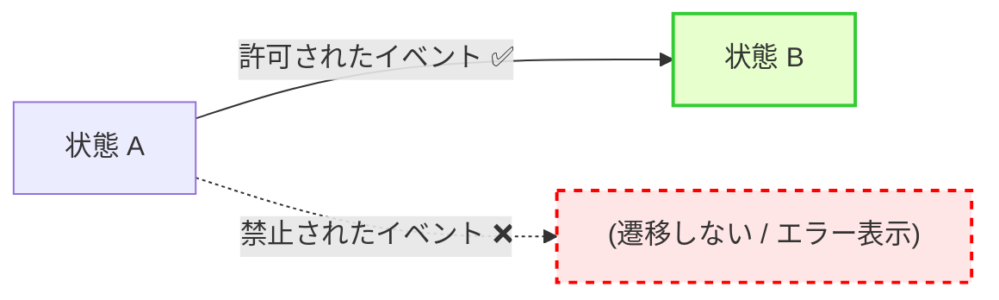
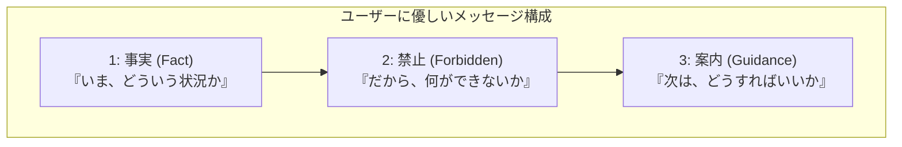

# 第9章：「禁止の遷移」を仕様として書く🚫🧾

この章はね、**「それ、できないよ」を“仕様”として先に決めておく章**だよ😊✨
ここが曖昧だと、実装で「バグなの？仕様なの？」がぐちゃぐちゃになって、あとで地獄になる…😵‍💫🔥

（ちなみに今どきの前提として、**C# 14 は .NET 10 でサポート**、**Visual Studio 2026 は .NET 10 SDK を含む**よ〜🪟✨ ([Microsoft Learn][1])）

---

## 0. この章のゴール🎯✨

できるようになることはこの3つ💪😊

1. **「禁止遷移＝仕様」**として、状態×イベントの“できない組”を言語化できる
2. 禁止のときに出す **ユーザー向けメッセージ**を、優しく・ブレなく作れる💬💖
3. 実装やテストにつなげるための **理由コード（エラー理由）**を付けられる🧾✅

---

## 1. 「禁止の遷移」ってなに？🚫





### ✅ “バグ”じゃなくて “仕様”だよ


状態機械って、ざっくり言うと

* **許可されてる遷移**：仕様どおりに次へ進む✅
* **禁止されてる遷移**：仕様どおりに止める🚫（＝想定内！）

なのね😊✨
禁止を「例外的な事故」として扱うより、**「仕様どおり止める」**のが超大事！

### ✅ 禁止遷移とガード条件の違い（次章の予告👀✨）

* **禁止遷移**：その状態では *絶対に* ダメ（状態×イベントでNGが確定）🚫
* **ガード条件**：同じイベントでも *条件しだい* でOK/NGが分かれる🛡️

UMLでも「ガードがfalseなら遷移は無効（disabled）」みたいに、“無効にする”概念があるよ〜 ([sparxsystems.com][2])
（第10章でガードはがっつりやるよ！）

---

## 2. 禁止遷移の“仕様テンプレ”📋✨

禁止遷移は、**最低これだけ**書けると強い💪😊

| 項目          | なにを書く？          | 例                                 |
| ----------- | --------------- | --------------------------------- |
| 現在状態        | いまの状態           | Cooking                           |
| イベント        | やろうとした操作/出来事    | Cancel                            |
| 判定          | OK / NG         | NG🚫                              |
| 禁止理由（業務ルール） | なぜダメ？（業務の言葉）    | 調理開始後はキャンセル不可                     |
| ユーザー向け表示    | 画面に出す文          | 「調理が始まったのでキャンセルできないよ🍳💦」         |
| 次の行動（推奨）    | ユーザーが次にできること    | 「受け取り後にサポートへ」                     |
| 理由コード       | 実装/ログ/テスト用の短いID | ORDER_CANNOT_CANCEL_AFTER_COOKING |

ポイントはこれ👇✨

* **“技術的に無理”じゃなくて、“業務としてダメ”**を先に書く🧠
* ユーザーメッセージは **責めない・専門用語なし・次の行動が分かる**💖
* 理由コードは **短く・一意・将来も変えにくい**🧾

---

## 3. 学食モバイル注文：禁止遷移ベスト10🔟🍙

題材（例の状態たち）
Draft → Submitted → Paid → Cooking → Ready → PickedUp
＋ Cancelled / Refunded

「ありがちで事故りやすい」禁止遷移を10個、先に“仕様化”しちゃおう😊✨

|  # | 現在状態      | イベント   | NG理由（業務）             | ユーザー向けメッセージ例💬                 | 理由コード例                      |
| -: | --------- | ------ | -------------------- | ------------------------------ | --------------------------- |
|  1 | Draft     | PickUp | 注文してないのに受け取れない       | 「まだ注文が確定してないよ〜📌」              | ORDER_NOT_SUBMITTED         |
|  2 | Draft     | Pay    | 注文確定前は支払い不可          | 「注文を確定してから支払いしてね💳✨」           | PAY_BEFORE_SUBMIT           |
|  3 | Submitted | PickUp | 受け取り準備ができてない         | 「まだ準備中だよ⏳ できたら通知するね✨」          | NOT_READY_YET               |
|  4 | Paid      | Pay    | 二重支払い防止              | 「すでに支払い済みだよ💳✅」                | ALREADY_PAID                |
|  5 | Cooking   | Cancel | 調理開始後はキャンセル不可        | 「ごめんね、調理が始まったのでキャンセルできないよ🍳💦」 | CANNOT_CANCEL_AFTER_COOKING |
|  6 | Ready     | Cancel | 受け取り待ちでキャンセル不可（運用方針） | 「受け取り準備ができてるよ📦 受け取りをお願い🙏」    | CANNOT_CANCEL_WHEN_READY    |
|  7 | PickedUp  | Cancel | 受け取り後キャンセル不可         | 「受け取り済みだからキャンセルはできないよ🙇‍♀️」    | CANNOT_CANCEL_AFTER_PICKUP  |
|  8 | Cancelled | Pay    | キャンセル済みに支払い不可        | 「これはキャンセル済みだよ🛑 新しく注文してね✨」     | PAY_AFTER_CANCEL            |
|  9 | Refunded  | PickUp | 返金済み注文は受け取り不可        | 「返金済みだから受け取りはできないよ💦」          | CANNOT_PICKUP_REFUNDED      |
| 10 | PickedUp  | Refund | 受け取り後返金は別フロー（窓口対応等）  | 「返金はサポートで対応するよ📩（注文番号を送ってね）」   | REFUND_AFTER_PICKUP_SUPPORT |

※ここは“正解”じゃなくて、**運用で決めてOK**だよ😊
たとえば #6（ReadyでCancel）をOKにするなら「廃棄コスト」や「混雑時の運用」を理由に決める感じ🍳📦

---

## 4. ユーザー向けメッセージの作り方💬💖（超大事！）


禁止遷移メッセージって、**3点セット**が最強だよ✨



1. いま何が起きてるか（事実）

2. だから何ができないか（禁止）
3. 次に何をしてね（案内）

### 例：CookingでCancel🚫

* 事実：調理が始まっている
* 禁止：キャンセルできない
* 案内：受け取り後にサポート等

👉「**調理が始まったのでキャンセルできないよ🍳💦 受け取り後にサポートへ連絡してね📩**」

あとね、**“あなたが悪い”系は封印**🙅‍♀️

* ❌「不正な操作です」
* ❌「状態が不正です」
* ✅「いまはこの操作ができないよ」
* ✅「次はこれをしてね」

---

## 5. 理由コード（エラー理由）を付けるコツ🧾✨

理由コードは、将来こういう所で効いてくるよ👇

* テストで「どの禁止が起きたか」を断定できる🧪
* ログで集計できる（どの禁止が多い？）📜
* UIの文言差し替えが楽（コードは同じで文言だけ変更）💬

### 命名のおすすめ

* `CANNOT_CANCEL_AFTER_COOKING` みたいに **英大文字＋アンダースコア**でOK
* 先頭に領域を付けてもOK：`ORDER_...`, `PAY_...`

---

## 6. 未来の実装につながる“データ構造”だけ先に作る📦✨


この章は仕様章だから、「今すぐ動く実装」じゃなくて、**仕様をそのままコードに落とせる形**を作るのが目的だよ😊

```csharp
public enum OrderState
{
    Draft, Submitted, Paid, Cooking, Ready, PickedUp, Cancelled, Refunded
}

public enum OrderEvent
{
    Submit, Pay, StartCooking, MarkReady, PickUp, Cancel, Refund
}

public record ForbiddenTransition(
    OrderState State,
    OrderEvent Event,
    string ReasonCode,
    string UserMessage,
    string BusinessReason
);
```

これを `List<ForbiddenTransition>` にしておけば、あとで

* 遷移表のチェック✅
* テストケース生成🧪
* 実装のResult化✅❌

にそのまま流せるよ✨

---

## 7. AI活用コーナー🤖✨（この章での“勝ち筋”）

AIは **「文案作り」と「漏れチェック」**が超得意💪
逆に **「業務ルールを決める」**のは人間が主役だよ😊（AIは勝手に決めがち💦）

### 7.1 禁止遷移リストの漏れチェック🔍


```text
学食注文の状態一覧とイベント一覧を渡すので、
「禁止にしておいた方が事故が減る組み合わせ」を10個提案して。
各提案に、業務理由（1行）も付けて。
状態: Draft/Submitted/Paid/Cooking/Ready/PickedUp/Cancelled/Refunded
イベント: Submit/Pay/StartCooking/MarkReady/PickUp/Cancel/Refund
```

### 7.2 ユーザー向けメッセージを3段階で作る💬

```text
次の禁止遷移について、ユーザー向け文を
「短い/普通/丁寧」の3種類で作って。
技術用語は使わないで、次の行動も添えて。
禁止: Cooking で Cancel
理由: 調理開始後はキャンセル不可
```

### 7.3 理由コード案を作る🧾

```text
以下の禁止遷移に対して、ReasonCode（英大文字スネーク）を提案して。
短く一意で、将来も意味が変わりにくい名前にして。
（禁止遷移リストを貼る）
```

---

## 8. 演習（手を動かすパート）✍️✨

### 演習A：禁止遷移ベスト10を確定する🔟

1. 遷移表を見ながら「これはダメ」を10個選ぶ
2. それぞれに **業務理由を1行**書く
3. それぞれに **ユーザー文**を書く（3点セット）

### 演習B：理由コードを付ける🧾

* 10個すべてに `ReasonCode` を付与
* 似たものは揃える（例：`CANNOT_CANCEL_...`で統一）

### 演習C：READMEの雛形を作る📘

* 「禁止ルール」セクションを作って、表を貼る
* “仕様としての禁止”を明記（＝バグ扱いしない）

---

## 9. よくあるつまずき＆アンチパターン😵‍💫🌀

* **禁止理由が「実装都合」**になってる

  * ❌「未実装なので不可」
  * ✅「業務上こうだから不可」

* **メッセージが冷たい**

  * ❌「無効な操作です」
  * ✅「いまはできないよ＋次これしてね」

* **禁止が増えてくると一貫性が崩れる**

  * 👉 理由コード命名を揃える／テンプレで書く📋✨

---

## 10. 次章（第10章）へのつなぎ🛡️✨

今日やったのは「状態×イベントで絶対NG」🚫
次は「同じイベントでも条件で分かれる」🛡️✨

たとえば：

* Cancelは **Cooking前ならOK**、Cooking後はNG
* Payは **金額が0以上**ならOK（みたいな入力条件）

ここをガード条件で綺麗に扱うよ〜😊✨

---

## まとめ🌸

禁止遷移を仕様にすると、

* 実装で迷わない✅
* UIが優しくなる💖
* テストが作りやすい🧪
* バグと仕様が混ざらない🚫✨

って感じで、いいことだらけだよ😊🎉

次は第10章「ガード条件」いく？🛡️✨

[1]: https://learn.microsoft.com/en-us/dotnet/csharp/whats-new/csharp-14?utm_source=chatgpt.com "What's new in C# 14"
[2]: https://sparxsystems.com/resources/user-guides/17.1/model-domains/uml-models.pdf?utm_source=chatgpt.com "Unified Modeling Language (UML)"