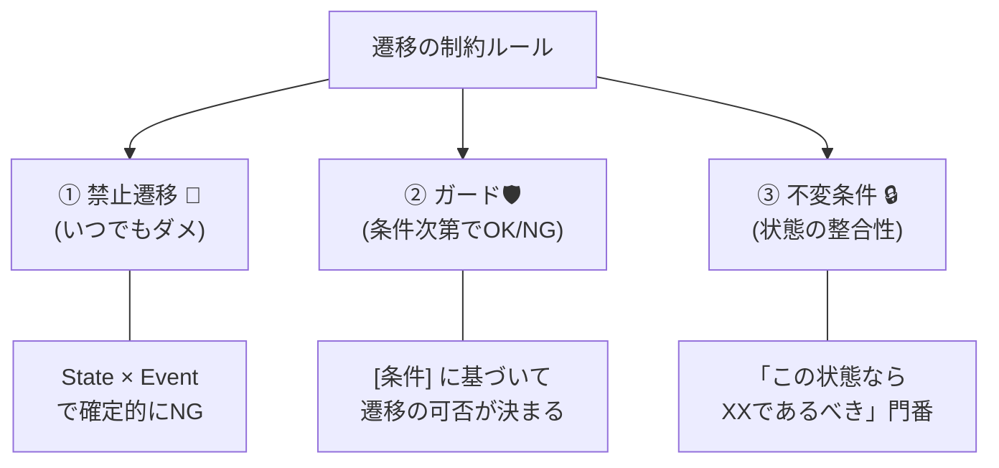
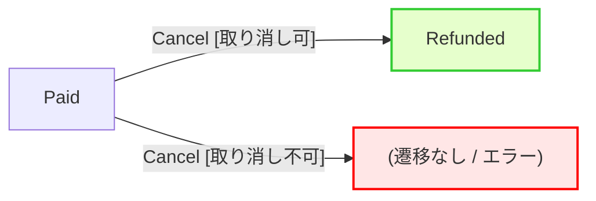

# 第10章：ガード条件（条件つき遷移）🛡️✨

「同じイベントでも、条件しだいで“行けたり行けなかったり”する」やつを、きれいに仕様化する章だよ〜😊💖

> ちなみにこの章で使うC#まわりは、**.NET 10 / C# 14 / Visual Studio 2026** 世代を前提にしてOK（公式にまとまってるよ）✨
> ([Microsoft Learn][1])

---

## 1) この章のゴール🎯✨

この章を終えると、こんなことができるようになるよ😊

* **ガード条件（Guard）**を「仕様として」書ける📝
* 遷移表に **“条件つき遷移”** を混ぜても破綻しない📊✨
* 「禁止遷移🚫」と「ガード🛡️」と「不変条件🔒」を混同しなくなる
* 条件の **テストケース** をサクッと作れる🧪✨

---

## 2) ガード条件ってなに？🛡️


ざっくり言うと…

* **ガード条件＝“その遷移を起こしていいかどうか”を決める真偽条件（true/false）**だよ😊
* UML（状態遷移図）だと、だいたい **`[条件]`** って **角カッコ** で書くのが定番✨

  * 例：`Submit [ItemsCount > 0]`
    ([sparxsystems.com][2])

---

混ざると一気に設計がぐちゃるから、ここで整理しよ〜😵‍💫➡️😊✨




## A. 禁止遷移🚫（いつでもダメ）

* 例：`PickedUp`（受取済）なのに `Pay`（支払い）
* **条件に関係なく常にNG**
* 仕様としては「この状態ではそのイベントは成立しない」って書く

## B. ガード🛡️（条件つきでOK/NG）

* 例：`Cancel` は **調理開始前だけOK** 🍳
* 同じ状態・同じイベントでも、**条件で結果が変わる**

## C. 不変条件（Invariants）🔒（“状態として成り立つ条件”）

* 例：状態が `Paid` なら `PaidAt`（支払日時）が必須
* これは **遷移の話じゃなくて、その状態が成立するための条件**
* “状態の整合性”を守る門番だよ🚪✨

---

## 4) どこにガードを置く？（3つの置き方）📍✨

「ガードってどこに書けばいいの〜？」をここでスッキリさせるよ😊

## ① 遷移に置く（おすすめ✨）

* 遷移表・図にそのまま出せる
* 仕様と実装がズレにくい👍
* 例：`Draft --Submit[ItemsCount>0]--> Submitted`

## ② 状態の中に置く（“状態のルール”としてまとめる）

* 「この状態の間は、こういう条件が必要」みたいに整理したいとき
* ただし、**遷移ごとの差分が多いと散らかりやすい**😵‍💫

## ③ イベント処理の中でifを書く（非推奨💦）

* いわゆる **if文地獄の再発**
* 遷移表を見ても条件が分からない → 事故る😇🔥

> 迷ったら：**①遷移に置く** を基本にすると、教材としても実務としても強いよ💪✨

---

## 5) 題材でやってみよ🍙📱（ガード設計の具体例）

ここから「学食モバイル注文」で、ガードを“仕様”に落とすよ😊✨

## 例1：Submitは「注文が空じゃない」時だけOK🧺➡️🧾

* 状態：`Draft`（下書き）
* イベント：`Submit`（注文確定）
* ガード：`ItemsCount > 0`

**仕様（文章）**

* 「注文内容が1件以上あるときだけ、SubmitでSubmittedになれる」📝

**遷移図っぽい書き方**

* `Draft --Submit [ItemsCount>0]--> Submitted`
* `Draft --Submit [ItemsCount==0]--> Draft（変化なし）`（または“失敗”として扱う）

ここでポイント💡

* “変化なし”も立派な結果だよ✨
* 実装では「同じ状態のまま + メッセージ返す」みたいになることが多い😊

---

## 例2：Cancelは「調理開始前のみ」OK🍳🚫

* イベント：`Cancel`
* ガード：`CookingStarted == false`

**仕様（文章）**

* 「調理開始後のキャンセルはできない」
* 「調理開始前なら Cancelled へ」

**遷移例**

* `Submitted --Cancel [!CookingStarted]--> Cancelled`
* `Cooking --Cancel--> （禁止 or 失敗）`

> ここ、**“禁止遷移”にするか“ガード失敗”にするか** は表現の違いで、どっちでもOK。
> 初学者向けには「同じCancelでも条件で可否が決まる」＝ガードで見せるのが分かりやすいよ😊🛡️

---

## 例3：「同じイベントで次状態が分岐」するパターン🌿✨



例：`Cancel` を `Paid` で押したとき

* もし「決済がまだ取り消せる」なら `Refunded`
* 取り消せないなら NG

**遷移例**

* `Paid --Cancel [CanVoidPayment]--> Refunded`
* `Paid --Cancel [!CanVoidPayment]--> （失敗）`

こうすると

* 「PaidからCancelできるの？」って質問に、**条件つきでYES**って答えられる✨
* 仕様がリアルになるよ😊

---

## 6) 遷移表に“ガード”を入れる書き方📊✨

おすすめの書式はこれ👇

## ✅ 遷移表（おすすめカラム）

* 現在状態（From）
* イベント（Event）
* ガード（Guard）
* 次状態（To）
* 失敗理由（FailReason）
* ユーザー向けメッセージ（UI Message）💬

**書き方のコツ💡**

1. **ガードは“名前”を付ける**（例：`CanCancelBeforeCooking`）

   * 条件式そのものより、意図が伝わる✨
2. **“else側”も仕様に書く**

   * ガードがfalseのとき、

     * 状態は変わらない？
     * エラーとして返す？
     * どんなメッセージ？
3. **同じEventで複数遷移がある場合は、優先順位も決める**

   * 例：`PermitIf A` と `PermitIf B` どっちが先？
   * ライブラリでも「どのガードが先に評価されるか」が重要になるよ👀✨
     ([GitHub][3])

---

## 7) ガード条件の“良い書き方”5か条🧁✨

初心者が一気に強くなるやつ💪😊

1. **“業務用語”で命名する**（CanCancel / HasItems みたいに）
2. **1ガード＝1つの理由**（複合条件モリモリは分割しよ）
3. **I/Oしない**（DBやAPI呼び出しをガードに混ぜない）🚫
4. **イベント引数と状態データで判定する**（再現性が上がる）
5. **テストできる形**にする（関数として切り出すのが強い🧪）

---

## 8) “条件のテストケース”の作り方🧪✨

ガードは **true/false** だから、基本はこれだけで超強い😊

## ① ガードごとに境界値を作る📏

* `ItemsCount > 0`

  * `0`（false）
  * `1`（true）

## ② 時間条件は「ちょい前／ちょうど／ちょい後」⏰

* 例：`Now <= CancelDeadline`

  * 期限1秒前 ✅
  * 期限ちょうど ✅/❌（どっちにするか仕様で決める）
  * 期限1秒後 ❌

## ③ “組み合わせ爆発”は無理しない💣

* 全組み合わせは増えすぎるので、

  * **重要な遷移**
  * **事故りやすい境界**
  * **金銭系（Pay/Refund）**
    だけ厚めにするのが実務的だよ😊✨

---

## 9) ちょい実装でイメージ（最小）🧱✨

この章は仕様中心だけど、イメージ湧くように最小だけね😊

## enum + switchで“ガードっぽさ”を出す

```csharp
public enum OrderState { Draft, Submitted, Paid, Cooking, Cancelled, Refunded }
public record Submit(int ItemsCount);
public record Cancel(bool CookingStarted, bool CanVoidPayment);

public static (OrderState next, string? error) Handle(OrderState state, object ev)
{
    return (state, ev) switch
    {
        (OrderState.Draft, Submit s) when s.ItemsCount > 0
            => (OrderState.Submitted, null),

        (OrderState.Draft, Submit s) // ItemsCount == 0
            => (OrderState.Draft, "商品が入ってないよ〜🧺💦"),

        (OrderState.Submitted, Cancel c) when c.CookingStarted == false
            => (OrderState.Cancelled, null),

        (OrderState.Paid, Cancel c) when c.CookingStarted == false && c.CanVoidPayment
            => (OrderState.Refunded, null),

        (_, Cancel)
            => (state, "今はキャンセルできないよ🍳💦"),

        _ => (state, "未対応の操作だよ〜😵‍💫")
    };
}
```

* `when` が **ガード（条件）** になってるのが分かるかな？😊✨
* でも本格化するとswitchが増えるので、次の章以降で“整理”していくよ🔧✨

## 参考：ガードで分岐するライブラリ例（PermitIf）📚

「ガードで分岐」そのものが機能として載ってる例もあるよ〜（後半で比較に使える）😊
([GitHub][3])

---

## 10) よくあるつまずきポイント😇💥（先に潰そ！）

* **ガードが増えすぎて“実質if文地獄”**
  → ガードを「業務ルール単位」でまとめて命名しよ📝✨
* **ガードが外部I/Oに依存してテスト不能**
  → ガードは“純粋”に。I/Oは別レイヤーへ🚪📤
* **ガード失敗時の挙動が未定**
  → 「状態は変わらない」「理由コード」「メッセージ」までセットで仕様化💬
* **同じEventで複数ガードがあるのに優先順位が曖昧**
  → 仕様に「どちらを先に判定するか」書こう👀✨

---

## 11) 演習（この章のメイン）🎮✨

やってみよ〜！😊💖

## 演習A：ガードを4つ作る🛡️🛡️🛡️🛡️

次の候補から4つ選んで、**ガード名＋条件＋説明1行**を書いてね📝

* `HasItems`（ItemsCount > 0）
* `CanCancelBeforeCooking`（!CookingStarted）
* `CanRefund`（CanVoidPayment）
* `CanPickUp`（受取コード一致 など）
* `WithinPickupWindow`（受取期限内）⏰

## 演習B：遷移表を更新📊✨

* `From / Event / Guard / To / FailReason / UI Message` で10行くらい作る
* ガードがfalseのときの **FailReason** も必ず書くよ💡

## 演習C：テストケースを列挙🧪✨

* 各ガードにつき **true / false** を最低1本ずつ
* 時間条件があるなら境界値も追加⏰

---

## 12) AI活用（この章はめっちゃ相性いい🤖💖）

コピペで使えるプロンプト置いとくね😊✨

## ① ガード候補を洗い出す

* 「学食注文の状態（Draft/Submitted/Paid/Cooking/Ready/PickedUp/Cancelled/Refunded）とイベント一覧（Submit/Pay/Cancel/MarkCooking/MarkReady/PickUp）を前提に、条件付き遷移が必要な場面を10個挙げて。各場面で Guard名（英語の短い名前）と条件式案、日本語の説明1行、失敗時のユーザーメッセージ案も出して。」

## ② 遷移表の矛盾チェック🔍

* 「この遷移表で、同一(From, Event)に複数行がある箇所を見つけ、Guardが重複してないか、elseケースが漏れてないか、優先順位が必要かを指摘して。」

## ③ ガードのテストケース自動列挙🧪

* 「Guard一覧（名前と条件）から、true/falseの最小テストセットと、境界値が必要なもの（数値/時間）を分類して、テストケース表を作って。」

---

## まとめ🎀✨

* ガードは「条件つき遷移」を仕様として扱うための道具🛡️
* **禁止🚫 / ガード🛡️ / 不変条件🔒** を分けると一気に設計が楽になる😊
* 遷移表に **Guard列** を足すだけで、抜け漏れ耐性がぐんと上がる📊✨

次の第11章は、遷移したときに「何をする？」（Entry/Exit/Transitionアクション🎬）を整理して、いよいよ“設計っぽさ”が爆上がりするよ〜😆💖

[1]: https://learn.microsoft.com/en-us/dotnet/core/whats-new/dotnet-10/overview "What's new in .NET 10 | Microsoft Learn"
[2]: https://sparxsystems.com/resources/tutorials/uml2/state-diagram.html?utm_source=chatgpt.com "UML 2 Tutorial - State Machine Diagram"
[3]: https://github.com/dotnet-state-machine/stateless?utm_source=chatgpt.com "dotnet-state-machine/stateless: A simple library for creating ..."