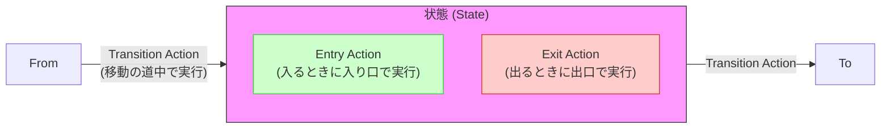
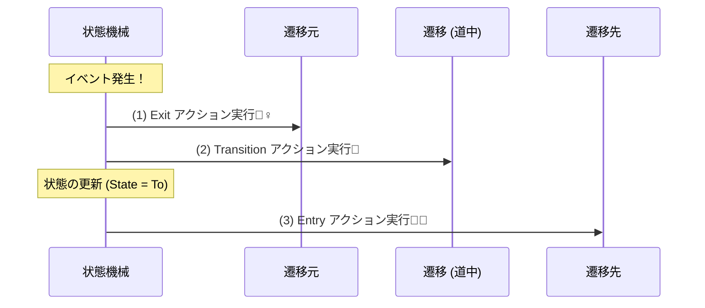

# 第11章：アクション（Entry / Exit / Transition）入門🎬😊

この章は「状態が変わる瞬間に、何をする？」をスッキリ整理できるようになる回だよ〜✨
（次の第12章で「副作用を分離してテストしやすくする」につなげる準備回でもあるよ🧹💖）

---

## 11.1 この章のゴール🎯✨

できるようになることはコレ👇

* ✅ **Entry / Exit / Transition** の違いを説明できる🗣️
* ✅ 仕様の「〜したら○○する」を、**どのアクションに置くべきか**判断できる🧠
* ✅ “置き場所ミス”で起きる事故（通知二重送信とか💥）を避けられる🚧

---

## 11.2 まず超イメージで掴もう🍙📱💡

題材はいつもの「学食モバイル注文」だよ〜😊

状態がこう変わるとするね👇
Draft → Submitted → Paid → Cooking → Ready → PickedUp
（＋ Cancelled / Refunded など）

ここで大事なのは👇

* **状態が変わるとき**にやること（＝アクション）
* **状態の中にいる間**に起きること（※これは次の章以降で強化✨）

---

## 11.3 Entry / Exit / Transition って何？（超やさしく）🌷





### ✅ Entry Action（入った瞬間にやる）🚪✨

「その状態に **入った瞬間** に1回やること」

例：

* Paid に入ったら **レシート発行🧾**
* Cooking に入ったら **調理開始ログ🍳**
* Ready に入ったら **受け取り通知📣**

### ✅ Exit Action（出る瞬間にやる）🚶‍♀️✨

「その状態から **出る瞬間** に1回やること」

例：

* Cooking を出るときに **タイマー停止⏱️**
* Submitted を出るときに **“未処理”フラグ解除🧹**

### ✅ Transition Action（移動の“途中”でやる）🔁✨

「A→B に移る“その遷移”にくっつく処理」
UMLでも「遷移に effect を持てる」感じで説明されるよ〜📘✨ ([sparxsystems.com][1])

例：

* Submitted → Paid の遷移で **決済IDを確定して保存💾**
* Ready → PickedUp の遷移で **受取時刻を確定🕒**

> ざっくり覚え方🌟
> **Entry/Exitは“状態に所属”**、**Transitionは“移動に所属”** だよ😊

---

## 11.4 置き場所の決め方：3秒ルール⏱️✨

迷ったら、この3つで決めるよ👇

1. **“その状態にいる”ことが条件？** → Entry/Exit（状態の所属）
2. **“A→B の移動”が条件？** → Transition（遷移の所属）
3. **同じ到達先でも、入ってきた経路でやることが違う？**
   　→ Transition に寄せる or 「どこから来たか」を見て Entry を分ける（あとで例出すね💖）

---

## 11.5 具体例で練習しよ🎮✨（学食フロー版）

### 例1：Paidになったらレシート発行🧾

* 状態：Paid に“入ったら”やる
  → **Entry（Paid）** が自然💡

### 例2：Submitted→Paid になった瞬間に「決済ID」を保存💾

* 「Submitted→Paid の遷移が起きた」ことが条件
  → **Transition（Submitted→Paid）** が自然💡

### 例3：Cookingを出るときに「調理中フラグ」を消す🧹

* Cooking “から出る”が条件
  → **Exit（Cooking）** 💡

### 例4：「Ready に入ったら通知」だけど、

* Cooking→Ready は通常通知
* Paid→Ready（何かの復元処理）では通知したくない😇
  → **遷移ごとに違う**から、**Transition に置く**方が事故りにくい✨

---

## 11.6 最小コードで“動き”を見よう👀✨（2パターン）

ここでは「雰囲気が分かればOK」だよ😊
（ガチ実装は15章以降で強化するよ🔧✨）

---

### パターンA：まずは自作で “フック” を作る🪝✨

「遷移する直前/直後に呼ぶ場所」を用意して、Entry/Exit/Transition を体感するやつ💡



```csharp

public enum OrderState { Draft, Submitted, Paid, Cooking, Ready, PickedUp, Cancelled }
public enum OrderEvent { Submit, Pay, StartCooking, MarkReady, Pickup, Cancel }

public sealed class OrderMachine
{
    public OrderState State { get; private set; } = OrderState.Draft;

    public void Fire(OrderEvent ev)
    {
        var from = State;
        var to = Next(from, ev);

        // Exit（出る瞬間）
        OnExit(from, ev, to);

        // Transition（移動の途中）
        OnTransition(from, ev, to);

        State = to;

        // Entry（入る瞬間）
        OnEntry(to, ev, from);
    }

    private static OrderState Next(OrderState from, OrderEvent ev) => (from, ev) switch
    {
        (OrderState.Draft, OrderEvent.Submit) => OrderState.Submitted,
        (OrderState.Submitted, OrderEvent.Pay) => OrderState.Paid,
        (OrderState.Paid, OrderEvent.StartCooking) => OrderState.Cooking,
        (OrderState.Cooking, OrderEvent.MarkReady) => OrderState.Ready,
        (OrderState.Ready, OrderEvent.Pickup) => OrderState.PickedUp,
        (_, OrderEvent.Cancel) => OrderState.Cancelled,
        _ => throw new InvalidOperationException($"禁止遷移: {from} + {ev}")
    };

    private void OnEntry(OrderState entered, OrderEvent by, OrderState from)
    {
        if (entered == OrderState.Paid) IssueReceipt();        // 🧾 Entry例
        if (entered == OrderState.Ready) NotifyReady();        // 📣 Entry例（※経路差があるならTransitionへ）
    }

    private void OnExit(OrderState exiting, OrderEvent by, OrderState to)
    {
        if (exiting == OrderState.Cooking) StopCookingTimer(); // ⏱️ Exit例
    }

    private void OnTransition(OrderState from, OrderEvent by, OrderState to)
    {
        if (from == OrderState.Submitted && to == OrderState.Paid) SavePaymentId(); // 💾 Transition例
        WriteTransitionLog(from, by, to); // 📜 ここに置くと分かりやすいこと多いよ
    }

    private static void IssueReceipt() { /* ... */ }
    private static void NotifyReady() { /* ... */ }
    private static void StopCookingTimer() { /* ... */ }
    private static void SavePaymentId() { /* ... */ }
    private static void WriteTransitionLog(OrderState from, OrderEvent by, OrderState to) { /* ... */ }
}
```

このコードの良いところは👇
「Entry/Exit/Transition を置く場所の感覚」が育つこと🌱✨

---

### パターンB：ライブラリで“教科書みたいに”書く📚✨（Stateless）

**Stateless** は .NET で有名な状態機械ライブラリで、Entry/Exit などがそのまま書けるよ〜😊
最新版は NuGet で **5.20.0（2025-09-18 公開）**が確認できるよ。 ([NuGet][2])
（GitHubのREADMEにも OnEntry/OnExit 例が載ってるよ📘） ([GitHub][3])

```csharp
using Stateless;

public enum OrderState { Draft, Submitted, Paid }
public enum OrderTrigger { Submit, Pay }

var sm = new StateMachine<OrderState, OrderTrigger>(OrderState.Draft);

sm.Configure(OrderState.Draft)
  .Permit(OrderTrigger.Submit, OrderState.Submitted);

sm.Configure(OrderState.Submitted)
  .OnEntry(() => Console.WriteLine("Submittedに入ったよ📨"))
  .Permit(OrderTrigger.Pay, OrderState.Paid);

sm.Configure(OrderState.Paid)
  .OnEntry(() => Console.WriteLine("Paidに入ったよ🧾✨"))
  .OnExit(() => Console.WriteLine("Paidから出るよ🚪"));

sm.Fire(OrderTrigger.Submit);
sm.Fire(OrderTrigger.Pay);
```

---

## 11.7 よくある事故💥（ここ超大事😇）

### 事故1：通知が二重に飛ぶ📣📣

例：

* Paid の Entry に「レシートメール」
* Submitted→Paid の Transition にも「レシートメール」
  → **2回送信**しがち😵‍💫

💡対策：

* “レシート送信”は **どっちか一箇所に決める**
* 「経路で変えたい」なら **Transition に寄せる** が安全✨

### 事故2：OnEntry 内で次の遷移を発火して混乱する🌀

Stateless でも「OnEntry中に Fire() したい」ケースの議論があるよ。 ([GitHub][4])
（気持ちは分かるけど、読みづらく＆順序が混乱しやすい😇）

💡対策：

* 「自動で次へ進む」は、**外側（アプリ層）でイベントを投げる**
* もしくは「処理中（Processing）」みたいな中間状態を設計（24章で強化⏳）

### 事故3：Entry/Exit が“重い処理”の塊になる🐘

通知・DB・外部APIが全部入り始めると、テスト地獄へ😵‍💫
→ 次の12章で “ロジック vs I/O” を分けてスッキリさせるよ🧹✨

---

## 11.8 ミニ演習🎮🧠（仕分けゲーム）

次の「〜したら○○する」を、**Entry / Exit / Transition** のどれに置くか考えてね👇✨

1. Paidになったらレシートを発行する🧾
2. Submitted→Paid になったら決済IDを確定して保存する💾
3. Cookingを出るときに調理タイマーを止める⏱️
4. Readyに入ったら通知する📣（ただし復元時は通知しない）
5. Cancelledに入ったら返金処理を開始する💸（※実際のI/Oは次章で分離ね✨）

---

### 解答例（まずは自分の答え出してから見てね😆💖）

* 1. **Entry（Paid）**
* 2. **Transition（Submitted→Paid）**
* 3. **Exit（Cooking）**
* 4. **Transition（Cooking→Ready の方に寄せる）**
* 5. **Entry（Cancelled）**（ただし“返金API呼び出し”は次章で外に逃がす予定🧹）

---

## 11.9 AI活用コーナー🤖✨（Copilot / Codex）

そのまま貼って使えるプロンプト例だよ〜💌

* 🧠 **アクション候補の洗い出し**
  「学食注文の状態機械で、Entry/Exit/Transitionに置くと良いアクション候補を、重複しないように列挙して。各項目に理由も1行つけて。」

* 🔍 **二重送信・二重保存の匂いチェック**
  「このアクション一覧を見て、同じ副作用（通知・保存・課金）が複数箇所に置かれていないか指摘して。統合案も出して。」

* 🧾 **仕様の言い換え**
  「‘Paidになったらレシート発行’を、誰が読んでも誤解しない仕様文に3パターン（短い/普通/丁寧）で書いて。」

---

## 11.10 まとめ🎀✨（次章へのつながり）

* Entry/Exit/Transition は **“所属”で決める**（状態？遷移？）
* “経路で違う”なら **Transition に寄せる**と事故りにくい✨
* アクションは増えるほど危ないので、次章で **副作用を分離**して強くするよ🧹💖

ちなみに、.NET 10 は **2025-11-11 にリリース**されて、**LTSで2028-11-10までサポート**って公式に出てるよ〜🪄 ([Microsoft for Developers][5])
（この講座のコードもその前提で育てていけるね😊）

---

次は第12章「副作用の分離（ロジック vs I/O）」だね🚪📤✨
この第11章のアクションを“仕分け”して、テストしやすい設計にしていくよ〜🧪💖

[1]: https://sparxsystems.com/enterprise_architect_user_guide/17.1/model_simulation/entering_a_state.html?utm_source=chatgpt.com "Example: Entering a State | Enterprise Architect User Guide"
[2]: https://www.nuget.org/packages/stateless/ "
        NuGet Gallery
        \| Stateless 5.20.0
    "
[3]: https://github.com/dotnet-state-machine/stateless "GitHub - dotnet-state-machine/stateless: A simple library for creating state machines in C# code"
[4]: https://github.com/dotnet-state-machine/stateless/issues/11?utm_source=chatgpt.com "Firing triggers from OnEntry/OnExit actions. · Issue #11"
[5]: https://devblogs.microsoft.com/dotnet/announcing-dotnet-10/ "Announcing .NET 10 - .NET Blog"