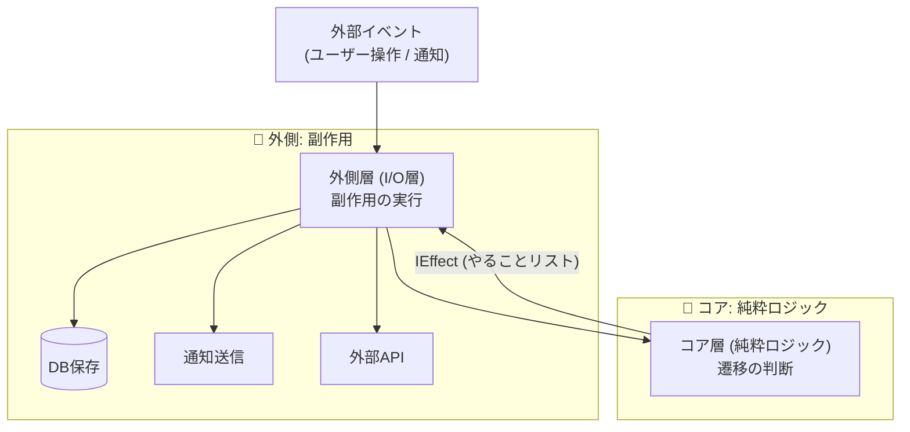
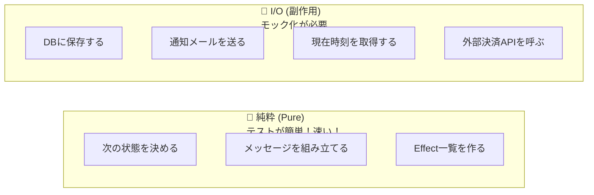

# 第12章：副作用の分離（ロジック vs I/O）🚪📤✨

（題材：学食モバイル注文🍙📱）

---

## 0. 今日の「最新」チェック✅🆕

この章のコード例は、いまの .NET 10 系でそのまま通るイメージで書くね（例：2026-01-13 時点で .NET 10.0.2 が提供中）🧩✨ ([Microsoft][1])
あと、C# 14 は .NET 10 と Visual Studio 2026 で試せるよ〜🪄 ([Microsoft Learn][2])

---

## 1. この章のゴール🎯💖

できるようになることはこの3つだけでOKだよ〜😊✨

1. **状態遷移の判断（ロジック）**を「純粋」にする🧼✨
2. **通知・DB・外部API**みたいな **I/O（副作用）**を外に出す📤🚪
3. その結果、**テストがラク**＆**事故りにくい**設計にする🧪💎

---

## 2. まず結論：状態機械は「2層」に分ける🍰✨





### ✅ 層A：コア（純粋ロジック）🧠✨

* 入力：`現在の状態 + イベント（コマンド） + 必要なデータ`
* 出力：`次の状態 + やるべき副作用（Effectの一覧）`
* ここは **DBもネットも触らない**🙅‍♀️🌐

### ✅ 層B：外側（I/O実行）🔌📦

* コアが出した `Effect` を見て、
  **DB保存💾 / 通知📩 / 決済API💳 / ログ📜** を実行する係

この分け方、あとで DI（依存性注入）とも相性バツグンだよ🤝✨ ([Microsoft Learn][3])

---

## 3. 「混ぜる」と何がつらいの？😵‍💫🔥（あるある）

状態遷移の中にこんなのが入ると…👇

* `HttpClient` で決済API呼ぶ💳🌐
* DBに保存する💾
* `DateTime.Now` で時刻を見る⏰
* `Console.WriteLine` やログをいっぱい書く📜

すると…

* テストが **遅い**（ネット・DB待ち）🐢
* テストが **不安定**（外部API落ちたら失敗）💥
* バグの原因が **追いにくい**（どこで壊れた？）🕵️‍♀️

だから「純粋ロジック」は純粋にして、テストしやすくするのが王道だよ🧪✨（単体テストの基本方針とも一致👍） ([Microsoft Learn][4])

---

## 4. 今日のハンズオン方針🎮✨

この章は「設計の型」を体に入れる回だよ〜🧠💖

### ステップA：副作用を “仕分け” する🧺





第11章で出したアクション（例：Paidになったらレシート発行🧾）を、次の2つに分類するよ👇

* **純粋（Pure）🧼**：計算・判断・メッセージ生成・Effect作成
* **I/O（副作用）📤**：保存、通知、決済、外部API、ログ、時刻取得 など

### ステップB：コアは “Effect を返すだけ” にする🎁

「実行」はしない。**“やることリスト” を返すだけ**にするよ📋✨

### ステップC：外側で Effect を実行する🏃‍♀️💨

DI で注入したサービス（Repository, Notifier, PaymentGateway…）を使って実行するよ🔧✨ ([Microsoft Learn][3])

---

## 5. 実装サンプル：Effect 方式（いちばん教科書的）📘✨

ここから “最小セット” の例を出すね（ConsoleでもAPIでも同じ考え方で使えるよ）😊

### 5.1 モデル（状態・コマンド・Effect）🧱

```csharp
using System;
using System.Collections.Generic;

public enum OrderState
{
    Draft,
    Submitted,
    PaymentProcessing,
    Paid,
    Cancelled
}

public sealed record Order(Guid OrderId, OrderState State, int TotalYen);

// イベント（第18章でCommand化が本格化するけど、先に雰囲気だけ✨）
public abstract record OrderCommand(Guid OrderId);
public sealed record Submit(Guid OrderId) : OrderCommand(OrderId);
public sealed record StartPayment(Guid OrderId) : OrderCommand(OrderId);
public sealed record PaymentSucceeded(Guid OrderId) : OrderCommand(OrderId);
public sealed record Cancel(Guid OrderId) : OrderCommand(OrderId);

// コアが「実行せずに」返す副作用の指示
public interface IEffect;

public sealed record SaveOrder(Order Order) : IEffect;
public sealed record NotifyUser(Guid OrderId, string Message) : IEffect;
public sealed record CallPaymentApi(Guid OrderId, int AmountYen) : IEffect;
public sealed record LogTransition(Guid OrderId, OrderState From, OrderState To, string EventName) : IEffect;
```

---

### 5.2 コア：遷移を判断して「次の状態＋Effect」を返す🧠✨

```csharp
public sealed record TransitionResult(
    bool Accepted,
    Order? NewOrder,
    IReadOnlyList<IEffect> Effects,
    string? RejectReason = null
);

public static class OrderStateMachineCore
{
    public static TransitionResult Handle(Order current, OrderCommand command)
    {
        // ここでは I/O しない！🧼✨
        // 例外で落とすより、まずは Result で返すのが初心者には優しいよ😊

        if (current.OrderId != command.OrderId)
        {
            return new TransitionResult(false, null, Array.Empty<IEffect>(), "OrderId mismatch");
        }

        return command switch
        {
            Submit => HandleSubmit(current),
            StartPayment => HandleStartPayment(current),
            PaymentSucceeded => HandlePaymentSucceeded(current),
            Cancel => HandleCancel(current),
            _ => new TransitionResult(false, null, Array.Empty<IEffect>(), "Unknown command")
        };
    }

    private static TransitionResult HandleSubmit(Order current)
    {
        if (current.State != OrderState.Draft)
            return Reject(current, "Draft 以外は Submit できないよ🚫");

        var next = current with { State = OrderState.Submitted };

        var effects = new List<IEffect>
        {
            new SaveOrder(next),
            new NotifyUser(next.OrderId, "注文を受け付けたよ！🍙✨"),
            new LogTransition(next.OrderId, current.State, next.State, nameof(Submit))
        };

        return Accept(next, effects);
    }

    private static TransitionResult HandleStartPayment(Order current)
    {
        if (current.State != OrderState.Submitted)
            return Reject(current, "Submitted のときだけ支払い開始できるよ💳");

        var next = current with { State = OrderState.PaymentProcessing };

        var effects = new List<IEffect>
        {
            new SaveOrder(next),
            new CallPaymentApi(next.OrderId, next.TotalYen), // ← 実行は外側で！
            new LogTransition(next.OrderId, current.State, next.State, nameof(StartPayment))
        };

        return Accept(next, effects);
    }

    private static TransitionResult HandlePaymentSucceeded(Order current)
    {
        if (current.State != OrderState.PaymentProcessing)
            return Reject(current, "支払い処理中じゃないと完了にできないよ⏳");

        var next = current with { State = OrderState.Paid };

        var effects = new List<IEffect>
        {
            new SaveOrder(next),
            new NotifyUser(next.OrderId, "支払い完了！調理に進むよ〜🍳✨"),
            new LogTransition(next.OrderId, current.State, next.State, nameof(PaymentSucceeded))
        };

        return Accept(next, effects);
    }

    private static TransitionResult HandleCancel(Order current)
    {
        // 例：調理開始後はキャンセル不可…みたいなのは第10章のGuardとも相性◎🛡️
        if (current.State is OrderState.Paid)
            return Reject(current, "支払い後はキャンセルできないよ🙅‍♀️");

        if (current.State is OrderState.Cancelled)
            return Reject(current, "もうキャンセル済みだよ〜😌");

        var next = current with { State = OrderState.Cancelled };

        var effects = new List<IEffect>
        {
            new SaveOrder(next),
            new NotifyUser(next.OrderId, "キャンセルしたよ🧾"),
            new LogTransition(next.OrderId, current.State, next.State, nameof(Cancel))
        };

        return Accept(next, effects);
    }

    private static TransitionResult Accept(Order next, IReadOnlyList<IEffect> effects)
        => new(true, next, effects);

    private static TransitionResult Reject(Order current, string reason)
        => new(false, null, Array.Empty<IEffect>(), reason);
}
```

✅ポイント：`CallPaymentApi` を **“呼ぶ” じゃなくて “呼べ” と指示**してるところがミソだよ💡💖

---

### 5.3 外側：Effect を実行する（DI と相性◎）🔌✨

```csharp
using System.Threading;
using System.Threading.Tasks;

public interface IOrderRepository
{
    Task SaveAsync(Order order, CancellationToken ct);
}

public interface IUserNotifier
{
    Task NotifyAsync(Guid orderId, string message, CancellationToken ct);
}

public interface IPaymentGateway
{
    Task StartPaymentAsync(Guid orderId, int amountYen, CancellationToken ct);
}

public interface IAppLogger
{
    void Info(string message);
}

public sealed class EffectRunner(
    IOrderRepository repo,
    IUserNotifier notifier,
    IPaymentGateway payment,
    IAppLogger logger)
{
    public async Task RunAsync(IReadOnlyList<IEffect> effects, CancellationToken ct)
    {
        foreach (var e in effects)
        {
            switch (e)
            {
                case SaveOrder s:
                    await repo.SaveAsync(s.Order, ct);
                    break;

                case NotifyUser n:
                    await notifier.NotifyAsync(n.OrderId, n.Message, ct);
                    break;

                case CallPaymentApi p:
                    await payment.StartPaymentAsync(p.OrderId, p.AmountYen, ct);
                    break;

                case LogTransition l:
                    logger.Info($"[{l.OrderId}] {l.From} -> {l.To} by {l.EventName}");
                    break;

                default:
                    throw new InvalidOperationException($"Unknown effect: {e.GetType().Name}");
            }
        }
    }
}
```

---

## 6. ここが嬉しい！🎉✨（テストが爆速になる）

### ✅ コアは “超” 単体テスト向き🧪💨

* DBなし
* ネットなし
* ただの関数チェック

例：

```csharp
// 例：Paid の Cancel は拒否される
var order = new Order(Guid.NewGuid(), OrderState.Paid, 500);
var result = OrderStateMachineCore.Handle(order, new Cancel(order.OrderId));

Console.WriteLine(result.Accepted);     // false
Console.WriteLine(result.RejectReason); // 支払い後はキャンセルできないよ🙅‍♀️
```

単体テストを「壊れにくく読みやすく」作る考え方にも合うよ📘✨ ([Microsoft Learn][4])

### ✅ I/O は別でテスト（必要なら）🧪🔌

* `EffectRunner` はモック/フェイクを差し替えてテスト
* もっと確かめたいなら、後で統合テストでOK👌

---

## 7. 演習（この章のメイン）🎮🍙

### 演習1：アクション仕分けゲーム🧺✨（10分）

第11章で出したアクション候補を **20個** 書いて、こう分けてね👇

* 🧼 Pure（例：メッセージ文を作る、次状態を決める）
* 📤 I/O（例：DB保存、Push通知、決済API、ログ出力）

目安：I/O はだいたい **外部と会話してるやつ全部**📞🌐

---

### 演習2：混ざってるコードを “Effect化” で救出🛟✨（20〜30分）

あなたの `HandlePay()` 的な処理が、もし👇みたいに混ざってたら…

* 状態変更
* DB保存
* 通知
* 決済開始

👉 **状態変更＝コア**、残りは **Effect** にして返すようにリファクタしてね✂️✨

---

### 演習3：テストを2本だけ書く🧪✌️（15分）

1. `Draft -> Submit -> Submitted` が通る✅
2. `Paid + Cancel` が拒否される🚫

この2本だけでも「分離の恩恵」がめっちゃ体感できるよ💖

---

## 8. つまずきポイント（先回り）🪤😳

### ❶ 「ログは副作用？」問題📜

うん、副作用だよ〜！
でも現実的には **LogTransition を Effect として返す**のがキレイ✨（コアは静かに、外で記録）💖

### ❷ 「じゃあバリデーションは？」🧾

* **判断に必要な検証**（状態的に無理）はコアでOK🧠
* **外部参照が必要**（在庫確認・会員ランク確認など）は、
  その結果を **事前に渡す**か、**問い合わせ自体をEffect化**するのが安全だよ🛡️✨

### ❸ 「何でもEffectにするとややこしい？」😵‍💫

だからこの講座では、まずは👇だけ守ればOK！

* **状態遷移の判断はコアに閉じ込める**🧠
* **外部と会話するのは全部外**🔌

---

## 9. AIの使いどころ🤖✨（Copilot/Codex向けプロンプト例）

### 🔥 仕分け用

「このメソッド内の処理を “Pure” と “I/O” に分類して、理由も一言で書いて」

### 🔥 Effect化リファクタ用

「この状態遷移処理を、(1) 次状態決定 (2) Effect一覧作成 に分けて。I/OはEffectとして返して」

### 🔥 テスト生成用

「この遷移仕様（状態×イベント→結果）から、単体テストケースを10個列挙して」

（AIに出させたコードは、そのまま採用せず “読んで理解して” から使うのがコツだよ🫶✨）

---

## 10. まとめ🎀✨

この章で一番大事なのはこれだけ💡

* 状態機械は **「決める（Pure）」と「やる（I/O）」を分ける**🧠🔌
* コアは **次状態＋Effectを返すだけ**🎁
* 外側が **Effectを実行する**🏃‍♀️💨
* すると **テストが速い・安定・読みやすい**🧪💖 ([Microsoft Learn][4])

---

次の第13章は「不変条件（Invariants）」で、**“壊れない状態”の守り方🔒✨** に入るよ〜😊
その前に、演習2の Effect化リファクタ、いちばん効くからぜひやってみてね🍙🔥

[1]: https://dotnet.microsoft.com/en-US/download/dotnet/10.0?utm_source=chatgpt.com "Download .NET 10.0 (Linux, macOS, and Windows) | .NET"
[2]: https://learn.microsoft.com/en-us/dotnet/csharp/whats-new/csharp-14?utm_source=chatgpt.com "What's new in C# 14"
[3]: https://learn.microsoft.com/en-us/dotnet/core/extensions/dependency-injection?utm_source=chatgpt.com "Dependency injection - .NET"
[4]: https://learn.microsoft.com/en-us/dotnet/core/testing/unit-testing-best-practices?utm_source=chatgpt.com "Best practices for writing unit tests - .NET"