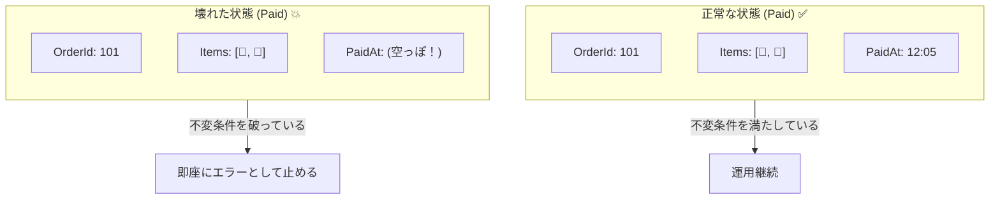
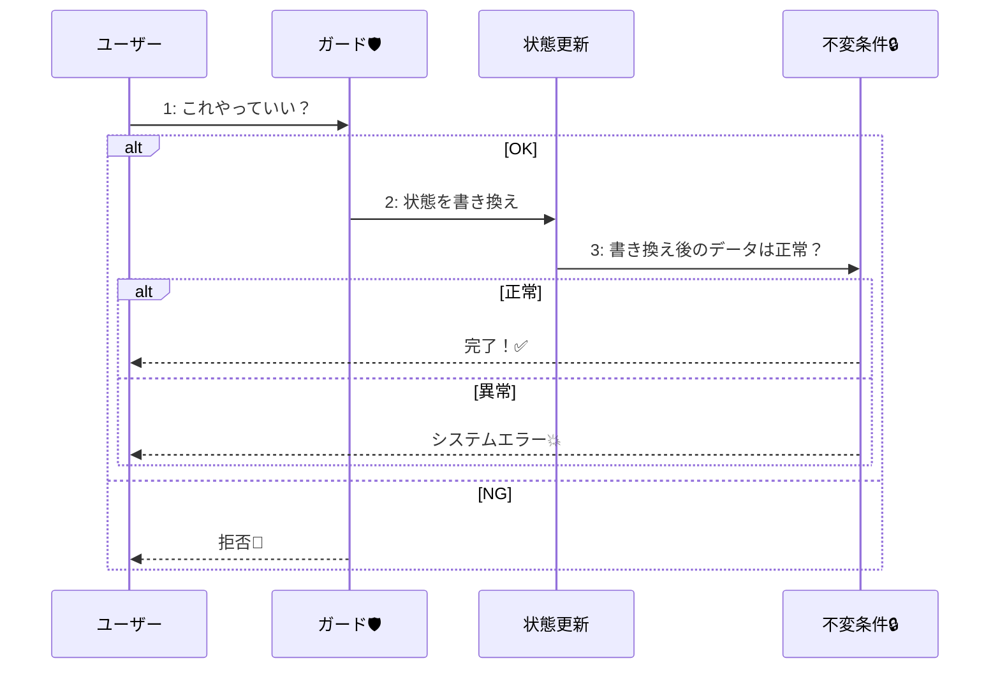

# 第13章：不変条件（Invariants）を決める🔒✨

〜“壊れない状態”を入口で守って、事故を激減させよ〜🧯💖

---

## 1) この章でできるようになること🎯✨

この章のゴールはこれだよ〜😊🫶

* **「この注文は“正常”？」を判断するルール（不変条件）を言語化**できる📘✨
* **状態ごとの必須項目（Paidなら支払い情報が必須！など）を表にできる**📊✅
* **コードで“不変条件チェック”を組み込める**（最小構成でOK）🧱🔒
* **AIに“不変条件の候補”と“破ると困る理由”を出させて、仕様を強くできる**🤖💡

---

## 2) 不変条件ってなに？（超ざっくり）🍙





**不変条件（Invariant）＝「そのオブジェクトが“正常”でいるために、いつでも守られてほしいルール」**だよ🔒✨
たとえば学食注文なら…

* ✅ **Paid（支払い済）なら**「支払い日時が入ってる」「金額が入ってる」
* ✅ **PickedUp（受取済）なら**「受取日時が入ってる」
* ✅ **Refunded（返金済）なら**「返金日時と返金額が入ってる」

こういうのが **“壊れないための最低条件”** だよ〜🧸💕

> ちなみに昔の「Code Contracts」みたいな“専用ツールで契約チェック”は、今の .NET（.NET 5+）ではサポートされない前提なので、**現代は「自前のチェック + NRT（nullable）+ テスト」**が現実的だよ🛡️✨ ([Microsoft Learn][1])

---

ここ、めっちゃ混ざりやすいので超大事〜〜⚠️😵‍💫





* **ガード条件（第10章）**：
  「このイベント、今この状態でやっていい？」（遷移の可否）🚦
  例：Cooking になったら Cancel できない🍳🚫

* **不変条件（第13章）**：
  「この状態の注文って、データとして“成立”してる？」（整合性）🧾✅
  例：Paid なのに PaidAt が null は成立しない💥

---

## 4) 手順：不変条件の作り方（初心者向けテンプレ）🧩✨

やることはシンプルだよ😊

### Step A：注文が持つデータ項目を“棚卸し”🧺


例（最低限）👇

* OrderId
* Items（注文明細）
* TotalAmount
* SubmittedAt
* PaymentMethod / PaidAt
* KitchenTicketId
* ReadyAt / PickedUpAt
* CancelledAt / CancelReason
* RefundedAt / RefundAmount

### Step B：「状態ごとの必須項目チェック表」を作る📊✅


ここが本章のメイン！💖
（例：学食モバイル注文）

| 状態              |    Items | TotalAmount | SubmittedAt | PaidAt/支払情報 | KitchenTicketId | ReadyAt | PickedUpAt | CancelReason | Refund情報 |
| --------------- | -------: | ----------: | ----------: | ----------: | --------------: | ------: | ---------: | -----------: | -------: |
| Draft（下書き）📝    |        ✅ |           ✅ |           — |           — |               — |       — |          — |            — |        — |
| Submitted（注文）📨 |        ✅ |           ✅ |           ✅ |           — |               — |       — |          — |            — |        — |
| Paid（支払）💳      |        ✅ |           ✅ |           ✅ |           ✅ |               — |       — |          — |            — |        — |
| Cooking（調理中）🍳  |        ✅ |           ✅ |           ✅ |           ✅ |               ✅ |       — |          — |            — |        — |
| Ready（受取可）📣    |        ✅ |           ✅ |           ✅ |           ✅ |               ✅ |       ✅ |          — |            — |        — |
| PickedUp（受取済）🎁 |        ✅ |           ✅ |           ✅ |           ✅ |               ✅ |       ✅ |          ✅ |            — |        — |
| Cancelled（取消）🚫 | ✅（場合による） |           ✅ |        （任意） |           — |               — |       — |          — |            ✅ |        — |
| Refunded（返金）💸  | ✅（場合による） |           ✅ |           ✅ |           ✅ |               — |       — |          — |        ✅（理由） |        ✅ |

✅＝必須 / —＝不要 or 任意
※「Cancelled の Items 必須か？」みたいに迷うところが**仕様の決めどころ**だよ〜🤝✨

### Step C：「破ると何が困る？」を書いて強化する🧠💥

例：Paid なのに PaidAt が無い
→ 「いつ支払ったか追跡できない」「返金や監査ログで詰む」😇📉

---

## 5) どこでチェックする？おすすめの置き場所🏠✨


初心者向けの結論だけ言うね😊

* **状態が変わった直後（遷移が成功した直後）に必ずチェック**🔁✅
* **保存（DB/ファイル）する直前にもチェック**💾🔒
* **APIで外へ返す前にもチェック**（壊れたデータを外に出さない）🌐🛡️

---

## 6) 実装（最小構成）：状態ごとの Invariant を switch で守る🧱🔒

※「第15〜17章の実装」に合流しやすい形（enum + メソッド）で書くよ😊

```csharp
#nullable enable
using System;
using System.Collections.Generic;
using System.Linq;

public enum OrderState
{
    Draft,
    Submitted,
    Paid,
    Cooking,
    Ready,
    PickedUp,
    Cancelled,
    Refunded
}

public sealed class Order
{
    public Guid OrderId { get; } = Guid.NewGuid();
    public OrderState State { get; private set; } = OrderState.Draft;

    public List<string> Items { get; } = new();
    public decimal TotalAmount { get; private set; }

    public DateTimeOffset? SubmittedAt { get; private set; }
    public string? PaymentMethod { get; private set; }
    public DateTimeOffset? PaidAt { get; private set; }

    public string? KitchenTicketId { get; private set; }
    public DateTimeOffset? ReadyAt { get; private set; }
    public DateTimeOffset? PickedUpAt { get; private set; }

    public string? CancelReason { get; private set; }
    public DateTimeOffset? CancelledAt { get; private set; }

    public decimal? RefundAmount { get; private set; }
    public DateTimeOffset? RefundedAt { get; private set; }

    public void AddItem(string name, decimal price)
    {
        if (State != OrderState.Draft) throw new InvalidOperationException("下書き以外では商品を追加できません🙅‍♀️");
        Items.Add(name);
        TotalAmount += price;

        EnsureInvariants();
    }

    public void Submit()
    {
        if (State != OrderState.Draft) throw new InvalidOperationException("提出できるのは下書きだけだよ🙅‍♀️");
        SubmittedAt = DateTimeOffset.Now;
        State = OrderState.Submitted;

        EnsureInvariants();
    }

    public void Pay(string paymentMethod)
    {
        if (State != OrderState.Submitted) throw new InvalidOperationException("支払いできるのは注文後だけだよ🙅‍♀️");
        PaymentMethod = paymentMethod;
        PaidAt = DateTimeOffset.Now;
        State = OrderState.Paid;

        EnsureInvariants();
    }

    public void StartCooking(string kitchenTicketId)
    {
        if (State != OrderState.Paid) throw new InvalidOperationException("調理開始できるのは支払い後だけだよ🙅‍♀️");
        KitchenTicketId = kitchenTicketId;
        State = OrderState.Cooking;

        EnsureInvariants();
    }

    public void MarkReady()
    {
        if (State != OrderState.Cooking) throw new InvalidOperationException("受取可にできるのは調理中だけだよ🙅‍♀️");
        ReadyAt = DateTimeOffset.Now;
        State = OrderState.Ready;

        EnsureInvariants();
    }

    public void PickUp()
    {
        if (State != OrderState.Ready) throw new InvalidOperationException("受け取りできるのは受取可だけだよ🙅‍♀️");
        PickedUpAt = DateTimeOffset.Now;
        State = OrderState.PickedUp;

        EnsureInvariants();
    }

    public void Cancel(string reason)
    {
        // 例として：Submitted までならキャンセル可（ガードは第10章の復習）
        if (State is not (OrderState.Draft or OrderState.Submitted))
            throw new InvalidOperationException("今はキャンセルできないよ🙅‍♀️");

        CancelReason = string.IsNullOrWhiteSpace(reason) ? "ユーザー都合" : reason;
        CancelledAt = DateTimeOffset.Now;
        State = OrderState.Cancelled;

        EnsureInvariants();
    }

    public void Refund(decimal refundAmount)
    {
        if (State != OrderState.Cancelled) throw new InvalidOperationException("返金はキャンセル後だけだよ🙅‍♀️");
        RefundAmount = refundAmount;
        RefundedAt = DateTimeOffset.Now;
        State = OrderState.Refunded;

        EnsureInvariants();
    }

    private void EnsureInvariants()
    {
        // 0) 常に守る（状態に依存しない）ルール
        if (OrderId == Guid.Empty) throw new InvalidOperationException("OrderId が壊れてるよ💥");
        if (TotalAmount < 0) throw new InvalidOperationException("合計金額がマイナスはおかしいよ💥");

        // Draft 以外では Items が空はダメ、など“方針”は仕様で決めてOK
        if (State != OrderState.Draft && Items.Count == 0)
            throw new InvalidOperationException("注文なのに商品が空だよ💥");

        // 1) 状態ごとの不変条件
        switch (State)
        {
            case OrderState.Draft:
                // 下書きは SubmittedAt なしでOK、など
                break;

            case OrderState.Submitted:
                Require(SubmittedAt is not null, "SubmittedAt が必須だよ💥");
                break;

            case OrderState.Paid:
                Require(SubmittedAt is not null, "SubmittedAt が必須だよ💥");
                Require(!string.IsNullOrWhiteSpace(PaymentMethod), "PaymentMethod が必須だよ💥");
                Require(PaidAt is not null, "PaidAt が必須だよ💥");
                break;

            case OrderState.Cooking:
                Require(PaidAt is not null, "PaidAt が必須だよ💥");
                Require(!string.IsNullOrWhiteSpace(KitchenTicketId), "KitchenTicketId が必須だよ💥");
                break;

            case OrderState.Ready:
                Require(!string.IsNullOrWhiteSpace(KitchenTicketId), "KitchenTicketId が必須だよ💥");
                Require(ReadyAt is not null, "ReadyAt が必須だよ💥");
                break;

            case OrderState.PickedUp:
                Require(ReadyAt is not null, "ReadyAt が必須だよ💥");
                Require(PickedUpAt is not null, "PickedUpAt が必須だよ💥");
                break;

            case OrderState.Cancelled:
                Require(CancelledAt is not null, "CancelledAt が必須だよ💥");
                Require(!string.IsNullOrWhiteSpace(CancelReason), "CancelReason が必須だよ💥");
                break;

            case OrderState.Refunded:
                Require(CancelledAt is not null, "CancelledAt が必須だよ💥");
                Require(RefundedAt is not null, "RefundedAt が必須だよ💥");
                Require(RefundAmount is not null && RefundAmount >= 0, "RefundAmount が必須だよ💥");
                break;
        }
    }

    private static void Require(bool condition, string message)
    {
        if (!condition) throw new InvalidOperationException(message);
    }
}
```

ポイントはここだよ〜🧡

* **不変条件は「最後の砦」**：状態が変わったあとに必ずチェック✅


* これだけで「PaidなのにPaidAt無い」とかが即爆発する💥→事故が早期発見できる🎉

---

## 7) 演習（やってみよ〜🎮✨）

### 演習1：チェック表を完成させる📊✅

* Cancelled / Refunded まわりの「必須項目」をチーム（自分）で決める🧠✨
* “迷う欄”は、**理由も1行**で書く📝

### 演習2：わざと壊して、落ちるのを確認する💥😆

* `PaidAt = null;` をどこかで混ぜてみる
* `EnsureInvariants()` がちゃんと止めてくれるか確認✅

### 演習3：テストで守る🧪🛡️（ミニ）

* 「PaidなのにPaymentMethod無しは例外」みたいな1〜3本でOK！

---

## 8) AI活用（この章のうまい使いどころ🤖✨）

そのままコピペで使えるよ〜🫶💖

* 🧠 **不変条件候補を出させる**
  「学食モバイル注文の状態（Draft/Submitted/Paid/Cooking/Ready/PickedUp/Cancelled/Refunded）ごとに、不変条件を5個ずつ提案して。破ると困る理由も1行で。」

* 📊 **チェック表を埋めさせる**
  「この状態一覧とデータ項目一覧で、状態×必須項目の表を作って。迷うところは“要判断”と理由も書いて。」

* 💬 **ユーザー向けの説明に直す**（仕様書用）
  「不変条件を、初心者にも分かる言葉で説明して。例も添えて。」

---

## 9) よくあるミス集（先に潰すよ〜🧯✨）

* ❌ **ガード条件と不変条件が混ざる**
  → ガード＝「やっていい？」 / 不変＝「成立してる？」で分ける🧠
* ❌ **不変条件が“お気持ちルール”で増えすぎる**
  → まずは「壊れたら即困る」だけに絞る🔪✨
* ❌ **状態追加したのにチェック更新し忘れる**
  → `switch(State)` があると「追加漏れ」に気づきやすい👍

---

## 10) まとめ🎀✨

* **不変条件は“注文が正常であるための最低条件”**🔒
* まずは **「状態×必須項目チェック表」** を作る📊✅
* 実装は **遷移の直後に `EnsureInvariants()`** を呼べばOK🧱✨
* ツール頼みより、**自前チェック + NRT + テスト**が現代の堅実ルートだよ🛡️ ([Microsoft Learn][1])

おまけで最新の足場だけ一言🪟✨：.NET 10 は LTS で、C# 14 / Visual Studio 2026 とセットで提供されてるよ〜（更新も継続的に出る）📦🔁 ([Microsoft Learn][2])

---

次は「第14章：状態機械を“仕様書”として整える📘✨」で、**いま作った不変条件をREADMEに“読みやすく統合”**していくよ〜🫶💖

[1]: https://learn.microsoft.com/en-us/dotnet/framework/debug-trace-profile/code-contracts?utm_source=chatgpt.com "Code Contracts - .NET Framework"
[2]: https://learn.microsoft.com/en-us/dotnet/csharp/whats-new/csharp-14?utm_source=chatgpt.com "What's new in C# 14"