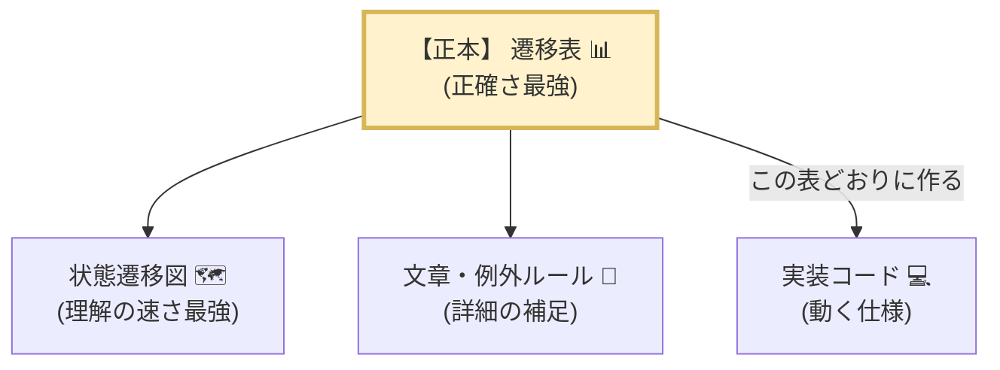
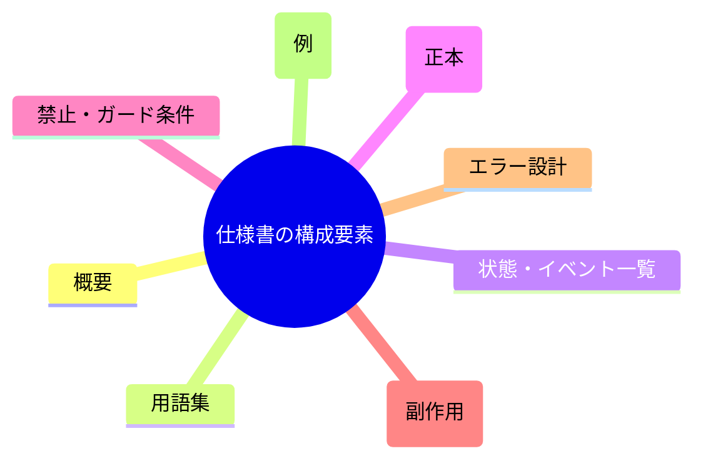
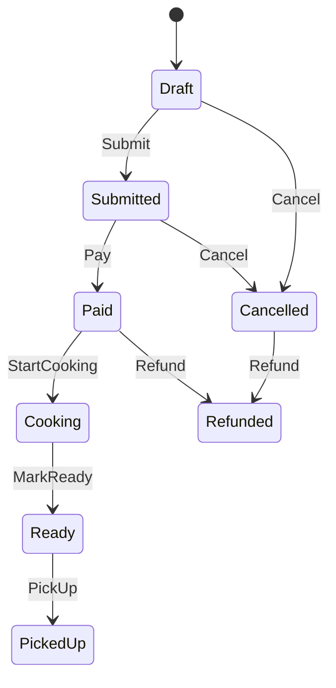

# 第14章：状態機械を“仕様書”として整える📘✨

（学食モバイル注文：Draft → Submitted → Paid → Cooking → Ready → PickedUp / Cancelled / Refunded）

---

## この章のゴール🎯💖

この章が終わったら、あなたの状態機械がこうなります👇✨

* 図🗺️・表📊・文章📝が **ピッタリ一致**してる（矛盾ゼロを目指す！）
* 「状態」「イベント」「禁止」「条件」「例外」の **読み物としての仕様**になってる
* 誰が読んでも「じゃあ実装はこうだね」って **迷わない**
* 変更が入っても、仕様が **崩れない運用**ができる

---

## まずは結論：仕様書の“中心”を1つ決めよう🌟

仕様って、あちこちに散らばるとすぐ壊れます😵‍💫💥
なので「ここが正（せい）！」って中心を1つ決めます。

おすすめはこれ👇

* ✅ **遷移表（現在状態 × イベント → 次状態）** を“正本（せいほん）”にする📊✨

  * 図は「見やすい説明」🗺️
  * 文章は「意図と例外」📝
  * **表がズレたら全部ズレ**なので、表を最優先に直す！

---

## 仕様書に入れる“最低セット”✅✨（これだけで強い）

README（仕様書）に、まずはこの順番で入れるのが安定です📘✨

1. **概要**：この状態機械は何を守る？🍙📱

2. **用語**（ミニ辞書）：State / Event / Guard / Invariant など📚
3. **状態一覧**：各状態の意味（1行）＋「その状態で成り立つこと」🔒
4. **イベント一覧**：何がトリガー？必要な入力は？📣
5. **遷移表（正本）**：できる/できない を全部ここに📊
6. **禁止遷移**：理由つきで🚫🧾
7. **ガード条件**：条件つきで分岐するやつ🛡️
8. **アクション（副作用）**：いつ何をする？🎬
9. **エラーの返し方**：UI/APIにどう伝える？💬
10. **代表フロー例**：よくある流れを3本くらい🏃‍♀️💨
11. **変更履歴**：いつ何が変わった？🕰️

> ポイント：最初から完璧にしなくてOK🙆‍♀️✨
> まず「表・図・文章が一致」だけは死守です🔥

---

## 粒度（つぶつぶ）を揃えるコツ🍡✨

仕様が読みにくくなる原因、だいたいこれ👇😇

### ❶ “画面の状態”と“業務の状態”が混ざる問題🌀

* NG例：`PaymentScreenOpen`（画面）
* OK例：`Paid`（業務の段階）

**状態名は「業務の段階」寄り**にすると、仕様が長生きします🫶

### ❷ 状態名とイベント名の“文法”を固定する📌

おすすめの型👇

* 状態（State）：**名詞/形容詞（結果）**

  * `Draft`, `Submitted`, `Paid`, `Ready`, `Cancelled` …
* イベント（Event）：**動詞（すること）**

  * `Submit`, `Pay`, `StartCooking`, `MarkReady`, `PickUp`, `Cancel`, `Refund` …

これだけで読みやすさ爆上がりします📈✨

---

## “例外ケース”の書き方（初心者でも事故らない）🚧✨

仕様書って、通常フローだけだと **実装で爆発**します💥
例外は「型」で書くのがコツだよ〜😊

### 例外のテンプレ🧩

* **いつ起きる？**（トリガー）
* **何がダメ？**（禁止 or 条件NG）
* **どう返す？**（理由コード＋メッセージ）
* **状態は変わる？**（変わらないなら“そのまま”）
* **ログに何を書く？**（原因追跡用）

たとえば👇

* ケース：`Cooking` になってから `Cancel` された

  * ダメな理由：調理開始後はキャンセル不可
  * 返し方：`InvalidTransition` + 「調理が始まっているのでキャンセルできないよ🙏」
  * 状態：変わらない（`Cooking` のまま）
  * ログ：`state=Cooking, event=Cancel, result=Rejected, reason=AfterCookingStarted`

---

## README（仕様書）テンプレ：そのまま使ってOK📝✨

GitHubのREADMEに **Mermaid図**も埋め込めます🗺️✨（そのまま表示されるよ） ([GitHub Docs][1])

### ① 状態遷移図（Mermaid）🗺️

### ② 状態一覧（1行説明＋不変条件チラ見せ）🔒

* `Draft`：下書き（まだ注文確定してない）
* `Submitted`：注文送信済（支払い待ち）
* `Paid`：支払い完了（レシート発行対象）
* `Cooking`：調理中（キャンセル不可）
* `Ready`：受け取り可能
* `PickedUp`：受取済（完了）
* `Cancelled`：キャンセル完了
* `Refunded`：返金完了

### ③ イベント一覧（入力があるならここに）📣

* `Submit`：注文内容を確定する
* `Pay(amount, method)`：支払いを行う
* `Cancel(reason)`：キャンセルする
* `Refund(reason)`：返金する
* `StartCooking` / `MarkReady` / `PickUp`：店舗側の進行イベント

### ④ 遷移表（ここが正本！）📊✨

* 例（書き方の雰囲気だけ）👇

  * `Draft + Submit => Submitted` ✅
  * `Cooking + Cancel => (禁止)❌ reason=AfterCookingStarted`
  * `Paid + Refund => Refunded` ✅

---

## “一致チェック”のやり方：超実践🧪✨

ここからがこの章のメインイベント🎉

### ステップ1：用語の揺れを潰す🔨

* `Ready` と `Available` が混在してない？
* `Pay` と `Paid` を取り違えてない？（イベントと状態が似てて混乱しがち😵‍💫）

👉 **用語集（ミニ辞書）**をREADMEに1ブロック作ると強い📚✨

### ステップ2：遷移表と図を突き合わせる🧐

* 図にある矢印が、表にある？
* 表にある遷移が、図にある？
* 禁止遷移の理由が、文章にある？

👉 ここは“機械的に”やるのが勝ち💪✨

### ステップ3：例外ケースを“型”で追加する🚧

* 「いつ」「なぜ」「どう返す」「状態は？」
  この4点が書けたら合格🙆‍♀️✨

---

## 演習🎮✨：READMEを“仕様書”に完成させよう

やることは3つだけ💖

1. READMEに **状態一覧**と**イベント一覧**を入れる📝
2. **禁止遷移トップ10**を「理由つき」で書く🚫🧾
3. **代表フロー3本**を書く🏃‍♀️💨

   * 通常：Draft→Submitted→Paid→Cooking→Ready→PickedUp
   * キャンセル：Draft→Cancelled / Submitted→Cancelled
   * 返金：Paid→Refunded（または Cancelled→Refunded）

提出物イメージ👇✨

* 「このREADMEだけ読めば、実装チームが作れる」状態🎉

---

## つまずきポイント集（先回りで回避！）🧯✨

* 😵‍💫 **状態とイベントがごっちゃ** → 名前の文法を固定（状態=結果、イベント=動詞）
* 😱 **禁止だけ書いて理由がない** → 「業務ルール」か「安全のため」か必ず書く
* 🤯 **ガード条件が散らばる** → “ガード条件一覧”に集約して参照させる
* 🫥 **図だけ更新して表が古い** → 正本は遷移表！表→図の順に直す

---

## AIの使いどころ🤖✨（この章はAIがめっちゃ強い！）

そのままコピペで使えるプロンプト例だよ〜🫶✨

### ① 用語の揺れチェック🔍

「以下のREADME草案から、状態名・イベント名の表記ゆれを列挙して、統一案を出して」

### ② 遷移表と図の差分検出🧩

「遷移表（CSV/表）と状態遷移図（Mermaid）を貼るので、
図にあって表にない遷移／表にあって図にない遷移を一覧化して」

### ③ 禁止遷移の“理由”をやさしく整形💬

「禁止遷移の理由を、ユーザー向けメッセージ（短い/普通/丁寧）で3案ずつ作って」

### ④ 代表フローの文章化📝

「この状態遷移を、初心者でも読める説明文にして。専門用語にはカッコで補足して」

---

## 最後の仕上げチェックリスト✅💖

これ全部OKなら、もう“仕様書”としてかなり強いよ🔥

* [ ] 状態一覧とイベント一覧がある
* [ ] 遷移表が正本になってる（更新手順も決めた）
* [ ] 図・表・文章が一致してる
* [ ] 禁止遷移は「理由つき」
* [ ] ガード条件がどこかに集約されてる
* [ ] 代表フローが3本ある
* [ ] 失敗時の返し方（理由コード＋メッセージ方針）がある
* [ ] 変更履歴がある（1行でもOK）

---

## ちょいメモ（最新の前提メモだけ）🪄

* C# 14 は最新のC#で、.NET 10でサポートされています ([Microsoft Learn][2])
* .NET 10 はLTSで、2025年11月リリース＆2028年11月までサポート予定です ([Microsoft][3])
* GitHubのMarkdownはMermaid図をそのまま描画できるので、README仕様書と相性バツグンです ([GitHub Docs][1])

---

次の第15章で、いよいよ **“仕様書どおりに動く最小実装”** を作ります🧱✨
その前に確認なんだけど…😊💡

* READMEは「GitHubに置く想定」？それとも「社内Wiki想定」？
  （書き方の“ちょうどいい丁寧さ”を合わせて、テンプレを最適化できるよ〜💖）

[1]: https://docs.github.com/en/get-started/writing-on-github/working-with-advanced-formatting/creating-diagrams?utm_source=chatgpt.com "Creating Mermaid diagrams"
[2]: https://learn.microsoft.com/en-us/dotnet/csharp/whats-new/csharp-14?utm_source=chatgpt.com "What's new in C# 14"
[3]: https://dotnet.microsoft.com/en-us/platform/support/policy/dotnet-core?utm_source=chatgpt.com "NET and .NET Core official support policy"