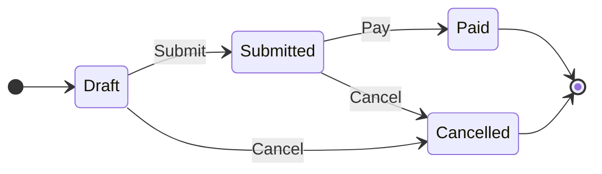
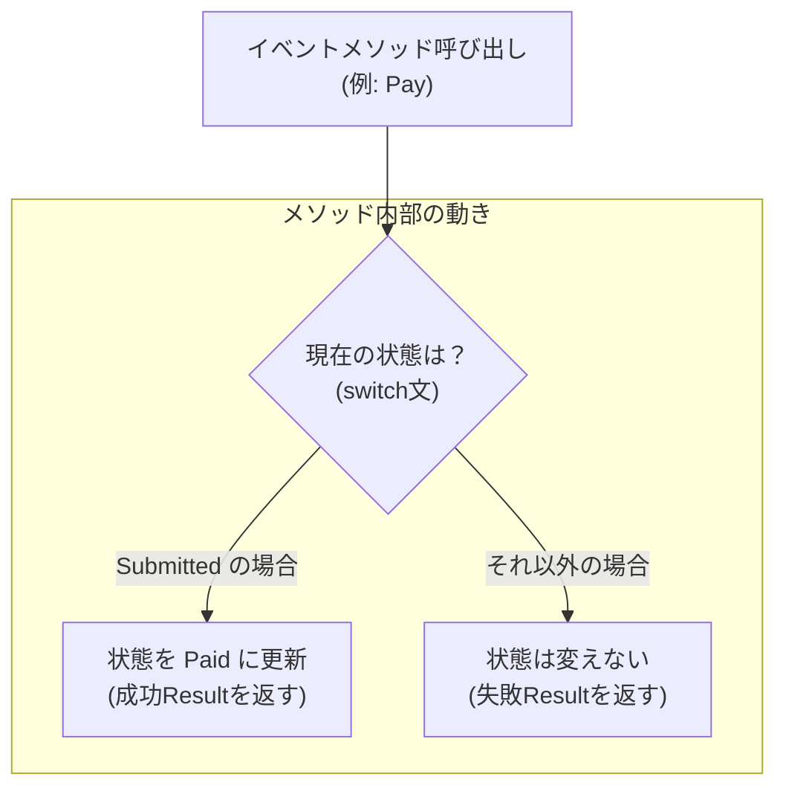

# 第15章：実装v1（enum + switchで最小実装）🧱✨

（2026/01/20 時点の最新：.NET 10 は LTS、C# 14 は .NET 10 で利用OK、Visual Studio 2026 で一式そろうよ）([Microsoft for Developers][1])

---

## 15.0 この章でやること（ゴール）🎯💖

今日のゴールはシンプルだよ〜！😊✨

* ✅ **「動く状態機械」を最短で作る**（まずは成功体験💪）
* ✅ **enum（状態）＋ switch（イベント処理）**で、仕様どおりに遷移させる
* ✅ **Submit / Pay / Cancel の3イベントだけ**先に動かす（小さく始める🧪）

> ここで大事なのは「美しさ」より「まず動く」だよ〜！🚀
> 美しさ（設計っぽさ）は次の章で、ちゃんと育てる🌱✨

---

## 15.1 まず“実装する範囲”を決めよう（ミニ仕様）🍙📱





今回は最小の3イベントだけに絞るよ！

### 状態（State）🧩

* Draft（下書き）
* Submitted（注文済）
* Paid（支払い済）
* Cancelled（キャンセル）

### イベント（Event）📣

* Submit（注文確定）
* Pay（支払い）
* Cancel（キャンセル）

### ざっくり遷移ルール（v1）🗺️

* Draft → Submit → Submitted ✅
* Submitted → Pay → Paid ✅
* Draft / Submitted → Cancel → Cancelled ✅
* それ以外は **禁止（無効遷移）** 🚫

---

## 15.2 実装方針（v1のルール）🧠✨

v1は「最短で動かす」ために、こう割り切るよ😊

* 状態は `enum` で持つ
* イベントは **メソッド**で表現（`Submit()` とか）
* メソッド内で `switch (CurrentState)` して遷移を決める
* 禁止遷移は「例外」じゃなく、まずは **Resultで返す**（ユーザーに優しい方向へ寄せる🌷）

  * ※Result設計は19章で本格的にやるけど、v1でも超ミニでOK！

---

## 15.3 つくるクラス構成（最小）📦✨

今回はこれだけでOK！

* `OrderState`（enum）
* `TransitionResult`（結果：成功/失敗と理由）
* `OrderStateMachine`（本体：現在状態とイベント処理）

---

## 15.4 コード：enum + switch の最小状態機械（コピペで動く）🛠️🤖✨



```csharp

using System;

namespace CafeteriaOrder.StateMachineV1
{
    public enum OrderState
    {
        Draft,
        Submitted,
        Paid,
        Cancelled
    }

    public readonly record struct TransitionResult(
        bool IsSuccess,
        OrderState From,
        OrderState To,
        string Message
    )
    {
        public static TransitionResult Success(OrderState from, OrderState to, string message = "OK")
            => new(true, from, to, message);

        public static TransitionResult Fail(OrderState from, string message)
            => new(false, from, from, message);
    }

    public sealed class OrderStateMachine
    {
        public OrderState CurrentState { get; private set; } = OrderState.Draft;

        // おまけ：最低限の“状態に紐づく情報”を持ってみる（I/Oなし）
        public DateTimeOffset? SubmittedAt { get; private set; }
        public DateTimeOffset? PaidAt { get; private set; }
        public DateTimeOffset? CancelledAt { get; private set; }

        public TransitionResult Submit(DateTimeOffset now)
        {
            return CurrentState switch
            {
                OrderState.Draft => TransitionTo(OrderState.Submitted, now, "注文を確定しました！🍙✨"),

                _ => TransitionResult.Fail(CurrentState,
                    $"いまは Submit できません（現在: {CurrentState}）🚫")
            };
        }

        public TransitionResult Pay(DateTimeOffset now, decimal amountYen)
        {
            if (amountYen <= 0)
            {
                return TransitionResult.Fail(CurrentState, "支払い金額が不正です💸🚫");
            }

            return CurrentState switch
            {
                OrderState.Submitted => TransitionTo(OrderState.Paid, now, $"支払い完了！{amountYen:N0}円💳✨"),

                _ => TransitionResult.Fail(CurrentState,
                    $"いまは Pay できません（現在: {CurrentState}）🚫")
            };
        }

        public TransitionResult Cancel(DateTimeOffset now)
        {
            return CurrentState switch
            {
                OrderState.Draft => TransitionTo(OrderState.Cancelled, now, "キャンセルしました🫶🚫"),
                OrderState.Submitted => TransitionTo(OrderState.Cancelled, now, "キャンセルしました🫶🚫"),

                _ => TransitionResult.Fail(CurrentState,
                    $"いまは Cancel できません（現在: {CurrentState}）🚫")
            };
        }

        private TransitionResult TransitionTo(OrderState next, DateTimeOffset now, string message)
        {
            var from = CurrentState;
            CurrentState = next;

            // “状態に入った時のアクション”を超ミニで置く（I/Oなし）
            switch (next)
            {
                case OrderState.Submitted:
                    SubmittedAt = now;
                    break;

                case OrderState.Paid:
                    PaidAt = now;
                    break;

                case OrderState.Cancelled:
                    CancelledAt = now;
                    break;
            }

            return TransitionResult.Success(from, next, message);
        }
    }
}
```

---

## 15.5 動作確認：Consoleで試す（最短テスト）🖥️✨

「ほんとに動いた！」って体験しよ〜！😊🎉

```csharp
using System;
using CafeteriaOrder.StateMachineV1;

class Program
{
    static void Main()
    {
        var sm = new OrderStateMachine();
        var now = DateTimeOffset.Now;

        Console.WriteLine($"Start: {sm.CurrentState}");

        Console.WriteLine(sm.Pay(now, 500).Message);      // まだSubmittedじゃないので失敗
        Console.WriteLine(sm.Submit(now).Message);        // 成功
        Console.WriteLine(sm.Pay(now, 500).Message);      // 成功
        Console.WriteLine(sm.Cancel(now).Message);        // Paid後なので失敗

        Console.WriteLine($"End: {sm.CurrentState}");
    }
}
```

✅ ここで見たいポイントはこれだよ👇

* Payが先に来たらちゃんと **失敗**する？🚫
* Draft→Submitted→Paid が **成功**する？✅
* PaidのあとにCancelできなくて **失敗**する？🚫

---

## 15.6 演習（手を動かすやつ！）🎮✨

### 演習1：メッセージを仕様っぽく整える💬

禁止遷移のメッセージを、ユーザー向けに優しくしてみてね🫶
例：

* 「支払いは“注文確定後”にできます🍙」
* 「この注文はもう支払い済みです💳」

### 演習2：ログっぽい1行を出す📜

`TransitionResult` を受け取ったら、こう出してみて！

* `Draft --Submit--> Submitted (OK)`
* `Paid --Cancel--> Paid (NG: いまは Cancel できません)`

（ログ設計は21章で本格的にやるよ💎）

### 演習3：状態を1個追加してみる（Cooking）🍳

* Paid → Cooking を1イベント（StartCooking）で遷移させる
* 追加したら「switchが増える感」を体験してメモ📝✨
  → これが次の章（16章）の“痛み”につながるよ👀💥

---

## 15.7 ありがちつまずきポイント（初心者あるある）🧯😵‍💫

* **switchのdefaultで全部例外にしがち**
  → まずはResultで返して「仕様として禁止」を表現すると安心🫶
* **状態に入った時の処理（PaidAt設定とか）を忘れる**
  → `TransitionTo()` に寄せると漏れにくいよ✅
* **“いま何ができるか”が散らばる**
  → v1では仕方ない！次章で改善するから、今は気にしすぎない😊✨

---

## 15.8 AI活用（Copilot / Codex）🤖✨

### ① switchの雛形を作らせる（最強）🛠️

プロンプト例：

* 「`OrderState` が Draft/Submitted/Paid/Cancelled。`Submit/Pay/Cancel` の各メソッドで `switch(CurrentState)` を使った遷移を作って。禁止は Result で返して」

### ② “禁止遷移の文言”だけAIに作らせる💬

プロンプト例：

* 「ユーザー向けに優しい文言で、禁止遷移メッセージを10個。短め/普通/丁寧の3段階も」

### ③ AIの提案は“仕様書（第14章で整えたやつ）”で殴ってOK📘✨

* 「その遷移、遷移表にある？ないなら却下〜！😎」
  これ大事！AIはたまに“それっぽい嘘遷移”を作る😂💦

※Visual Studio 側の Copilot 更新も継続的に出てるので、IDE内の提案品質も定期的に上がるよ〜！([The GitHub Blog][2])

---

## 15.9 まとめ（この章で得た武器）🗡️✨

* enum + switch で **最短の状態機械v1** を作れた🎉
* 禁止遷移を **Resultで表現**できた🫶
* 次章（16章）で「switchつらい…」を観察する準備OK👀💥

---

次は **第16章：switch実装の限界を知る（痛みの観察）** だよ〜！😆
このv1に **状態を2つ** 追加してから行くと、楽しさ倍増（つらさも倍増）だよ😂🔥

[1]: https://devblogs.microsoft.com/dotnet/announcing-dotnet-10/?utm_source=chatgpt.com "Announcing .NET 10"
[2]: https://github.blog/changelog/2025-12-03-github-copilot-in-visual-studio-november-update/?utm_source=chatgpt.com "GitHub Copilot in Visual Studio — November update"