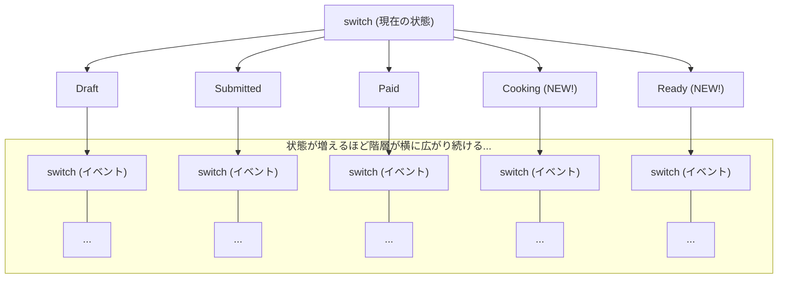
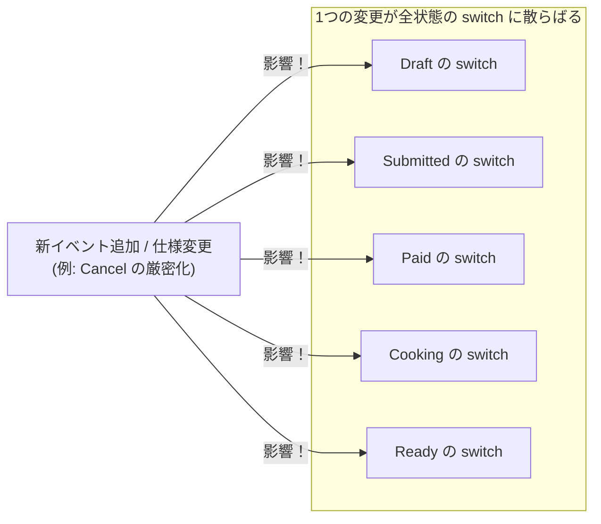

# 第16章：switch実装の限界を知る（痛みの観察）👀💥

この章は「うまく作る章」じゃなくて、**あえて“つらさ”を可視化する章**だよ〜😇📝
次の第17章（テーブル駆動）に進むときに、「だから必要なんだ！」って腹落ちするのがゴール✨

---

## 0) 今日の到達目標🎯✨

* switch実装がしんどくなる理由を、**自分の手で増築して体感**できる👷‍♀️💥
* しんどさを「感想」じゃなくて、**観察メモ（再現できる事実）**として残せる📝🔍
* 次章で何を改善するのかを、**自分の言葉で説明**できる🗣️💖

---

## 1) “痛み”を起こすための追加仕様📌🍙





前章の最小実装（enum + switch）に、次を足すよ👇✨

* 状態を2つ追加：`Cooking`（調理中）🍳、`Ready`（受け取り可）📣
* イベントを3つ追加：`StartCooking`（調理開始）🔥、`MarkReady`（完成）✅、`PickUp`（受取）📦

そして自然なルールを置くよ〜👇

* `Paid` になったら店が `StartCooking` できる🍳
* `Cooking` のあと `MarkReady` で `Ready` に✅
* `Ready` のあと `PickUp` で `PickedUp` に📦
* それ以外の状態でそれらを起こしたら **禁止**🚫

---

## 2) まず「いまのswitch構造」を用意する🧱

※ここでは「限界観察」が目的だから、**わざとベタに**いくよ😇

```csharp
public enum OrderState
{
    Draft,
    Submitted,
    Paid,
    Cooking,   // 追加🍳
    Ready,     // 追加📣
    PickedUp,
    Cancelled,
    Refunded
}

public enum OrderEvent
{
    Submit,
    Pay,
    Cancel,
    Refund,
    StartCooking, // 追加🔥
    MarkReady,    // 追加✅
    PickUp        // 追加📦
}

public sealed class Order
{
    public OrderState State { get; private set; } = OrderState.Draft;

    public void Handle(OrderEvent ev)
    {
        State = Next(State, ev);
    }

    private static OrderState Next(OrderState state, OrderEvent ev)
    {
        // 「状態ごとにイベント分岐」＝典型的なswitch地獄の入口😵‍💫
        return state switch
        {
            OrderState.Draft => ev switch
            {
                OrderEvent.Submit => OrderState.Submitted,
                OrderEvent.Cancel => OrderState.Cancelled,
                _ => throw new InvalidOperationException($"Draftでは {ev} はできません🚫")
            },

            OrderState.Submitted => ev switch
            {
                OrderEvent.Pay => OrderState.Paid,
                OrderEvent.Cancel => OrderState.Cancelled,
                _ => throw new InvalidOperationException($"Submittedでは {ev} はできません🚫")
            },

            OrderState.Paid => ev switch
            {
                OrderEvent.StartCooking => OrderState.Cooking, // 追加🔥
                OrderEvent.Refund => OrderState.Refunded,
                _ => throw new InvalidOperationException($"Paidでは {ev} はできません🚫")
            },

            OrderState.Cooking => ev switch
            {
                OrderEvent.MarkReady => OrderState.Ready, // 追加✅
                _ => throw new InvalidOperationException($"Cookingでは {ev} はできません🚫")
            },

            OrderState.Ready => ev switch
            {
                OrderEvent.PickUp => OrderState.PickedUp, // 追加📦
                _ => throw new InvalidOperationException($"Readyでは {ev} はできません🚫")
            },

            OrderState.PickedUp => ev switch
            {
                _ => throw new InvalidOperationException($"PickedUpでは {ev} はできません🚫")
            },

            OrderState.Cancelled => ev switch
            {
                OrderEvent.Refund => OrderState.Refunded,
                _ => throw new InvalidOperationException($"Cancelledでは {ev} はできません🚫")
            },

            OrderState.Refunded => ev switch
            {
                _ => throw new InvalidOperationException($"Refundedでは {ev} はできません🚫")
            },

            _ => throw new ArgumentOutOfRangeException(nameof(state), state, "未知の状態です💥")
        };
    }
}
```

ここで大事なのは「良いコードにする」じゃなくて👇
**どこが増築でしんどくなるか**を、体で覚えることだよ〜😇💕

> ちなみに C# 14 は .NET 10 でサポートされていて、VS 2026 で試せるよ〜という最新状況だよ✨ ([Microsoft Learn][1])

---

## 3) 演習A：状態を2つ増やしたとき、何が起きた？😵‍💫📝

やることはシンプル👇

1. `OrderState` に `Cooking` と `Ready` を追加🍳📣
2. `OrderEvent` に `StartCooking` と `MarkReady` と `PickUp` を追加🔥✅📦
3. switchにケースを足して動かす（上の例どおり）✅

### 観察ポイント👀✨（ここが本題！）

追加してる最中に、こういう感情にならなかった？👇

* 「どこに追記すればいいんだっけ…？」迷子😵‍💫🧭
* 「同じ例外メッセージ、コピペしよ…」コピペ祭り📋📋📋


* 「このイベント、他の状態でも弾かないとダメ？」漏れ不安😨
* 「禁止ルールがコードのあちこちに散ってる…」散らばり🌀

---

## 4) 演習B：イベントを“1個追加”したときの破壊力💣


ここがswitchの地味にヤバいところ😇
**イベント1個増えるだけで、全部の状態に影響**しがち。

たとえば「`Cancel` の仕様を変更」して👇

* `Cooking` 以降はキャンセル不可（返金フローへ誘導）🚫💳
  みたいなルールを入れようとすると…

* `Draft` / `Submitted` の Cancel はOK

* `Paid` の Cancel は「Refundへ案内」or「禁止」

* `Cooking` の Cancel は禁止

* `Ready` の Cancel は禁止

* …って感じで、**関係箇所が一気に増える**😵‍💫💥

結果👇
「ルール変更」＝「switchの複数箇所修正」＝「漏れたら事故」🚑💦




---

## 5) switch実装の“限界サイン”チェックリスト🚥😇

当てはまったら「次の設計」に進む合図だよ✨

* ✅ 状態やイベントを足すたびに、**複数のswitchを横断**して触ってる🧭
* ✅ **例外メッセージや禁止処理がコピペ**だらけ📋
* ✅ 仕様（遷移表）とコードが**1対1対応してない**（追跡がつらい）🕵️‍♀️
* ✅ 変更のたびに「全部のケース見ないと怖い」😨
* ✅ テストが「どこまで書けば安心か」わからなくなる🧪🌀

---

## 6) “痛みメモ”テンプレ（これが超大事）📝💎


次章以降で改善したとき、**改善が本物か**が分かるようになるよ✨

* 追加したもの：状態 `___`、イベント `___`
* 触った場所：ファイル `___`、修正箇所 `___` 個
* コピペ回数（体感でOK）：`___`
* 迷子になった時間：`___` 分
* 漏れそうと思った瞬間：`___`（例：ReadyのPickUp入れ忘れそう…）
* 「仕様はここに書いてあるのに、コードはどこ？」となった回数：`___`

---

## 7) AI活用🤖✨（“痛み”の言語化に使うのがコツ）

### Copilot / Codex に投げるプロンプト例💬✨

* 「このswitch実装、状態とイベントが増えたときの問題点を3つ、具体例付きで指摘して」🕵️‍♀️
* 「禁止遷移のルールが散らばっている箇所を列挙して」🔍
* 「このコードを“遷移表”の形に変換するなら、表の列と行はどう設計する？」📊
* 「次章でやる“テーブル駆動”に移すなら、どの情報を辞書に持たせるべき？」🧠

---

## 8) おまけ：switch“式”で「漏れ」を警告にできる⚠️✨


C# は **switch式**だと「網羅されてないよ！」って警告が出ることがあるよ（CS8509）⚠️ ([Microsoft Learn][2])
さらに `.editorconfig` でそれを **エラー化**もできる✨ ([Stack Overflow][3])

```ini
## .editorconfig（例）
[*.cs]
dotnet_diagnostic.CS8509.severity = error
```

ただし注意⚠️

* これは「switch**式**」の話が中心で、switch**文**だと効き方が違ったりするよ😇
* enum は外部入力で“変な値”が入る可能性もあるから、最終的には防御も必要💥

この章では深追いしなくてOK！
「漏れが怖い」って感覚を持てたら勝ち〜🏆💖

---

## 9) まとめ：この章で得た“最高のお土産”🎁✨

あなたが今感じた「うっ…しんど…😵‍💫」は、才能じゃなくて **構造の問題**だよ〜🫶
だから次章で👇

* 遷移を **データ（表）** に寄せて📊
* 仕様とコードの距離を縮めて🚀
* 変更が怖くない形にする😊✨

って流れに入るよ！

---

次は第17章「テーブル駆動（辞書で遷移を表す）」に進むけど、
この章の最後にひとつだけ宿題📌✨

👉 **痛みメモ**を、今のプロジェクトに `docs/pain-notes/ch16.md` とかで1枚残しておいてね📝💖

[1]: https://learn.microsoft.com/en-us/dotnet/csharp/whats-new/csharp-14?utm_source=chatgpt.com "What's new in C# 14"
[2]: https://learn.microsoft.com/en-us/dotnet/csharp/language-reference/compiler-messages/pattern-matching-warnings?utm_source=chatgpt.com "Resolve pattern matching errors and warnings - C# reference"
[3]: https://stackoverflow.com/questions/68227746/can-i-force-a-non-exhaustive-c-sharp-switch-expression-to-cause-a-compile-error?utm_source=chatgpt.com "Can I force a non-exhaustive c# switch expression to cause ..."