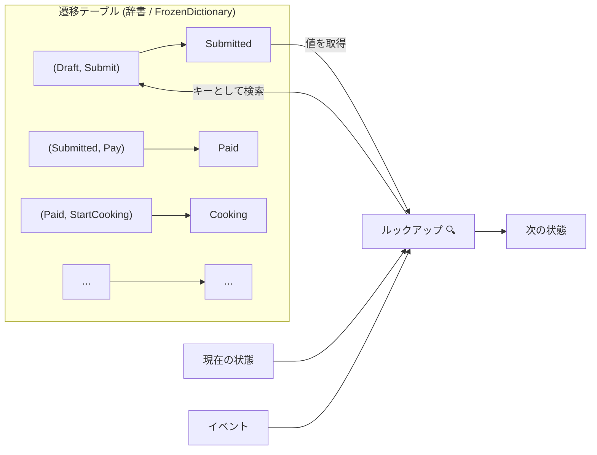
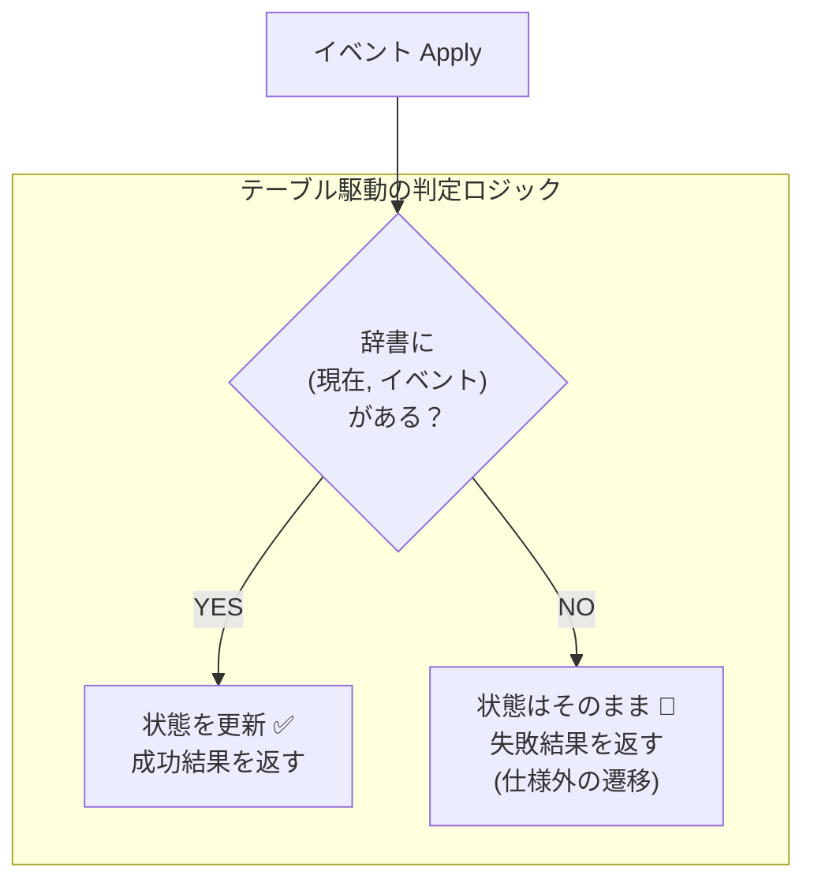

# 第17章：テーブル駆動（辞書で遷移を表す）📚✨

「遷移表（仕様）」をそのまま“データ”としてコードに持ち込み、**switch地獄から卒業**する章だよ〜🎓💖

---

## 1) この章でできるようになること 🎯✨

* 遷移表（現在状態×イベント→次状態）を **Dictionary（辞書）** で表現できる🗺️
* 「できる遷移／できない遷移（禁止）」を **データで**扱える✅🚫
* 仕様変更が来ても、**辞書の行を足す/直すだけ**で追従しやすくなる🧠✨
* （おまけ）固定テーブルなら **FrozenDictionary** で読み取り最適化もできる❄️（.NET 10でも利用可） ([Microsoft Learn][1])

> ちなみに今どきの前提として、**C# 14 は .NET 10 でサポート**、**Visual Studio 2026 には .NET 10 SDK が同梱**だよ〜🪟✨ ([Microsoft Learn][2])

---

## 2) なんで「テーブル駆動」が効くの？🤔💡





### switch実装のつらみ（第16章で味わったやつ）😵‍💫

* 状態が増えるほど `switch` が肥大化🍔
* “この状態のときだけ例外” が混ざって読みづらい🙃
* 遷移表とコードがズレやすくて、仕様漏れが起きる💥

### テーブル駆動のうれしさ 😍

* **仕様（遷移表）＝コード（辞書）** の距離が近い📏✨
* 禁止遷移は「辞書に存在しない」だけで表現できる🚫
* テストも「遷移表の行」をそのまま並べればOK🧪✨（第22章につながる！）

---

## 3) まずは“最小の状態機械”を辞書で作ろう 🧱✨

### 3-1) 状態とイベントを enum にする 🧩

（イベントに引数を持たせる“型イベント化”は次章でやるよ📦✨）

```csharp
public enum OrderState
{
    Draft,
    Submitted,
    Paid,
    Cooking,
    Ready,
    PickedUp,
    Cancelled,
    Refunded
}

public enum OrderEvent
{
    Submit,
    Pay,
    StartCooking,
    MarkReady,
    PickUp,
    Cancel,
    Refund
}
```

---

### 3-2) 遷移定義を「行」で書く（＝遷移表の1行）📊➡️🧾

**ポイント：辞書をいきなり直書きより、まず“行配列”にすると安全**だよ✨
（重複チェックしやすい！）

```csharp
public readonly record struct TransitionDef(OrderState From, OrderEvent Event, OrderState To);

public static class OrderTransitions
{
    public static readonly TransitionDef[] Defs =
    {
        new(OrderState.Draft,     OrderEvent.Submit,      OrderState.Submitted),
        new(OrderState.Submitted, OrderEvent.Pay,         OrderState.Paid),
        new(OrderState.Paid,      OrderEvent.StartCooking,OrderState.Cooking),
        new(OrderState.Cooking,   OrderEvent.MarkReady,   OrderState.Ready),
        new(OrderState.Ready,     OrderEvent.PickUp,      OrderState.PickedUp),

        // 例：キャンセル（とりあえず “調理前までOK” の世界観）
        new(OrderState.Draft,     OrderEvent.Cancel,      OrderState.Cancelled),
        new(OrderState.Submitted, OrderEvent.Cancel,      OrderState.Cancelled),

        // 例：返金（とりあえず “支払い済み以降で返金可” の世界観）
        new(OrderState.Paid,      OrderEvent.Refund,      OrderState.Refunded),
    };
}
```

✅ ここはまだ“仕様の一部”でOK！
章の演習で、あなたの遷移表に合わせて増やして完成させるよ〜🧡

---

### 3-3) 行配列 → Dictionary に変換（重複があったら落とす）🧨✅

辞書のキーは **(状態, イベント)** のペアにするのが気持ちいい✨

```csharp
using System.Collections.Frozen;

public static class TransitionTable
{
    // FrozenDictionaryは「作ったら変更しない」前提の読み取り最適化コレクション❄️
    // 固定テーブルなら相性がいいよ（.NET 10でもOK） :contentReference[oaicite:2]{index=2}
    public static readonly FrozenDictionary<(OrderState State, OrderEvent Event), OrderState> Map
        = Build();

    private static FrozenDictionary<(OrderState, OrderEvent), OrderState> Build()
    {
        var dict = new Dictionary<(OrderState, OrderEvent), OrderState>();

        foreach (var d in OrderTransitions.Defs)
        {
            var key = (d.From, d.Event);

            // ここ超大事：同じキーが2回出たら仕様矛盾なので例外で気づく！
            if (!dict.TryAdd(key, d.To))
                throw new InvalidOperationException(
                    $"Duplicate transition: ({d.From}, {d.Event})");

        }

        return dict.ToFrozenDictionary();
    }
}
```

> Frozenじゃなくて普通の `Dictionary` でも全然OKだよ👍
> 「静的に1回作って、以後は読取りだけ」なら Frozen が相性よい、ってだけ❄️✨ ([Microsoft Learn][1])

---

禁止遷移は「辞書にない」＝失敗として返すだけ😊
例外を投げない設計にしておくと、UI/APIにも優しい💬✨（第19〜20章につながる！）



```csharp

public sealed class OrderStateMachine
{
    public OrderState CurrentState { get; private set; } = OrderState.Draft;

    public TransitionResult Apply(OrderEvent ev)
    {
        var before = CurrentState;
        var key = (before, ev);

        if (!TransitionTable.Map.TryGetValue(key, out var after))
        {
            // 禁止遷移：仕様として「できない」を返す🚫
            return TransitionResult.Fail(
                before,
                ev,
                code: "INVALID_TRANSITION",
                message: $"{before} のときは {ev} できないよ〜💦"
            );
        }

        CurrentState = after;

        // ログ（第21章の種🌱）※とりあえずConsoleでOK！
        Console.WriteLine($"{before} --{ev}--> {after} 📜✨");

        return TransitionResult.Ok(before, after, ev);
    }
}

public readonly record struct TransitionResult(
    bool Success,
    OrderState Before,
    OrderState After,
    OrderEvent Event,
    string? ErrorCode,
    string? Message)
{
    public static TransitionResult Ok(OrderState before, OrderState after, OrderEvent ev)
        => new(true, before, after, ev, null, null);

    public static TransitionResult Fail(OrderState state, OrderEvent ev, string code, string message)
        => new(false, state, state, ev, code, message);
}
```

---

### 3-5) 動作確認ミニランナー 🏃‍♀️💨

```csharp
public static class Program
{
    public static void Main()
    {
        var sm = new OrderStateMachine();

        Console.WriteLine($"Start: {sm.CurrentState} 🌱");

        Console.WriteLine(sm.Apply(OrderEvent.Pay));        // DraftでPayは基本NGにしてるので失敗のはず
        Console.WriteLine(sm.Apply(OrderEvent.Submit));     // OK
        Console.WriteLine(sm.Apply(OrderEvent.Pay));        // OK
        Console.WriteLine(sm.Apply(OrderEvent.Cancel));     // PaidでCancelは辞書に無いので失敗のはず

        Console.WriteLine($"End: {sm.CurrentState} 🎉");
    }
}
```

---

## 4) 演習（ここが本番）💪✨

### 演習A：あなたの遷移表の“上位10行”をコードにする 📊➡️📚

1. 遷移表から「よく使う順」に10行選ぶ🔟
2. `OrderTransitions.Defs` に追加する🧾
3. ランナーで順番に `Apply()` して、ログが気持ちよく流れるのを確認📜✨

✅ ゴール：**“遷移表の10行”がそのままコードになって動く！**🎮

---

### 演習B：禁止遷移のメッセージを整える💬💖

`INVALID_TRANSITION` のメッセージを、ユーザー向けに優しくする✨
例：

* 「今は支払い前なので受け取りできないよ〜🍙」
* 「調理が始まってるからキャンセルできないよ💦」

---

### 演習C：重複キーをわざと作って、検知できるか試す🧨

同じ `(From, Event)` を2回入れて、`Duplicate transition` で落ちることを確認✅
→ **仕様矛盾に“早く気づける”**って超大事だよ〜🫶

---

## 5) よくあるつまずきポイント集 🐣💥

### つまずき①：辞書に入れ忘れて「なんでも禁止」になる😇

* 症状：`TryGetValue` が全部 false
* 対策：まずは **1行だけ**入れて動かす → じわじわ増やす🐾

### つまずき②：辞書の直書きで重複に気づかない😵

* `[(A, X)] = B` を2回書くと **後勝ち**で静かに上書きされがち
* 対策：この章のやり方（`TryAdd` で検知）がおすすめ✅

### つまずき③：ガード条件を混ぜたくなる🛡️

* 「Cancelは調理前だけ」みたいな条件は、次の段階で整理した方が楽✨
* 今章はまず **“表＝辞書”** を固めよう📚

---

## 6) AIの使いどころ（この章は相性抜群）🤖✨

### 使いどころ①：遷移表 → `Defs` を生成してもらう🗺️

プロンプト例👇

* 「この遷移表（貼り付け）を `new(From, Event, To)` の配列に変換して」
* 「重複キーが起きそうな行があったら指摘して」

### 使いどころ②：禁止遷移メッセージを量産💬

* 「女子大生向けの優しい文で、短い/普通/丁寧の3段階で10個作って」✨

### 使いどころ③：テストケースの候補を出す🧪

* 「この `Defs` から正常遷移テストを列挙して（入力→期待状態）」
  （第22章の準備になるよ！）

---

## 7) 章末チェック（ミニクイズ）🎯📝

* Q1：禁止遷移は辞書でどう表現してる？🚫
* Q2：辞書のキーに **(状態, イベント)** を使うメリットは？🧠
* Q3：重複遷移（同じキー）があると何が怖い？😱
* Q4：ログに最低限入れると嬉しい情報は？📜

---

## まとめ 🎀✨

この章のキモはこれだけ！👇

* **遷移表の1行＝コードの1行**にする🧾
* **(状態, イベント) → 次状態** を辞書で持つ🗺️
* **禁止遷移は “辞書に無い”** でOK🚫
* 重複は `TryAdd` で**即バレ**させる🧨✅

次の第18章で、イベントに引数を持たせて「Pay(金額)」みたいな **型イベント**に進化させるよ〜📦✨

[1]: https://learn.microsoft.com/en-us/dotnet/api/system.collections.frozen.frozendictionary?view=net-10.0&utm_source=chatgpt.com "FrozenDictionary Class (System.Collections.Frozen)"
[2]: https://learn.microsoft.com/en-us/dotnet/csharp/whats-new/csharp-14?utm_source=chatgpt.com "What's new in C# 14"