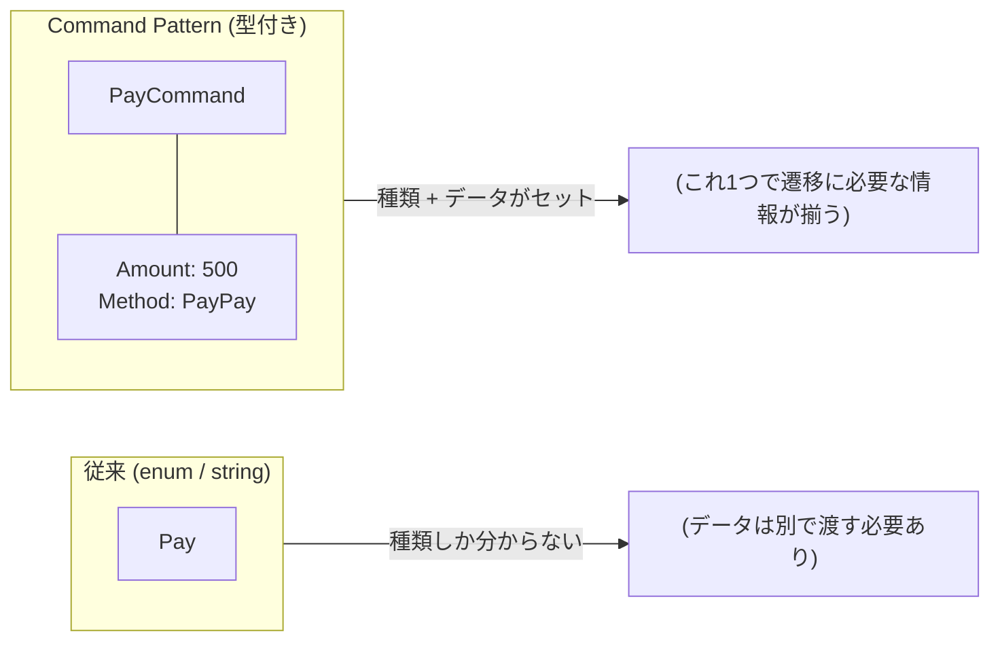
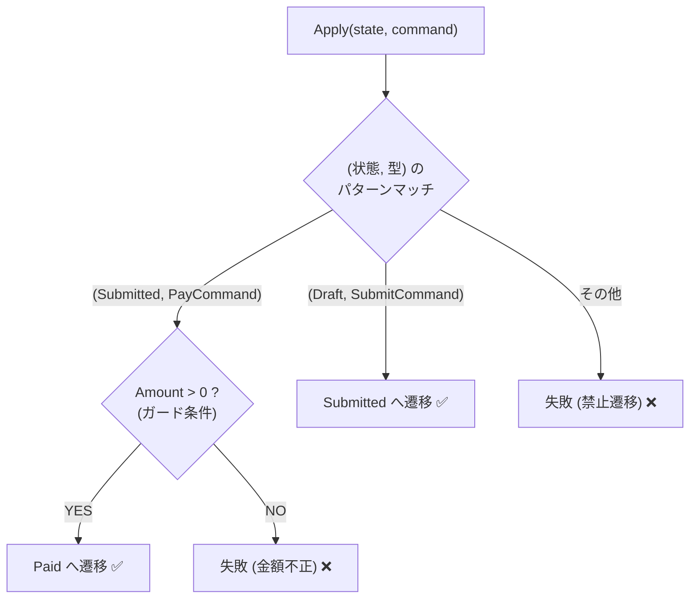

# 第18章：イベントを“型”にする（Command化）📦✨

（題材：学食モバイル注文🍙📱）

---

## 0) この章でできるようになること🎯✨

* 「イベント＝文字列/enum」から卒業して、**イベントを“コマンド型（Command）”として表現**できるようになる💪📦
* `Pay(Amount)` みたいに、**イベントが引数（入力データ）を持つ**のを安全に扱えるようになる💳✅
* 章17の「テーブル駆動（辞書遷移）」に、**型付きイベント**を自然に接続できるようになる🔁🧠
* “設計っぽい”けど難しすぎない、**初学者向けの落とし所**が分かる🌸😊

※この章は .NET 10（LTS）＋ C# 14 世代の考え方で書くよ✨（.NET 10 は 2025-11-11 リリースで、2026-01-13 時点の最新パッチは 10.0.2 だよ） ([Microsoft][1])
※C# 14 は .NET 10 上でサポートされる “最新の C#” として案内されてるよ📘✨ ([Microsoft Learn][2])

---

## 1) なんで「イベントを型にする」の？🤔💡





### 1-1. 文字列イベントの“あるある地獄”😵‍💫🔥

たとえばこんな感じ👇

* `"Pay"` と `"PAY"` の表記ゆれでバグる😇
* `"Pay"` のときに必要な `amount` を忘れてもコンパイルは通る😇
* 引数が増えたとき、呼び出し側が全部壊れる😇
* 「このイベントって何が必要なの？」がコードから読み取れない😇

### 1-2. enumイベントも“半分だけ”つらい😿

`OrderEvent.Pay` みたいにできるのは良いけど…

* `Pay` に `Amount` を持たせられない（持たせようとすると別の場所で if が増える）
* 「イベントに必要な入力」が型で表現できない

> つまり、**イベントは “種類” だけじゃなくて “入力データ込み” で表したい**んだよね📦✨

---

## 2) Command化ってなに？📦✨（超やさしく）

イベントを **「命令オブジェクト」**として表すやり方だよ😊

* `SubmitCommand`（注文を確定して）
* `PayCommand(Amount)`（この金額で支払って）💳
* `CancelCommand(Reason)`（理由つきでキャンセルして）🚫

ポイントはこれ👇
✅ **イベント＝“データを持つ型”**
✅ **必要な入力がコンパイル時に見える**（渡し忘れが減る✨）
✅ `switch` の分岐が読みやすくなる（パターンマッチ）🧠✨ ([Microsoft Learn][3])

---

## 3) 今回のゴール設計（小さく・安全に）🧱✨

この章では、イベント（操作）をこう作るよ👇

* 共通インターフェース `IOrderCommand` を用意
* `record` でコマンド型を作る（データ入れ物に強い）📦
* 状態機械側は **`Apply(state, command)`** で受け取る
* `PayCommand` だけ引数（Amount）を持たせる💳

---

## 4) 実装してみよう（ミニ最小セット）✍️😊

### 4-1. 状態（前の章と同じ）🍙📱

```csharp
public enum OrderState
{
    Draft,
    Submitted,
    Paid,
    Cooking,
    Ready,
    PickedUp,
    Cancelled,
    Refunded
}
```

### 4-2. コマンド（イベント）を“型”で作る📦✨

ここが主役だよ〜！🥳

```csharp
public interface IOrderCommand;

public sealed record SubmitCommand() : IOrderCommand;
```


```csharp
// Pay は金額が必要！💳
public sealed record PayCommand(decimal Amount) : IOrderCommand;

// Cancel は理由があると嬉しい（UIメッセージにも使える）🚫
public sealed record CancelCommand(string Reason) : IOrderCommand;
```

> `PayCommand(decimal Amount)` って見ただけで「支払いには金額が要る」って分かるのが最高😊✨

---

## 5) 状態機械側：Commandを受けて遷移する🔁✨

### 5-1. “遷移結果”を返す（例外地獄を避ける）✅❌

初心者さん向けに、ここでは **例外でドーン！**より **Result で返す**寄りにするよ🫶
（※例外が悪いわけじゃないけど、最初は事故りやすいからね💦）

```csharp
public sealed record TransitionResult(
    bool IsSuccess,
    OrderState CurrentState,
    OrderState? NextState,
    string? ErrorCode,
    string? Message)
{
    public static TransitionResult Ok(OrderState from, OrderState to)
        => new(true, from, to, null, null);

    public static TransitionResult Fail(OrderState state, string code, string message)
        => new(false, state, null, code, message);
}
```

### 5-2. Apply：状態＋コマンド → 次状態 を決める🧠✨

```csharp
public static class OrderStateMachine
{
```


```csharp
    public static TransitionResult Apply(OrderState state, IOrderCommand command)
        => (state, command) switch
        {
            (OrderState.Draft, SubmitCommand) => TransitionResult.Ok(state, OrderState.Submitted),

            (OrderState.Submitted, PayCommand pay) when pay.Amount > 0m
                => TransitionResult.Ok(state, OrderState.Paid),

            // ガード条件（Amountが不正）🛡️
            (OrderState.Submitted, PayCommand pay)
                => TransitionResult.Fail(state, "PAY_INVALID_AMOUNT", "金額が不正だよ💦"),

            // 例：Draft/Submitted ならキャンセルOK
            (OrderState.Draft, CancelCommand c) when !string.IsNullOrWhiteSpace(c.Reason)
                => TransitionResult.Ok(state, OrderState.Cancelled),

            (OrderState.Submitted, CancelCommand c) when !string.IsNullOrWhiteSpace(c.Reason)
                => TransitionResult.Ok(state, OrderState.Cancelled),

            // それ以外は全部「禁止遷移」🚫
            _ => TransitionResult.Fail(state, "INVALID_TRANSITION", "その操作は今はできないよ🚫")
        };
}
```

ここで大事なのは👇

* `PayCommand pay` って **型で受け取れてる**から、`pay.Amount` が自然に使える💳✨
* `when pay.Amount > 0m` で **ガード条件**が書ける🛡️
* **パターンマッチ**が読みやすい（`(state, command)`）🧠✨ ([Microsoft Learn][3])




---

## 6) 章17（テーブル駆動）とどう繋ぐ？📚🔁

章17の「辞書で遷移を表す」って、**イベントが enum**だとやりやすかったよね？
Command化すると、素直にやるなら「イベント種別」を取り出したくなる…🤔

### 6-1. 初学者向けの落とし所：CommandKind を1個だけ持つ🏷️✨

「遷移表は kind で見る」＋「必要データは Command が持つ」って分業にすると、両方うまくいくよ😊

```csharp
public enum CommandKind
{
    Submit,
    Pay,
    Cancel
}

public interface IOrderCommand
{
    CommandKind Kind { get; }
}

public sealed record SubmitCommand() : IOrderCommand
{
    public CommandKind Kind => CommandKind.Submit;
}

public sealed record PayCommand(decimal Amount) : IOrderCommand
{
    public CommandKind Kind => CommandKind.Pay;
}

public sealed record CancelCommand(string Reason) : IOrderCommand
{
    public CommandKind Kind => CommandKind.Cancel;
}
```

そして章17の辞書はこう👇

```csharp
public static class OrderTransitions
{
```


```csharp
    // (現在状態, コマンド種別) -> 次状態
    public static readonly Dictionary<(OrderState, CommandKind), OrderState> Map = new()
    {
        {(OrderState.Draft, CommandKind.Submit), OrderState.Submitted},
        {(OrderState.Submitted, CommandKind.Pay), OrderState.Paid},
        {(OrderState.Draft, CommandKind.Cancel), OrderState.Cancelled},
        {(OrderState.Submitted, CommandKind.Cancel), OrderState.Cancelled},
    };
}
```

で、適用側は「辞書で次状態を引く」＋「個別ガードは型ごとにチェック」みたいにできるよ🧠✨

```csharp
public static TransitionResult ApplyTableDriven(OrderState state, IOrderCommand command)
{
    if (!OrderTransitions.Map.TryGetValue((state, command.Kind), out var next))
        return TransitionResult.Fail(state, "INVALID_TRANSITION", "その操作は今はできないよ🚫");

    // ガード（Payは金額必須）🛡️
    if (command is PayCommand pay && pay.Amount <= 0m)
        return TransitionResult.Fail(state, "PAY_INVALID_AMOUNT", "金額が不正だよ💦");

    return TransitionResult.Ok(state, next);
}
```

> 「遷移表＝辞書（Kind）」と、「入力データ＝Command本体」で役割分担するのが、初学者さんにはめちゃ分かりやすいよ🫶✨

---

## 7) 入力バリデーションはどこでやる？🧾🛡️

### 7-1. おすすめ順（初心者向け）🍀

1. **UI/API で受けた瞬間に “Command を作れる形” に整える**（変換層）
2. **Command 作成時に最低限のチェック**（空文字ダメ等）
3. 状態機械で **ガード条件として最終チェック**（業務ルール）

「どこでもチェックしていい」んだけど、最初は混乱するから👇

* **入力の形の問題**（空、型変換できない）→ 変換層
* **業務ルールの問題**（今この状態でOK？）→ 状態機械

って分けるとスッキリするよ😊✨

---

## 8) ミニ演習（手を動かそう）🎮✨

### 演習A：PayCommand を強化しよう💳✨

1. `PayCommand` に `PaymentMethod`（例：`Card`, `PayPay` など）を追加してみよう
2. `Apply` 側で「方法が未指定なら失敗」を返すガードを書こう🛡️

チェック✅

* `PayCommand` の引数が増えても、呼び出し側で渡し忘れたらコンパイルで気づける🎉

---

### 演習B：CommandKind 方式で“辞書遷移”に接続しよう📚🔁

1. `IOrderCommand.Kind` を導入
2. `OrderTransitions.Map` に (state, kind) を追加
3. `ApplyTableDriven` で動くことを確認

チェック✅

* 遷移表（辞書）と、コマンドの入力データが両立できる✨

---

## 9) よくあるつまずきポイント（先に潰す💥）🧯✨

### つまずき①：Command に “処理” を入れたくなる😵

`PayCommand.Execute()` みたいにし始めると、どんどん責務が混ざってしんどくなるよ💦
この章の段階では **Command は「データだけ」**が安全🫶📦

### つまずき②：辞書キーに `Type` を使って迷子🤯

できるけど、初心者さんは混乱しがち！
まずは **CommandKind 方式**が楽だよ😊🏷️

### つまずき③：ガード条件が散らばる🧩

最初は「状態機械に寄せる」でOK！
章10でやった Guard の考え方に戻ると整うよ🛡️✨

---

## 10) AI活用コーナー（Copilot / Codex）🤖✨

そのままコピペで使える指示だよ🫶

* 「学食注文の状態機械で使う Command 型を、`record` で 8個作って。各コマンドに必要な引数も提案して」📦✨
* 「`(state, command)` の switch 式で、禁止遷移は Result.Fail を返す形にして。読みやすさ優先で！」🧠✨
* 「CommandKind を導入して、辞書遷移＋ガード条件の構成にリファクタして」🔁🛡️

---

## まとめ🌸✨

この章のキモはこれだよ〜！🥳

* **イベントを “型” にすると、必要な入力が見える**📦✅
* `Pay(Amount)` みたいに **引数付きイベントが自然に扱える**💳✨
* 章17の辞書遷移とは **CommandKind で橋渡し**すると初学者でも迷いにくい🏷️🔁

次（第19章）では、この「失敗（禁止遷移やガードNG）」を **成功/失敗の結果として整える**方向に進むよ✅❌✨

[1]: https://dotnet.microsoft.com/en-us/platform/support/policy/dotnet-core ".NET and .NET Core official support policy | .NET"
[2]: https://learn.microsoft.com/en-us/dotnet/csharp/whats-new/csharp-14 "What's new in C# 14 | Microsoft Learn"
[3]: https://learn.microsoft.com/en-us/dotnet/csharp/language-reference/operators/patterns?utm_source=chatgpt.com "Pattern matching using the is and switch expressions. - C# ..."