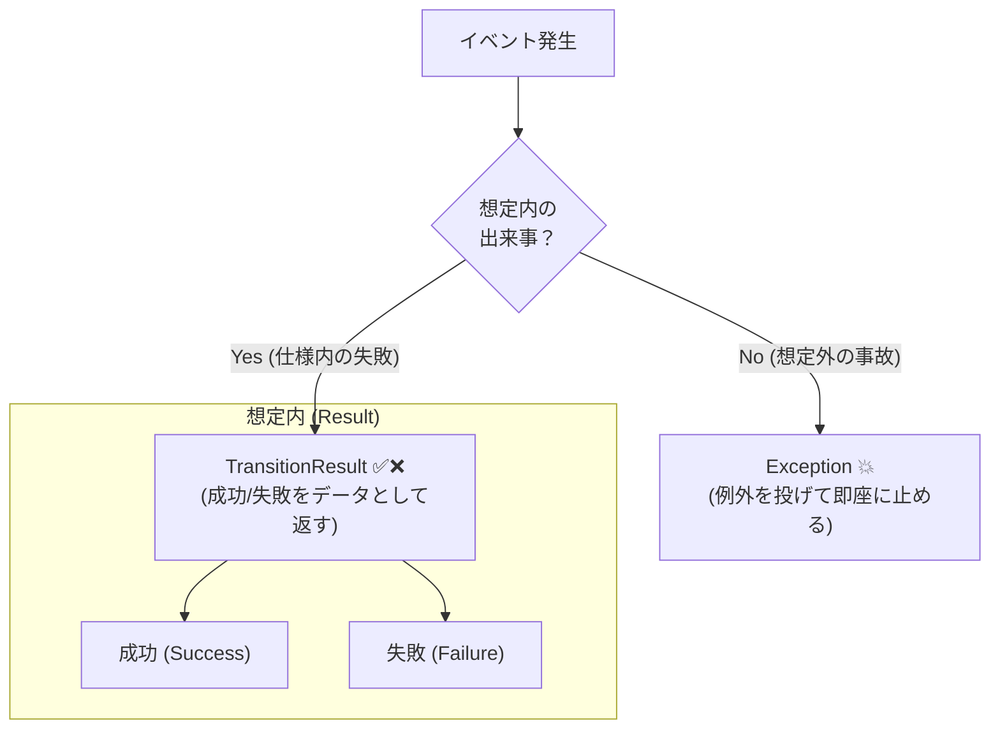
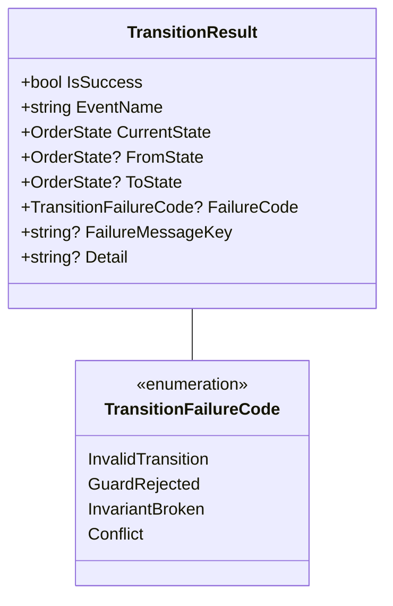
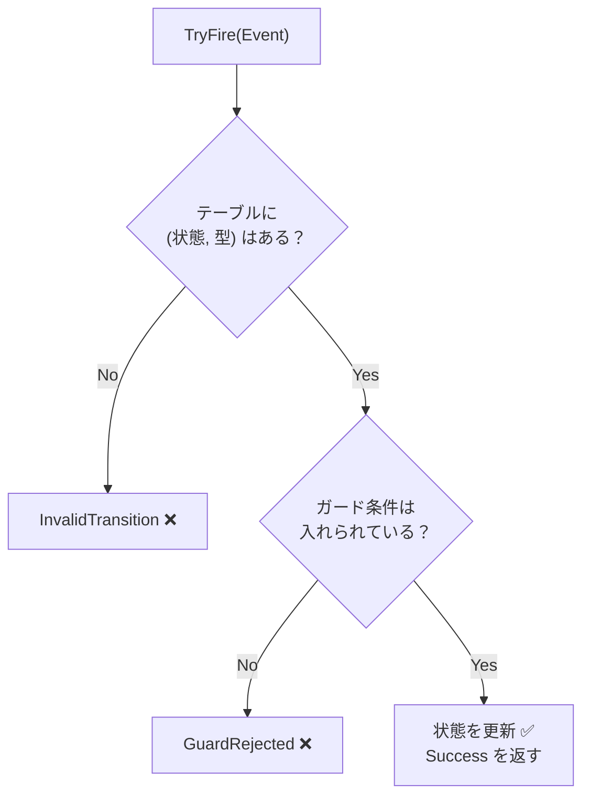

# 第19章：遷移の結果を整える（成功/失敗）✅❌

この章は「無効な遷移が起きたとき、どう返す？」を“事故らない形”に整える回だよ〜😊✨
状態機械って、**失敗が起きるのは普通**なんだよね（ユーザーが押しちゃう・連打しちゃう・順番を間違える…あるある😂）

---

## 1) この章でできるようになること🎯✨

* 「遷移できた／できない」を**例外（throw）に頼らず**扱えるようになる🙆‍♀️
* 失敗時に「理由コード＋メッセージ（またはキー）」を返せるようになる🧾
* UI/API/ログ/テストに渡しやすい「遷移結果モデル」を作れる📦

---

## 2) まず結論：例外は“想定外”、Resultは“想定内”💡





状態機械の「この状態ではそのイベント無理〜」は、だいたい **想定内の失敗** だよね？🙂
その場合、.NET の設計ガイドでも「通常の制御フローに例外を使わないでね」って言ってるよ。([Microsoft Learn][1])

なのでこの教材のおすすめはこう👇

* ✅ **想定内の失敗（無効遷移・ガードNG）** → `Result` で返す
* 💥 **想定外（不変条件が壊れてる・データ破損）** → 例外（＝バグの匂い）

---

## 3) 「失敗」って実は種類がある🗂️✨

最低限、次の2つを分けるだけで一気に扱いやすくなるよ😊

### A. 無効遷移（Invalid Transition）🚫

「今の状態では、そのイベントはできません」
例：`Cooking` なのに `Pay` しようとした、みたいなやつ🍳💳❌

### B. ガード条件NG（Guard Rejected）🛡️

「イベント自体は候補にあるけど、条件が満たされてない」
例：`Cancel` は「調理開始前のみOK」なのに、開始後だった…みたいなやつ😢

（余裕が出たら、並行実行の衝突 `Conflict` とか、入力不正 `Validation` とかも足せるよ。これは後半章に効いてくる🧠✨）

---

## 4) “落としどころ”の設計：TransitionResult を作ろう📦✨

**“成功か失敗か＋必要な情報”** を持った型を1つ用意するのがおすすめだよ😊




### 4-1. 失敗理由コード（まずはこれ！）🧾


```csharp
public enum TransitionFailureCode
{
    InvalidTransition, // その状態ではそのイベントはできない
    GuardRejected,     // 条件(ガード)が満たされない
    InvariantBroken,   // 本来起きない(バグ/データ破損の匂い)
    Conflict           // 並行実行などで衝突(後の章で活躍)
}
```

### 4-2. 遷移結果（Success/Failure を1つにまとめる）✅❌

初心者さんに優しい形でいくね（読みやすさ優先）😊


```csharp
public readonly record struct TransitionResult
{
    public bool IsSuccess { get; }
    public string EventName { get; }
    public OrderState CurrentState { get; }   // 遷移後(失敗なら変わらない)
    public OrderState? FromState { get; }     // 成功時だけ
    public OrderState? ToState { get; }       // 成功時だけ

    public TransitionFailureCode? FailureCode { get; } // 失敗時だけ
    public string? FailureMessageKey { get; }          // UI向けは次章で磨く✨
    public string? Detail { get; }                     // ログ/デバッグ向け

    private TransitionResult(
        bool isSuccess,
        string eventName,
        OrderState currentState,
        OrderState? fromState,
        OrderState? toState,
        TransitionFailureCode? failureCode,
        string? failureMessageKey,
        string? detail)
    {
        IsSuccess = isSuccess;
        EventName = eventName;
        CurrentState = currentState;
        FromState = fromState;
        ToState = toState;
        FailureCode = failureCode;
        FailureMessageKey = failureMessageKey;
        Detail = detail;
    }

    public static TransitionResult Success(string eventName, OrderState from, OrderState to)
        => new(true, eventName, to, from, to, null, null, null);

    public static TransitionResult Fail(
        string eventName,
        OrderState current,
        TransitionFailureCode code,
        string messageKey,
        string? detail = null)
        => new(false, eventName, current, null, null, code, messageKey, detail);
}
```

ポイントはこれ👇✨

* **失敗しても例外で落ちない**（UI/APIが扱いやすい）
* 失敗時に `FailureCode` と `FailureMessageKey` を持てる（次章に繋がる）
* `Detail` を入れておくとログが強くなる（第21章で神になる）📜💎

---

## 5) 実装：テーブル駆動＋Resultで返す（ミニ版）📚🔁

ここでは「遷移表→辞書」の形を保ったまま、返り値だけ整えるよ😊

```csharp
public enum OrderState
{
    Draft,
    Submitted,
    Paid,
    Cooking,
    Ready,
    PickedUp,
    Cancelled,
    Refunded
}

public interface IOrderEvent { }

public sealed record SubmitCommand() : IOrderEvent;
public sealed record PayCommand(decimal Amount) : IOrderEvent;
public sealed record CancelCommand() : IOrderEvent;
```

遷移ルール（ガード付き）を定義：

```csharp
public sealed record TransitionRule(
    OrderState To,
    Func<Order, IOrderEvent, bool>? Guard = null,
    string? GuardFailMessageKey = null);

public sealed class Order
{
    public OrderState State { get; private set; } = OrderState.Draft;

    private readonly Dictionary<(OrderState State, Type EventType), TransitionRule> _table;

    public Order()
    {
        _table = new()
        {
            [(OrderState.Draft, typeof(SubmitCommand))] = new(OrderState.Submitted),

            [(OrderState.Submitted, typeof(PayCommand))] = new(
                To: OrderState.Paid,
                Guard: (o, e) => ((PayCommand)e).Amount > 0,
                GuardFailMessageKey: "pay.amount.must_be_positive"),
            [(OrderState.Submitted, typeof(CancelCommand))] = new(OrderState.Cancelled),
        };
    }
```


```csharp
    public TransitionResult TryFire(IOrderEvent ev)

        var key = (State, ev.GetType());
        var eventName = ev.GetType().Name;

        if (!_table.TryGetValue(key, out var rule))
        {
            return TransitionResult.Fail(
                eventName,
                current: State,
                code: TransitionFailureCode.InvalidTransition,
                messageKey: "transition.not_allowed",
                detail: $"State={State}, Event={eventName}");
        }

        if (rule.Guard is not null && !rule.Guard(this, ev))
        {
            return TransitionResult.Fail(
                eventName,
                current: State,
                code: TransitionFailureCode.GuardRejected,
                messageKey: rule.GuardFailMessageKey ?? "transition.guard_rejected",
                detail: $"State={State}, Event={eventName}");
        }

        var from = State;
        State = rule.To;

        return TransitionResult.Success(eventName, from, State);
    }
}
```



これで、呼び出し側はこう書けるよ👇

```csharp
var order = new Order();

var r1 = order.TryFire(new PayCommand(100)); // Draft で Pay は無効
Console.WriteLine($"{r1.IsSuccess} / {r1.FailureCode} / {r1.FailureMessageKey}");

var r2 = order.TryFire(new SubmitCommand());
Console.WriteLine($"{r2.IsSuccess} {r2.FromState}->{r2.ToState}");

var r3 = order.TryFire(new PayCommand(0)); // ガードNG
Console.WriteLine($"{r3.IsSuccess} / {r3.FailureCode} / {r3.FailureMessageKey}");
```

---

## 6) よくある設計のつまずきポイント😵‍💫➡️😊

### つまずき①：失敗メッセージをドメインに直書きしがち💬

ここでは **キー（例：`transition.not_allowed`）** を返すのが安全✨
日本語の文言は第20章で“UI/API向けに整える”のがキレイだよ😊

### つまずき②：例外で全部やりたくなる💥

「失敗が普通に起きうる」なら Result が楽だよ。
.NET のガイドラインもその方向を推してるよ。([Microsoft Learn][1])

### つまずき③：失敗理由が “ただの文字列” になる🧵

`FailureCode` を enum にするだけで、

* テストが書きやすい🧪
* ログ分析がしやすい📜
* UI側の分岐が安全になる🧠
  …って一気に嬉しくなるよ✨

---

## 7) 演習（手を動かすやつ）🎮✨

### 演習A：失敗理由コードを増やしてみよう🧾

`TransitionFailureCode` に次を追加して、返すところまでやってみてね👇

* `AlreadyDone`（同じ操作をもう一回：冪等の入口🔁）
* `Expired`（期限切れ：第27章に繋がる⏰）

### 演習B：禁止遷移ベスト10に「FailureMessageKey」を割り当てる🔟

例：

* `transition.not_allowed`
* `cancel.not_before_cooking`
* `pay.amount.must_be_positive`

### 演習C：Resultだけでテストを書いてみよう🧪

* 無効遷移 → `InvalidTransition` が返る
* ガードNG → `GuardRejected` が返る
* 成功 → `FromState/ToState` が入る

---

## 8) AIの使いどころ🤖✨（コピペで使える指示）

* 「この `TransitionResult` を、呼び出し側が if 文少なく読める形に整えて」
* 「失敗理由コードの候補を、状態機械の運用で困りがちな順に10個出して」
* 「遷移表から “InvalidTransition になるケース” を自動列挙して、テストケース案にして」
* 「`FailureMessageKey` を i18n しやすい命名規則にして（例：`order.cancel.not_allowed` みたいな）」

※出てきたコードは、そのまま採用せず「命名の一貫性」と「責務（ドメインが文章を持ちすぎてないか）」だけチェックしてね😊🔎

---

## 9) 章のミニまとめ📌💖

* 状態機械の失敗は“普通に起きる” → **Resultで返す**のが扱いやすい✅
* 返すのは「成功/失敗」だけじゃなくて、**理由コード＋キー**が大事🧾
* これが次の章（メッセージ設計）と、その次（ログ設計）で効いてくる📜✨

---

次の第20章では、この `FailureMessageKey` を「ユーザーに優しい文」に変換する設計をやるよ〜🫶💬✨

[1]: https://learn.microsoft.com/en-us/dotnet/standard/design-guidelines/exception-throwing?utm_source=chatgpt.com "Exception Throwing - Framework Design Guidelines"