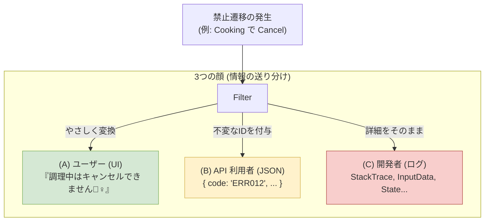
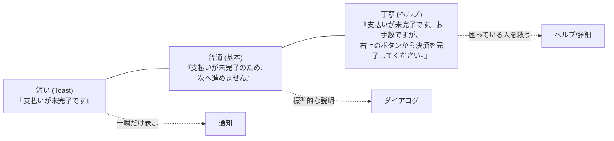
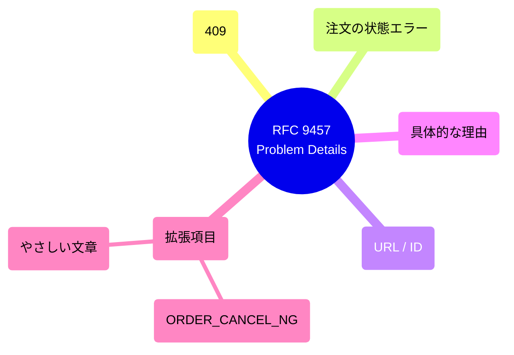

# 第20章：UI/APIへ伝えるエラーメッセージ設計💬✨

（学食モバイル注文：状態機械）

この章は、「禁止遷移（できない操作）」が起きたときに、**ユーザーにやさしく**＆**APIとしても扱いやすく**伝える設計をやるよ〜😊🫶
（.NET 10 / C# 14 / ASP.NET Core 10 の現行ドキュメント＆標準に合わせた内容だよ）([Microsoft][1])

---

## 1) この章のゴール🎯✨

* 「できない操作」を、**怒らない・困らせない**文章にできる🙅‍♀️➡️😊
* UI用メッセージと、API用エラー（機械可読）を**分けて設計**できる🧩
* **“同じ失敗”を3段階（短い/普通/丁寧）**で言い換えできる💬💬💬
* APIでは **Problem Details（RFC 9457）** をベースに返せる📦([RFC Editor][2])

---

## 2) まず大事な考え方：エラーは「3つの顔」を持つ😺😼😺

同じ“失敗”でも、相手によって欲しい情報が違うよね👇

### ✅ (A) ユーザー向け（UIの文章）





* 技術用語なし🙅‍♀️
* 次に何をすればいいかが分かる🧭
* 読んでイヤな気持ちにならない🫶

### ✅ (B) API利用者向け（機械可読な情報）

* **安定したエラーコード**がほしい（文言は変わってもOK）🔖
* どの入力が悪い？どの遷移がNG？を判定したい🤖

### ✅ (C) 開発者向け（ログ/デバッグ）

* 例外名、状態名、イベント名、相関IDなど濃い情報💣
* でも **ユーザーには見せない**🙈

> つまり：
> **UI文言（人間向け）** と **エラーコード（機械向け）** と **ログ詳細（開発者向け）** は分けるのが勝ち✨

---

## 3) UIメッセージの“黄金ルール”8つ👑✨

禁止遷移メッセージを作るときのコツだよ😊

1. **あなたが悪い**系を言わない🙅‍♀️（責めない）
2. **何が起きたか**を1文で（状況）📝
3. **なぜダメか**を短く（理由）🔎
4. **次に何をすればいいか**（行動）➡️
5. 可能なら **ボタン名/画面名**で誘導（探させない）🧭
6. 状態名（Draft/Paid…）は基本出さない（業務の言葉で）🍙
7. **同じ原因には同じ言い回し**（用語ブレ禁止）📏
8. 困ったら最後に **問い合わせ導線**（注文番号など）🆘

---

## 4) “3段階”テンプレ（短い/普通/丁寧）💬✨

第20章の演習で使うテンプレを先に決めちゃうよ！

### 🧩 テンプレ





* **短い**：状況だけ（トースト向け）🍞
* **普通**：状況＋次の行動（基本これ）😊
* **丁寧**：状況＋理由＋次の行動＋安心（困ってる人向け）🫶

例：

* 短い：`支払いが完了していません。`
* 普通：`支払いが完了していないため、受け取りに進めません。支払いを完了してください。`
* 丁寧：`まだ支払いが完了していないため、受け取り準備に進めません。お手数ですが「支払い」から手続きを完了してください。`

---

## 5) 学食注文：禁止遷移10個を“やさしく”する🫶🍙

（例として10個つくるね。あなたの仕様に合わせて増やしてOK✨）

### ① 下書きのまま支払いしようとした（DraftでPay）💳

* 短い：`注文が確定していません。`
* 普通：`注文が確定していないため、支払いできません。先に「注文する」を押してください。`
* 丁寧：`まだ注文が確定していないため、支払いに進めません。先に内容を確認して「注文する」を押してください。`

### ② 調理開始後にキャンセル（CookingでCancel）🍳🚫

* 短い：`調理が始まっているためキャンセルできません。`
* 普通：`調理が始まっているためキャンセルできません。受け取り後にサポートへご連絡ください。`
* 丁寧：`申し訳ありません。すでに調理が始まっているためキャンセルできません。状況に応じて対応しますので、受け取り後にサポートへご連絡ください。`

### ③ 受け取り可能前に受け取り完了（Ready前にPickedUp）📦❓

* 短い：`まだ受け取り可能になっていません。`
* 普通：`まだ受け取り可能になっていないため完了できません。通知を待ってください。`
* 丁寧：`まだ受け取り可能になっていないため、この操作はできません。準備ができたら通知しますので、しばらくお待ちください。`

### ④ キャンセル済みなのに支払い（CancelledでPay）💳🚫

* 短い：`キャンセル済みの注文です。`
* 普通：`この注文はキャンセル済みのため支払いできません。新しく注文してください。`
* 丁寧：`この注文はすでにキャンセルされています。支払いはできないため、必要なら新しく注文してください。`

### ⑤ 支払い前に調理開始（SubmittedでCookingへ進めたい）🍳

* 短い：`支払いが必要です。`
* 普通：`支払いが完了していないため、調理に進めません。支払いを完了してください。`
* 丁寧：`支払いが完了していないため、調理に進めません。お手数ですが「支払い」から手続きを完了してください。`

### ⑥ 返金を要求したけど未払い（SubmittedでRefund）💸

* 短い：`返金できる支払いがありません。`
* 普通：`支払いが完了していないため返金できません。`
* 丁寧：`支払いが完了していないため、返金の対象がありません。状況が不明な場合はサポートへご連絡ください。`

### ⑦ 受け取り済みのキャンセル（PickedUpでCancel）📦🚫

* 短い：`受け取り済みの注文です。`
* 普通：`受け取り済みのためキャンセルできません。`
* 丁寧：`この注文はすでに受け取り済みのためキャンセルできません。問題がある場合はサポートへご連絡ください。`

### ⑧ すでに支払い済みなのに再支払い（PaidでPay）💳💳

* 短い：`すでに支払い済みです。`
* 普通：`この注文はすでに支払い済みのため、再度支払いできません。`
* 丁寧：`この注文はすでに支払いが完了しています。二重請求を防ぐため、再度の支払いはできません。`

### ⑨ まだ受け取り可能前に「受け取りQR表示」したい（CookingでShowPickupQR）📱

* 短い：`準備中です。`
* 普通：`まだ準備中のため受け取りQRを表示できません。受け取り可能になったら表示できます。`
* 丁寧：`現在は準備中のため受け取りQRを表示できません。受け取り可能になったら自動で表示できます。`

### ⑩ すでに返金済みで再返金（RefundedでRefund）💸🚫

* 短い：`すでに返金済みです。`
* 普通：`この注文はすでに返金済みのため、再度返金できません。`
* 丁寧：`この注文はすでに返金手続きが完了しています。明細の確認が必要ならサポートへご連絡ください。`

---

## 6) APIは “Problem Details（RFC 9457）” をベースにする📦✨

HTTP APIのエラー形式は、近年は **Problem Details** が標準寄りで、RFC 9457 が RFC 7807 を置き換える形になってるよ📌([RFC Editor][2])
ASP.NET Core 側も ProblemDetails を扱う仕組み（サービスやミドルウェア）が整ってる👍([Microsoft Learn][3])

### ✅ 返すデータのおすすめ構造（最低限）

* `status`：HTTPステータス（例：409）
* `title`：短い要約（API利用者向け）
* `detail`：もう少し説明（※UI文言とは分けてもOK）
* `type`：エラー種別URI（社内で固定でもOK）
* `instance`：そのリクエストを識別（相関IDやパス）
* `extensions`：独自項目（例：`errorCode`, `uiMessage`, `currentState`, `event`）




---

## 7) C#実装例：Result（第19章）→ UI/APIに“翻訳”する🧩🤖

ポイントは「ドメインの失敗」を**翻訳して出す**こと！
（ドメイン層は“ユーザー文章”を直接知らなくてOKにすると強いよ✨）

```csharp
public sealed record TransitionError(
    string Code,              // 機械向け（固定）
    string UiMessageShort,    // UI向け（短い）
    string UiMessageNormal,   // UI向け（普通）
    string UiMessagePolite,   // UI向け（丁寧）
    string? Detail = null     // 開発者向け（ログ用・API detail 用）
);

public sealed record TransitionResult(
    bool IsSuccess,
    OrderState? NewState,
    TransitionError? Error
)
{
    public static TransitionResult Ok(OrderState newState) => new(true, newState, null);
    public static TransitionResult Fail(TransitionError error) => new(false, null, error);
}
```

### エラーカタログ（コードと文言を一箇所管理）📚✨

```csharp
public static class ErrorCatalog
{
    public static TransitionError OrderNotSubmitted() => new(
        Code: "ORDER_NOT_SUBMITTED",
        UiMessageShort: "注文が確定していません。",
        UiMessageNormal: "注文が確定していないため、支払いできません。先に「注文する」を押してください。",
        UiMessagePolite: "まだ注文が確定していないため、支払いに進めません。先に内容を確認して「注文する」を押してください。"
    );

    public static TransitionError CannotCancelAfterCooking() => new(
        Code: "ORDER_CANNOT_CANCEL_AFTER_COOKING",
        UiMessageShort: "調理が始まっているためキャンセルできません。",
        UiMessageNormal: "調理が始まっているためキャンセルできません。受け取り後にサポートへご連絡ください。",
        UiMessagePolite: "申し訳ありません。すでに調理が始まっているためキャンセルできません。状況に応じて対応しますので、受け取り後にサポートへご連絡ください。"
    );
}
```

---

## 8) ASP.NET Core 側：ProblemDetails で返す（例）🌐✨

ASP.NET Core は **AddProblemDetails** などの仕組みが用意されてるよ([Microsoft Learn][3])
（Minimal APIでもControllerでもOK👌）

```csharp
app.MapPost("/orders/{id}/pay", (string id, PayRequest req) =>
{
    var result = orderService.Pay(id, req.Amount);

    if (result.IsSuccess) return Results.Ok(new { state = result.NewState!.ToString() });

    var err = result.Error!;
    // 409 Conflict: 状態的にできない（禁止遷移）として扱う例
    return Results.Problem(
        statusCode: StatusCodes.Status409Conflict,
        title: "Invalid state transition",
        detail: err.Detail ?? "The requested operation is not allowed in the current state.",
        extensions: new Dictionary<string, object?>
        {
            ["errorCode"] = err.Code,
            ["uiMessage"] = err.UiMessageNormal,
        }
    );
});
```

> UIは `uiMessage` を表示してOK👌
> API利用者は `errorCode` を見て分岐できる🤖✨
> そしてログにはもっと濃い情報を別で残す（第21章でやるよ📜）

---

## 9) AI活用（Copilot / Codex）🤖💡

### 使いどころ①：3段階言い換え量産💬💬💬

おすすめプロンプト例👇

```text
次の禁止遷移のエラーメッセージを日本語で作って。
条件：
- 技術用語なし
- 責めない
- 次の行動がわかる
- 3段階（短い/普通/丁寧）
禁止遷移：{ここに状況}
```

### 使いどころ②：用語ブレ検出📏🔍

* 「注文する/確定する」みたいな言い回しが混ざるのを、AIに一覧化させて統一✨

### 注意点⚠️

* AIは丁寧にしすぎて長文化しがち😂
  → **UI表示は短く**、詳細はヘルプや展開表示へ分けるのが◎

---

## 10) つまずきポイント集😵‍💫➡️😊

* **UI文言をドメイン層に直書き**して、変更が地獄になる
  → `ErrorCatalog` に寄せる＆コード（Code）で安定化🔖
* **例外メッセージをそのままユーザーへ**出しちゃう
  → “開発者向け”はログへ🙈
* **エラーコードが場当たりで増える**
  → 命名規則：`ORDER_` / `PAYMENT_` みたいに接頭辞を固定📚

---

## 11) 演習（この章の手を動かすパート）🎮✨

1. 禁止遷移を10個選ぶ（第9章のベスト10でOK）🔟
2. 各禁止遷移について

   * 短い/普通/丁寧 を作る💬
   * `errorCode` を付ける🔖
3. UI表示の場所を決める（トースト？画面内？ダイアログ？）🖥️
4. APIのレスポンスを ProblemDetails 形式で返す📦([RFC Editor][2])

---

## まとめ🎀✨（この章で“強くなる”ところ）

* **禁止遷移はバグじゃなく仕様**として、やさしく伝える🫶
* **UI文言 / errorCode / ログ**を分離して設計すると、変更にも強い💪
* APIは **Problem Details（RFC 9457）** をベースにすると後が楽📦([RFC Editor][2])

次の第21章は「遷移ログは宝物」📜💎で、今日作った `errorCode` がめちゃ活きるよ〜😊✨

[1]: https://dotnet.microsoft.com/en-us/platform/support/policy/dotnet-core ".NET and .NET Core official support policy | .NET"
[2]: https://www.rfc-editor.org/rfc/rfc9457.html?utm_source=chatgpt.com "RFC 9457: Problem Details for HTTP APIs"
[3]: https://learn.microsoft.com/en-us/aspnet/core/fundamentals/error-handling-api?view=aspnetcore-10.0 "Handle errors in ASP.NET Core APIs | Microsoft Learn"