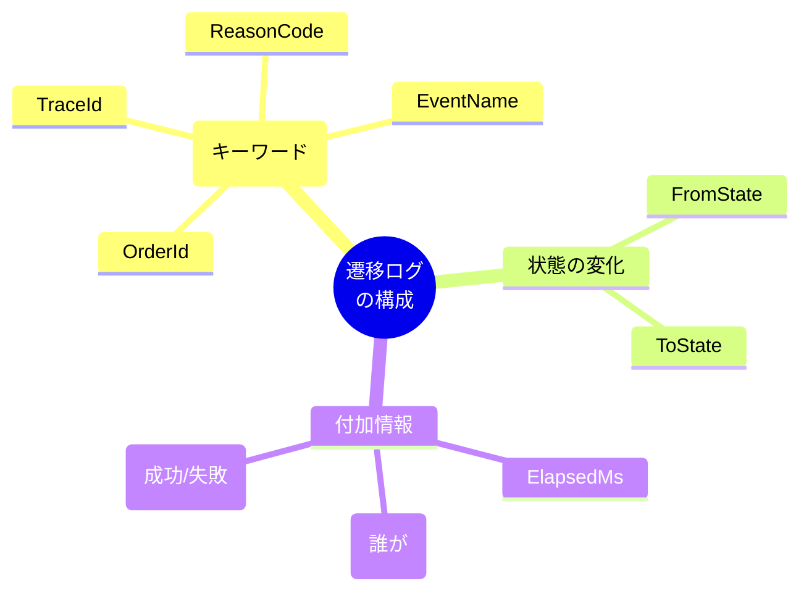
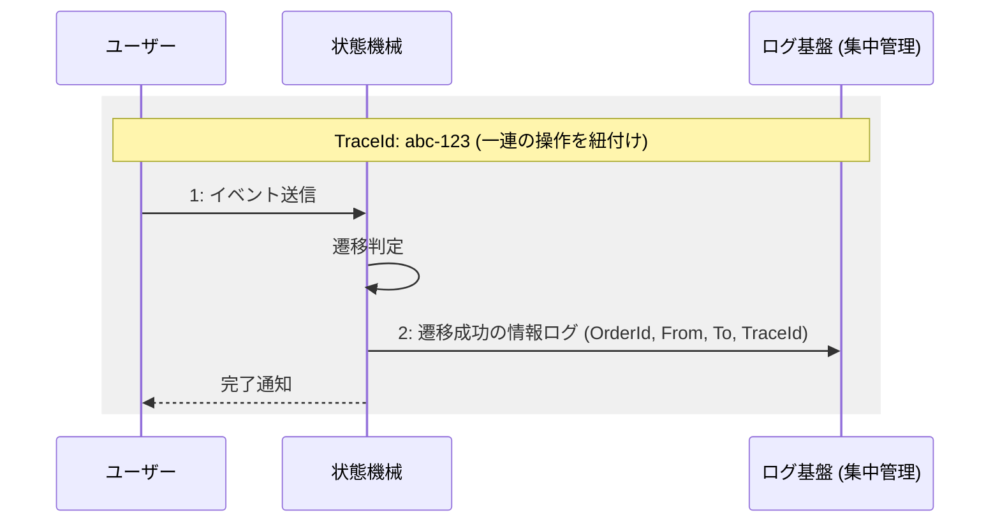
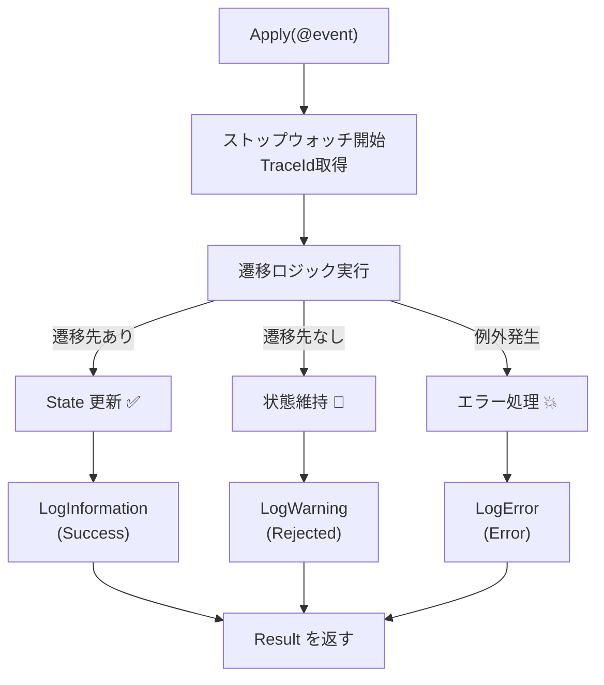

# 第21章：ログ設計（遷移ログは宝物）📜💎✨

## 今日のゴール🎯

* 状態遷移（成功✅／失敗❌）を**あとから追えるログ設計**ができるようになる✨
* **「何を」「どの粒度で」「どのレベルで」**残すか決められるようになる🧠
* C#で**構造化ログ**（検索しやすいログ）をサクッと実装できるようになる🛠️✨  ([Microsoft Learn][1])

---

## 1) なんで遷移ログが“宝物”なの？💎





状態機械のバグって、だいたいこういう形で来ます👇

* 「支払い済みのはずなのに“調理中”に戻ってる」😵‍💫
* 「キャンセルしたのに請求が走った」💥
* 「同じイベントが二重で適用されたっぽい」👆👆

このとき、**遷移ログがあれば一発で原因に近づけます**✨

* どの注文（OrderId）で
* どの状態からどの状態へ
* どのイベントが来て
* 成功/失敗と理由は何で
* いつ・誰が・相関IDは何で

これが揃うと、デバッグ時間が激減します🫶

---

## 2) まずは“ログ項目”を決めよう📋✨（最小セット→強化セット）

## ✅最小セット（まずこれだけでOK！）

* **OrderId**（対象の注文ID）
* **FromState / ToState**（旧状態→新状態）
* **Event**（起きたイベント名）
* **Result**（Success / Rejected / Error）
* **ReasonCode**（失敗理由コード：例 `NotAllowedInCurrentState`）
* **ElapsedMs**（処理時間：遅延検知にも◎）

## 🌟あると神（後から効くやつ）

* **CorrelationId**（画面/リクエスト単位の相関ID）
* **TraceId / SpanId**（分散トレースと結びつく） ([OpenTelemetry][2])
* **Actor**（誰がやった：UserId/StaffIdなど ※個人情報は注意⚠️）
* **IdempotencyKey**（二重処理対策の鍵🔑：後の章で超重要）
* **Version**（状態データの版：競合が起きた時に助かる）

## 🚫入れないほうがいい（地雷）

* クレカ番号・メール全文・住所など**センシティブ情報**💣
* 長すぎる本文や巨大オブジェクト（ログ爆発する）🌋
* “生の例外全文”を情報レベルで大量出力（ノイズ地獄）😇

---


## 3) “構造化ログ”の基本🧱✨（検索できるログにする）

C#の `ILogger` は、メッセージテンプレートの `{Name}` が**プロパティとして残る**のがポイントだよ🎉
たとえば👇みたいに書くと `{OrderId}` や `{From}` が「検索キー」になります🔎✨  ([Microsoft Learn][1])

---


## 4) ログレベル設計（迷ったらこれ）🎚️✨

* **Information**：正常な遷移（状態が変わった）✅
* **Warning**：禁止遷移（仕様どおりに拒否）🚫
* **Error**：想定外（例外・DB不整合など）💥
* **Debug/Trace**：開発中だけ見たい詳細（引数の中身とか）🧪

「禁止遷移」は**バグじゃなく仕様**なので、例外で落とすより `Warning + ReasonCode` が扱いやすいことが多いよ🫶

---


## 5) 相関ID（Correlation）を入れると“捜査”が楽になる🕵️‍♀️✨

## ざっくり言うと…

* **相関ID**があると「この1回の操作に紐づくログ」を束ねられる📎
* OpenTelemetryの流れだと **TraceId / SpanId** をログに入れると、トレースとログがつながって超便利✨  ([OpenTelemetry][2])
* .NETでは `Activity.Current` から `TraceId` が取れるよ🧵  ([Microsoft Learn][3])




---

## 6) 実装してみよう🛠️✨（遷移ログを“1行”で出す）

## 6-1. ログを吐く場所（おすすめ）

**状態遷移を確定する“1箇所”**に集めるのがコツだよ✨

* どのイベントでも必ず通る
* 成功でも失敗でも必ず残る
* ここが“宝箱の入口”💎

## 6-2. C#サンプル（ILogger＋構造化ログ）👩‍💻✨

```csharp
using System.Diagnostics;
using Microsoft.Extensions.Logging;

public enum OrderState { Draft, Submitted, Paid, Cooking, Ready, PickedUp, Cancelled, Refunded }
public enum TransitionOutcome { Success, Rejected, Error }

public record TransitionResult(
    TransitionOutcome Outcome,
    OrderState From,
    OrderState? To,
    string ReasonCode,
    string Message,
    string? TraceId);

public sealed class OrderStateMachine
{
    private readonly ILogger _logger;

    public OrderState State { get; private set; } = OrderState.Draft;
    public Guid OrderId { get; }

    public OrderStateMachine(Guid orderId, ILogger logger)
    {
        OrderId = orderId;
        _logger = logger;
    }

    public TransitionResult Apply(string @event)
    {
        var from = State;
        var sw = Stopwatch.StartNew();

        try
        {
            // 例：超簡易なルール（本当はテーブル駆動などでやる）
            OrderState? to = (from, @event) switch
            {
                (OrderState.Draft, "Submit") => OrderState.Submitted,
                (OrderState.Submitted, "Pay") => OrderState.Paid,
                (OrderState.Paid, "StartCooking") => OrderState.Cooking,
                (OrderState.Cooking, "MarkReady") => OrderState.Ready,
                (OrderState.Ready, "PickUp") => OrderState.PickedUp,
                (_, "Cancel") when from is OrderState.Draft or OrderState.Submitted => OrderState.Cancelled,
                _ => null
            };

            if (to is null)
            {
                sw.Stop();
                var traceId = Activity.Current?.TraceId.ToString();

                _logger.LogWarning(
                    "TransitionRejected OrderId={OrderId} From={From} Event={Event} Reason={ReasonCode} TraceId={TraceId} ElapsedMs={ElapsedMs}",
                    OrderId, from, @event, "NotAllowedInCurrentState", traceId, sw.ElapsedMilliseconds);

                return new TransitionResult(
                    TransitionOutcome.Rejected, from, null,
                    "NotAllowedInCurrentState",
                    $"Event '{@event}' is not allowed from state '{from}'.",
                    traceId);
            }

            // 状態確定
            State = to.Value;

            sw.Stop();
            {
                var traceId = Activity.Current?.TraceId.ToString();

                _logger.LogInformation(
                    "TransitionSuccess OrderId={OrderId} From={From} To={To} Event={Event} TraceId={TraceId} ElapsedMs={ElapsedMs}",
                    OrderId, from, State, @event, traceId, sw.ElapsedMilliseconds);

                return new TransitionResult(
                    TransitionOutcome.Success, from, State,
                    "OK",
                    "Transition applied.",
                    traceId);
            }
        }
        catch (Exception ex)
        {
            sw.Stop();
            var traceId = Activity.Current?.TraceId.ToString();

            _logger.LogError(ex,
                "TransitionError OrderId={OrderId} From={From} Event={Event} TraceId={TraceId} ElapsedMs={ElapsedMs}",
                OrderId, from, @event, traceId, sw.ElapsedMilliseconds);

            return new TransitionResult(
                TransitionOutcome.Error, from, null,
                "UnexpectedError",
                "Unexpected error occurred.",
                traceId);
        }
    }
}
```



> `ILogger` のテンプレート（`{OrderId}` みたいなやつ）で、ログが「検索しやすい形」になってくれるよ✨  ([Microsoft Learn][1])
> `Activity.Current?.TraceId` を入れると、OpenTelemetryの相関にもつながる流れが作れるよ🧵✨  ([OpenTelemetry][2])

---

## 7) さらに良くする：高速＆きれいにする（LoggerMessage生成）⚡✨

ログが多くなると、細かい割り当て（allocation）が気になってくるよね🥺
最近の .NET では `LoggerMessageAttribute` の**コンパイル時生成**が使えて、速く＆きれいに書けるよ✨  ([Microsoft Learn][4])

（今は「知っておく」でOK！使うタイミングは実務で増えてからで大丈夫😊）

---

## 8) 演習🎮✨（手を動かすと一気に身につく！）

## 演習A：成功ログ✅

* `Submit → Pay → StartCooking` を順に呼んで、**Information**が3行出ることを確認👀✨

## 演習B：禁止ログ🚫

* `Draft` のまま `Pay` を呼んで、**Warning**が出ることを確認⚠️
* `ReasonCode=NotAllowedInCurrentState` が入ってるかチェック✅

## 演習C：ログ項目チェックリスト✅🤖

チェック項目（例）👇

* OrderId / From / To / Event / Outcome / ReasonCode / ElapsedMs
* TraceId（取れない時は null でもOK）
* 個人情報を入れてないか⚠️

---

## 9) よくあるつまずきポイント😵‍💫（ここ注意！）

* `{OrderId}` なのに引数の順番が違って混乱する👉 **ログの項目名と並びを揃える**
* 文字列補間 `$"..."` を多用して検索不能ログになる👉 **テンプレート＋引数**が基本✨  ([Microsoft Learn][1])
* ログ出しすぎて見えなくなる👉 **Informationは“状態が変わった”だけ**に絞るのが安定😊

---

## 10) AI活用（Copilot / Codex）🤖✨

そのまま投げてOKなプロンプト例だよ📝

* 「状態遷移ログに必要な項目を、初心者向けにチェックリスト化して」✅
* 「禁止遷移のReasonCode候補を10個、命名ルール付きで提案して」🏷️
* 「ILoggerの構造化ログで、OrderId/From/To/Event/ElapsedMs/TraceIdを統一して出すヘルパー案を出して」🛠️

---

## 次の章につながるよ📌

次は **第22章：単体テスト①（遷移表ベース）**🧪✨
今日作ったログ設計は、テストが落ちた時の“犯人探し”にも超効くよ〜💎😆

[1]: https://learn.microsoft.com/en-us/dotnet/core/extensions/logging?utm_source=chatgpt.com "Logging in C# - .NET"
[2]: https://opentelemetry.io/docs/languages/dotnet/logs/correlation/?utm_source=chatgpt.com "Log correlation"
[3]: https://learn.microsoft.com/ja-jp/dotnet/api/system.diagnostics.activity.traceid?view=net-8.0&utm_source=chatgpt.com "Activity.TraceId プロパティ (System.Diagnostics)"
[4]: https://learn.microsoft.com/en-us/dotnet/core/extensions/logger-message-generator?utm_source=chatgpt.com "Compile-time logging source generation - .NET"