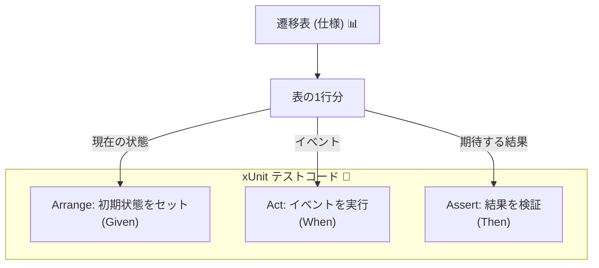
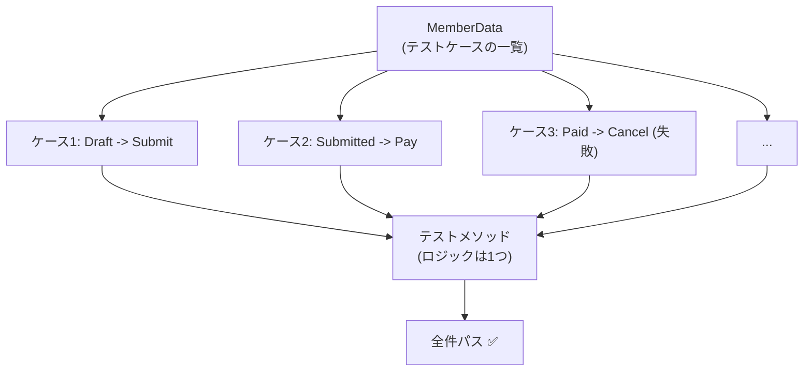

# 第22章：単体テスト①（遷移表ベースで作る）🧪✨

（テーマ：**「遷移表 = テストケースの原材料」**にしちゃう💡）

---

## 1) この章のゴール🎯💖

この章が終わったら、こんなことができるようになります👇✨

* **遷移表の1行を、そのままテスト1件に落とせる** 🧾➡️🧪
* **正常遷移テスト / 禁止遷移テスト** を、まとめて量産できる🔁✨
* テストが増えても破綻しない **「データ駆動（Theory）」** の書き方がわかる📦✨
  （`dotnet test` は VSTest / Microsoft Testing Platform どちらにも対応、という最新事情も踏まえます🧠✨） ([Microsoft Learn][1])

---

## 2) まず結論：遷移表って、そのままテスト仕様書だよ📊💎





遷移表ってこういうやつ👇（例）

| 現在状態      | イベント   | 次状態       | できる？ | 失敗理由コード                 |
| --------- | ------ | --------- | ---- | ----------------------- |
| Draft     | Submit | Submitted | ✅    | -                       |
| Submitted | Pay    | Paid      | ✅    | -                       |
| Paid      | Cancel | （変化なし）    | ❌    | `CannotCancelAfterPaid` |

この**1行 = 1テストケース**にしちゃうのが今回の主役です🧪✨

* ✅行 → 「次状態が合ってる？」をテスト
* ❌行 → 「失敗になる？理由コード合ってる？」をテスト

こうすると、状態が増えても「表を足す → テストも増える」が自然に回るよ〜🥰

---

## 3) 今回のテスト方針（超シンプル版）🍙✨

この章では、まず最小セットでいきます🧸

### A. 正常遷移テスト✅

* Given：初期状態
* When：イベント適用
* Then：成功して、期待の次状態になる

### B. 禁止遷移テスト🚫

* Given：初期状態
* When：イベント適用
* Then：失敗して、状態は変わらない（or 仕様通り）＋理由コードが合う

---

## 4) テストしやすい「状態機械の返り値」形を決めよう📦✨


テストがラクになる“推し”の形はこれ👇

* `Apply(event)` が **例外を投げず**（※禁止遷移は“失敗として返す”）
* `TransitionResult` に「成功/失敗」「次状態」「理由コード」が入ってる

例（雰囲気）👇

```csharp
public enum OrderState
{
    Draft, Submitted, Paid, Cooking, Ready, PickedUp, Cancelled, Refunded
}

public interface IOrderEvent { }

public sealed record Submit() : IOrderEvent;
public sealed record Pay(decimal Amount) : IOrderEvent;
public sealed record Cancel(string Reason) : IOrderEvent;

public sealed record TransitionResult(
    bool IsSuccess,
    OrderState State,
    string? ErrorCode = null,
    string? ErrorMessage = null
);

public sealed class OrderStateMachine
{
    public OrderState State { get; private set; } = OrderState.Draft;

    public TransitionResult Apply(IOrderEvent ev)
    {
        // ここは第15〜19章で作った実装がある想定でOK👍
        // 今回は「テスト側」を主役にするよ🧪✨
        throw new NotImplementedException();
    }
}
```

> 「禁止遷移で例外」より「Resultで返す」の方が、UI/APIに繋げる時もテストもラクになりがちです☺️✨（第19章の流れとも相性◎）

---

## 5) テストプロジェクト作成＆実行（最短）🏃‍♀️💨


CLIで作るならこれだけ👇（xUnit テンプレあり✨） ([Microsoft Learn][2])

```bash
dotnet new sln -n CafeteriaOrder
dotnet new classlib -n CafeteriaOrder.Core
dotnet new xunit   -n CafeteriaOrder.Tests
dotnet sln CafeteriaOrder.sln add CafeteriaOrder.Core/CafeteriaOrder.Core.csproj
dotnet sln CafeteriaOrder.sln add CafeteriaOrder.Tests/CafeteriaOrder.Tests.csproj
dotnet add CafeteriaOrder.Tests/CafeteriaOrder.Tests.csproj reference CafeteriaOrder.Core/CafeteriaOrder.Core.csproj
dotnet test
```

* `dotnet test` は最新の仕組み（VSTest / MTP）も含めて進化してるので、困ったら公式の挙動説明を見るのが早いです🧠✨ ([Microsoft Learn][1])
* Visual Studioなら **Test Explorer** でポチ実行もOK👌（右クリックでOpen Testとかもできるよ） ([Microsoft Learn][3])

---

## 6) 遷移表を「テストデータ」にする（ここが本題）📊➡️🧪✨

### 6.1 テストケース用の型を作る🧾✨

```csharp
public sealed record TransitionCase(
    OrderState Given,
    IOrderEvent When,
    bool ExpectSuccess,
    OrderState ExpectState,
    string? ExpectErrorCode = null
);
```

### 6.2 遷移表（の一部）を “そのまま” データ化📚✨


xUnitでは **Theory + MemberData**（データ駆動）が相性抜群です💖
Theoryは「同じテストを入力違いで回す」機能だよ〜🧠✨ ([Microsoft Learn][4])

```csharp
using System.Collections.Generic;

public static class OrderTransitionTable
{
    public static IEnumerable<object[]> Cases()
    {
        // ✅ 正常遷移
        yield return new object[] { new TransitionCase(OrderState.Draft,     new Submit(),        true,  OrderState.Submitted) };
        yield return new object[] { new TransitionCase(OrderState.Submitted, new Pay(500m),        true,  OrderState.Paid) };

        // 🚫 禁止遷移（例）
        yield return new object[] { new TransitionCase(OrderState.Paid,      new Submit(),        false, OrderState.Paid, "CannotSubmitAfterPaid") };
        yield return new object[] { new TransitionCase(OrderState.Paid,      new Cancel("no"),    false, OrderState.Paid, "CannotCancelAfterPaid") };
    }
}
```

> ※ `MemberData` は **static** が要求されがちなので、こういう `static class` に寄せると事故りにくいです🙏✨

---

* 遷移表が更新されたら、**テストも一緒に更新**できる（仕様と同期しやすい）📘✨



## 7) たった1本のテストで「表の行全部」を検証する🧪🔁✨


```csharp
using Xunit;

public sealed class OrderStateMachine_TransitionTests
{
    [Theory]
    [MemberData(nameof(TransitionCases))]
    public void Transition_table_driven_test(TransitionCase tc)
    {
        // Arrange
        var sm = new OrderStateMachine();
        SetStateForTest(sm, tc.Given);

        // Act
        var result = sm.Apply(tc.When);

        // Assert
        Assert.Equal(tc.ExpectSuccess, result.IsSuccess);
        Assert.Equal(tc.ExpectState, result.State);

        if (!tc.ExpectSuccess)
        {
            Assert.Equal(tc.ExpectErrorCode, result.ErrorCode);
        }
    }

    public static IEnumerable<object[]> TransitionCases() => OrderTransitionTable.Cases();

    private static void SetStateForTest(OrderStateMachine sm, OrderState state)
    {
        // 本当は「状態を外からいじらない」方がキレイ💅
        // でも学習の最初は、テストのために“注入”できる仕組みを用意するのがコツだよ✨
        // 例：コンストラクタで初期状態を受け取れるようにする / internal setter + InternalsVisibleTo など
        throw new NotImplementedException();
    }
}
```

### ✅この形の強いところ💪✨

* テストが増えても **メソッド1本のまま**
* ケース追加は **データを1行足すだけ**
* 遷移表が更新されたら、**テストも一緒に更新**できる（仕様と同期しやすい）📘✨

---

## 8) 演習：まず “10ケース” 作ろう🔟🧪✨

次の方針で10件作ると、実戦っぽくなります💖

### 8.1 正常遷移（6件くらい）✅

* Draft → Submit → Submitted
* Submitted → Pay → Paid
* Paid → （調理開始イベント）→ Cooking
* Cooking → （調理完了イベント）→ Ready
* Ready → PickUp → PickedUp
* Submitted → Cancel → Cancelled

### 8.2 禁止遷移（4件くらい）🚫

* Draft で Pay（まだ注文してない）→ ❌ `CannotPayBeforeSubmit`
* Paid で Cancel → ❌ `CannotCancelAfterPaid`
* PickedUp で Cancel → ❌ `CannotCancelAfterPickedUp`
* Cancelled で PickUp → ❌ `CannotPickUpAfterCancelled`

> ここで大事なのは「それっぽいコード名」を決めて、**未来の自分が読んで分かる**ようにすることだよ☺️🧾✨

---

## 9) AI活用（この章はめちゃ相性いい）🤖💖

AIは **「表→テストデータ」変換が得意**です🎯✨

### 9.1 おすすめプロンプト（そのままコピペOK）📋✨

* 「次の遷移表を、xUnit の `IEnumerable<object[]>` で `TransitionCase` の列にしてください。失敗ケースは `ErrorCode` も埋めてください。C#コードだけで出力して。」
* 「禁止遷移の理由コード（ErrorCode）を、命名規則 `Cannot{Event}When{State}` で提案して。」
* 「この遷移表から、優先度の高い10ケースだけ選んで（ユーザー影響が大きい順）、テストデータを作って。」

### 9.2 注意点（AIあるある）⚠️😂

* **状態名やイベント名を勝手に増やす**ことがある → 表の用語に合わせてね✋
* **失敗コードがブレる** → 命名規則を先に決めるのが勝ち🏆✨

---

## 10) つまずきポイント集（先回り）🧯✨

### 10.1 Visual Studioでテストが出てこない😵‍💫

だいたいは **テストアダプタ** まわりが原因になりがち。
xUnit では `xunit.runner.visualstudio` が “VSTest(Test Explorer)用アダプタ” です🧩✨ ([NuGet][5])
（※最近は xUnit v3 + Microsoft Testing Platform みたいな新しい流れもあるので、パッケージの整合性は大事だよ〜🧠✨ ([xunit.net][6])）

### 10.2 Theoryのデータが不安定で、表示や実行が変になる🌀

`DateTime.Now` みたいな「毎回変わる値」をテストデータに入れると、Test Explorerの扱いがややこしくなることがあります💦
xUnit側も “Theoryデータの安定性” を注意喚起してるよ🧠 ([xunit.net][7])

### 10.3 `dotnet test` のモード混在で困る🧩

ソリューション内で VSTest と MTP を混ぜるのは注意、という公式ガイドもあります⚠️ ([Microsoft Learn][8])
（この講座では、まずは “同じ流儀で統一” が安全だよ☺️）

---

## 11) まとめ🍙✨（次章へのつながりも）

この章でやったことはこれ👇🧪💖

* ✅ **遷移表の1行 = テスト1件** を体験した
* ✅ Theory/MemberDataで **表からテストを量産**できた ([Microsoft Learn][4])
* ✅ 禁止遷移も「失敗として返す」なら、**テストがきれいに書ける**✨

次の第23章では、ここからさらに一段進めて
**「全部はテストできない…じゃあ何から？」** を優先度づけしていきます🎯🧪✨

[1]: https://learn.microsoft.com/en-us/dotnet/core/tools/dotnet-test?utm_source=chatgpt.com "dotnet test command - .NET CLI"
[2]: https://learn.microsoft.com/ja-jp/dotnet/core/tools/dotnet-new?utm_source=chatgpt.com "dotnet new <TEMPLATE> - .NET CLI"
[3]: https://learn.microsoft.com/en-us/visualstudio/test/run-unit-tests-with-test-explorer?view=visualstudio&utm_source=chatgpt.com "Run Unit Tests with Test Explorer - Visual Studio (Windows)"
[4]: https://learn.microsoft.com/en-us/dotnet/core/testing/unit-testing-csharp-with-xunit?utm_source=chatgpt.com "Unit testing C# in .NET using dotnet test and xUnit"
[5]: https://www.nuget.org/packages/xunit.runner.visualstudio?utm_source=chatgpt.com "xunit.runner.visualstudio 3.1.5"
[6]: https://xunit.net/docs/getting-started/v3/microsoft-testing-platform?utm_source=chatgpt.com "Microsoft Testing Platform (xUnit.net v3) [2025 November 2]"
[7]: https://xunit.net/docs/theory-data-stability-in-vs?utm_source=chatgpt.com "Theory Data Stability in Test Explorer [2025 November 27]"
[8]: https://learn.microsoft.com/ja-jp/dotnet/core/testing/unit-testing-with-dotnet-test?utm_source=chatgpt.com "'dotnet test' を使用したテスト - .NET"