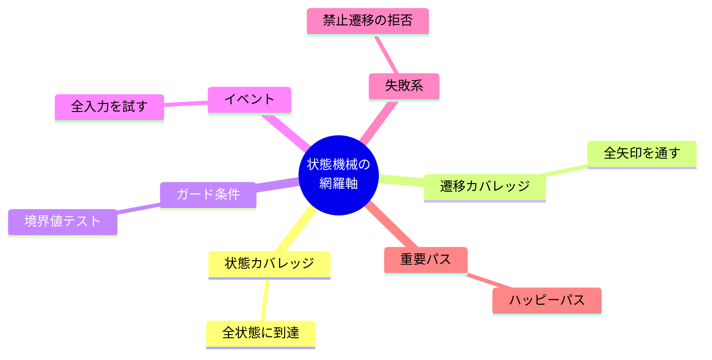
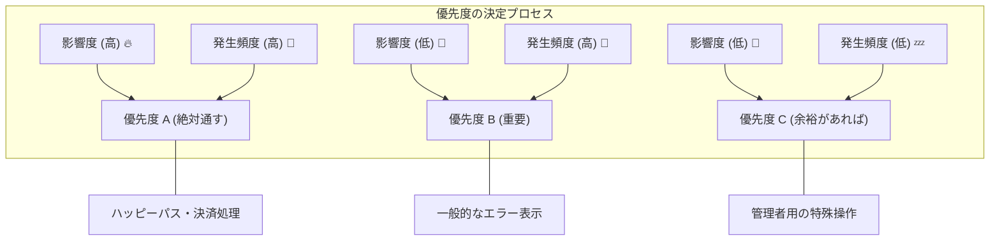
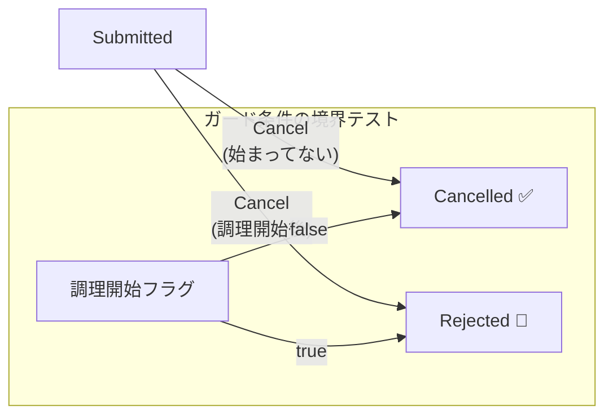

# 第23章：単体テスト②（網羅の考え方）🎯🧪✨

（テーマ：**全部テストできないとき、どう“賢く”テストする？**）

第22章で「遷移表の行＝テストケース」にできたよね？😆✨
でも現実は…状態もイベントも増えるから、**全部の組み合わせをテストするのはムリ**になりがち💦
だから第23章は、**“網羅”の考え方**と、**優先度A/B/Cでテスト計画を作る技術**を身につけるよ〜！🫶🎯

---

## 1) 今日のゴール（できるようになること）🎓✨

* 「網羅」って言われてもビビらない😎
* 状態機械のテストで大事な“網羅軸”が分かる🧭
* **優先度A/B/C**で、現実的なテスト計画を作れる📋✨
* コードカバレッジ（行カバレッジ）を“使い方限定”で活かせる🧪📈 ([Microsoft Learn][1])

---

## 2) まず「網羅」って何？👀✨





「網羅＝全部やる」じゃないよ🙅‍♀️💦
**網羅＝“何をどこまで確認したいか”の観点（軸）を決めて、漏れを減らすこと**だよ✅✨

状態機械だと、網羅の軸がいくつかあるのがポイント🌟

---

## 3) 状態機械テストの“網羅軸”ベスト6 🏆🧪


ここが第23章の核だよ〜！💖

### A. 状態カバレッジ（State Coverage）🧊

* **全状態に1回は到達**できてる？
* 「その状態に入ったときのルール（不変条件）」壊れてない？

### B. 遷移カバレッジ（Transition Coverage）🔁

* **全ての“矢印（遷移）”を1回は通す**
* 状態機械ではコレが超重要🎯

### C. イベントカバレッジ（Event Coverage）📣

* 全イベントが、少なくともどこかで期待通り動く？
* 逆に「どの状態で受け付けないか（禁止）」も確認できてる？🚫

### D. ガード条件カバレッジ（Guard Coverage）🛡️


* 条件つき遷移は **境界（ギリギリ）** が事故りやすい😵‍💫
* 例：Cancelは「調理開始前だけ」→ **開始前/開始後** 両方テスト必須🍳

### E. 失敗カバレッジ（Failure Coverage）✅❌

* 禁止遷移が「例外で落ちる」じゃなく、**Resultで安全に返る**？
* UI/APIに渡す理由コード・メッセージが正しい？💬✨

### F. 重要パス集中（Critical Path Coverage）🚀


* **一番使われる流れ（ハッピーパス）**を最優先で守る
* “売上・支払い・返金”みたいな致命傷ルートはA級🔥💳

---

## 4) 「全部テストできない」時の優先順位の決め方🧠✨


ここからが実務力〜！💪😆

優先度はだいたいこの3つの掛け算で決めると強いよ👇

* **壊れやすさ**：分岐多い/境界ある/複雑/過去にバグった？🧨




---

## 5) 演習：テスト計画をA/B/Cで作ろう📋✨

題材：「学食モバイル注文」🍙📱
状態：Draft → Submitted → Paid → Cooking → Ready → PickedUp
例外：Cancelled / Refunded

### ✅ 優先度A（落としたら炎上🔥）

* **支払い（Paid）に関係する遷移**：Submitted→Paid、Paid→Refunded など💳
* ハッピーパスの骨格：Draft→Submitted→Paid→Cooking→Ready→PickedUp 🚀
* ガード境界：Cancel可能/不可能の境目（調理前/後）🍳🛡️
* 二重実行しそうなイベント（Pay連打など）は次章で扱うけど、最低限の防波堤はここで意識👆💥

### 👍 優先度B（大事だけど、Aの次）

* キャンセル系（Draft/SubmittedでのCancel）
* ReadyからPickUpまでの例外（受け取り期限などがあるなら）⏰
* メッセージ内容（丁寧さ違い）は第20章寄りだけど、最低限は確認💬

### 🥺 優先度C（余裕があれば）

* レアな運用（管理者が手動で戻す等）
* ほぼ起きない入力（極端な金額など）※ただし“境界”ならA/Bに昇格🎯

---

## 6) 「網羅したつもり」事故あるある😵‍💫（回避策つき）

### あるある①：行カバレッジ100%で安心しちゃう📈💦


* 行カバレッジは「通った行」しか見ないよ
* 状態機械では **“遷移（矢印）”を通したか** を主役にしてね🔁🎯

### あるある②：禁止遷移をテストしてない🚫

* 事故の半分は「想定外の状態でボタン押された」系👆💥
* 禁止遷移は **“仕様”** だから、ちゃんとテスト対象だよ✅

---

## 7) テストコード例（xUnitで“優先度Aの骨格”）🧪✨

※ここでは「遷移の判断だけ」をテストしやすい形（副作用は別）にしてる前提だよ🚪✨

```csharp
using Xunit;

public enum OrderState
{
    Draft, Submitted, Paid, Cooking, Ready, PickedUp,
    Cancelled, Refunded
}

public enum OrderEvent
{
    Submit, Pay, StartCooking, MarkReady, PickUp, Cancel, Refund
}

public readonly record struct TransitionResult(bool Ok, OrderState State, string Reason);

public static class OrderStateMachine
{
    public static TransitionResult Apply(OrderState state, OrderEvent ev, bool cookingStarted = false)
    {
        // 例：Cancelは「調理開始前だけOK」みたいなガード
        if (ev == OrderEvent.Cancel)
        {
            if (state is OrderState.Draft or OrderState.Submitted && !cookingStarted)
                return new(true, OrderState.Cancelled, "OK");

            return new(false, state, "CANCEL_NOT_ALLOWED");
        }

        return (state, ev) switch
        {
            (OrderState.Draft, OrderEvent.Submit) => new(true, OrderState.Submitted, "OK"),
            (OrderState.Submitted, OrderEvent.Pay) => new(true, OrderState.Paid, "OK"),
            (OrderState.Paid, OrderEvent.StartCooking) => new(true, OrderState.Cooking, "OK"),
            (OrderState.Cooking, OrderEvent.MarkReady) => new(true, OrderState.Ready, "OK"),
            (OrderState.Ready, OrderEvent.PickUp) => new(true, OrderState.PickedUp, "OK"),
            (OrderState.Paid, OrderEvent.Refund) => new(true, OrderState.Refunded, "OK"),
            _ => new(false, state, "INVALID_TRANSITION")
        };
    }
}

public class OrderStateMachineTests
{
    [Fact]
    public void A_HappyPath_should_reach_PickedUp()
    {
        var s = OrderState.Draft;

        s = OrderStateMachine.Apply(s, OrderEvent.Submit).State;
        s = OrderStateMachine.Apply(s, OrderEvent.Pay).State;
        s = OrderStateMachine.Apply(s, OrderEvent.StartCooking).State;
        s = OrderStateMachine.Apply(s, OrderEvent.MarkReady).State;
        s = OrderStateMachine.Apply(s, OrderEvent.PickUp).State;

        Assert.Equal(OrderState.PickedUp, s);
    }

    [Theory]
    [InlineData(OrderState.Draft, false, true)]
    [InlineData(OrderState.Submitted, false, true)]
    [InlineData(OrderState.Paid, false, false)]
    [InlineData(OrderState.Submitted, true, false)] // 調理開始後はCancel禁止のイメージ
    public void A_Cancel_guard_boundary(OrderState state, bool cookingStarted, bool shouldOk)
    {
        var r = OrderStateMachine.Apply(state, OrderEvent.Cancel, cookingStarted);

        Assert.Equal(shouldOk, r.Ok);
        if (!shouldOk) Assert.Equal("CANCEL_NOT_ALLOWED", r.Reason);
    }
}
```




ポイント💡

* **A（炎上防止）**は「ハッピーパス」「支払い」「境界ガード」をまず固める🔥💳🛡️
* 禁止遷移の `Reason` を見るテストは、仕様の“言い切り”になって強いよ✅✨

---

## 8) コードカバレッジの取り方（CLI/Visual Studio）📈🧪

### ✅ CLIで取る（簡単＆CIでも使える）

`dotnet test --collect:"XPlat Code Coverage"` でOK✨
XPlat Code Coverage は coverlet のデータコレクターに対応してて、結果（例：cobertura.xml）が TestResults に出るよ🧾✨ ([Microsoft Learn][1])

### ✅ Visual Studioで取る（見た目が分かりやすい）

Visual Studio 2026 では Test メニューから **Analyze Code Coverage for All Tests** などで実行できて、エディタ上で“どこ通ってるか”も見えるよ👀✨ ([Microsoft Learn][2])

⚠️注意：

* カバレッジは“高いほど正しい”じゃないよ🙅‍♀️
* 状態機械は **遷移（矢印）ベースの網羅**を主にして、カバレッジは「穴探し補助」くらいがちょうどいい🔍✨

---

## 9) AI活用（第23章の使いどころ）🤖✨

### ① 優先度A/B/Cの叩き台を作らせる📋

* 「遷移表（状態×イベント→次状態）」を渡して

  * “影響度/頻度/壊れやすさ”の観点でスコア付け
  * A/B/Cに分類
  * Aだけ先に最小ケース数に圧縮
    みたいに頼むと強いよ🔥

### ② “落ちやすい組み合わせ”を推測させる🔮

* ガード条件の境界
* 例外系（Refund/Cancel）
* 条件の漏れ（SubmittedでRefundしてない？等）
  を列挙してもらうと、人間の見落としが減る🫶✨

### ③ テストの雛形（Theory/InlineData）を生成させる🧪

ただし！

* **期待値（次状態・理由コード）は人間が最終責任**で確定してね✅（AIはここを平気で間違える💦）

---

## 10) つまずきポイント集（先回り）🧯✨

* **テスト名が雑** → `A_何を守る_どんな条件で_どうなる` みたいに命名すると読みやすい📛✨
* **Theoryが増えすぎ** → まずA級だけTheory化、B/Cは後回し🧹
* **カバレッジの数字に支配される** → “矢印を守れてる？”に戻る🔁🎯

---

## 11) 仕上げチェックリスト✅✨

* [ ] ハッピーパスがAで通る🚀
* [ ] 支払い/返金など“お金系”がAで守れてる💳
* [ ] ガード境界（できる/できない両側）をテストした🛡️
* [ ] 禁止遷移が「落ちないで」理由付きで返る✅❌
* [ ] カバレッジは穴探しに使った（数字を目的化してない）🔍📈

---

## 次章へのつながり（チラ見せ）👀✨

第24章は、支払いAPIみたいな **“待ち”がある世界（async/await）** に入っていくよ⏳⚡
そのとき「中間状態」や「完了イベント」が出てきて、テスト観点も増えるから…
第23章の **優先順位づけ** がめっちゃ効いてくるのだ🫶✨

---

必要なら、この第23章の内容を“授業スライド風”にして、

* 例題（A/B/C分類クイズ🎯）
* 解答と理由（影響度×頻度×壊れやすさ）
* 宿題テンプレ（テスト計画シート📋）
  まで付けた版も作れるよ〜😆📘✨

[1]: https://learn.microsoft.com/ja-jp/dotnet/core/testing/unit-testing-code-coverage?utm_source=chatgpt.com "単体テストにコードカバレッジを使用する - .NET"
[2]: https://learn.microsoft.com/en-us/visualstudio/releases/2026/release-notes?utm_source=chatgpt.com "Visual Studio 2026 Release Notes"