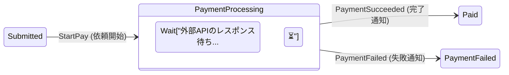
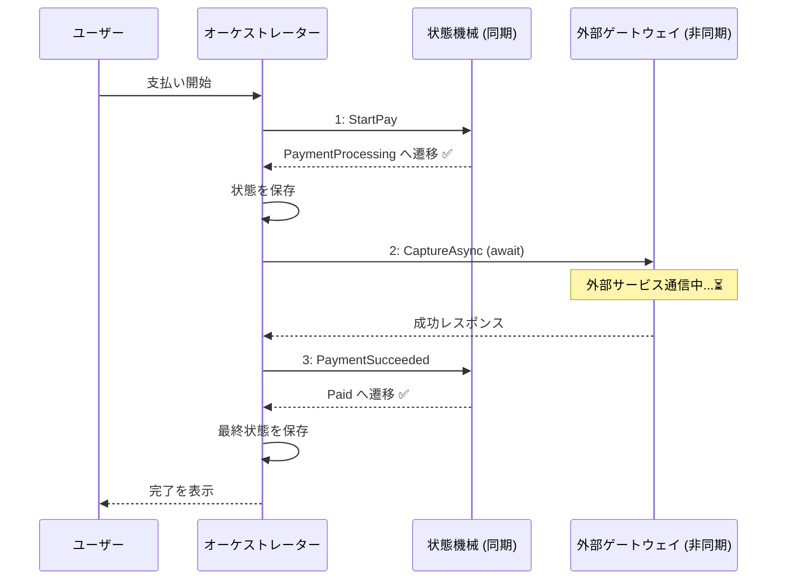
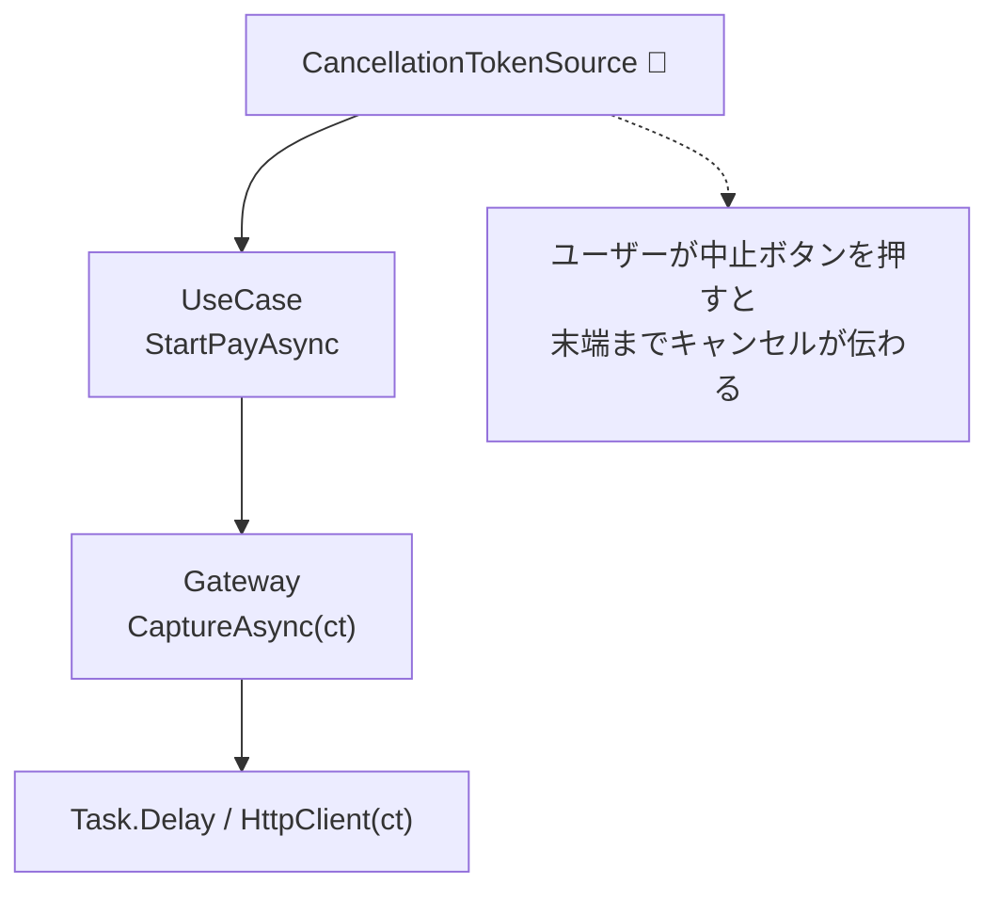

# 第24章：非同期（async/await）と中間状態 ⏳⚡

（題材：学食モバイル注文 🍙📱）

---

## 1) この章でできるようになること 🎯✨

この章を終えると、こんな設計ができるようになります😊

* 「支払いAPIみたいに“待ち”がある処理」を、状態機械に安全に組み込める 💳⏳
* Paid に“直行”せず、Processing（処理中）みたいな **中間状態** を入れられる 🛟
* 非同期の完了を **イベント（完了通知）** として扱える（Succeeded / Failed）📣✅❌
* UIやAPIで事故りがちな「.Result / .Wait の地雷」を避けられる 💣🙅‍♀️ ([Microsoft Learn][1])
* キャンセル（CancellationToken）を自然に通せる 🔙🧯 ([Microsoft Learn][2])

---

## 2) まず“なぜ中間状態が要るの？”🤔💡





支払いって、だいたい外部サービスにお願いするよね？（カード会社・決済代行など）💳🌐
この時点で「すぐPaid！」って確定できません😵‍💫

* 通信が遅い / 一時的に落ちる 📡💦
* 先方が「処理中」って返す（後で確定）⏳
* 成功・失敗が後から判明する ✅❌

だから、状態機械としてはこうしたい👇

**Submitted（注文済） → PaymentProcessing（支払い処理中） → Paid（支払い完了）**
または
**Submitted → PaymentProcessing → PaymentFailed（失敗）**

この「PaymentProcessing」が中間状態です⏳✨

---

## 3) 非同期の基本は “TAP（Taskベース）”で考える 🧠✨

.NET の非同期は基本的に **Task（Task<T>）** を使う「TAP」が推奨です🙆‍♀️
C# の async/await は、このTAPを読みやすく書くための仕組みだよ〜😊 ([Microsoft Learn][3])

ここで大事な感覚👇

* await は「待つ」けど **スレッドをブロックしない**（止めない）🧘‍♀️✨ ([Microsoft Learn][4])
* 逆に .Result / .Wait は **ブロック** しがちで、UIだとデッドロック地獄になりやすい 💣😇 ([Microsoft Learn][1])

---

## 4) 状態機械に async を“直埋め”しないコツ 🧷✨

初心者さんがやりがちな危ない例👇

* 「Pay() の中で外部API await して、戻ってきたら State を Paid に更新」
  → その間に別イベントが来たり、二重実行が起きたりして事故りやすい 👆💥（次章で深掘り）

この章の安全な型はこれ👇✨

### ✅ ルールA：状態機械は “同期の判断” に寄せる

* 状態機械：いまの状態＋イベント → 次の状態（＋副作用の依頼）
* 非同期I/O：状態機械の外（オーケストレーター）で await

### ✅ ルールB：非同期の完了は “完了イベント” にする

* PaymentSucceeded / PaymentFailed を **イベント** として状態機械に投げ直す 📣✨

### ✅ ルールC：完了イベントには “照合用ID” を持たせる

* requestId（支払い依頼ID）が一致する時だけ反映✅
* 遅れて届いた古い成功通知を弾ける🧯（超大事）

---

## 5) 仕様（ミニ遷移表）📊✨

今回の章は支払い周りに集中して、最小でこうします👇

* 状態：Submitted / PaymentProcessing / Paid / PaymentFailed
* イベント：StartPay / PaymentSucceeded / PaymentFailed

例：

| 現在状態              | イベント             | 次状態               | 備考            |
| ----------------- | ---------------- | ----------------- | ------------- |
| Submitted         | StartPay         | PaymentProcessing | 外部決済へ依頼する     |
| PaymentProcessing | PaymentSucceeded | Paid              | requestId一致のみ |
| PaymentProcessing | PaymentFailed    | PaymentFailed     | requestId一致のみ |
| PaymentProcessing | StartPay         | （禁止）              | “処理中だよ”と返す    |

---

## 6) 実装ハンズオン（最小セット）🛠️✨

ここから C# で “動く形” を作るよ〜😊💕

### 6-1) ドメインモデル（状態と注文）📦

ポイント：**Processing 中に requestId を保持**して照合に使います🔑✨

```csharp
public enum OrderState
{
    Draft,
    Submitted,
    PaymentProcessing,
    Paid,
    PaymentFailed,
    Cancelled
}

public sealed class Order
{
    public string OrderId { get; }
    public OrderState State { get; private set; } = OrderState.Draft;

    // 支払い中の照合用（Processingのときだけ入る想定）
    public string? CurrentPaymentRequestId { get; private set; }
    public string? ProviderTransactionId { get; private set; }

    public Order(string orderId) => OrderId = orderId;

    public void SetState(OrderState next) => State = next;

    public void StartPayment(string requestId)
    {
        CurrentPaymentRequestId = requestId;
        ProviderTransactionId = null;
    }

    public void CompletePayment(string requestId, string providerTxId)
    {
        CurrentPaymentRequestId = requestId; // 記録として残してもOK
        ProviderTransactionId = providerTxId;
    }

    public void FailPayment(string requestId)
    {
        CurrentPaymentRequestId = requestId;
        ProviderTransactionId = null;
    }
}
```

---

### 6-2) イベント（Command化してる前提）📣✨

StartPay は「支払い開始」
Succeeded/Failed は「外部APIの結果が返ってきた」通知だよ😊

```csharp
public interface IOrderEvent { }

public sealed record Submit() : IOrderEvent;

// 支払い開始（ユーザー操作）
public sealed record StartPay(decimal Amount, string PaymentRequestId) : IOrderEvent;

// 外部決済の結果（完了通知）
public sealed record PaymentSucceeded(string PaymentRequestId, string ProviderTransactionId) : IOrderEvent;
public sealed record PaymentFailed(string PaymentRequestId, string Reason) : IOrderEvent;
```

---

### 6-3) 遷移結果（成功/失敗＋メッセージ）✅❌

第19章あたりでやった Result 形式をここでも使うと超ラクです😊✨

```csharp
public sealed record TransitionResult(
    bool Success,
    string Message,
    OrderState? NextState = null,
    string? SideEffect = null
);
```

ここでは SideEffect を「CALL_PAYMENT」のような文字列にしてるけど、慣れてきたら型にしてOK👍✨

---

### 6-4) 状態機械本体（同期の判断だけ）🧠✨

async は **一切** 出てきません🙅‍♀️✨
“判断”だけ！

```csharp
public static class OrderStateMachine
{
    public static TransitionResult Apply(Order order, IOrderEvent ev)
    {
        return order.State switch
        {
            OrderState.Draft => ApplyDraft(order, ev),
            OrderState.Submitted => ApplySubmitted(order, ev),
            OrderState.PaymentProcessing => ApplyPaymentProcessing(order, ev),
            OrderState.Paid => new TransitionResult(false, "支払い完了後は支払いイベントを受け付けません🙏"),
            OrderState.PaymentFailed => ApplyPaymentFailed(order, ev),
            _ => new TransitionResult(false, "未対応の状態です🙏")
        };
    }

    private static TransitionResult ApplyDraft(Order order, IOrderEvent ev)
        => ev switch
        {
            Submit => new TransitionResult(true, "注文を送信しました📨", OrderState.Submitted),
            _ => new TransitionResult(false, "下書き中はその操作できないよ〜📝")
        };

    private static TransitionResult ApplySubmitted(Order order, IOrderEvent ev)
        => ev switch
        {
            StartPay x => new TransitionResult(
                true,
                "支払いを開始します💳⏳",
                OrderState.PaymentProcessing,
                SideEffect: "CALL_PAYMENT"
            ),
            _ => new TransitionResult(false, "注文済みではその操作できないよ〜🍙")
        };

    private static TransitionResult ApplyPaymentProcessing(Order order, IOrderEvent ev)
        => ev switch
        {
            PaymentSucceeded x when IsMatch(order, x.PaymentRequestId)
                => new TransitionResult(true, "支払い完了です✅🎉", OrderState.Paid),

            PaymentFailed x when IsMatch(order, x.PaymentRequestId)
                => new TransitionResult(true, $"支払い失敗…❌（{x.Reason}）", OrderState.PaymentFailed),

            // requestIdが違う完了通知は「古い通知」かもしれないので弾く
            PaymentSucceeded => new TransitionResult(false, "古い支払い結果なので無視します🧯"),
            PaymentFailed => new TransitionResult(false, "古い支払い結果なので無視します🧯"),

            StartPay => new TransitionResult(false, "いま支払い処理中だよ〜⏳（連打ストップ✋）"),

            _ => new TransitionResult(false, "支払い処理中はその操作できないよ〜⏳")
        };

    private static TransitionResult ApplyPaymentFailed(Order order, IOrderEvent ev)
        => ev switch
        {
            StartPay x => new TransitionResult(true, "もう一度支払いを開始します💳⏳", OrderState.PaymentProcessing, "CALL_PAYMENT"),
            _ => new TransitionResult(false, "支払い失敗中は、支払い再試行かキャンセルを選んでね🙏")
        };

    private static bool IsMatch(Order order, string paymentRequestId)
        => order.CurrentPaymentRequestId == paymentRequestId;
}
```

---

## 7) “await する人”＝オーケストレーターを作る 🤝⚡





状態機械の外で、外部決済を await します💳⏳

### 7-1) 外部決済ゲートウェイ（スタブ）

キャンセルをちゃんと通すのがポイント🧯✨
タスクキャンセルは協調的に設計するのが基本です🙆‍♀️ ([Microsoft Learn][2])

```csharp
public sealed record PaymentGatewayResult(bool Success, string? ProviderTxId, string? Reason);

public interface IPaymentGateway
{
    Task<PaymentGatewayResult> CaptureAsync(string paymentRequestId, decimal amount, CancellationToken ct);
}

// ダミー：1.5秒待って、成功/失敗をランダムに返す
public sealed class FakePaymentGateway : IPaymentGateway
{
    private readonly Random _random = new();

    public async Task<PaymentGatewayResult> CaptureAsync(string paymentRequestId, decimal amount, CancellationToken ct)
    {
        await Task.Delay(TimeSpan.FromSeconds(1.5), ct);

        var ok = _random.NextDouble() < 0.75; // 75%成功
        return ok
            ? new PaymentGatewayResult(true, ProviderTxId: $"TX-{Guid.NewGuid():N}", Reason: null)
            : new PaymentGatewayResult(false, ProviderTxId: null, Reason: "カード会社が拒否しました");
    }
}
```

---

### 7-2) 支払いユースケース（ここで await）

流れはこう👇✨

1. StartPay を状態機械に入れる（Submitted→Processing）
2. いったん保存（本当はDB、ここでは省略OK）
3. 外部決済を await
4. 結果イベント（Succeeded/Failed）を状態機械に入れる

```csharp
public sealed class PayUseCase
{
    private readonly IPaymentGateway _gateway;

    public PayUseCase(IPaymentGateway gateway) => _gateway = gateway;

    public async Task<TransitionResult> StartPayAsync(Order order, decimal amount, CancellationToken ct)
    {
        var requestId = $"PAY-{Guid.NewGuid():N}";

        // ① 状態機械：支払い開始（同期判断）
        var r1 = OrderStateMachine.Apply(order, new StartPay(amount, requestId));
        if (!r1.Success) return r1;

        // ② 状態を反映（Processing + requestId保持）
        order.StartPayment(requestId);
        order.SetState(r1.NextState!.Value);

        // ③ 外部決済：await（非同期I/O）
        PaymentGatewayResult gw;
        try
        {
            gw = await _gateway.CaptureAsync(requestId, amount, ct);
        }
        catch (OperationCanceledException)
        {
            // キャンセルは次章/第27章で扱うけど、ここではメッセージだけでもOK
            return new TransitionResult(false, "支払い処理をキャンセルしました🧯");
        }

        // ④ 完了イベントを状態機械に投入（同期判断）
        TransitionResult r2;
        if (gw.Success)
        {
            r2 = OrderStateMachine.Apply(order, new PaymentSucceeded(requestId, gw.ProviderTxId!));
            if (r2.Success)
            {
                order.CompletePayment(requestId, gw.ProviderTxId!);
                order.SetState(r2.NextState!.Value);
            }
            return r2;
        }
        else
        {
            r2 = OrderStateMachine.Apply(order, new PaymentFailed(requestId, gw.Reason ?? "不明なエラー"));
            if (r2.Success)
            {
                order.FailPayment(requestId);
                order.SetState(r2.NextState!.Value);
            }
            return r2;
        }
    }
}
```



---


## 8) 動作確認（Consoleデモ）🖥️✨

```csharp
public static class Program
{
    public static async Task Main()
    {
        var order = new Order("ORDER-001");

        Console.WriteLine($"初期: {order.State}");

        // Draft -> Submitted
        var s1 = OrderStateMachine.Apply(order, new Submit());
        order.SetState(s1.NextState!.Value);
        Console.WriteLine($"{s1.Message} / 状態: {order.State}");

        var useCase = new PayUseCase(new FakePaymentGateway());

        using var cts = new CancellationTokenSource();
        // 例：3秒で諦める（CancelAfterは公式の定番パターンだよ）⏰✨
        cts.CancelAfter(TimeSpan.FromSeconds(3));
        
        var s2 = await useCase.StartPayAsync(order, amount: 650m, ct: cts.Token);
        Console.WriteLine($"{s2.Message} / 状態: {order.State}");
    }
}
```

CancelAfter は「一定時間後にキャンセルする」公式チュートリアルがあるよ⏰✨ ([Microsoft Learn][5])

---

## 9) この章の“つまずきポイント集”😵‍💫🧷

### ❌ 1) .Result / .Wait を使う

UIイベントや同期コンテキストが絡むとデッドロックしやすいです💥 ([Microsoft Learn][1])
→ 基本は await で通す🙆‍♀️✨

### ❌ 2) Processing を作らずに Paid にしちゃう

「支払い依頼した」＝「支払い完了」ではないよ〜💳😵‍💫
→ **中間状態** を挟むのが王道🛟✨

### ❌ 3) 完了通知の照合IDがない

古い成功通知が遅れて届いたら、別の支払いを上書きしちゃうかも😇
→ requestId を持とう🔑✨

### ❌ 4) CancellationToken を渡さない

止めたいのに止まらない…🧯💦
→ ct を末端まで通すのが基本🙆‍♀️ ([Microsoft Learn][2])

---

## 10) 演習（やってみよ〜🎮✨）

### 演習A：PaymentFailed を “Submittedに戻す” 仕様にしてみる 🔁

* 失敗したら PaymentFailed じゃなくて Submitted に戻す
* メッセージで「もう一度お試しください」って出す💬

### 演習B：Processing 中の Cancel をどうする？🚫

* Cancel を許可する？（ただし外部決済は止められる？止められない？）
* 状態機械の仕様として決めて、遷移表に書く📊✨
  （次章の“連打・二重処理”にもつながるよ👆💥）

### 演習C：タイムアウトの作法を入れる ⏰

* CancelAfter を 2秒にして、たまにキャンセルが起きるのを観察する
* キャンセル時に「Processingのまま」か「Submittedに戻す」か決める
  ※タイムアウト設計は第27章で本格的にやるよ〜😊 ([Microsoft Learn][5])

---

## 11) AI（Copilot/Codex）の使いどころ 🤖✨

そのままコピペ採用じゃなくて、“叩き台生成”に使うのがコツだよ😊💕

* 「遷移表から switch の雛形を作って」📊→🧱
* 「Processing が必要な中間状態を、この業務で列挙して」⏳
* 「requestId 照合のテストケースを10個作って」🧪
* 「キャンセルとタイムアウトの分岐の注意点をレビューして」🧯

---

## 12) まとめ（この章の合言葉）🎀✨

* **外部I/Oは待つもの** → だから **中間状態（Processing）** を入れる⏳
* **状態機械は判断（同期）**、**await は外（オーケストレーター）** 🤝
* **完了はイベントで戻す**（Succeeded/Failed）📣
* **.Result/.Wait は封印** 🙅‍♀️💣 ([Microsoft Learn][1])
* **CancellationToken は末端まで通す** 🧯✨ ([Microsoft Learn][2])

---

次の第25章は、ここで作った「Processing」が **連打👆💥** と組み合わさった時に起きる事故を、仕様と設計で潰していきます🔥😊

[1]: https://learn.microsoft.com/ja-jp/dotnet/desktop/winforms/forms/events?utm_source=chatgpt.com "イベントの概要 - Windows Forms"
[2]: https://learn.microsoft.com/en-us/dotnet/standard/parallel-programming/task-cancellation?utm_source=chatgpt.com "Task Cancellation - .NET"
[3]: https://learn.microsoft.com/en-us/dotnet/standard/asynchronous-programming-patterns/?utm_source=chatgpt.com "Asynchronous programming patterns - .NET"
[4]: https://learn.microsoft.com/en-us/dotnet/csharp/asynchronous-programming/?utm_source=chatgpt.com "Asynchronous programming - C#"
[5]: https://learn.microsoft.com/en-us/dotnet/csharp/asynchronous-programming/cancel-async-tasks-after-a-period-of-time?utm_source=chatgpt.com "Cancel async tasks after a period of time\" - C#"