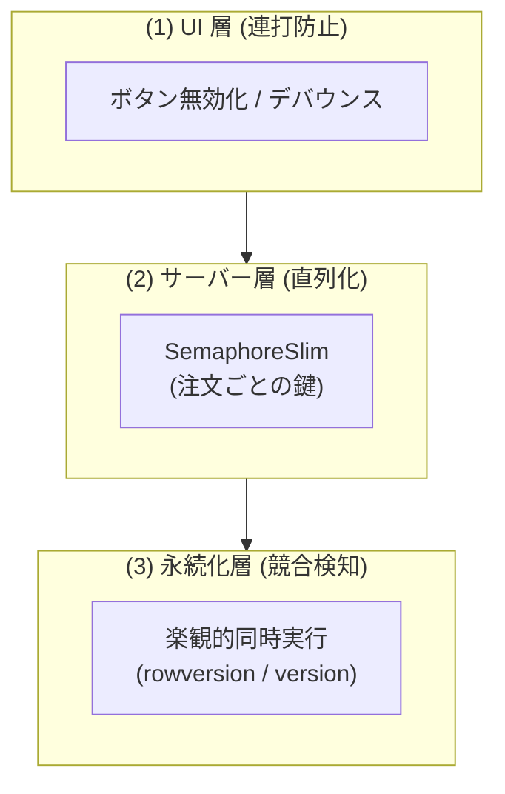
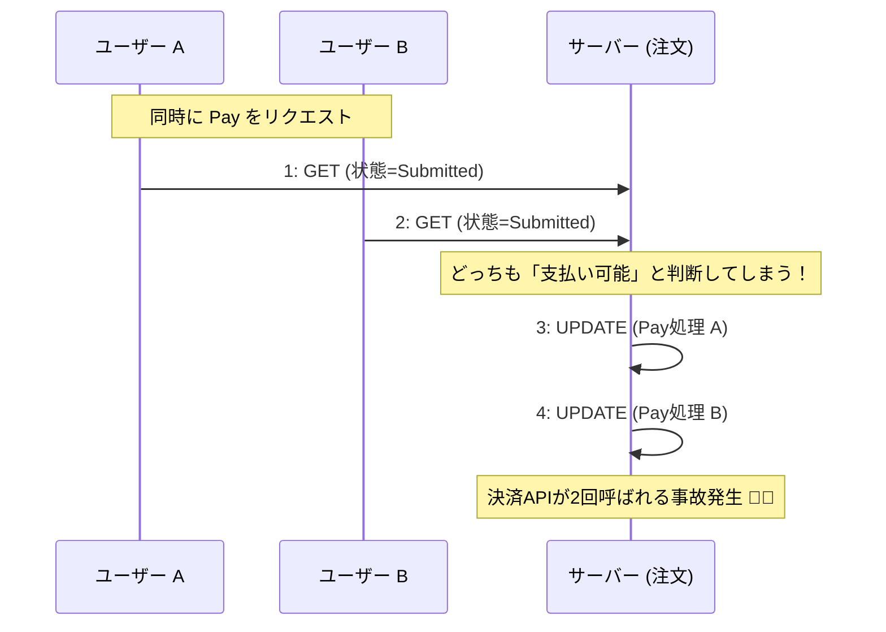
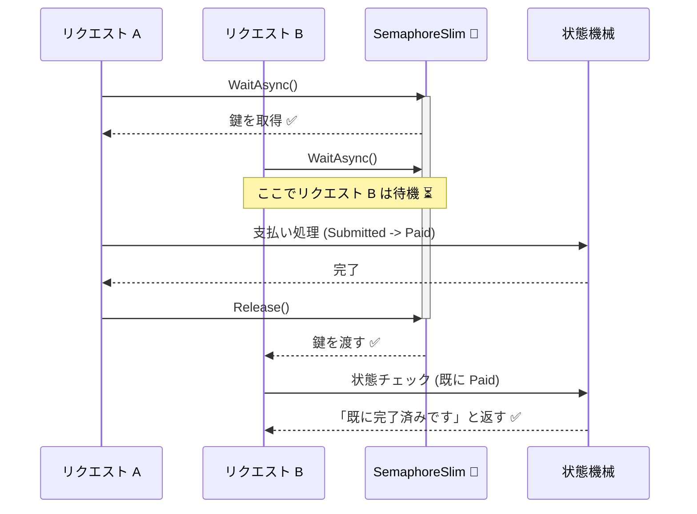

# 第25章：並行実行の事故（連打・二重処理）👆💥

〜「現実の連打」に耐える状態機械にしていこ〜！🧠✨

---

## 1) 今日のゴール🎯✨

この章が終わると、こんなことができるようになるよ😊💕

* 連打・二重送信・同時イベントで何が壊れるか説明できる🧨
* 「どっちを正にする？」を仕様として決められる🧾✅
* 状態遷移を“原子的（読み→判断→書きが一塊）”に守れる🔒
* C#で **asyncでも安全に直列化** する基本が書ける（SemaphoreSlim / Channel）⚡
* 競合が起きたら **検知してやり直す**（楽観的同時実行）という発想が持てる💡（永続化章の前準備）

※ .NET 10 はLTSで提供されていて、最新パッチも継続的に出てるよ（2026/1時点で 10.0.2 など） ([Microsoft for Developers][1])

---

## 2) まず「事故」をイメージしよ😵‍💫💥


学食モバイル注文でありがちなやつ👇

* **支払いボタン連打**：Payが2回飛ぶ💳💳
* **戻る→再送**：通信遅い→不安で再タップ📶😫
* **別端末で同時操作**：スマホAでCancel、スマホBでPay📱📱
* **処理中にUIが固まって連打**：同じイベントが並行で走る🏃‍♀️🏃‍♀️
* **遅延したレスポンスが後から来る**：順番が前後する⏳↩️

この手の事故は、「UIでボタン無効化したからOK〜」だけだと普通に抜けるよ🥲（別端末・リトライ・ネットワーク再送があるので）

---

## 3) 仕様として“勝者”を決めよう🧾⚔️

**超重要**：同時に来たときの正解は「実装」じゃなくて「仕様」だよ✨

たとえば Pay が2回来たら、候補は3つ👇

* A：**2回目は成功扱い（実質無視）** ✅（ユーザー体験よし）
* B：**2回目は失敗（AlreadyPaid）** ❌（APIとして厳密）
* C：**2回目は409/競合** ⚠️（クライアントに再取得させる）

初心者向けの落とし所はだいたいこれ👇😊

* **同じ状態で同じ意味の操作が来たら「安全に無視 or 既に完了」**
* **違う意味の操作が競合したら「競合（409相当）で返す」**

例：

* `Paid` に `Pay` → 「もう支払い済みです」
* `ProcessingPayment` に `Cancel` → 「支払い処理中はキャンセルできません」
* `Submitted` に `Cancel` と `Pay` が同時 → どっち優先？（仕様で決める！）

---

## 4) 防衛ラインは3層🛡️🛡️🛡️





現場ではだいたい **重ねがけ** するよ〜✨

### ① UI層（連打対策）👆🚫





* ボタンをすぐ無効化
* デバウンス（一定時間は同操作を受けない）
* “処理中…”表示

でも **UIは信用しない**（抜け道が多い）😇

### ② ドメイン/サーバー層（直列化）🔒✨

**同じ注文IDのイベントは、必ず1本ずつ処理** する
→ これがこの章のメイン💖

* `SemaphoreSlim` で「注文ごとの鍵」🔑
* `Channel` で「注文ごとのキュー」📮

`SemaphoreSlim` は軽量なセマフォで、非同期で待てる `WaitAsync` があるよ ([Microsoft Learn][2])
`Channel` は producer/consumer の形で非同期にデータを渡す仕組みだよ ([Microsoft Learn][3])

### ③ 永続化層（競合検知）💾⚠️

DBに保存するなら、**楽観的同時実行（Optimistic Concurrency）** が強い✨
EF Coreなら `rowversion`（`[Timestamp]`）などの concurrency token で衝突検知できるよ ([Microsoft Learn][4])

---

## 5) まず「壊れる」コードを作ってみよう😈🧨


例：支払い処理を `await` してる間に、もう1本が入り込むやつ。

```csharp
public enum OrderState
{
    Draft, Submitted, ProcessingPayment, Paid, Cancelled
}

public sealed class Order
{
    public string Id { get; }
    public OrderState State { get; private set; } = OrderState.Submitted;

    public Order(string id) => Id = id;

    // わざと危ない：並行実行されると壊れる可能性あり
    public async Task<string> PayAsync(decimal amount)
    {
        if (State is OrderState.Cancelled) return "Cancelledなので支払い不可";
        if (State is OrderState.Paid) return "もう支払い済み";

        State = OrderState.ProcessingPayment;

        // 外部決済API呼び出しっぽい待ち
        await Task.Delay(200);

        State = OrderState.Paid;
        return "支払い完了";
    }
}
```

これ、2本同時に走ったらどうなる？👀💥

* どっちも `Paid` になるから「見た目」だけは平和
* でも本当は **決済APIが2回呼ばれた** かもで最悪😱💸




---

## 6) 解決①：注文ごとに “asyncロック” で直列化🔑✨（おすすめ）


`lock` は **async内でawaitできない** から注意だよ⚠️（CS1996） ([Microsoft Learn][5])
なので、ここは `SemaphoreSlim` が素直で強い💪✨

### 6-1) 「注文ID→鍵」を管理するクラス🧰

```csharp
using System.Collections.Concurrent;

public sealed class OrderLockPool
{
    private readonly ConcurrentDictionary<string, SemaphoreSlim> _locks = new();

    public SemaphoreSlim Get(string orderId)
        => _locks.GetOrAdd(orderId, _ => new SemaphoreSlim(1, 1));

    // 余力：一定時間使われなかった鍵を掃除、などもできる（発展）
}
```

### 6-2) サービス側で “読み→判断→書き” を1塊にする🧱✨

```csharp
public sealed class OrderService
{
    private readonly OrderLockPool _lockPool = new();
    private readonly Dictionary<string, Order> _orders = new(); // 今日は簡易Repo

    public Order GetOrCreate(string id)
    {
        if (!_orders.TryGetValue(id, out var o))
        {
            o = new Order(id);
            _orders[id] = o;
        }
        return o;
    }

    public async Task<string> PayAsync(string orderId, decimal amount, CancellationToken ct = default)
    {
        var gate = _lockPool.Get(orderId);

        await gate.WaitAsync(ct); // asyncで待てるのが強い✨
        try
        {
            var order = GetOrCreate(orderId);

            // ★ここから下が「原子的」に守られる★
            return await order.PayAsync(amount);
        }
        finally
        {
            gate.Release(); // Release忘れは事故るので必ずfinally！
        }
    }
}
```

ポイント📝✨

* **鍵の範囲**は「状態読み→遷移判断→状態更新→（必要なら保存）」まで
* 途中でawaitがあってもOK（SemaphoreSlimはasync待機できる） ([Microsoft Learn][6])

---

## 7) 解決②：イベントを「キュー」にして順番に処理📮✨（さらに強い）

「同じ注文のイベントは全部並べて、1本の処理係が順にさばく」方式だよ😊
`Channel` を使うと作りやすい ([Microsoft Learn][3])

イメージだけ（ミニ版）👇

```csharp
using System.Threading.Channels;

public sealed class OrderMailbox
{
    private readonly Channel<Func<Task>> _channel = Channel.CreateUnbounded<Func<Task>>();

    public OrderMailbox()
    {
        _ = Task.Run(async () =>
        {
            await foreach (var job in _channel.Reader.ReadAllAsync())
            {
                await job(); // ここは必ず直列
            }
        });
    }

    public ValueTask Enqueue(Func<Task> job) => _channel.Writer.WriteAsync(job);
}
```

この方式の良いところ💖

* ロックより「順序」が明確
* ログも追いやすい
* 1注文＝1アクターっぽくできる

（欠点：メールボックス管理の設計が増える。まずはSemaphoreSlimでOK😊）

---

## 8) 解決③：DBで衝突を検知して“負けた方”をやり直す💾♻️


Web API + DB だと、複数インスタンス（スケールアウト）もあるから、
**インメモリロックだけでは守れない** 場面が出るよ⚠️

そこで **楽観的同時実行**：

* 取得時のバージョン（rowversionなど）を持って
* 更新時に「同じバージョンなら更新OK、違ったら競合！」にする✨

EF Core なら concurrency token（`[Timestamp]`でrowversion等）で扱えるよ ([Microsoft Learn][4])

この章では「考え方だけ」覚えればOK！
（本格実装は永続化章で気持ちよく繋がる🫶）

---

## 演習（ハンズオン）🧪✨：Pay連打に勝つ！

## 演習1：わざと二重実行してみる😈💳💳

* `Order.PayAsync()` を同じ注文に対して `Task.WhenAll` で2本呼ぶ
* ログ（ConsoleでもOK）で「決済API呼び出し相当」が2回走りうるのを確認😱

## 演習2：SemaphoreSlimで直列化してみる🔑✨

* `OrderService.PayAsync` を使って同じことをやる
* 「決済API相当」が1回しか走らない設計になった？✅

## 演習3：競合ケースを仕様で決める🧾✨

次の同時操作の“勝者”を決めて、結果メッセージも作ってね💬💕

* `Cancel` vs `Pay`（Submitted中）
* `Pay` vs `Pay`（Submitted中）
* `Cancel` vs `Cancel`（Submitted中）

---

## つまずきポイント集🫠🧯

* `lock` の中で `await` できない！ → `SemaphoreSlim` を使おう ([Microsoft Learn][5])
* `Release()` を忘れてデッドロック😇 → `try/finally` 固定！
* 「ロック範囲が狭すぎ」問題：読みと書きが別ロックだと意味ない🙅‍♀️
* UI対策だけで安心しちゃう：別端末＆再送で死ぬ😵‍💫

---

## AI（Copilot/Codex）使いどころ🤖✨

そのままコピって投げてOKだよ〜💕

* 「この状態機械で起きる“連打・二重処理”の事故パターンを10個、状態×イベントで整理して」
* 「Payが同時に2回来た時、仕様の選択肢（成功扱い/失敗扱い/競合）を比較して、UXと実装難易度も書いて」
* 「SemaphoreSlimで注文IDごとに直列化するC#コード（try/finally、CancellationToken対応）を書いて」
* 「この直列化の単体テスト案を、フレークしにくい形で提案して」

---

## ミニ理解チェック🎯✅（3問）

1. UIでボタン無効化したのに、二重処理が起きるのはなぜ？📱📱
2. `lock` がasyncと相性悪い理由は？（キーワード：await）🧠
3. “読み→判断→書き” のどこまでを同じ鍵で守るべき？🔒

---

## まとめ🎉

* 連打・二重送信は「よくある」じゃなくて「必ず来る」👆💥
* 正解はまず **仕様として勝者を決める** 🧾✨
* 実装は **直列化（SemaphoreSlim / Channel）** が最初の正攻法🔑📮
* 将来スケールするなら **DBの競合検知（楽観的同時実行）** も視野💾⚠️ ([Microsoft Learn][4])

次の第26章（冪等性）で、
「同じイベントが“リトライ”で来ても安全」まで一段進められるよ〜🔁✨

[1]: https://devblogs.microsoft.com/dotnet/announcing-dotnet-10/?utm_source=chatgpt.com "Announcing .NET 10"
[2]: https://learn.microsoft.com/ja-jp/dotnet/api/system.threading.semaphoreslim?view=net-8.0&utm_source=chatgpt.com "SemaphoreSlim クラス (System.Threading)"
[3]: https://learn.microsoft.com/ja-jp/dotnet/core/extensions/channels?utm_source=chatgpt.com "System.Threading.Channels ライブラリ"
[4]: https://learn.microsoft.com/en-us/ef/core/saving/concurrency?utm_source=chatgpt.com "Handling Concurrency Conflicts - EF Core"
[5]: https://learn.microsoft.com/en-us/dotnet/csharp/language-reference/compiler-messages/lock-semantics?utm_source=chatgpt.com "Lock statement errors and warnings - C# reference"
[6]: https://learn.microsoft.com/ja-jp/dotnet/api/system.threading.semaphoreslim.waitasync?view=net-8.0&utm_source=chatgpt.com "SemaphoreSlim.WaitAsync メソッド (System.Threading)"