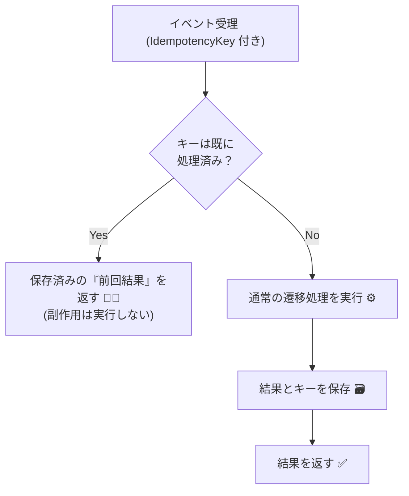
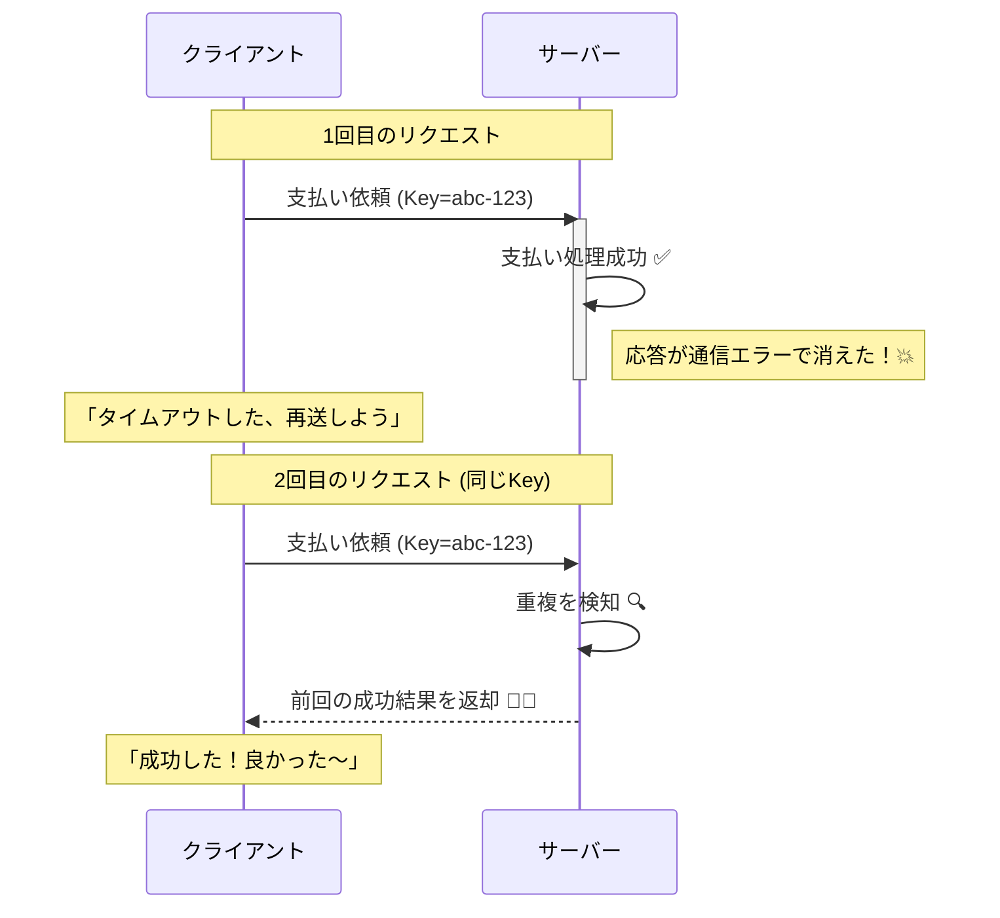
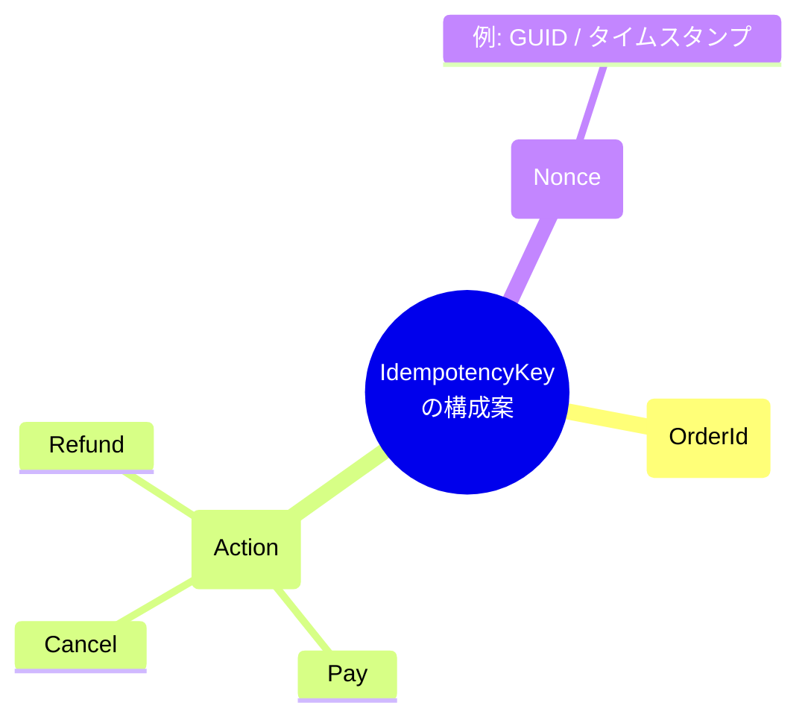

# 第26章：冪等性（Idempotency）入門🔁✨ 〜「リトライされても壊れない状態機械」へ〜

この章はね、「同じイベントが2回以上来ても、結果が“1回分”になる」状態機械を作れるようになる回だよ〜😊💖
（通信って…普通にリトライされるので…対策しないと“二重注文”“二重課金”が起きがち😵‍💫💥）

---

## 1) この章でできるようになること🎯✨

* 「冪等性」って言葉を **状態機械の文脈で**説明できる📚😊
* 二重クリック・タイムアウトリトライ・Webhook重複…みたいな **現実の事故**を想定できる👆⏳📨
* イベント（Command）に **IdempotencyKey（冪等キー）** を持たせて、**重複を安全に吸収**できる🔑✨
* 「重複を捨てる」だけじゃなく、**前回と同じ結果を返す**設計ができる✅🔁

---

## 2) まず冪等性ってなに？🧠✨





超ざっくり言うと…

> **同じ操作を何回やっても、最終的な結果が変わらない**こと🔁✨

HTTPの公式定義（超要約すると）も、「同じリクエストを複数回送っても、意図する効果が1回と同じなら冪等」って言ってるよ📮✨ ([RFC Editor][1])

### HTTPでイメージする小ネタ🌐

* **GET / PUT / DELETE は冪等**（仕様でそう扱う）
* **POST は冪等じゃないことが多い**（“作成”が多いから） ([RFC Editor][1])

でもこの章は「HTTPの話」より、**状態機械での冪等性**が主役だよ🍙📱✨

---

## 3) なぜ状態機械で冪等性が必要？😵‍💫💥（事故あるある）

「学食モバイル注文」で想像してみよ〜🍙📱

### 事故あるある①：支払いボタン連打👆👆👆

* ユーザーが「反応ない…？」って思って2回押す
* **Payイベントが2回**飛ぶ
* 対策ないと → **二重課金**💸💸（最悪）

### 事故あるある②：通信タイムアウトで自動リトライ⏳🔁

* サーバーは処理したけど、返事が届かなかった
* クライアントは「失敗した！」と思って同じ操作を再送
* 対策ないと → **同じ注文を2回進める**😇

だから「重複を捌く or 処理を冪等に」が必要、っていう話がよく出てくるよ📨🔁 ([Microsoft Learn][3])




---

## 4) 状態機械での冪等性のゴール🏁✨

ゴールはこれ👇

✅ **同じIdempotencyKeyのイベント**がもう一回来ても

* 状態は進まない（副作用も増えない）
* **前回と同じ結果（成功/失敗）を返す**

「重複は無視！」だけだと、クライアントが「え、成功したの？失敗したの？」って迷子になりがちなので、**結果も再利用**するのが強いよ〜🔁✨

Stripeみたいな決済系も「同じキーなら安全にリトライできる」思想で、冪等キーを使う設計を推してるよ💳🔑 ([Stripe ドキュメント][4])

---

## 5) 実装方針（レベル別）📶✨

### Lv1：操作を“自然に冪等”にする（最小）🌱

例：

* 「Paidにする」イベントが来た

  * まだPaidじゃない → Paidへ
  * もうPaid → 何もしない（結果だけ返す）

ただし！⚠️
状態は変わらなくても、**メール送信**や**レシート発行**みたいな副作用が2回走るとアウトなので、結局Lv2が欲しくなること多いよ😵‍💫💥

### Lv2：IdempotencyKeyで重複排除＋結果再利用（おすすめ）🥇

* イベントに **IdempotencyKey** を付ける🔑
* サーバー側で「このキー処理済み？」を記録🗃️
* 処理済みなら **前回の結果を返す**🔁✨

### Lv3：Inbox/Outboxやメッセージングまで含めて堅牢に（発展）🚀

* DBに「受信イベント（Inbox）」を残して重複排除
* 「送信イベント（Outbox）」で副作用も1回に
  このへんは後ろの章の“永続化”とも相性がいいよ💾✨

---

## 6) IdempotencyKey設計のコツ🔑✨（ここが勝負！）

### ✅ ルール1：**リトライ時は“同じキー”を使う**

* 「送信し直すたびに新しいGUID」だと、重複排除できないよ😇💦

### ✅ ルール2：キーの単位を決める（何に対して一意？）

おすすめはだいたい👇

* 「注文ID × 操作種別（Pay/Cancelなど） × クライアントが生成したキー」

### ✅ ルール3：同じキーで“内容が違う”のはエラーにする

例：

* 同じキーなのに金額が違う
  → **危険すぎ**なので弾く🚫💥
  （安全のため「キー + リクエストのハッシュ」を保存して照合することが多いよ）

例えばStripeは「キーは一定時間でシステムから消える」運用を明示してるよ🕒 ([Stripe ドキュメント][5])




---

## 7) ハンズオン🛠️✨：状態機械に冪等レイヤーを足す

ここでは **Consoleでも動くミニ実装**でいくね😊
（後でAPIにしても考え方は同じ！）

### 7-1. まずはCommandにキーを持たせる📦🔑

```csharp
public interface ICommand
{
    string IdempotencyKey { get; }
}

public sealed record PayCommand(decimal Amount, string IdempotencyKey) : ICommand;

public sealed record CancelCommand(string Reason, string IdempotencyKey) : ICommand;
```

* IdempotencyKeyは **Guid文字列**にすると楽（例：Guid.NewGuid().ToString("N")）✨

---

### 7-2. 状態と結果の型を用意する📘✨

```csharp
public enum OrderState
{
    Draft,
    Submitted,
    Paid,
    Cancelled
}

public enum ApplyStatus
{
    Applied,        // 遷移した
    Rejected,       // 禁止遷移などで失敗
    DuplicateReplay // 同じキーなので前回結果を返した
}

public sealed record ApplyResult(
    ApplyStatus Status,
    OrderState Before,
    OrderState After,
    string Message
);
```

---

### 7-3. 「処理済みキー」を保存するストア🗃️✨（今回はメモリ版）

```csharp
using System.Collections.Concurrent;

public interface IIdempotencyStore
{
    bool TryGet(string key, out ApplyResult result);
    bool TryPut(string key, ApplyResult result);
}

public sealed class MemoryIdempotencyStore : IIdempotencyStore
{
    private readonly ConcurrentDictionary<string, ApplyResult> _map = new();

    public bool TryGet(string key, out ApplyResult result)
        => _map.TryGetValue(key, out result!);

    public bool TryPut(string key, ApplyResult result)
        => _map.TryAdd(key, result);
}
```

---

### 7-4. 状態機械の適用処理に「冪等チェック」を入れる🔁🔑

```csharp
public sealed class Order
{
    public string OrderId { get; }
    public OrderState State { get; private set; }

    public Order(string orderId, OrderState state = OrderState.Draft)
    {
        OrderId = orderId;
        State = state;
    }

    public void SetState(OrderState next) => State = next;
}

public sealed class OrderStateMachine
{
    private readonly IIdempotencyStore _store;

    public OrderStateMachine(IIdempotencyStore store)
    {
        _store = store;
    }

    public ApplyResult Apply(Order order, ICommand command)
    {
        // ① まず「同じキー処理済み？」を確認
        if (_store.TryGet(command.IdempotencyKey, out var cached))
        {
            return cached with { Status = ApplyStatus.DuplicateReplay };
        }

        // ② 未処理なら通常処理して結果を作る
        var before = order.State;
        ApplyResult result = command switch
        {
            PayCommand pay => ApplyPay(order, pay),
            CancelCommand cancel => ApplyCancel(order, cancel),
            _ => new ApplyResult(ApplyStatus.Rejected, before, before, "未対応のコマンドだよ🥺")
        };

        // ③ 結果を保存（次回以降のリプレイ用）
        _store.TryPut(command.IdempotencyKey, result);

        return result;
    }

    private static ApplyResult ApplyPay(Order order, PayCommand cmd)
    {
        var before = order.State;

        if (before is OrderState.Submitted)
        {
            order.SetState(OrderState.Paid);
            return new ApplyResult(ApplyStatus.Applied, before, order.State, $"支払いOK💳✨ 金額={cmd.Amount}");
        }

        return new ApplyResult(ApplyStatus.Rejected, before, before, "今は支払いできない状態だよ🚫");
    }

    private static ApplyResult ApplyCancel(Order order, CancelCommand cmd)
    {
        var before = order.State;

        if (before is OrderState.Draft or OrderState.Submitted)
        {
            order.SetState(OrderState.Cancelled);
            return new ApplyResult(ApplyStatus.Applied, before, order.State, $"キャンセルOK🙆‍♀️ 理由={cmd.Reason}");
        }

        return new ApplyResult(ApplyStatus.Rejected, before, before, "今はキャンセルできない状態だよ🚫");
    }
}
```

✅ これで「同じキーで来たら前回結果を返す」になるよ🔁✨
（**成功も失敗も**再利用するのがポイント！）

---

## 8) 動作チェック（ミニ実験）🧪✨

### ✅ 実験1：Payを2回送る（同じキー）

1回目：Applied（Submitted → Paid）
2回目：DuplicateReplay（状態はそのまま、結果だけ返る）🔁✨

### ✅ 実験2：Payを2回送る（違うキー）

1回目：Applied
2回目：Rejected（もうPaidだから）🚫

この違いで、「二重クリックは同じキーで吸収」「別操作として来たら普通に判定」ができるよ😊

---

## 9) 実務で必ず出る“もう一段むずい話”😈（でも大事！）

### 9-1. 同時に2個来たら？（in-flight重複）⚡

* リトライが「前の処理が終わる前」に届くことある
  その場合は、
* ストアに「処理中」マーカーを入れる
* あるいはDBの一意制約で“先着1名だけ”通す
  みたいな対策が必要になるよ💥

### 9-2. 冪等性と並行制御は別モノだよ🧩

* 冪等性：**同じ操作の重複**を安全に
* 並行制御：**別操作が同時に走る**のを安全に

DB使うなら、EF Coreの楽な手として **楽観的同時実行（Concurrency Token）** があるよ🧷✨ ([Microsoft Learn][6])

---

## 10) 演習（この章のゴール演習）📝✨

### 演習A：IdempotencyKeyを「注文ID + 操作種別」でスコープ分けしてみよ🔑

* CancelとPayでキーがぶつからないようにする
  （例：OrderId + ":PAY:" + Key）

### 演習B：同じキーで「金額が違う」場合は弾く🚫

* ストアに「Amountも一緒に保存」して照合
  （本番だと “リクエストのハッシュ” が多いよ）

### 演習C：テストを書く🧪

* 同じキー2回 → 2回目はDuplicateReplay
* 違うキー2回 → 2回目はRejected

---

## 11) AIの使いどころ🤖✨（Copilot / Codex向け）

### そのままコピペで使える指示例💬

* 「OrderStateMachineに冪等ストアを追加して、同じキーなら前回結果を返す実装にして」
* 「同じキーで内容が違うケース（Amount違い）を検出する設計案を3つ出して」
* 「xUnitで、同一キーの2回適用テストと、別キーの2回適用テストを書いて」

AIに書かせたら、最後にこれだけは自分でチェックしてね✅

* “同じキー”のとき **副作用が増えない**か？（ログ/通知/DB更新など）
* “失敗結果”も **同じ結果が返る**か？

---

## 12) まとめ📌💖

* 冪等性は「リトライされる世界」で生きるための防具🛡️✨
* 状態機械では **同じイベントが複数回来る前提**で作るのが強い🔁
* IdempotencyKey + 結果保存で
  **二重課金・二重注文・二重処理を止められる**💳🚫✨
* 並行制御（同時更新）とは別なので、必要なら別対策も足す🧩

---

### おまけ：最新版メモ🗒️✨（リサーチ結果）

* .NET 10 は 2025-11-11 リリースのLTSとして案内されてるよ📌 ([Microsoft][7])
* C# 14 は Visual Studio 2026 / .NET 10 SDK で試せる新機能として整理されてるよ✨ ([Microsoft Learn][8])

---

次の第27章は「時間で動く（Timeout・期限）」だよ⏰✨
冪等性を入れた状態機械に、**期限切れ**とか**自動キャンセル**を足して“さらに現実っぽく”していこ〜😊💖

[1]: https://www.rfc-editor.org/rfc/rfc9110.html?utm_source=chatgpt.com "RFC 9110: HTTP Semantics"
[2]: https://learn.microsoft.com/en-us/azure/architecture/patterns/retry?utm_source=chatgpt.com "Retry pattern - Azure Architecture Center"
[3]: https://learn.microsoft.com/en-us/azure/architecture/microservices/design/interservice-communication?utm_source=chatgpt.com "Interservice communication in microservices - Azure"
[4]: https://docs.stripe.com/api/idempotent_requests?utm_source=chatgpt.com "Idempotent requests | Stripe API Reference"
[5]: https://docs.stripe.com/error-low-level?utm_source=chatgpt.com "Advanced error handling"
[6]: https://learn.microsoft.com/en-us/ef/core/saving/concurrency?utm_source=chatgpt.com "Handling Concurrency Conflicts - EF Core"
[7]: https://dotnet.microsoft.com/ja-jp/platform/support/policy?utm_source=chatgpt.com "公式の .NET サポート ポリシー | .NET"
[8]: https://learn.microsoft.com/ja-jp/dotnet/csharp/whats-new/csharp-14?utm_source=chatgpt.com "C# 14 の新機能"