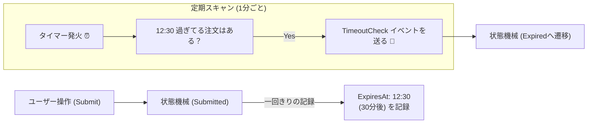
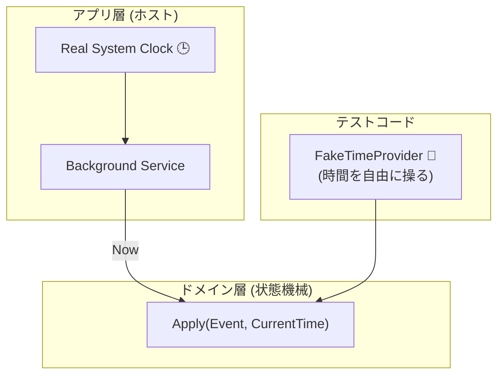
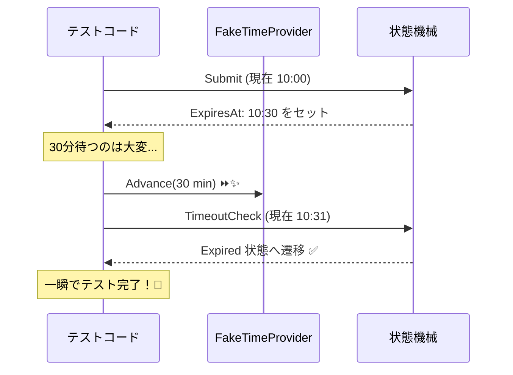

# 第27章：時間で動く（Timeout・期限）⏰✨

〜「放置されたら自動で状態が変わる」を、事故らずに作るよ〜😊💖

---

## 0) この章でできるようになること🎓✨

* 「期限切れ」「自動キャンセル」「タイムアウト」みたいな **“時間で勝手に動く遷移”** を、仕様としてちゃんと設計できる🧾✅
* 実装でありがちな **DateTime.Now 直書き事故** を避けて、テストしやすくする🧪💕
* 期限の発火方法を **3パターン（スキャン／予約／ハイブリッド）** で選べるようになる🧠✨

---

## 1) “時間で動く”って、どういうこと？⏳💡





状態機械って普通は「ユーザー操作（イベント）」で動くよね？👆✨
でも現実は… **放置や期限** があるの🥲

例：学食モバイル注文🍙📱

* **Submitted のまま30分放置** → 自動で **Expired**（期限切れ）⏰
* 支払い中に外部API待ち → しばらく **Processing** → タイムアウトしたら **Failed** 😢
* 調理開始前だけキャンセルOK → 期限過ぎたら不可🚫

こういうのを雑に作ると、**「たまに壊れる」** が発生しがち😵‍💫💥
だからこの章で、ちゃんと型と設計で守るよ🛡️✨

---

## 2) いちばん大事な考え方：時間も“イベント”にする⏰➡️📣

ポイントはこれ👇✨

* **時間は外から渡す**（または `TimeProvider` を注入）と、めちゃ安定する💪✨




`.NET` には **TimeProvider（時間の抽象化）** が用意されてて、テスト可能な時間設計がしやすいよ😊✨ ([Microsoft Learn][1])

---

## 3) 期限には2種類あるよ⏰🧠

## A) 相対期限（Timeout）⌛

「状態に入ってから30分」みたいなやつ

* Submittedに入った時刻 `SubmittedAt`
* `ExpiresAt = SubmittedAt + 30分`

## B) 絶対期限（Deadline）📅

「2026/1/20 12:00まで」みたいなやつ

* `DeadlineAt` をそのまま持つ

💡おすすめは **ExpiresAt（いつまで）を持つ** こと！
理由：復元（永続化）や再起動に強い💾✨（次章にもつながるよ！）

---

## 4) “期限イベント”を発火させる方法 3パターン🎛️✨

## ① 定期スキャン（ポーリング）🔁🕒（初心者におすすめ）

「1分ごとに、期限切れの注文を探してExpiredにする」

* ✅ シンプル
* ✅ 再起動しても平気
* ✅ 大量データでも設計しやすい
* ❌ “ちょうど30分” から少しズレる（1分粒度なら最大1分）

## ② 予約実行（スケジュール）📆⚙️

「Submittedになった瞬間に、30分後のジョブを予約」

* ✅ 正確
* ❌ 永続化やジョブ基盤が必要になりがち（実務向け）

## ③ ハイブリッド🧩✨

「基本は予約、落ちた時の保険でスキャンもする」

* ✅ 実務で強い
* ❌ 実装はちょい重め

この章はまず **①定期スキャン** で “勝てる形” を作るよ😊💕

---

## 5) 実装のコツ：タイマーはアプリ層に置く🧱➡️🏗️

* **状態機械（ドメイン）**：期限切れの判定と遷移だけ担当
* **アプリ層（ホスト/サービス）**：一定間隔で `TimeoutCheck` を投げる担当

バックグラウンド実行は `BackgroundService` が定番だよ🛠️✨ ([Microsoft Learn][2])
定期実行は `PeriodicTimer` が便利で、`.NET 10` のドキュメントもあるよ⏲️✨ ([Microsoft Learn][3])
しかも `PeriodicTimer(TimeSpan, TimeProvider)` みたいに **TimeProvider で時間を注入**できるのが強い！🧪✨ ([Microsoft Learn][4])

---

## 6) ハンズオン：Submittedのまま30分でExpiredへ⏰➡️🪦

## 6-1) ドメインモデル（状態・イベント・結果）📦✨

```csharp
using System;

public enum OrderState
{
    Draft,
    Submitted,
    Paid,
    Expired,
    Cancelled,
}

public interface IOrderEvent;

public sealed record Submit : IOrderEvent;

public sealed record Pay(decimal Amount) : IOrderEvent;

public sealed record TimeoutCheck : IOrderEvent; // “時間が来たか確認してね”イベント

public sealed record Order(
    Guid Id,
    OrderState State,
    DateTimeOffset? SubmittedAt,
    DateTimeOffset? ExpiresAt
)
{
    public static Order Create(Guid id) => new(id, OrderState.Draft, null, null);

    public TransitionResult Apply(IOrderEvent ev, DateTimeOffset nowUtc)
    {
        // ここでは “UTCの現在時刻” が外から渡ってくる前提にするよ🕒✨

        return (State, ev) switch
        {
            (OrderState.Draft, Submit) =>
                TransitionResult.TransitionTo(
                    this with
                    {
                        State = OrderState.Submitted,
                        SubmittedAt = nowUtc,
                        ExpiresAt = nowUtc.AddMinutes(30),
                    },
                    code: "SUBMITTED",
                    message: "注文したよ！30分以内に支払ってね💳✨"
                ),

            (OrderState.Submitted, Pay) when IsExpired(nowUtc) =>
                TransitionResult.Invalid(
                    code: "EXPIRED",
                    message: "ごめんね💦 期限切れで支払えないよ⏰🥲"
                ),

            (OrderState.Submitted, Pay) =>
                TransitionResult.TransitionTo(
                    this with { State = OrderState.Paid },
                    code: "PAID",
                    message: "支払い完了だよ〜！ありがとう😊💖"
                ),

            (OrderState.Submitted, TimeoutCheck) when IsExpired(nowUtc) =>
                TransitionResult.TransitionTo(
                    this with { State = OrderState.Expired },
                    code: "AUTO_EXPIRED",
                    message: "期限切れでExpiredになったよ⏰💤"
                ),

            (OrderState.Submitted, TimeoutCheck) =>
                TransitionResult.Noop(
                    code: "NOT_YET",
                    message: "まだ期限内だよ🙆‍♀️✨"
                ),

            _ =>
                TransitionResult.Invalid(
                    code: "INVALID",
                    message: $"今はその操作できないよ🚫（State={State}）"
                ),
        };
    }

    private bool IsExpired(DateTimeOffset nowUtc)
        => ExpiresAt is not null && nowUtc >= ExpiresAt.Value;
}

public sealed record TransitionResult(
    bool IsSuccess,
    bool IsChanged,
    string Code,
    string Message,
    Order? NewOrder
)
{
    public static TransitionResult TransitionTo(Order newOrder, string code, string message)
        => new(true, true, code, message, newOrder);

    public static TransitionResult Noop(string code, string message)
        => new(true, false, code, message, null);

    public static TransitionResult Invalid(string code, string message)
        => new(false, false, code, message, null);
}
```

## ここ、超えらいポイント💮✨

* 状態機械は **「期限かどうか」だけ** を判断してる🧠
* “時間を進める”のは外側（アプリ層）に任せる🏗️✨
* だからテストが楽になるよ🧪💕

---

## 6-2) 期限チェック用の「定期スキャン」サービス🔁⏲️

`PeriodicTimer` と `BackgroundService` で、10秒ごとに `TimeoutCheck` を投げる例だよ😊✨
（本番は 30秒〜1分 とかが多いよ〜🕒）

```csharp
using System;
using System.Collections.Concurrent;
using System.Collections.Generic;
using System.Linq;
using System.Threading;
using System.Threading.Tasks;
using Microsoft.Extensions.Hosting;
using Microsoft.Extensions.Logging;
using System.Threading;
using System.Threading.Tasks;
using System.Threading;
using System.Threading.Tasks;
using System.Threading;
using System.Threading.Tasks;
using System.Threading;
using System.Threading.Tasks;
using System.Threading;
using System.Threading.Tasks;
using System.Threading;
using System.Threading.Tasks;

public interface IOrderRepository
{
    Task SaveAsync(Order order, CancellationToken ct);
    Task<IReadOnlyList<Order>> ListSubmittedAsync(CancellationToken ct);
}

public sealed class InMemoryOrderRepository : IOrderRepository
{
    private readonly ConcurrentDictionary<Guid, Order> _store = new();

    public Task SaveAsync(Order order, CancellationToken ct)
    {
        _store[order.Id] = order;
        return Task.CompletedTask;
    }

    public Task<IReadOnlyList<Order>> ListSubmittedAsync(CancellationToken ct)
    {
        var list = _store.Values.Where(o => o.State == OrderState.Submitted).ToList();
        return Task.FromResult<IReadOnlyList<Order>>(list);
    }
}

public sealed class TimeoutScannerService : BackgroundService
{
    private readonly IOrderRepository _repo;
    private readonly TimeProvider _time;
    private readonly ILogger<TimeoutScannerService> _logger;

    public TimeoutScannerService(IOrderRepository repo, TimeProvider time, ILogger<TimeoutScannerService> logger)
    {
        _repo = repo;
        _time = time;
        _logger = logger;
    }

    protected override async Task ExecuteAsync(CancellationToken stoppingToken)
    {
        // .NET 10: PeriodicTimer は TimeProvider を渡せるよ🧪✨
        using var timer = new PeriodicTimer(TimeSpan.FromSeconds(10), _time);

        while (await timer.WaitForNextTickAsync(stoppingToken))
        {
            var nowUtc = _time.GetUtcNow();

            var submitted = await _repo.ListSubmittedAsync(stoppingToken);

            foreach (var order in submitted)
            {
                var result = order.Apply(new TimeoutCheck(), nowUtc);

                if (result.IsChanged && result.NewOrder is not null)
                {
                    await _repo.SaveAsync(result.NewOrder, stoppingToken);
                    _logger.LogInformation("Timeout transition: {Code} {Message} OrderId={OrderId}",
                        result.Code, result.Message, order.Id);
                }
            }
        }
    }
}
```

* `BackgroundService` はホスト型のバックグラウンド処理の基本形だよ🧰✨ ([Microsoft Learn][2])
* `PeriodicTimer` は非同期で「次のtick」を待てる定期タイマーだよ⏲️✨ ([Microsoft Learn][3])

---

## 6-3) テスト：FakeTimeProvider で “30分経過” を一瞬で再現🧪⚡

時間ものテストで「30分待つ」とか、無理すぎるよね😂🫠
そこで `FakeTimeProvider` を使うと、**時間を手で進められる**よ✨ ([Microsoft Learn][5])
しかも `Advance(TimeSpan)` で進めるのが公式に用意されてる🕒➡️🕒✨ ([Microsoft Learn][6])



```csharp
using System;
using System.Linq;
using System.Threading;
using System.Threading.Tasks;
using Microsoft.Extensions.Time.Testing;
using Xunit;

public class TimeoutTests
{
    [Fact]
    public async Task Submitted_should_become_Expired_after_30_minutes()
    {
        var fake = new FakeTimeProvider(new DateTimeOffset(2026, 1, 20, 0, 0, 0, TimeSpan.Zero));
        var repo = new InMemoryOrderRepository();

        var id = Guid.NewGuid();
        var order = Order.Create(id);

        // Submit
        var submitted = order.Apply(new Submit(), fake.GetUtcNow()).NewOrder!;
        await repo.SaveAsync(submitted, CancellationToken.None);

        // 31分進める（待たない！）⏩✨
        fake.Advance(TimeSpan.FromMinutes(31));

        var target = (await repo.ListSubmittedAsync(CancellationToken.None)).Single();
        var result = target.Apply(new TimeoutCheck(), fake.GetUtcNow());

        Assert.True(result.IsChanged);
        Assert.Equal(OrderState.Expired, result.NewOrder!.State);
    }
}
```

---

## 7) つまずきポイント集（先に潰す！）🧨🛡️

## 🧯① “期限”はUTC基準が安全

* `DateTimeOffset` + UTC で持つと事故が減るよ🌍✨
* 夏時間とかローカル時計の変更がある世界だと、地味に壊れる🥲

## 🧯② 「タイマーを注文ごとに作る」は危険なことが多い

* 注文が増えるとタイマー大量でしんどい😵‍💫
* まずは **定期スキャン** が堅い💪✨

## 🧯③ 期限チェックとユーザー操作が同時に来る👆⏰💥

* 例：支払いボタン押した瞬間に期限切れチェックが走る
* 仕様として「どっちを勝たせる？」を決めるのが大事🧾✨

  * **“期限到達時刻と比較して判断”** にすると説明しやすいよ😊

---

## 8) AIの使いどころ🤖✨（Copilot / Codex 向け）

そのままコピって使えるやつ置いとくね💖

## ✅ 仕様づくり用🧾

* 「Submitted が Expired になる仕様を、ユーザー向け文言と管理者向け文言の2種類で作って」
* 「期限切れの優先順位（支払いと競合した時）を3案出して、メリデメも書いて」

## ✅ テスト自動生成🧪

* 「遷移表のうち、時間が絡むケース（期限前/期限ちょうど/期限後）をテストケース化して」
* 「FakeTimeProvider を使って、待ち時間ゼロで検証できる形にして」

## ✅ ログ設計📜

* 「期限切れ遷移のログに入れるべき項目をチェックリスト化して（相関ID、期限、現在時刻など）」

---

## 9) 演習（やると一気に身につくよ）🎯✨

## 演習A：仕様🧾

* `Submitted → Expired` の条件を文章で書く（1行でOK）✍️
* 「期限ちょうど（now == ExpiresAt）」は期限切れ扱いにする？しない？決める🤔⏰

## 演習B：実装🔧

* `Expired` になったら「支払い不可」「キャンセル不可」にする🚫
* `Expired` 時のメッセージを「短い/普通/丁寧」の3段階で作る💬✨

## 演習C：テスト🧪

* 期限 **1分前**：`TimeoutCheck` は Noop
* 期限 **ちょうど**：Expired になる
* 期限 **後**：Pay が Invalid になる
  この3本を FakeTimeProvider で作る💖

---

## まとめ🌈✨

* “時間で動く”は、**時間をイベント化**して、ドメインを純粋にすると勝てる😊💪
* 発火はまず **定期スキャン**がラク＆堅い🔁✨
* `.NET` の `TimeProvider` と `PeriodicTimer(TimeProvider)` を使うと、テストもきれいにできるよ🧪💕 ([Microsoft Learn][1])

---

次章（第28章）は「状態を保存して、再起動しても続きから動く💾✨」だよね😊
この章で作った `SubmittedAt / ExpiresAt` が、そのまま活きてくるよ〜！🎉

[1]: https://learn.microsoft.com/en-us/dotnet/standard/datetime/timeprovider-overview?utm_source=chatgpt.com "What is the TimeProvider class - .NET"
[2]: https://learn.microsoft.com/en-us/aspnet/core/fundamentals/host/hosted-services?view=aspnetcore-10.0&utm_source=chatgpt.com "Background tasks with hosted services in ASP.NET Core"
[3]: https://learn.microsoft.com/ja-jp/dotnet/api/system.threading.periodictimer?view=net-10.0&utm_source=chatgpt.com "PeriodicTimer クラス (System.Threading)"
[4]: https://learn.microsoft.com/ja-jp/dotnet/api/system.threading.periodictimer.-ctor?view=net-10.0&utm_source=chatgpt.com "PeriodicTimer コンストラクター (System.Threading)"
[5]: https://learn.microsoft.com/en-us/dotnet/api/microsoft.extensions.time.testing.faketimeprovider?view=net-10.0-pp&utm_source=chatgpt.com "FakeTimeProvider Class (Microsoft.Extensions.Time.Testing)"
[6]: https://learn.microsoft.com/en-us/dotnet/api/microsoft.extensions.time.testing.faketimeprovider.advance?view=net-10.0-pp&utm_source=chatgpt.com "FakeTimeProvider.Advance(TimeSpan) Method"