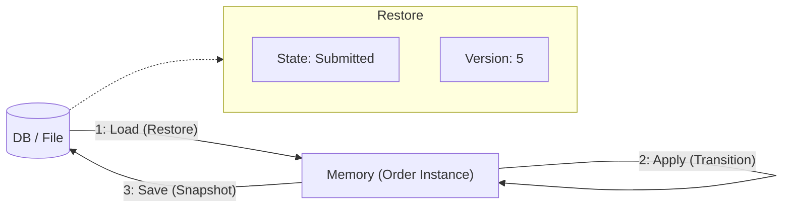
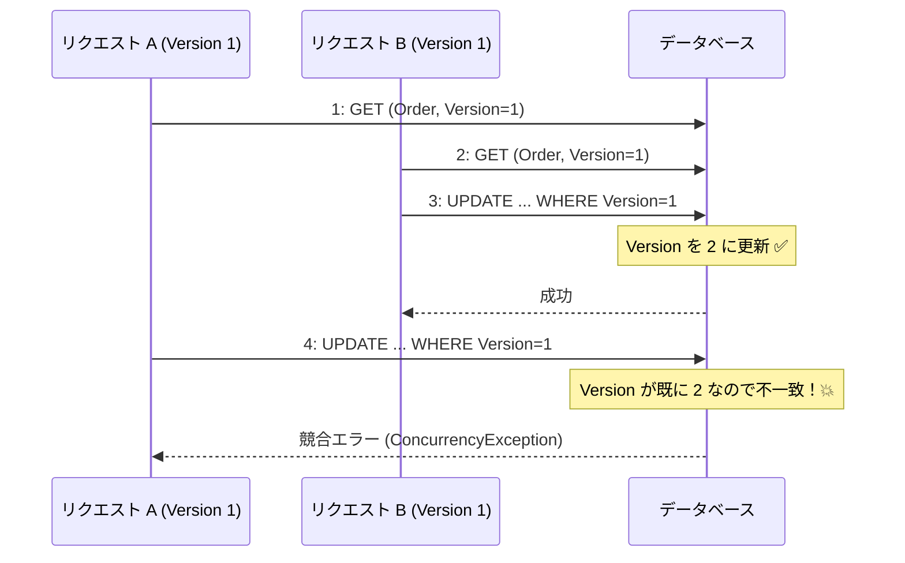
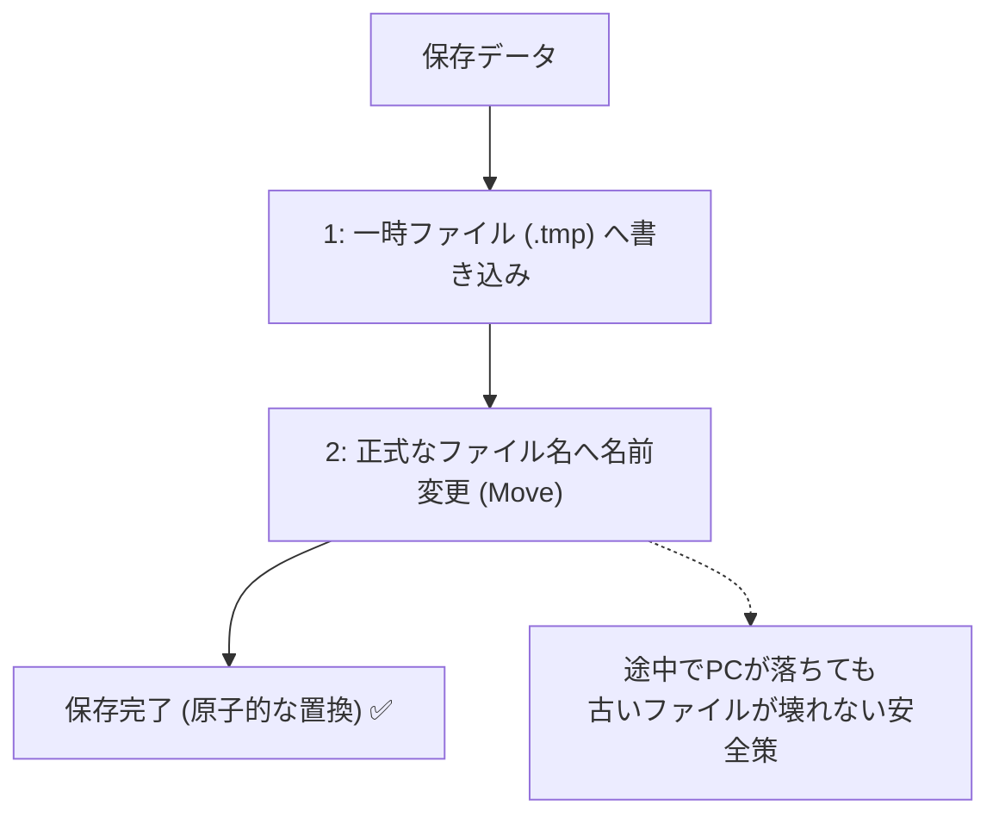

# 第28章：永続化（保存）①：現在状態をDBへ 💾✨

（題材：学食モバイル注文🍙📱）

---

## 0. この章のゴール🎯✨

この章が終わると、こんなことができるようになります😊

* ✅ 注文の「現在の状態（State）」を保存して、アプリ再起動後も続きを動かせる
* ✅ 「保存する最小項目」を自分で決められる
* ✅ “同時更新（更新競合）”が起きても壊れにくい保存ができる（やさしい版）🛡️

---

## 1. なんで保存が必要なの？🤔💡





状態機械って、動いてる間はメモリに状態を持てるけど…

* アプリが落ちた😇
* PC再起動した😇
* サーバー再起動した😇
* 別の処理（別リクエスト）が同じ注文を更新した😇

このとき「今 Ready だったよね？」って続きから再開するには、**状態を外に保存**しておかないと詰みます💥

---

## 2. 保存する“最小項目”って何？📦✨

まずは「現在状態を復元できる」だけに集中します（履歴は次章📜）

**最小セット（おすすめ）✅**

* `OrderId`：どの注文か
* `State`：今どの状態か（例：Paid / Cooking）
* `Version`：更新競合対策の番号（後で超大事！）
* `UpdatedAt`：いつ更新されたか

**余裕があれば（第26章の冪等性と相性◎）🔁**

* `LastIdempotencyKey`（または「処理済みキー集合」）：二重適用を避けたい時に便利

---

## 3. まずは2択！保存先どうする？🗂️✨

この章では、学びやすい順に2つやります😊

1. **JSONファイル保存**：最短で「保存→復元」を体験できる📄✨
2. **SQLite（ローカルDB）＋EF Core**：実務に近い💾✨

EF Core 10 は .NET 10 で動くLTSの世代だよ〜という前提で進めます😊 ([Microsoft Learn][1])
（C# 14 は .NET 10 対応、VS 2026 に .NET 10 が入る流れも公式に書いてあります🪟✨） ([Microsoft Learn][2])

---

## 4. 更新競合（同時更新）ってなに？😵‍💫➡️😊

同じ注文に対して、

* Aさん処理：`Paid` にしたい
* Bさん処理：同時に `Cancel` したい

みたいに「同じ行（注文）を同時に更新」すると、**後勝ちで上書き**になって事故ります💥

そこで使うのが **楽ちん“楽観的ロック（Optimistic Concurrency）”**🛡️✨
やることは超シンプル：

> 保存時に「自分が読んだときの Version と同じなら更新OK、違うなら拒否」

EF Core でも「Concurrency Token」を使ってこの検出ができます😊 ([Microsoft Learn][3])




---

## 実装A：JSONファイルで“保存→復元”を体験📄💾✨

## A-1. スナップショット（保存する形）を作る🧾

```csharp
public enum OrderState
{
    Draft,
    Submitted,
    Paid,
    Cooking,
    Ready,
    PickedUp,
    Cancelled,
    Refunded
}

public sealed record OrderSnapshot(
    Guid OrderId,
    OrderState State,
    int Version,
    DateTimeOffset UpdatedAt,
    string? LastIdempotencyKey = null
);
```

## A-2. 保存先インターフェイス（差し替えできる形）🔌✨

```csharp
public interface IOrderSnapshotStore
{
    Task<OrderSnapshot?> FindAsync(Guid orderId, CancellationToken ct = default);

    // 期待したVersionと一致したら保存OK、一致しなければ false（更新競合）
    Task<bool> TrySaveAsync(OrderSnapshot next, int expectedVersion, CancellationToken ct = default);
}
```

## A-3. JSONファイル実装（原子書き込みで安全寄り）🧯✨

ポイント：

* プロセス内の同時書き込みは `SemaphoreSlim` でガード（超入門版）




```csharp
using System.Text.Json;

public sealed class JsonFileOrderSnapshotStore : IOrderSnapshotStore
{
    private readonly string _dir;
    private readonly SemaphoreSlim _gate = new(1, 1);

    private static readonly JsonSerializerOptions JsonOptions = new()
    {
        WriteIndented = true
    };

    public JsonFileOrderSnapshotStore(string directoryPath)
    {
        _dir = directoryPath;
        Directory.CreateDirectory(_dir);
    }

    private string PathOf(Guid orderId) => System.IO.Path.Combine(_dir, $"{orderId}.json");

    public async Task<OrderSnapshot?> FindAsync(Guid orderId, CancellationToken ct = default)
    {
        var path = PathOf(orderId);
        if (!File.Exists(path)) return null;

        await _gate.WaitAsync(ct);
        try
        {
            await using var fs = File.OpenRead(path);
            return await JsonSerializer.DeserializeAsync<OrderSnapshot>(fs, JsonOptions, ct);
        }
        finally
        {
            _gate.Release();
        }
    }

    public async Task<bool> TrySaveAsync(OrderSnapshot next, int expectedVersion, CancellationToken ct = default)
    {
        var path = PathOf(next.OrderId);
        var tmp = path + ".tmp";

        await _gate.WaitAsync(ct);
        try
        {
            // 現在のVersion確認（なければ 0 扱い）
            var current = await FindUnsafeAsync(next.OrderId, ct);
            var currentVersion = current?.Version ?? 0;

            if (currentVersion != expectedVersion) return false;

            // Version を進めて保存
            var toSave = next with { Version = expectedVersion + 1, UpdatedAt = DateTimeOffset.UtcNow };

            await using (var fs = File.Create(tmp))
            {
                await JsonSerializer.SerializeAsync(fs, toSave, JsonOptions, ct);
            }

            // 原子的に置換（Windowsでも比較的安全）
            File.Move(tmp, path, overwrite: true);
            return true;
        }
        finally
        {
            _gate.Release();
        }
    }

    private async Task<OrderSnapshot?> FindUnsafeAsync(Guid orderId, CancellationToken ct)
    {
        var path = PathOf(orderId);
        if (!File.Exists(path)) return null;

        await using var fs = File.OpenRead(path);
        return await JsonSerializer.DeserializeAsync<OrderSnapshot>(fs, JsonOptions, ct);
    }
}
```

## A-4. 使い方（ロード→遷移→保存）🔁✨

```csharp
public sealed class OrderAppService
{
    private readonly IOrderSnapshotStore _store;

    public OrderAppService(IOrderSnapshotStore store) => _store = store;

    public async Task<string> MarkPaidAsync(Guid orderId, string idempotencyKey, CancellationToken ct = default)
    {
        var current = await _store.FindAsync(orderId, ct)
            ?? new OrderSnapshot(orderId, OrderState.Draft, Version: 0, UpdatedAt: DateTimeOffset.UtcNow);

        // 例：本当は「状態機械のApply」でチェックしてね（ここは章の主題じゃないので簡略😊）
        if (current.State is not (OrderState.Submitted or OrderState.Draft))
            return "今の状態では支払いできないよ〜💦";

        // 次のスナップショット案（Versionは store が進める）
        var next = current with { State = OrderState.Paid, LastIdempotencyKey = idempotencyKey };

        var ok = await _store.TrySaveAsync(next, expectedVersion: current.Version, ct);
        return ok ? "支払いOK！Paidになったよ💳✨" : "更新競合！もう一度読み直してね🙏";
    }
}
```

ここまでで「保存→復元→続きが動く」体験は完成です🎉✨

---

## 実装B：SQLite＋EF Coreで“実務寄り”にする💾📚✨

## B-1. まず入れるNuGet（SQLiteプロバイダ）📦

SQLite を EF Core で使うときは `Microsoft.EntityFrameworkCore.Sqlite` が定番です😊 ([nuget.org][4])

（EF Core 10 は .NET 10 世代のLTSだよ〜も公式で明記されてます） ([Microsoft Learn][1])

## B-2. テーブル（Entity）設計：Versionで更新競合を検出🛡️

SQLiteには SQL Server の `rowversion` みたいな自動更新列がないので、**Versionを自分で増やす方式**が分かりやすいです😊
（EF Core の “Concurrency Token” の考え方自体は公式ドキュメントど真ん中） ([Microsoft Learn][3])

```csharp
using System.ComponentModel.DataAnnotations;

public sealed class OrderRow
{
    [Key]
    public Guid OrderId { get; set; }

    // 読みやすさ優先で文字列に（好みで int でもOK）
    public string State { get; set; } = "Draft";

    // これが更新競合のカギ🗝️
    [ConcurrencyCheck]
    public int Version { get; set; }

    public DateTimeOffset UpdatedAt { get; set; }
    public string? LastIdempotencyKey { get; set; }
}
```

## B-3. DbContext（UseSqlite）🧩✨

```csharp
using Microsoft.EntityFrameworkCore;

public sealed class OrdersDbContext : DbContext
{
    public DbSet<OrderRow> Orders => Set<OrderRow>();

    public OrdersDbContext(DbContextOptions<OrdersDbContext> options) : base(options) { }

    protected override void OnModelCreating(ModelBuilder modelBuilder)
    {
        modelBuilder.Entity<OrderRow>()
            .Property(x => x.State)
            .IsRequired();

        // [ConcurrencyCheck] を付けてるので、これだけでもOK（明示したい人は IsConcurrencyToken でも👌）
        modelBuilder.Entity<OrderRow>()
            .Property(x => x.Version)
            .HasDefaultValue(0);
    }
}
```

## B-4. リポジトリ（ロード→更新→SaveChanges）🔁✨

ここがこの章の本丸です💪💞

* 読んだVersionと同じなら更新
* 違ったら `DbUpdateConcurrencyException` になる → 「競合だよ」って返す

```csharp
using Microsoft.EntityFrameworkCore;

public sealed class EfOrderSnapshotStore : IOrderSnapshotStore
{
    private readonly IDbContextFactory<OrdersDbContext> _factory;

    public EfOrderSnapshotStore(IDbContextFactory<OrdersDbContext> factory)
        => _factory = factory;

    public async Task<OrderSnapshot?> FindAsync(Guid orderId, CancellationToken ct = default)
    {
        await using var db = await _factory.CreateDbContextAsync(ct);

        var row = await db.Orders.AsNoTracking()
            .SingleOrDefaultAsync(x => x.OrderId == orderId, ct);

        if (row is null) return null;

        return new OrderSnapshot(
            row.OrderId,
            Enum.Parse<OrderState>(row.State),
            row.Version,
            row.UpdatedAt,
            row.LastIdempotencyKey
        );
    }

    public async Task<bool> TrySaveAsync(OrderSnapshot next, int expectedVersion, CancellationToken ct = default)
    {
        await using var db = await _factory.CreateDbContextAsync(ct);

        var row = await db.Orders.SingleOrDefaultAsync(x => x.OrderId == next.OrderId, ct);

        if (row is null)
        {
            // 新規作成（expectedVersion は 0 想定）
            if (expectedVersion != 0) return false;

            db.Orders.Add(new OrderRow
            {
                OrderId = next.OrderId,
                State = next.State.ToString(),
                Version = 1,
                UpdatedAt = DateTimeOffset.UtcNow,
                LastIdempotencyKey = next.LastIdempotencyKey
            });

            await db.SaveChangesAsync(ct);
            return true;
        }

        // ここが超大事：期待Versionと違うなら即NG（自前チェックで分かりやすく）
        if (row.Version != expectedVersion) return false;

        // 更新
        row.State = next.State.ToString();
        row.Version = expectedVersion + 1;
        row.UpdatedAt = DateTimeOffset.UtcNow;
        row.LastIdempotencyKey = next.LastIdempotencyKey;

        try
        {
            await db.SaveChangesAsync(ct);
            return true;
        }
        catch (DbUpdateConcurrencyException)
        {
            // EF的に競合検出された場合
            return false;
        }
    }
}
```

---

## 5. “Stateは文字列？int？”のおすすめ判断🍀

* **文字列（"Paid"）**：DB見たとき分かりやすい😊

  * ただし、将来 `Paid` を `PaymentCompleted` に改名すると移行が必要💦
* **int（enum値）**：改名に強い✨

  * ただしDB見ても分かりにくい😵‍💫

迷ったら初心者段階は **文字列**でOK！
運用に入る頃に「変換テーブル」か「int化」を検討するときれいです🌷

---

## 6. よくある落とし穴（先に潰す）🧨➡️😊

* ❌ **Versionを保存してない** → 競合検知できず上書き事故💥
* ❌ **読み込み→時間が経って→保存** で、他の更新が挟まる → Versionで防ぐ🛡️
* ❌ **状態機械ロジックの中でDB保存しちゃう** → テストがつらい😇

  * ✅ 「状態遷移」は純粋に、保存は外（Store/Repo）へ分離が安定✨

---

## 7. 演習（やってみよ〜！）🧪🎮✨

1. ✅ JSON版で、注文を作って `Submitted → Paid → Cooking` を保存して復元
2. ✅ SQLite版で同じこと（DBファイル残るのが嬉しい💾）
3. ✅ 競合テスト：

   * 同じ `OrderId` を2回ロードして
   * 先に片方を保存（Version進む）
   * 後からもう片方を保存 → **false（競合）** になるのを確認🎯

---

## 8. AIの使いどころ🤖✨（超おすすめプロンプト例）

* 「OrderSnapshotStore の JSON保存を、**temp→置換**で安全にして。Version競合も入れて」
* 「EF Core で SQLite を使って、OrderRow を作って。Versionで楽観的同時実行制御も」
* 「DbUpdateConcurrencyException が起きた時の、ユーザー向けメッセージ案を3段階で」

👉 コツ：AIが出したコードは **“Versionがどこで増えるか”**だけ必ず目視チェックしてね👀✨
ここズレると競合がすり抜けます😇

---

## まとめ🎀✨

* 状態機械を“現実に置く”には、**現在状態の保存**が必須💾
* 保存の最小セットは `OrderId / State / Version / UpdatedAt` ✅
* 更新競合は **Version（楽観的ロック）**でやさしく守れる🛡️✨
* まず JSON で体験 → SQLite＋EF Coreで実務寄りにすると理解が爆速🚀

---

次の章（29章）で「履歴（監査ログ）」を残すと、
「なんでそうなったの？」が説明できる“強い状態機械”になります📜💎✨

[1]: https://learn.microsoft.com/en-us/ef/core/what-is-new/ef-core-10.0/whatsnew?utm_source=chatgpt.com "What's New in EF Core 10"
[2]: https://learn.microsoft.com/en-us/dotnet/csharp/whats-new/csharp-14?utm_source=chatgpt.com "What's new in C# 14"
[3]: https://learn.microsoft.com/en-us/ef/core/saving/concurrency?utm_source=chatgpt.com "Handling Concurrency Conflicts - EF Core"
[4]: https://www.nuget.org/packages/microsoft.entityframeworkcore.sqlite?utm_source=chatgpt.com "Microsoft.EntityFrameworkCore.Sqlite 10.0.2"