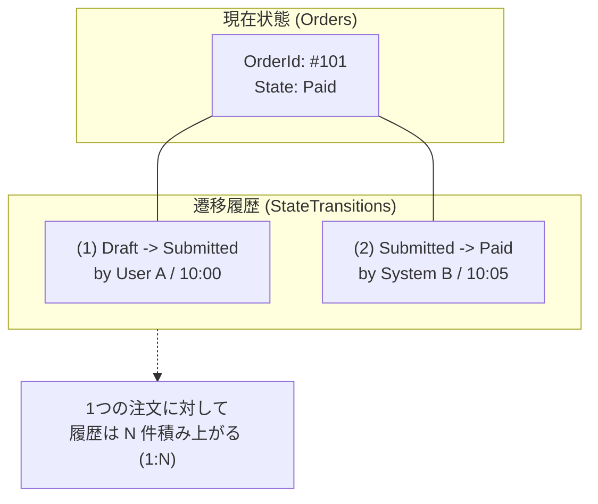
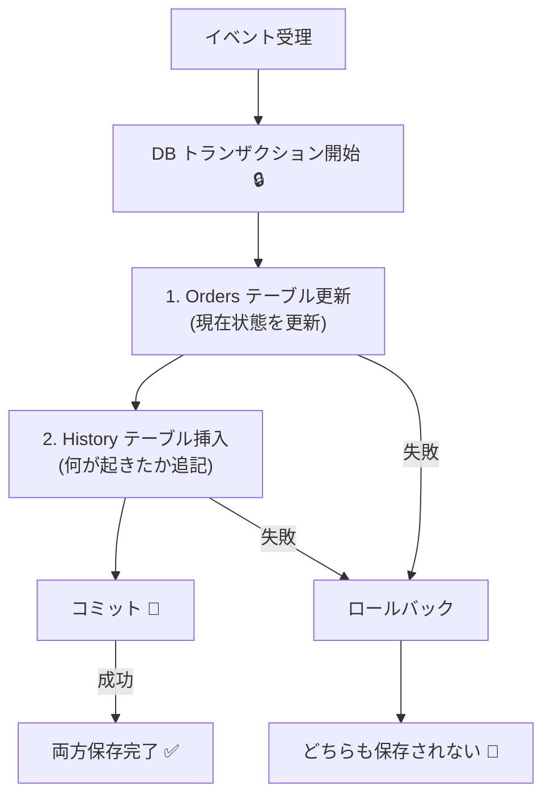
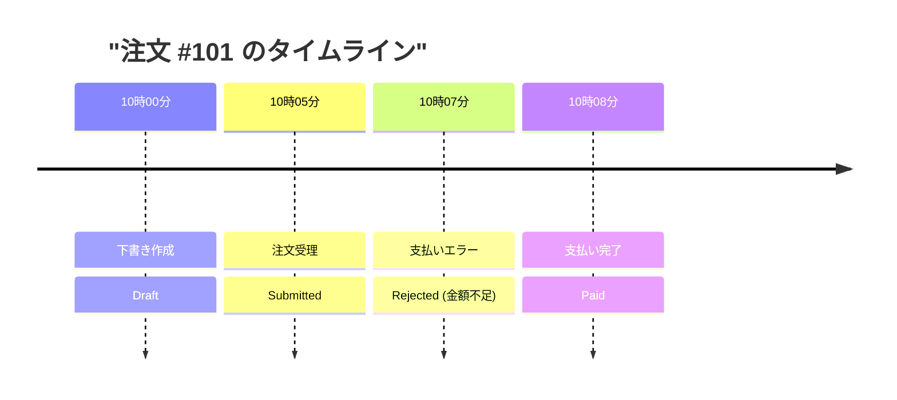

# 第29章：永続化②：履歴（監査ログ）を残す📜✨

〜「なぜそうなった？」をあとから説明できる状態機械へ〜🕵️‍♀️💡

---

## 1. この章でできるようになること🎯💖

この章のゴールはこれ👇✨

* 状態遷移を **“履歴として”** ちゃんと残せる💾📜
* 「いつ・誰が・何をして・どう変わったか」を **タイムライン表示** できる🕰️📱
* “連打”“リトライ”“並行実行”が混ざっても、あとから追えるログ設計ができる🔁🧯

ちなみに今の最新世代は **.NET 10 (LTS)** で、2026-01-13時点だと **10.0.2** が最新パッチです💡 ([Microsoft][1])
EF Core 10 も LTS で、.NET 10 が必要です📦✨ ([Microsoft Learn][2])
C# 14 もこの世代で扱えます🧠✨ ([Microsoft Learn][3])

---

## 2. まず超大事：いま保存してるのは「現在」だけ🧊➡️📜


第28章の保存は、ざっくり言うとこう👇

* 注文（Order）の **“今の状態”** をDBに保存する
  例：`State = Ready`

でもこれだと、問い合わせが来たときに困るの🥺💦

* 「いつ Ready になったの？」
* 「誰が Cancel 押したの？」
* 「Paid のあとに Refunded になった理由は？」

ここで必要なのが **履歴（監査ログ / 監査証跡）** だよ📜✨

---

## 3. 履歴テーブルで答えたい“4つの質問”🧠📝





監査ログって、最低でもこの4つに答えたいの👇✨

1. **いつ**（When）⏰
2. **誰が/何が**（Who/What：ユーザー？システム？）👤🤖
3. **何をした**（Which Event）📣
4. **どう変わった**（From → To）🔁

できれば追加で👇もあると強い💪✨

* **なぜ**（Reason / ErrorCode）🧾
* **相関ID**（CorrelationId：一連の流れを束ねる）🧵
* **冪等キー**（IdempotencyKey：重複イベントを見分ける）🔑

---

## 4. いちばんわかりやすい設計：遷移履歴テーブルを「追記専用」で持つ📌💾


### ✅ 方針：履歴は「更新しない」✋📜

監査ログは基本 **append-only（追記専用）** が安心✨
あとから改ざんできると意味なくなるからね🥺

---

## 5. テーブル設計（おすすめの最小セット）🧱✨

### 5.1 Orders（現在）

* `OrderId`
* `State`（現在状態）
* `UpdatedAtUtc`
* （あると良い）`Version`（楽観的同時実行用）

### 5.2 OrderStateTransitions（履歴）📜

最低限これ👇✨（★＝特に重要）

* `TransitionId`（PK）
* `OrderId`（FK）★
* `OccurredAtUtc`（いつ）★
* `ActorType`（User/System）★
* `ActorId`（誰）★
* `EventName`（何した）★
* `FromState` → `ToState`（どう変わった）★
* `ResultType`（Succeeded / Rejected）★
* `ReasonCode`（禁止遷移や失敗理由のコード）
* `CorrelationId`
* `IdempotencyKey`
* `PayloadJson`（イベントの入力：金額とか）※必要なら
* `SnapshotJson`（その時点の注文スナップショット）※必要なら

### 5.3 インデックスおすすめ🚀

* `(OrderId, OccurredAtUtc)`：タイムライン表示が爆速🕰️
* `UNIQUE(OrderId, IdempotencyKey)`：重複イベント防止に強い🔑

---

## 6. 実装イメージ：状態機械 → 遷移結果 → DBに「現在＋履歴」を同時保存🔁💾


じゃないと「状態だけ更新されたけど履歴がない」事故が起きる😵‍💫💦




---

## 7. C# 実装サンプル（最小で動く形）🧁✨

### 7.1 エンティティ（現在＋履歴）

```csharp
public enum OrderState
{
    Draft, Submitted, Paid, Cooking, Ready, PickedUp, Cancelled, Refunded
}

public sealed class Order
{
    public Guid OrderId { get; set; }
    public OrderState State { get; set; }

    // 楽観的同時実行（軽めのやつ）
    // 更新するたびにアプリ側で +1 する運用でもOK
    public long Version { get; set; }

    public DateTime UpdatedAtUtc { get; set; }
}

public enum ActorType { User, System }
public enum TransitionResultType { Succeeded, Rejected }

public sealed class OrderStateTransition
{
    public long TransitionId { get; set; }                 // 連番が扱いやすい
    public Guid OrderId { get; set; }

    public DateTime OccurredAtUtc { get; set; }
    public ActorType ActorType { get; set; }
    public string ActorId { get; set; } = "";

    public string EventName { get; set; } = "";
    public OrderState FromState { get; set; }
    public OrderState ToState { get; set; }

    public TransitionResultType ResultType { get; set; }
    public string? ReasonCode { get; set; }

    public string? CorrelationId { get; set; }
    public string? IdempotencyKey { get; set; }

    public string? PayloadJson { get; set; }
    public string? SnapshotJson { get; set; }
}
```

---

### 7.2 EF Core のDbContext（SQLiteでもSQL ServerでもOK）

```csharp
using Microsoft.EntityFrameworkCore;

public sealed class AppDbContext : DbContext
{
    public DbSet<Order> Orders => Set<Order>();
    public DbSet<OrderStateTransition> OrderStateTransitions => Set<OrderStateTransition>();

    protected override void OnConfiguring(DbContextOptionsBuilder options)
        => options.UseSqlite("Data Source=app.db"); // まずは手軽に

    protected override void OnModelCreating(ModelBuilder modelBuilder)
    {
        modelBuilder.Entity<Order>()
            .HasKey(x => x.OrderId);

        modelBuilder.Entity<Order>()
            .Property(x => x.Version)
            .IsConcurrencyToken(); // 同時更新検知（EFの基本）:contentReference[oaicite:3]{index=3}

        modelBuilder.Entity<OrderStateTransition>()
            .HasIndex(x => new { x.OrderId, x.OccurredAtUtc });

        modelBuilder.Entity<OrderStateTransition>()
            .HasIndex(x => new { x.OrderId, x.IdempotencyKey })
            .IsUnique();
    }
}
```

> 「同時実行（楽観的同時実行）」は、EF Core だと **Concurrency Token** で扱うのが基本だよ💡 ([Microsoft Learn][4])

---

### 7.3 “遷移させる”メソッド（現在＋履歴を同時に保存）💾🔁

```csharp
using Microsoft.EntityFrameworkCore;

public sealed record TransitionRequest(
    Guid OrderId,
    string EventName,
    string ActorId,
    ActorType ActorType,
    string? CorrelationId,
    string? IdempotencyKey,
    string? PayloadJson
);

public sealed class OrderService
{
    private readonly AppDbContext _db;

    public OrderService(AppDbContext db) => _db = db;

    public async Task<(bool ok, string? reasonCode)> ApplyAsync(TransitionRequest req)
    {
        // すでに同じ冪等キーが保存されてたら「成功扱いで早期リターン」でもOK👌
        if (!string.IsNullOrWhiteSpace(req.IdempotencyKey))
        {
            bool exists = await _db.OrderStateTransitions
                .AnyAsync(x => x.OrderId == req.OrderId && x.IdempotencyKey == req.IdempotencyKey);

            if (exists) return (true, null); // すでに適用済み
        }

        await using var tx = await _db.Database.BeginTransactionAsync();

        var order = await _db.Orders.SingleAsync(x => x.OrderId == req.OrderId);
        var from = order.State;

        // ★ここは本体：状態機械ロジック（例として超簡略）
        (bool can, OrderState to, string? reason) = Decide(from, req.EventName);

        var transition = new OrderStateTransition
        {
            OrderId = order.OrderId,
            OccurredAtUtc = DateTime.UtcNow,
            ActorId = req.ActorId,
            ActorType = req.ActorType,
            EventName = req.EventName,
            FromState = from,
            ToState = can ? to : from,
            ResultType = can ? TransitionResultType.Succeeded : TransitionResultType.Rejected,
            ReasonCode = can ? null : reason,
            CorrelationId = req.CorrelationId,
            IdempotencyKey = req.IdempotencyKey,
            PayloadJson = req.PayloadJson,
            SnapshotJson = null
        };

        _db.OrderStateTransitions.Add(transition);

        if (!can)
        {
            await _db.SaveChangesAsync();
            await tx.CommitAsync();
            return (false, reason);
        }

        order.State = to;
        order.Version += 1;
        order.UpdatedAtUtc = DateTime.UtcNow;

        try
        {
            await _db.SaveChangesAsync();
            await tx.CommitAsync();
            return (true, null);
        }
        catch (DbUpdateConcurrencyException)
        {
            // 同時更新が起きた（連打・並行・二重処理）みたいなケース
            // “競合”として呼び出し元に返すのが実務的👌
            return (false, "CONCURRENCY_CONFLICT");
        }
    }

    private static (bool can, OrderState to, string? reason) Decide(OrderState from, string eventName)
        => (from, eventName) switch
        {
            (OrderState.Draft, "Submit") => (true, OrderState.Submitted, null),
            (OrderState.Submitted, "Pay") => (true, OrderState.Paid, null),
            (OrderState.Submitted, "Cancel") => (true, OrderState.Cancelled, null),

            // 禁止遷移
            (OrderState.Cooking, "Cancel") => (false, from, "CANNOT_CANCEL_AFTER_COOKING"),

            _ => (false, from, "INVALID_TRANSITION"),
        };
}
```

---

---



## 8. タイムライン表示（注文の履歴を“見える化”）🕰️✨


### 8.1 クエリ例（OrderIdの履歴を時系列で取得）

```csharp
public sealed record TimelineItem(
    DateTime OccurredAtUtc,
    string EventName,
    string ActorId,
    ActorType ActorType,
    OrderState From,
    OrderState To,
    TransitionResultType Result,
    string? ReasonCode
);

public static class TimelineQueries
{
    public static async Task<List<TimelineItem>> GetTimelineAsync(AppDbContext db, Guid orderId)
    {
        return await db.OrderStateTransitions
            .Where(x => x.OrderId == orderId)
            .OrderBy(x => x.OccurredAtUtc)
            .Select(x => new TimelineItem(
                x.OccurredAtUtc,
                x.EventName,
                x.ActorId,
                x.ActorType,
                x.FromState,
                x.ToState,
                x.ResultType,
                x.ReasonCode
            ))
            .ToListAsync();
    }
}
```

> これがあるだけで、障害対応がめっちゃ楽になるよ…！🥹💖
> 「再現できない…」が「履歴みればわかる」になる✨

---

## 9. もっと実務っぽく強くするコツ💪📌

### 9.1 時刻は UTC で保存しよう🌍🕰️

* DBには `Utc`、表示でローカル変換が鉄板✨
  （サーバーが増えたり、海外対応が混ざっても壊れにくい）

### 9.2 「スナップショット」vs「差分」どっち？📸🆚🧩

* **差分（From/To + Payload）**：軽い！速い！まずはこれ👌
* **スナップショット（SnapshotJson）**：復元・監査が最強だけど重い📦💦

おすすめは段階的に👇

1. 最初は差分だけ
2. “重要な遷移だけ”スナップショット追加（Paid/Refundedとか）✨

### 9.3 DB機能で履歴を持つ案もあるよ（SQL Server Temporal Tables）🗃️✨


SQL Server には **システムバージョン管理（Temporal Tables）** があって、行の変更履歴を自動で残せるよ💡 ([Microsoft Learn][5])
ただし「誰がやったか」はアプリ側で別途持たないと分からないことが多いので、学習題材としては **アプリの遷移履歴テーブル** が理解しやすいよ👍💕

---

## 10. 演習（この章のミッション）🎮✨

### 演習A：履歴テーブルを追加して“必ず1件残す”📜

* どのイベントでも、成功でも失敗でも、履歴が1件追加されること✅

### 演習B：タイムライン表示🕰️

* `OrderId` を指定すると、履歴が時系列で出る

### 演習C：冪等キーで「重複イベント」を無害化🔑

* 同じ `IdempotencyKey` が来たら二重に履歴を増やさない
* もしくは「増やすけど Result=Rejected にする」でもOK（仕様次第）✨

---

## 11. AIの使いどころ（この章、めっちゃ相性いい🤖💖）

コピペで使える指示例だよ👇✨

* 「この2テーブル（Orders / OrderStateTransitions）を EF Core でマッピングして、SQLite向けの migration を作って」🛠️
* 「OrderIdのタイムライン表示用のDTOとクエリを書いて。並び順とインデックスも提案して」🕰️
* 「監査ログに入れるべき項目チェックリスト作って（相関ID、冪等キー、禁止遷移理由など）」✅
* 「PII（個人情報）が履歴に残りすぎないように、Payload/Snapshotの設計をレビューして」🧼🔒

---

## 12. まとめ🍀✨

この章で入れた “履歴” は、状態機械を **実務投入できる道具** に変えてくれるよ📜💎

* 状態（現在）＝ **今どうなってる？**
* 履歴（監査ログ）＝ **なぜそうなった？**

次の第30章（卒業制作）では、この履歴を使って
「注文の画面にタイムラインを表示」みたいな“それっぽい実務アプリ感”を出せるようになるよ🎓🎉✨

---

次の一手、どっちにする？😊💖

* A：履歴の **SnapshotJson** を「重要遷移だけ」入れる設計に拡張📸✨
* B：履歴を使って「管理画面のタイムラインUI（ConsoleでもOK）」まで作る🕰️📱

[1]: https://dotnet.microsoft.com/en-US/download/dotnet/10.0?utm_source=chatgpt.com "Download .NET 10.0 (Linux, macOS, and Windows) | .NET"
[2]: https://learn.microsoft.com/en-us/ef/core/what-is-new/ef-core-10.0/whatsnew?utm_source=chatgpt.com "What's New in EF Core 10"
[3]: https://learn.microsoft.com/ja-jp/dotnet/csharp/whats-new/csharp-14?utm_source=chatgpt.com "C# 14 の新機能"
[4]: https://learn.microsoft.com/en-us/ef/core/saving/concurrency?utm_source=chatgpt.com "Handling Concurrency Conflicts - EF Core"
[5]: https://learn.microsoft.com/en-us/sql/relational-databases/tables/temporal-tables?view=sql-server-ver17&utm_source=chatgpt.com "Temporal Tables - SQL Server"