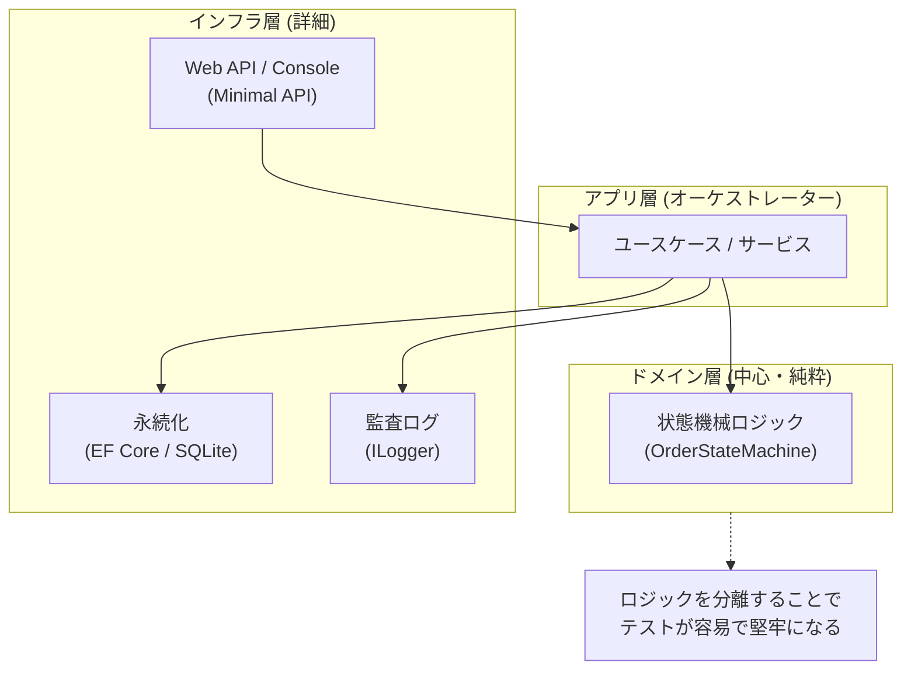
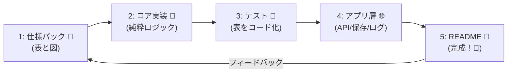
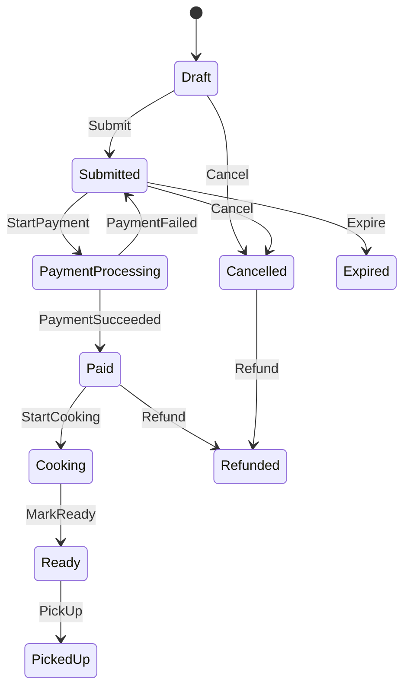

# 第30章：卒業制作🎓🎉（ミニ実務アプリ完成）

※この記事は **2026/01/20 時点の公式ドキュメント・リリース情報**を参照して構成しています🧭✨ ([マイクロソフトサポート][1])

---

## ゴール🎯✨

「状態機械って、**仕様を壊さず育てる道具**なんだ〜！」を、**図・表・コード・テスト・ログ・README**まで一気通貫で “手で作って” 体に入れる章だよ🫶💖

---

## 成果物チェックリスト✅📦

完成したら、これが全部そろってる状態！

* [ ] 状態一覧／イベント一覧（1行説明つき）🗂️
* [ ] 遷移表（禁止も含む）📊
* [ ] 遷移図（MermaidでOK）🗺️
* [ ] 実装（Console か Web API）💻🌐
* [ ] 単体テスト（遷移表ベースでデータ駆動）🧪
* [ ] 遷移ログ（旧→新、イベント、理由、相関ID）📜
* [ ] README（使い方・仕様・禁止遷移の理由）📝

---

## 作り方の全体像（迷子防止マップ）🗺️✨





6. **README**で “人に渡せる” 形にする




---

## 1) 仕様パック（この章の心臓🫀）🧾✨

## 状態一覧（例）🏷️

> まずは “学食モバイル注文” を最後まで通すのに十分な数だけ！増やすのは後でOK😊

* Draft：下書き
* Submitted：注文確定（まだ未払い）
* PaymentProcessing：支払い処理中（外部待ち）⏳
* Paid：支払い完了
* Cooking：調理中
* Ready：受け取り可
* PickedUp：受取済
* Cancelled：キャンセル
* Refunded：返金済
* Expired：期限切れ（例：Submittedから30分）⏰

## イベント一覧（例）📣

* Submit
* StartPayment（Amount, IdempotencyKey）🔑
* PaymentSucceeded（TxnId）✅
* PaymentFailed（Reason）❌
* StartCooking
* MarkReady
* PickUp
* Cancel（Reason）🚫
* Refund（Reason）💸
* Expire（期限イベント）⏰

---

## 遷移（許可だけ並べるとスッキリ）📊✨

| From              | Event            | Guard（条件） | To                | メモ          |
| ----------------- | ---------------- | --------- | ----------------- | ----------- |
| Draft             | Submit           | 明細が1件以上   | Submitted         | 不変条件にするのも◎  |
| Submitted         | StartPayment     | 金額>0      | PaymentProcessing | 冪等キー必須🔑    |
| PaymentProcessing | PaymentSucceeded | TxnIdあり   | Paid              | 支払日時セット     |
| PaymentProcessing | PaymentFailed    |           | Submitted         | “再支払いOK”に戻す |
| Paid              | StartCooking     |           | Cooking           | 厨房へ通知は副作用へ  |
| Cooking           | MarkReady        |           | Ready             |             |
| Ready             | PickUp           |           | PickedUp          |             |
| Draft/Submitted   | Cancel           | 調理前       | Cancelled         | 調理開始後は不可    |
| Paid/Cancelled    | Refund           | 返金条件OK    | Refunded          | “返金済”は終端に近い |
| Submitted         | Expire           | 期限超え      | Expired           | 時間で動く⏰      |

禁止遷移は “例外” じゃなく “仕様” にして、理由コードを付けるのがおすすめだよ🫶
（例：Cooking中のCancelは `ORDER_ALREADY_COOKING`）✨

---

## 遷移図（Mermaid）🗺️✨

READMEに貼ると一気にプロっぽい〜！



---

## 2) コア実装（UIなしで動く状態機械）🧱✨

ここができると、**ConsoleでもWeb APIでも同じロジック**が使えて強いよ💪💖

## 2-1. 状態・イベント型（シンプルにrecordでOK）📦

```csharp
public enum OrderState
{
    Draft,
    Submitted,
    PaymentProcessing,
    Paid,
    Cooking,
    Ready,
    PickedUp,
    Cancelled,
    Refunded,
    Expired
}

public interface IOrderEvent;

public sealed record Submit() : IOrderEvent;

public sealed record StartPayment(decimal Amount, string IdempotencyKey) : IOrderEvent;
public sealed record PaymentSucceeded(string TxnId) : IOrderEvent;
public sealed record PaymentFailed(string Reason) : IOrderEvent;

public sealed record StartCooking() : IOrderEvent;
public sealed record MarkReady() : IOrderEvent;
public sealed record PickUp() : IOrderEvent;

public sealed record Cancel(string Reason) : IOrderEvent;
public sealed record Refund(string Reason) : IOrderEvent;

public sealed record Expire() : IOrderEvent;
```

## 2-2. 結果型（例外地獄を避ける✅❌）

```csharp
public sealed record TransitionError(string Code, string Message);

public sealed record TransitionResult(
    bool IsSuccess,
    OrderState Current,
    OrderState? Next,
    TransitionError? Error,
    string CorrelationId
)
{
    public static TransitionResult Ok(OrderState current, OrderState next, string corr)
        => new(true, current, next, null, corr);

    public static TransitionResult Fail(OrderState current, string code, string msg, string corr)
        => new(false, current, null, new(code, msg), corr);
}
```

## 2-3. 注文モデル（状態＋監査に必要な最小だけ）🍙

```csharp
public sealed class Order
{
    public Guid Id { get; init; } = Guid.NewGuid();
    public OrderState State { get; private set; } = OrderState.Draft;

    // 監査・競合対策（簡易）
    public int Version { get; private set; } = 0;

    // 支払い関連（例）
    public decimal? PaidAmount { get; private set; }
    public DateTimeOffset? PaidAt { get; private set; }
    public string? LastPaymentTxnId { get; private set; }

    // 冪等（直近キーだけの最小例。実務は保持方法を検討）
    public HashSet<string> AppliedIdempotencyKeys { get; } = new();

    public void ApplySideEffects(OrderState from, OrderState to, IOrderEvent ev)
    {
        // ここにはI/Oを書かない！「副作用の種類を列挙」するくらいに留めると強い✨
    }

    public void Commit(OrderState next)
    {
        State = next;
        Version++;
    }

    public void MarkPaid(decimal amount, string txnId)
    {
        PaidAmount = amount;
        PaidAt = DateTimeOffset.UtcNow;
        LastPaymentTxnId = txnId;
    }
}
```

---

## 3) 遷移テーブル駆動（表→コードの直結🔁✨）

辞書で “遷移表そのもの” を表すよ📚✨（第17章の集大成！）

```csharp
public sealed class OrderStateMachine
{
    private readonly Dictionary<(OrderState State, Type EventType), Func<Order, IOrderEvent, (bool ok, OrderState next, TransitionError? err)>> _rules;

    public OrderStateMachine()
    {
        _rules = new()
        {
            {(OrderState.Draft, typeof(Submit)), (o, e) =>
                HasAtLeastOneItem(o)
                    ? (true, OrderState.Submitted, null)
                    : (false, o.State, new("ORDER_EMPTY", "明細がないので注文できません🥺"))},

            {(OrderState.Submitted, typeof(StartPayment)), (o, e) =>
            {
                var ev = (StartPayment)e;
                if (ev.Amount <= 0) return (false, o.State, new("PAY_AMOUNT_INVALID", "金額が不正です💦"));
                if (!TryApplyIdempotency(o, ev.IdempotencyKey))
                    return (false, o.State, new("DUPLICATE_EVENT", "同じ支払い要求が二重に来ています🔁"));
                return (true, OrderState.PaymentProcessing, null);
            }},

            {(OrderState.PaymentProcessing, typeof(PaymentSucceeded)), (o, e) =>
            {
                var ev = (PaymentSucceeded)e;
                if (string.IsNullOrWhiteSpace(ev.TxnId))
                    return (false, o.State, new("TXN_REQUIRED", "取引IDがありません💦"));
                o.MarkPaid(o.PaidAmount ?? 0m, ev.TxnId);
                return (true, OrderState.Paid, null);
            }},

            {(OrderState.PaymentProcessing, typeof(PaymentFailed)), (o, e) =>
                (true, OrderState.Submitted, null)},

            {(OrderState.Paid, typeof(StartCooking)), (o, e) =>
                (true, OrderState.Cooking, null)},

            {(OrderState.Cooking, typeof(MarkReady)), (o, e) =>
                (true, OrderState.Ready, null)},

            {(OrderState.Ready, typeof(PickUp)), (o, e) =>
                (true, OrderState.PickedUp, null)},

            {(OrderState.Draft, typeof(Cancel)), (o, e) => (true, OrderState.Cancelled, null)},
            {(OrderState.Submitted, typeof(Cancel)), (o, e) => (true, OrderState.Cancelled, null)},

            {(OrderState.Paid, typeof(Refund)), (o, e) => (true, OrderState.Refunded, null)},
            {(OrderState.Cancelled, typeof(Refund)), (o, e) => (true, OrderState.Refunded, null)},

            {(OrderState.Submitted, typeof(Expire)), (o, e) => (true, OrderState.Expired, null)},
        };
    }

    public TransitionResult TryApply(Order order, IOrderEvent ev, string correlationId)
    {
        var key = (order.State, ev.GetType());
        if (!_rules.TryGetValue(key, out var rule))
        {
            return TransitionResult.Fail(order.State, "TRANSITION_FORBIDDEN",
                $"その操作は今の状態（{order.State}）ではできません🚫", correlationId);
        }

        var (ok, next, err) = rule(order, ev);
        if (!ok)
        {
            return TransitionResult.Fail(order.State, err!.Code, err.Message, correlationId);
        }

        var from = order.State;
        order.ApplySideEffects(from, next, ev);
        order.Commit(next);
        return TransitionResult.Ok(from, next, correlationId);
    }

    private static bool HasAtLeastOneItem(Order o) => true; // ここは題材に合わせて実装してね😊

    private static bool TryApplyIdempotency(Order o, string key)
    {
        if (string.IsNullOrWhiteSpace(key)) return false;
        return o.AppliedIdempotencyKeys.Add(key);
    }
}
```

---

## 4) ログ（遷移ログは宝物📜💎）

ログは “あとで自分を助けるタイムマシン” だよ🕰️✨
.NETのログは `ILogger` が基本になるよ〜！ ([Microsoft Learn][2])

**出したい項目（最低ライン）✅**

* CorrelationId（相関ID）
* OrderId
* Event
* FromState → ToState
* 成功/失敗
* 失敗なら Code と Message

（Consoleなら `Console.WriteLine` でもOKだけど、将来のためにILoggerに寄せると強いよ💪）

---

## 5) 単体テスト（遷移表→テスト化が最強🧪✨）

`dotnet test` の体験は .NET 10 でも公式に整理されてるよ〜！ ([Microsoft Learn][3])
（.NET 10 では Microsoft.Testing.Platform という新しいモードも入ったけど、まずはテンプレのままでもOK🙆‍♀️）

## テストケースを “データ” にする🎲

```csharp
public static class TransitionCases
{
    public static IEnumerable<object[]> ValidTransitions()
    {
        yield return Case(OrderState.Draft, new Submit(), OrderState.Submitted);
        yield return Case(OrderState.Submitted, new StartPayment(500, "idem-001"), OrderState.PaymentProcessing);
        yield return Case(OrderState.PaymentProcessing, new PaymentFailed("NG"), OrderState.Submitted);
        yield return Case(OrderState.PaymentProcessing, new PaymentSucceeded("txn-001"), OrderState.Paid);
        yield return Case(OrderState.Paid, new StartCooking(), OrderState.Cooking);
    }

    public static IEnumerable<object[]> ForbiddenTransitions()
    {
        yield return Forbidden(OrderState.Cooking, new Cancel("やっぱり…"), "TRANSITION_FORBIDDEN");
        yield return Forbidden(OrderState.Ready, new StartPayment(500, "idem-zzz"), "TRANSITION_FORBIDDEN");
    }

    private static object[] Case(OrderState from, IOrderEvent ev, OrderState to)
        => new object[] { from, ev, to };

    private static object[] Forbidden(OrderState from, IOrderEvent ev, string code)
        => new object[] { from, ev, code };
}
```

## xUnitでデータ駆動テスト🧪✨

```csharp
using Xunit;

public sealed class OrderStateMachineTests
{
    [Theory]
    [MemberData(nameof(TransitionCases.ValidTransitions), MemberType = typeof(TransitionCases))]
    public void Valid_transition_should_succeed(OrderState from, IOrderEvent ev, OrderState expectedTo)
    {
        var order = new Order();
        ForceState(order, from);

        var sm = new OrderStateMachine();
        var result = sm.TryApply(order, ev, correlationId: "test-corr");

        Assert.True(result.IsSuccess);
        Assert.Equal(expectedTo, order.State);
    }

    [Theory]
    [MemberData(nameof(TransitionCases.ForbiddenTransitions), MemberType = typeof(TransitionCases))]
    public void Forbidden_transition_should_fail(OrderState from, IOrderEvent ev, string expectedCode)
    {
        var order = new Order();
        ForceState(order, from);

        var sm = new OrderStateMachine();
        var result = sm.TryApply(order, ev, correlationId: "test-corr");

        Assert.False(result.IsSuccess);
        Assert.Equal(expectedCode, result.Error!.Code);
        Assert.Equal(from, order.State);
    }

    private static void ForceState(Order order, OrderState state)
    {
        // 章の都合でテスト補助。実務なら内部コンストラクタやFactoryで調整するのが◎
        var field = typeof(Order).GetProperty(nameof(Order.State))!;
        field.SetValue(order, state);
    }
}
```

---

## 6) Web API版（選択）🌐✨

Consoleで完成したら、同じコアを使ってAPIにするのも超おすすめ！

## 6-1. “今どきテンプレ事情”だけ押さえる✍️

* `dotnet new webapi` は、指定しないと **最小限API（Minimal API）** が作られるよ ([Microsoft Learn][4])
* OpenAPIは ASP.NET Core に **組み込みサポート**がある（UIは別途） ([Microsoft Learn][5])
* .NET 10 で Minimal API の **バリデーションサポート**が入ったよ ([Microsoft Learn][6])

## 6-2. 状態不一致は 409 Conflict（超それっぽい）⚔️

`Results.Conflict(...)` / `TypedResults.Conflict(...)` が公式で用意されてるよ ([Microsoft Learn][7])
409の意味も “リソース状態との衝突” って定義されてるのが強い🫶 ([rfc-editor.org][8])

（例）禁止遷移なら 409 でエラー本体を返す：

```csharp
app.MapPost("/orders/{id:guid}/submit", (Guid id) =>
{
    // 読み込み → state machine → 保存（省略）
    var result = /* TryApply(...) */ default(TransitionResult);

    return result.IsSuccess
        ? Results.Ok(result)
        : Results.Conflict(result.Error); // 409
});
```

## 6-3. エラーは ProblemDetails に寄せると実務っぽい🧠✨

APIのエラー応答を標準化するなら ProblemDetails が王道だよ〜！ ([Microsoft Learn][9])

---

## 7) READMEテンプレ（そのまま貼れる📝✨）

READMEは「未来の自分」と「初見の人」へのラブレター💌

**入れる章立ておすすめ**

1. これは何？（1〜2行）
2. 仕様（状態一覧／イベント一覧）
3. 遷移表（許可・禁止・理由コード）
4. 遷移図（Mermaid）
5. 実行方法（Console or API）
6. テスト実行方法
7. ログの見方（CorrelationIdで追える）

---

## AI活用（この章の“勝ち筋”🤖✨）

### ① 遷移表→テスト自動生成🧪

* 「この遷移表を xUnit の MemberData に変換して」
* 「禁止遷移は 409 相当のコードで返す想定で、失敗コード一覧も作って」

### ② READMEレビュー📝

* 「初学者が読んで詰まる箇所を指摘して、言い換え案も出して」
* 「仕様とコードのズレが起きそうな点をチェックして」

### ③ “設計の穴”検出🔍

* 「この状態遷移で、デッドエンドや到達不能状態ある？」
* 「冪等キーの扱い、最小実装として危ない点ある？」

---

## よくあるつまずきポイント（先に潰す💥➡️😊）

* **状態とイベントが増えすぎる** → まずは “通す” 最小を完成させてから追加！🌱
* **I/Oがコアに混ざる** → コアは “判断だけ”。通知や保存は外へ🚪
* **禁止遷移を例外で落とす** → 仕様として `Result.Fail(code, message)` が優しい🫶
* **テストが手作業で辛い** → 遷移表を “データ化” して自動量産🎯

---

## おまけ：C# 14 の「存在だけ」知っておく📌✨

この章のコードは基本機能で十分だけど、C# 14 では拡張メンバー等いろいろ入ってるよ〜（興味出たら見る枠👀） ([Microsoft Learn][10])

---

## 発展（選択）🌟

* ライブラリ比較：**Stateless** を入れて “書き味” を比べる📚 ([GitHub][11])
* APIをより実務っぽく：ProblemDetails＋バリデーション整備🧠 ([Microsoft Learn][6])
* ログを強化：構造化ログで “検索しやすいログ” に🧾 ([Microsoft Learn][2])

---

ここまでできたら、もう完全に「状態機械で仕様を守って育てる」側の人だよ🎓💖
次の一手としては、**Console完成版**を **Web API化**して、`200/409` をちゃんと返すところまで行くのが気持ちいい〜！✨

[1]: https://support.microsoft.com/en-us/topic/-net-10-0-update-january-13-2026-64f1e2a4-3eb6-499e-b067-e55852885ad5?utm_source=chatgpt.com ".NET 10.0 Update - January 13, 2026"
[2]: https://learn.microsoft.com/en-us/dotnet/core/extensions/logging?utm_source=chatgpt.com "Logging in C# - .NET"
[3]: https://learn.microsoft.com/ja-jp/dotnet/core/testing/unit-testing-with-dotnet-test?utm_source=chatgpt.com "'dotnet test' を使用したテスト - .NET"
[4]: https://learn.microsoft.com/ja-jp/dotnet/core/tools/dotnet-new-sdk-templates "'dotnet new' の .NET の既定のテンプレート - .NET CLI | Microsoft Learn"
[5]: https://learn.microsoft.com/ja-jp/aspnet/core/fundamentals/openapi/aspnetcore-openapi?view=aspnetcore-10.0 "OpenAPI ドキュメントを生成する | Microsoft Learn"
[6]: https://learn.microsoft.com/en-us/aspnet/core/fundamentals/minimal-apis/responses?view=aspnetcore-10.0&utm_source=chatgpt.com "Create responses in Minimal API applications"
[7]: https://learn.microsoft.com/en-us/dotnet/api/microsoft.aspnetcore.http.results.conflict?view=aspnetcore-10.0&utm_source=chatgpt.com "Results.Conflict Method (Microsoft.AspNetCore.Http)"
[8]: https://www.rfc-editor.org/rfc/rfc9110.html?utm_source=chatgpt.com "RFC 9110: HTTP Semantics"
[9]: https://learn.microsoft.com/en-us/aspnet/core/fundamentals/error-handling-api?view=aspnetcore-10.0&utm_source=chatgpt.com "Handle errors in ASP.NET Core APIs"
[10]: https://learn.microsoft.com/en-us/dotnet/csharp/whats-new/csharp-14 "What's new in C# 14 | Microsoft Learn"
[11]: https://github.com/dotnet-state-machine/stateless?utm_source=chatgpt.com "dotnet-state-machine/stateless: A simple library for creating ..."