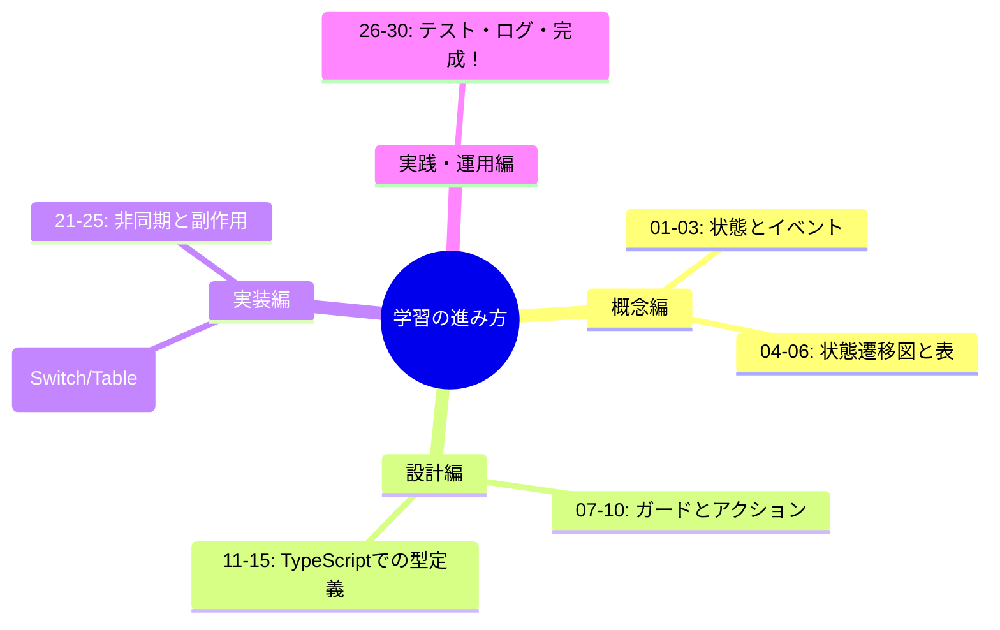

# 第01章：この教材のゴールと全体像🎯

## 1) この章で「できるようになること」🌸

この章のゴールは、ズバリこれ👇

* 状態機械（State Machine）って何を解決するのか、イメージで説明できる😊
* 最終成果物（フォーム送信）を「状態」と「イベント」に分けて、ざっくり設計メモを作れる📝
* AIに“良い質問”を投げて、設計の抜け漏れを減らせる🤖✨

---

## 2) そもそも状態機械って何がうれしいの？🚦💖

アプリって、だいたい「流れ」がありますよね👇

* 入力する → 送信する → 成功/失敗 → もう一回/戻る

この「流れ」を、**状態（いま何してる？）** と **イベント（何が起きた？）** で整理して、
**“ありえない動き”を最初から潰していく**のが状態機械だよ〜😊🧯

結果として👇

* if文が増えてグチャグチャ…を防げる😵‍💫
* バグの温床「想定外ルート」を減らせる🕵️‍♀️
* テストが作りやすくなる🧪✨

---

## 3) 最終ゴール：フォーム送信を「バグりにくく」完成させる📨🎉

この教材の最終成果物は、わかりやすい題材にします👇

**フォーム送信（成功 / 失敗 / リトライ）**

たとえば「お問い合わせフォーム」みたいな感じ💌

* 入力中（編集できる）
* 送信中（ボタン連打できない）
* 成功（完了メッセージ）
* 失敗（エラー表示＋再試行）

ここが“状態”で整理できると、強いんだよね💪✨

---

## 4) 完成イメージ（この章の成果物）📝✨

この章では、コードはまだ頑張らなくてOK🙆‍♀️
まずは **「完成イメージメモ」** を作ります！

### ✅ 状態の候補（例）

* Idle（まだ何もしてない）
* Editing（入力中）
* Submitting（送信中）
* Success（成功）
* Error（失敗）

### ✅ イベントの候補（例）

* INPUT_CHANGED（入力が変わった）
* SUBMIT（送信ボタン押した）
* SUBMIT_OK（送信成功）
* SUBMIT_NG（送信失敗）
* RETRY（再試行）
* RESET（最初から）

### ✅ 画面のふるまいメモ（例）

* Editing：送信ボタンは押せる✅
* Submitting：入力欄と送信ボタンは無効🚫（二重送信防止）
* Error：エラーメッセージ表示＋Retryボタン表示🔁
* Success：完了メッセージ＋Reset表示🎉

この1枚があるだけで、次の章からめちゃ進みやすいよ😊✨

---

## 5) “最新”の道具事情を軽く把握しとこ🧰✨

この教材は「いま普通に手に入る前提」で進めます。参考までに、公式情報だと👇

* TypeScript は公式サイト上で「最新は 5.9」と案内されています。([typescriptlang.org][1])
* Node.js は v24 が Active LTS（本番向けの主力）として案内されています。([Node.js][2])
* VS Code は 2026年1月の Insiders 更新が継続していて、直近更新日も公開されています。([code.visualstudio.com][3])
* さらに将来の話として、TypeScript のネイティブ実装プレビュー（高速化の流れ）も公式から出ています。([Microsoft Developer][4])

※ここは「へぇ〜そうなんだ」くらいでOK！この章の本題は設計イメージ作りだよ🧸✨

---

## 6) この教材の進み方（全体像）🗺️✨

30章ぜんぶを一言でまとめると、こう👇

1. **状態機械の考え方を体に入れる**（身近な例・手書き）🐣
2. **表と図で、抜け漏れを潰す**（遷移表・遷移図）📋🧭
3. **イベント/ガード/アクションで運用できる形にする**📣🛡️🧰
4. **TypeScriptの型で守る**（State/Event/Context）🔒
5. **実装→非同期→テスト→ログまで仕上げる**🧪🔍

第1章は、この旅の「地図」を持つ章だよ😊🗺️

---

## 7) AIの使いどころ（第1章版）🤖✨

AIは、**答えを丸写し**じゃなくて
**“抜け漏れを見つける相棒”**にすると最強👍💖

### 使えるプロンプト例（コピペOK）📌

* 「フォーム送信の仕様を、状態とイベントに分解して候補を出して」
* 「禁止遷移になりそうな操作（やっちゃダメ）を洗い出して」
* 「状態が多すぎ/少なすぎになってないかレビューして。理由も」

---

## 8) 今日のミニ課題（5〜15分）⏱️🎀

ノートでもメモ帳でもOK！これを書いてください👇

### 📝 完成イメージメモ（テンプレ）

* 作りたいもの：フォーム送信（成功/失敗/リトライ）
* ## 状態（5つくらい）：

  *
  *
* ## イベント（6つくらい）：

  *
  *
* 送信中（Submitting）のルール：

  * ボタン連打は？
  * 入力はできる？
* 失敗（Error）のルール：

  * 何を表示する？
  * Retryは何回まで？（仮でOK）

「仮」でいいよ！完璧にしないでOK🙆‍♀️✨
次の章でどんどん整えていくからね😊

---

## 9) セルフチェック✅✨

* 状態は「いま何してる？」になってる？（動詞っぽくなりすぎてない？）👀
* イベントは「何が起きた？」になってる？📣
* Submitting中に“できちゃダメ”な操作を1つ言える？🚫

---

次の第2章で、迷子にならないミニ土台（実行・整形・テスト）を作って、
第3章から一気に「状態で世界を見る👀✨」に入っていこうね〜🚦💖

[1]: https://www.typescriptlang.org/download/ "TypeScript: How to set up TypeScript"
[2]: https://nodejs.org/en/about/previous-releases "Node.js — Node.js Releases"
[3]: https://code.visualstudio.com/updates/v1_109 "January 2026 Insiders (version 1.109)"
[4]: https://developer.microsoft.com/blog/typescript-7-native-preview-in-visual-studio-2026?utm_source=chatgpt.com "TypeScript 7 native preview in Visual Studio 2026"
