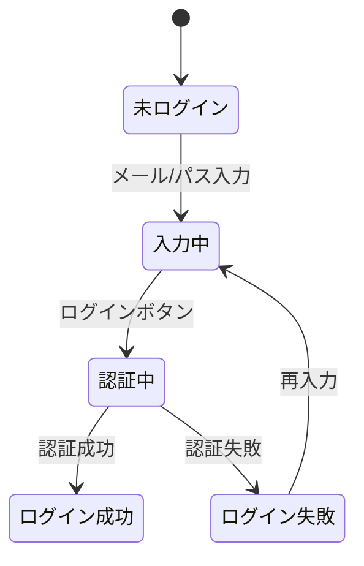

# 第03章：状態機械ってなに？（超入門）🚦

## この章のゴール🎯

この章が終わったら、あなたはこうなれます😊💖

* 「状態（State）」と「イベント（Event）」を言葉で説明できる🗣️✨
* 身近な例を **状態→イベント→次状態** に分解できる🔍🧩
* 例題3つ（信号🚥・自販機🥤・ログイン🔐）のミニメモが完成する📝🎉

---

## 1) 状態機械を一言でいうと？🧸💡

状態機械（State Machine）ってね、超ざっくり言うと…

**「いまの状態」を持っていて、何か（イベント）が起きたら、決まったルールで次の状態に移る仕組み** です🚦➡️🚦✨

ポイントはこれ👇

* **状態（State）**：いまどういう状況？（例：赤信号、投入待ち、ログイン中）
* **イベント（Event）**：何が起きた？（例：時間が来た、100円入れた、ログイン押した）
* **遷移（Transition）**：イベントで状態が変わるルール（例：赤→青）

「流れ」を **ルール化** するから、あとで見返しても迷子になりにくいんだ〜😊🧭✨

---

## 2) まずは超重要：状態とイベントの見分け方👀✨

ここ、最初に掴むと一気にラクになります💪🌸

## ✅ 状態（State）っぽい言葉

* 「〜中」「〜待ち」「〜済み」「〜できる/できない」
* 例：送信中📨⏳、入力中⌨️、購入可能🛒✅

## ✅ イベント（Event）っぽい言葉

* 「〜した」「〜が起きた」「〜になった」
* 例：ボタン押した🖱️、タイムアウトした⏰、通信成功した📡✅

迷ったら、魔法の質問🪄

* 状態👉 **「いま、何の時間？」**
* イベント👉 **「何が起きたの？」**

---

## 3) 例で体に入れよう① 信号機🚥✨


「信号」は状態機械の王道サンプルです😊

## 状態（State）

* 赤🔴
* 青🟢
* 黄🟡

## イベント（Event）

* 一定時間が経過した⏱️

## 遷移（Transition）メモ

* 赤🔴 ＋ 時間⏱️ → 青🟢
* 青🟢 ＋ 時間⏱️ → 黄🟡
* 黄🟡 ＋ 時間⏱️ → 赤🔴

**ルールが固定**だから、if を増やさなくても破綻しない🙆‍♀️✨

---

## 4) 例で体に入れよう② 自販機🥤🪙✨

自販機は「状態＋イベント」で考えると超キレイに整理できます🎀

## 状態（State）例

* 待機中（お金入ってない）🧍‍♀️
* 入金中（お金は入ってる）🪙
* 商品排出中🥤
* おつり返却中💰

## イベント（Event）例

* お金を入れた🪙
* 商品ボタンを押した🔘
* 在庫がなかった😢
* 返却レバーを引いた↩️

## 遷移（Transition）メモ例

* 待機中 →（お金を入れた）→ 入金中
* 入金中 →（商品ボタン）→ 商品排出中
* 入金中 →（返却）→ おつり返却中 → 待機中

ここで良いところ🌟

* 「在庫なし😢」が起きた時も、**どの状態から、どこに戻すか**が決められる
* 「いま何ができる？」が状態で決まる（入金中なら買える、待機中なら買えない）

---

## 5) 例で体に入れよう③ ログイン🔐✨

アプリのログインも、状態機械で超整理できます😊

## 状態（State）例

* 未ログイン👤
* 入力中⌨️
* 認証中🔄
* ログイン成功🎉
* ログイン失敗😵‍💫

## イベント（Event）例

* メール/パス入力した✍️
* ログイン押した🖱️
* 認証成功した✅
* 認証失敗した❌

## 遷移（Transition）メモ例

* 未ログイン →（入力した）→ 入力中
* 入力中 →（ログイン押した）→ 認証中
* 認証中 →（成功）→ ログイン成功
* 認証中 →（失敗）→ ログイン失敗




この形にしておくと、あとで「リトライ🔁」や「タイムアウト⏰」を追加する時も、迷いにくいです✨

---

## 6) ここが超だいじ：禁止の動きも“決められる”🚫✨

状態機械では「やっちゃダメ」も扱えます😊

たとえばログインで…

* 未ログインのまま「認証成功」が突然来たら？（普通ないよね😳）
  → **禁止遷移**として「無視する」「エラーにする」「ログに残す」など方針を決められます🧯📝

この「想定外ルート」を潰せるのが、強さのひとつ💪✨

---

## 7) TypeScriptでちょいだけ雰囲気🍰✨

まだ本格実装は後の章でやるけど、「こういう形になるよ〜」だけ見せます😊
（“状態”と“イベント”を型にすると、ミスが減るよって話🌸）

```ts
type State = "RED" | "GREEN" | "YELLOW";
type Event = "TIMER";

function transition(state: State, event: Event): State {
  switch (state) {
    case "RED":    return "GREEN";
    case "GREEN":  return "YELLOW";
    case "YELLOW": return "RED";
  }
}
```

この感覚、あとでめちゃくちゃ効いてきます🔒✨
（ちなみに TypeScript は 5.9.3 が “Latest” 扱いになっています。([GitHub][1])）

---

## 8) いまどき事情：状態機械は“現役バリバリ”🏄‍♀️✨

最近は、状態機械をアプリで扱いやすくするライブラリも充実してます😊
たとえば **XState** は「状態機械・状態チャート・イベント駆動」で複雑ロジックを整理できて、ドキュメントやツールも揃ってます📚🧰✨ ([XState][2])

「概念」をこの章で体に入れておくと、あとで実装に進んだ時にスイスイです🏊‍♀️💨

---

## 9) ミニワーク📝✨（提出物：例題3つのメモ）

この章の成果物はこれです🎉
下のテンプレを、信号🚥・自販機🥤・ログイン🔐の3つ分うめてね😊💖

| 題材     | 状態（State） | イベント（Event） | 遷移メモ（State + Event → Next） |
| ------ | --------- | ----------- | -------------------------- |
| 信号🚥   | 例：赤/青/黄   | 例：時間        | 例：赤＋時間→青                   |
| 自販機🥤  |           |             |                            |
| ログイン🔐 |           |             |                            |

コツ🍀

* 状態は **3〜6個くらい**でOK（最初から完璧にしない😊）
* 遷移は **「よく起きるやつ」から**書くと早い✍️✨

---

## 10) AI活用プロンプト集🤖✨（コピペOK）

状態機械の練習、AIと相性めっちゃいいです🥰

1. 身近な例を出してもらう

* 「状態機械の身近な例を3つ、状態・イベント・遷移の形で出して」🤖✨

2. 状態とイベントの候補をもらう

* 「“○○（題材）”を状態機械にしたい。状態候補とイベント候補を箇条書きで」📝🤖

3. 抜け漏れチェック

* 「この状態とイベントで、想定外（禁止）になりそうな遷移を指摘して」🕵️‍♀️🤖

---

## まとめ🎀✨

* 状態機械は **状態＋イベント＋遷移ルール**で「流れ」を整理する考え方🚦✨
* 見分け方はカンタン：

  * 状態＝「いま何の時間？」
  * イベント＝「何が起きた？」
* 例題3つのメモができたら、この章はクリア🎉📝

次の第4章では、「じゃあ何でそれが必要なの？🤔」を **if地獄😱** で体感して、さらに納得していくよ〜🔥💖

[1]: https://github.com/microsoft/typescript/releases "Releases · microsoft/TypeScript · GitHub"
[2]: https://xstate.js.org/?utm_source=chatgpt.com "XState - JavaScript State Machines and Statecharts"
