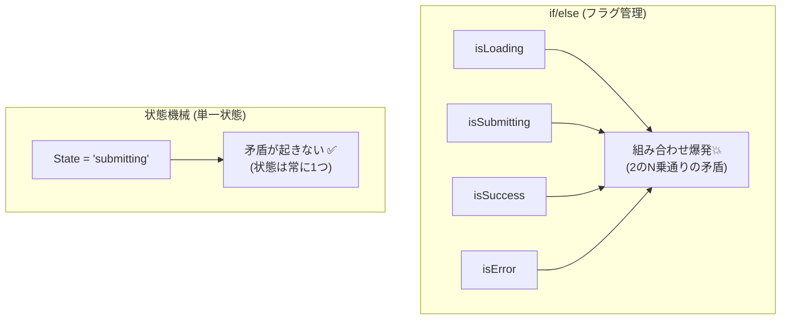

# 第04章：なぜ必要？（if地獄のこわさ）😱

この章はね、「状態機械って便利そう〜」じゃなくて、**“必要になる瞬間”**を体感する回だよ🥺✨
コードが増えるほど、if/elseが **ジワジワ事故の温床**になっていく理由を、やさしく見ていくね🧸💕

---

## 4-1. if地獄ってなに？🕳️😵‍💫

ざっくり言うと、

* 条件分岐（if/else）が色んな場所に散らばって🧩
* 状態を表す変数が増えすぎて（フラグ地獄）🚩🚩🚩
* 「この時って、どの分岐通るの？」が誰にも分からなくなる😇

…みたいな状態のこと！

そして怖いのが、**動いてはいるのに、たまに壊れる**やつ😱💥
（再現しづらいバグ＝いちばんつらい😭）

---

## 4-2. まずは“フラグ地獄”を見よう🚩😱


状態管理をifで頑張ると、こうなりがち👇

* `isLoading`
* `isSubmitting`
* `isSuccess`
* `isError`
* `errorMessage`
* `retryCount`
* `isDirty`（編集したか）
* `isValid`

……増える増える😂




### ✅ ここがポイント


フラグが増えると、**ありえない組み合わせ**が発生するの！

たとえば3つのフラグだけでも、

* `isSubmitting`
* `isSuccess`
* `isError`

これだけで組み合わせは **2×2×2 = 8通り**😇
でも実際は「SubmittingとSuccessが同時」は変だよね？💦
それを **ifで毎回防ぐ**のがしんどいの…😭

---

## 4-3. 典型的な事故パターン5連発💥😱

if地獄は、こういう事故を呼びやすいよ👇

### ① 「たまたま通った分岐」で状態が壊れる🧨

どこかで `isSuccess = true` にしたのに、別の場所で `isError` が残ってた…みたいなやつ😵‍💫

### ② 画面とロジックがズレる🖥️💔


UIは「送信中」表示なのに、内部では `isSubmitting = false` になってるとか…。

### ③ 非同期で“時間差パンチ”が来る⏳🥊


APIの結果が遅れて返ってきて、**すでに別の状態に進んでるのに上書き**しちゃうやつ😱
（フォーム送信でめちゃ起きる😭）

### ④ “禁止したい操作”が普通に通る🚫➡️✅

「送信中は再送禁止」なのに、二重クリックで送れてしまう…など💥

### ⑤ テストが地獄🧪😇

「このフラグの組み合わせの時だけ」みたいなケースが増えすぎて、網羅しようとすると爆発する💣

---

## 4-4. 実例：フォーム送信の “ifで頑張る版” 😭📨

ありがちなコード（短くしてるけど雰囲気はこれ！）👇

```ts
type ApiResult = { ok: true } | { ok: false; message: string };

let isSubmitting = false;
let isSuccess = false;
let errorMessage: string | null = null;

async function submit(form: { email: string }) {
  if (isSubmitting) return; // 二重送信防止のつもり

  if (!form.email.includes("@")) {
    errorMessage = "メール形式が変だよ";
    return;
  }

  isSubmitting = true;
  errorMessage = null;

  const res: ApiResult = await fakeApi(form);

  if (res.ok) {
    isSuccess = true;
  } else {
    errorMessage = res.message;
  }

  isSubmitting = false;
}

async function fakeApi(_: unknown): Promise<ApiResult> {
  await new Promise((r) => setTimeout(r, 800));
  return Math.random() < 0.5 ? { ok: true } : { ok: false, message: "サーバーエラー" };
}
```

### 😱 これ、どこが危ないの？

* `isSuccess` を一度 true にしたら、**再編集したときに戻す処理**が必要になる（どこで戻す？）🌀
* `errorMessage` はいつ消す？（入力変更したら？送信開始したら？成功したら？）🤔
* 非同期中にユーザーが入力を変えたら？（古い結果で上書きする？）⏳😱
* 状態の正しさが **コード全体に散ってる**（1か所見ても分からない）🧩

---

## 4-5. 状態機械が“バグ防止装置”になる理由🧯✨

状態機械にすると、考え方がこう変わるよ👇

### ✅ 「フラグの組み合わせ」→「状態は1つ」へ🧠✨

成功か、送信中か、エラーか…を **1個の状態（State）**で表す。

例：フォーム送信なら

* `idle`（何もしてない）
* `editing`（入力中）
* `submitting`（送信中）
* `success`（成功）
* `error`（失敗）

みたいにね😊

### ✅ 「ifが散らばる」→「遷移ルールが1か所」へ📋✨

「この状態でこのイベントが来たら次はこれ」っていうルールが、**表 or 1関数**に集まるのが強い💪

---

## 4-6. “まず一歩”の改善：フラグをやめて状態を1個にする🙂🧩


まだ状態機械を完成させなくても、**1変数に寄せるだけで事故が減る**よ✨

```ts
type Status = "editing" | "submitting" | "success" | "error";

type UiState =
  | { status: "editing"; errorMessage: string | null }
  | { status: "submitting" }
  | { status: "success" }
  | { status: "error"; errorMessage: string };

let ui: UiState = { status: "editing", errorMessage: null };
```

この時点で、

* 「success と error が同時」みたいな **矛盾が型で起きにくい**✨
* 状態ごとに必要なデータが明確になる（error時だけmessage必須）💡

TypeScriptの強み、ここで効いてくるよ〜🧡
（最新版だと npm 上の “Latest” は 5.9.3 として案内されてるよ）([npm][1])

---

## 4-7. 成果物：アンチパターン集（“何が辛いか一言で”）🧾💥


この章のゴールはこれ！👇（コピペして自分メモにしてOK🥰）

* **フラグ増殖**：状態が2進数になって人間が追えない🚩😇
* **分岐の分散**：状態ルールが複数ファイルに散って迷子🧩
* **矛盾状態**：ありえない組み合わせが普通に作れる💥
* **禁止遷移が曖昧**：「本当は押しちゃダメ」がif漏れで通る🚫
* **非同期レース**：遅れて来た結果が現状態を上書き⏳😱
* **リセット忘れ**：成功後にエラーが残る、編集後に成功が残る🌀
* **テスト爆発**：組み合わせが増えすぎて網羅不能🧪💣
* **“例外”の増殖**：`if (isX) return;` が増えて読めない📈
* **デバッグ困難**：ログが「今どの状態？」を語ってくれない🔍

---

## 4-8. ミニ演習：あなたのコードを“状態の言葉”に翻訳してみよ📝✨

次の質問に答えるだけで、一気に状態機械脳になるよ🧠🌸

1. その機能の「状態」は何個ありそう？（5個くらいでOK）🙂
2. ユーザー/システムが起こす「イベント」は何？📣
3. “本当は起きてほしくない操作”はどれ？（禁止遷移）🚫
4. 失敗したらユーザーは次に何ができるべき？（戻る/再試行など）🔁

---

## 4-9. AI活用（この章の使いどころ）🤖💖

ここはAIがめちゃ得意！✨
VS Codeまわりだと、最近は **agent mode** みたいに「タスクを渡して自律的に編集・コマンド提案まで」やってくれる方向が強いよ（※機能説明はGitHub公式ドキュメントにあるよ）([GitHub Docs][2])
VS Codeの最近の更新でも、チャットやエージェント系の更新が続いてるよ([Visual Studio Code][3])

### ✅ プロンプト例（コピペOK）💌

* 「このコードで取りうる状態（フラグ組み合わせ）を列挙して、矛盾を指摘して」🧠
* 「“状態”を1つのユニオン型にまとめる案を出して」🧩
* 「イベント一覧（ユーザー操作/システム発生/タイマー）を提案して」📣⏱️
* 「禁止遷移になりそうな操作を洗い出して、理由も添えて」🚫
* 「最小の状態遷移表（状態×イベント）を作って」📋✨

---

## 4-10. まとめ🎀

* if/elseで状態管理すると、**フラグ増殖＋分岐分散＋矛盾状態**が起きやすい😱
* 非同期が混ざると、**時間差で壊れるバグ**が増える⏳💥
* 状態機械は「状態は1つ」「遷移ルールは1か所」で、**バグ予防**になる🧯✨

次の章（第5章）は、ここで出てきた言葉たち（State / Event / Transition / Guard / Action / Context）を、**最小セットで味方にする回**だよ📌💖

[1]: https://www.npmjs.com/package/typescript?activeTab=versions&utm_source=chatgpt.com "typescript"
[2]: https://docs.github.com/en/copilot/get-started/features?utm_source=chatgpt.com "GitHub Copilot features"
[3]: https://code.visualstudio.com/updates?utm_source=chatgpt.com "December 2025 (version 1.108)"
