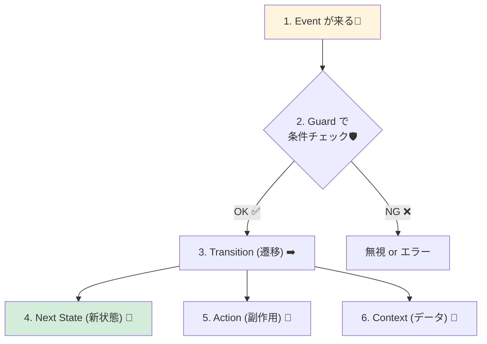

# 第05章：用語を味方にしよう（6つだけ）📌

（State / Event / Transition / Guard / Action / Context）

この章のゴールはシンプル！
**状態機械の会話ができる“最小6語”**を、自分の言葉で説明できるようになることだよ〜😊💖

---

## 0) まずは1分イメージ：フォーム送信📨✨

「送信ボタン押した！」→「送信中」→「成功」or「失敗」
…っていう流れ、よくあるよね？😆

状態機械だと、これをこう分解するよ👇

* **State（状態）**：いまどの段階？（編集中 / 送信中 / 成功 / エラー…）
* **Event（イベント）**：何が起きた？（送信押した / 成功返ってきた / 失敗した…）
* **Transition（遷移）**：イベントで状態がどう変わる？（編集中→送信中…）
* **Guard（ガード）**：その遷移、行っていい？（入力OK？通信中じゃない？）
* **Action（アクション）**：遷移したとき何する？（API呼ぶ/ログ/トースト出す…）
* **Context（コンテキスト）**：状態とは別に持つデータ（入力値/エラー理由/requestId…）

この6語だけで、設計の説明がめっちゃラクになるよ〜！🥳🧠✨

---

## 1) 用語6つを“超ざっくり一言”で覚える📚✨


まずは **「一言辞書」** を作っちゃおう！✍️💖

| 用語         | 一言でいうと     | 例（フォーム送信）                              |
| ---------- | ---------- | -------------------------------------- |
| State      | 今のモード/段階   | Editing / Submitting / Success / Error |
| Event      | 起きたこと（入力）  | CLICK_SUBMIT / RESOLVE / REJECT        |
| Transition | 状態の移動ルール   | Editing + CLICK_SUBMIT → Submitting    |
| Guard      | 遷移して良い？の条件 | 入力OKなら送信できる                            |
| Action     | 遷移時にやる処理   | API呼び出し開始、ログ出す                         |
| Context    | 状態とは別のデータ箱 | formData / errorMessage / requestId    |

ここまで言えたらもう勝ち！🏆✨

---

## 2) それぞれを“ちゃんと使える”レベルにする💪✨

### 2-1) State（状態）🚦

**ポイント：Stateは「いま何ができるか」を決める**よ😊

* Editing（編集できる）
* Submitting（編集できない・送信中）
* Success（完了表示できる）
* Error（再試行できる、など）

✅ **Stateが変わると、UIの振る舞いが変わる**（ボタン押せる/押せないとか）🎛️✨

---

### 2-2) Event（イベント）📣

**Eventは「起きた事実」**だよ〜！

* ユーザー操作：CLICK_SUBMIT 🖱️
* システム：RESOLVE / REJECT 🌐
* タイマー：TIMEOUT ⏱️

✅ Eventは「命令」じゃなくて「起きたこと」に寄せるとキレイ✨
（例：`SubmitNow!!` じゃなくて `CLICK_SUBMIT` とか）

---

### 2-3) Transition（遷移）➡️

**Transitionは “(状態, イベント) → 次の状態” のルール**！

例：

* (Editing, CLICK_SUBMIT) → Submitting
* (Submitting, RESOLVE) → Success
* (Submitting, REJECT) → Error

✅ ここが「仕様」そのもの📜✨
仕様書の文章を、遷移に落とせると強いよ〜！

---

### 2-4) Guard（ガード）🛡️


**Guardは「その遷移、していい？」のチェック**だよ😊

例：

* 入力が空なら送信しない
* すでにSubmittingなら二重送信させない

✅ Guardがあると **ifが散らからない**✨
「遷移する場所」に条件を集められるのが天才的に気持ちいい🥹💖

---

### 2-5) Action（アクション）🧰


**Actionは「遷移したときにやる処理」**だよ！

例：

* API呼び出しを開始する
* ログを出す
* トースト表示する

✅ コツ：**状態変更（遷移）と副作用（Action）を分けて考える**🌿
このあとPart 3で超伸びるところ〜！🚀

---

### 2-6) Context（コンテキスト）🧠


**Contextは「状態とは別に持つデータ箱」**！

例：

* formData（入力値）
* errorMessage（エラー理由）
* requestId（リクエストの識別）

✅ Stateは「モード」
✅ Contextは「中身（データ）」
ここを分けると、設計が一気に整うよ〜！🧺✨

---

## 3) 6語がどう繋がるか（超重要の1枚）🧩✨


* **Event** が来る
* いまの **State** を見る
* **Guard** で遷移OKか判定
* OKなら **Transition** して次のStateへ
* 必要なら **Action** を実行（副作用）
* 必要なら **Context** を更新（データを変える）

この流れを頭に置くだけで、状態機械の理解が爆速になるよ〜！💨🧠✨




---

## 4) TypeScriptで“雰囲気だけ”触ってみる（ミニ）🧡

※ここでは「用語と形」が伝わればOK！ガチ実装は後の章でやるよ😊

### 4-1) State / Event を型で表す（判別可能ユニオン）🎫✨


TypeScriptは、タグ（例：`type` や `kind`）で **ユニオンを判別**できるのが強みだよ〜！💖 ([typescriptlang.org][1])

```ts
type State =
  | { kind: "Editing" }
  | { kind: "Submitting" }
  | { kind: "Success" }
  | { kind: "Error"; message: string }; // Errorは理由を持たせてもOK（例）

type Event =
  | { type: "CLICK_SUBMIT" }
  | { type: "RESOLVE" }
  | { type: "REJECT"; message: string };
```

* `kind` が **State**
* `type` が **Event**
* `message` みたいな追加情報は **ContextやEventに載せる**ことが多いよ😊

---

### 4-2) Transition / Guard / Action を“言葉で書く”例📝✨

```ts
// 「ルールの文章」を書くイメージ（実装は後の章でOK！）
/*
(Editing, CLICK_SUBMIT) --[Guard: 入力OK]--> Submitting
  Action: API呼び出し開始

(Submitting, RESOLVE) --> Success
  Action: 成功ログ

(Submitting, REJECT) --> Error
  Action: エラーログ
*/
```

今はこれで十分！🙆‍♀️✨
「用語がどこに出てくるか」が分かれば勝ちだよ〜！

---

## 5) ありがちミス集（ここ刺さる）⚠️😵‍💫

* **StateとContextをごっちゃにする**

  * ✖ `state = "Error: timeout"`（状態に理由を混ぜる）
  * ◎ `state = "Error"` + `context.errorReason = "timeout"`
* **Eventに命令を混ぜる**

  * ✖ `DO_API_CALL_NOW`
  * ◎ `CLICK_SUBMIT` / `REQUEST_SENT` みたいに“起きたこと”へ
* **Guardをあちこちに散らす**

  * ✖ UI側にifだらけ
  * ◎ 遷移の直前に集約（状態機械の責務に寄せる）

---

## 6) 練習問題（めっちゃ大事）✍️🎀

### 問題A：ドア🚪（超定番）

ドアの仕様：

* 状態：Closed / Open / Locked
* イベント：OPEN / CLOSE / LOCK / UNLOCK

✅ やること：

1. **禁止遷移**を2つ挙げてみて（例：LockedでOPENは無理だよね？😆）
2. **Guardが必要そうな遷移**を1つ考えてみて（例：鍵持ってる？🔑）

---

### 問題B：フォーム送信📨

次の要素を、6語に分類してね👇

* 「送信ボタン押下」
* 「送信中は二重送信できない」
* 「送信が成功した」
* 「エラー理由（timeout）」
* 「APIを叩く」
* 「いま編集中」

答えはこの章の最後にあるよ😊✨

---

## 7) AI活用プロンプト（この章の最強装備）🤖💖

そのままコピペで使えるやつ置いとくね🎁✨

* 用語のたとえ話：
  「State/Event/Transition/Guard/Action/Contextを、日常の例（カフェ注文など）で説明して。初心者向けで短く！」

* 仕様→6語分解：
  「この仕様文を State / Event / Transition / Guard / Action / Context に分解して、箇条書きで出して」

* 命名案：
  「State名とEvent名を、英語で統一感のある命名にして（例：Editing, Submitting… / CLICK_SUBMIT, RESOLVE…）候補を3パターン」

---

## 8) 練習問題の答え合わせ✅✨

### 問題Bの例

* 「送信ボタン押下」→ **Event**
* 「送信中は二重送信できない」→ **Guard**（Submitting中のCLICK_SUBMITを拒否）
* 「送信が成功した」→ **Event**（RESOLVE）
* 「エラー理由（timeout）」→ **Context**（またはEventのpayload）
* 「APIを叩く」→ **Action**
* 「いま編集中」→ **State**（Editing）

---

## 9) 最新メモ（2026/01/20時点）🗓️✨

「今どれが新しいの？」を不安にさせないためのミニメモだよ😊

* TypeScript（npmのlatest）は **5.9.3** 表示（少なくとも2025/09末以降しばらく最新として案内） ([npm][2])
* TypeScript 6.0/7.0（ネイティブ化含む）の話題は進行中（“早期2026”目標の報道・解説あり） ([InfoQ][3])
* Node.js は **v24系がActive LTS**、**v25系がCurrent**（2026/01更新あり） ([Node.js][4])
* VS Code は **1.108（2025年12月版）**が **2026/01/08リリース**として案内、Insidersは **1.109** が更新中 ([Visual Studio Code][5])

---

### 次の章につながる一言🐣✨

第5章の6語が言えるようになったら、もう設計が“言語化”できる人だよ！🥳💖
次の第6章は、手書きで一気に「できた感」出していこうね〜！🚪✍️✨

[1]: https://www.typescriptlang.org/docs/handbook/unions-and-intersections.html?utm_source=chatgpt.com "Handbook - Unions and Intersection Types"
[2]: https://www.npmjs.com/package/typescript?utm_source=chatgpt.com "TypeScript"
[3]: https://www.infoq.com/news/2026/01/typescript-7-progress/?utm_source=chatgpt.com "Microsoft Share Update on TypeScript 7"
[4]: https://nodejs.org/en/about/previous-releases?utm_source=chatgpt.com "Node.js Releases"
[5]: https://code.visualstudio.com/updates?utm_source=chatgpt.com "December 2025 (version 1.108)"
