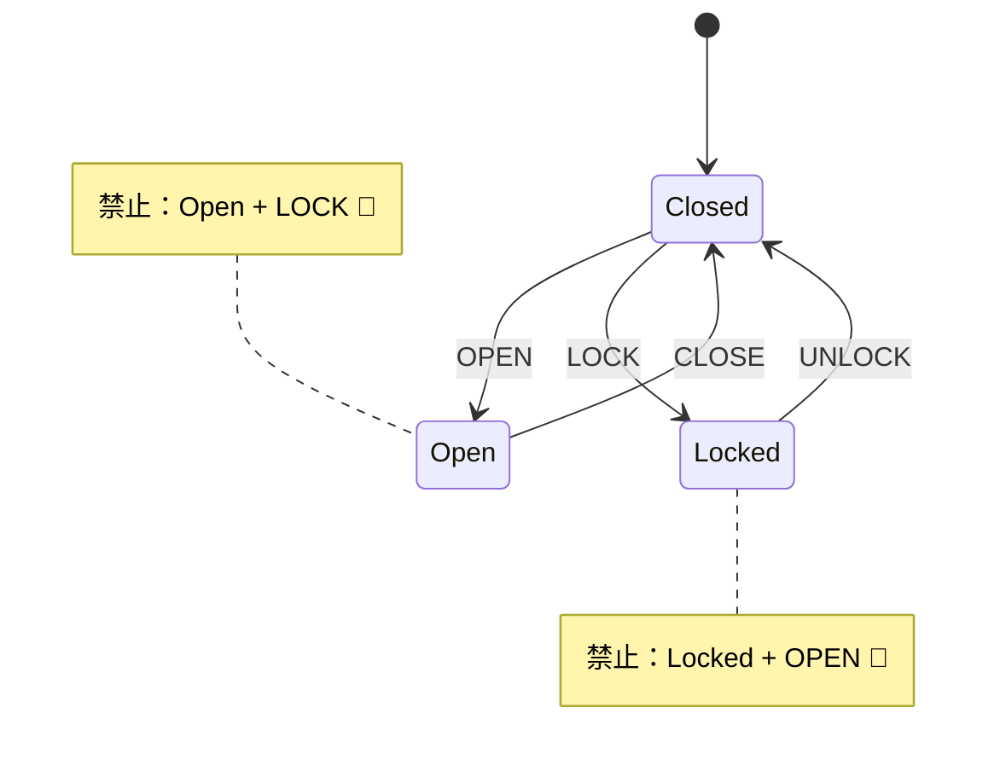

# 第06章：手書きでやる！ミニ状態機械（ドア）🚪

この章は「最速で、状態機械の気持ちよさを体に入れる回」だよ〜！🎉
ドア🚪を題材にして、**紙とペン（またはメモ帳）だけ**で状態機械を完成させます✍️💕

---

## 6-1. 今日のゴール🎯

ゴールはこれ👇

* ドアの「状態」を3つに分ける🧠✨
* 「イベント」を決めて、矢印でつなぐ➡️
* **禁止遷移（やっちゃダメ）**も決める🚫
* 最後に「状態一覧＋イベント一覧」が手元に残る📝💖

> ここまでできると、「あ、これなら自分でも設計できるかも…！」ってなるやつ😆🌸

---

## 6-2. まず「状態」を3つだけ決めよ〜！🧸


ドアは、ざっくりこうだよね👇

* **Closed**（閉まってる）🚪
* **Open**（開いてる）🚪✨
* **Locked**（鍵かかってる）🔒

ここで大事ポイント💡
状態は **“今のドアの置かれてる状況”** を表すよ。
「開ける途中…」とか「ちょっとだけ開いてる…」とか言い出すと沼りやすいので、今日は一旦3つでOK🙆‍♀️💕

---

## 6-3. 次に「イベント」を4つ決める📣✨

イベントは **“何が起きた？”** だよ〜！

* **OPEN**（開ける）🖐️
* **CLOSE**（閉める）🖐️
* **LOCK**（鍵をかける）🔒
* **UNLOCK**（鍵を外す）🔓

イベント名は、基本 **動詞っぽく**すると迷子になりにくい😊👍

---

## 6-4. 矢印でつなぐ（遷移を書く）➡️📝

ここからが状態機械の核心〜！✨
「この状態で、このイベントが来たら、次はどこ？」を決めます。

### まず自然なやつから🌿

* Closed + OPEN → Open
* Open + CLOSE → Closed
* Closed + LOCK → Locked
* Locked + UNLOCK → Closed

これだけで、かなり「ドア」っぽい！😆🚪

---

## 6-5. 禁止遷移（やっちゃダメ）を決める🚫😱

ここが状態機械の“バグ防止装置”ポイント🧯✨

たとえば…

* **Locked** なのに **OPEN** 👉 無理じゃん！🔒🚪❌
* **Open** なのに **LOCK** 👉 ドア開いたまま鍵かける？普通しないよね😵‍💫❌
* **Open** で **OPEN** 👉 もう開いてる😂（これは「無視」でもOK）

禁止遷移をどう扱うかは、ざっくり3択だよ👇

1. **無視する**（何も起きない）😶
2. **エラーにする**（例外/エラー返す）🚨
3. **ログだけ出す**（デバッグ用）🪵

今日は入門なのでおすすめは👇

* 明らかに危ないやつ（Locked + OPEN）は **エラー or ログ**
* どうでもいい二度押し（Open + OPEN）は **無視**
  この“温度感”があると実務で超ラク😊✨

---

## 6-6. 完成形（まずは紙にこう書ければ勝ち）🏆✨

### ✅ 状態一覧

* Closed / Open / Locked

### ✅ イベント一覧

* OPEN / CLOSE / LOCK / UNLOCK

### ✅ 遷移（ルール）

* Closed + OPEN → Open
* Open + CLOSE → Closed
* Closed + LOCK → Locked
* Locked + UNLOCK → Closed
* Locked + OPEN → ❌（禁止）
* Open + LOCK → ❌（禁止）
* Closed + CLOSE → （無視でOK）
* Open + OPEN → （無視でOK）
* Locked + LOCK → （無視 or ログ）




---

## 6-7. “抜け漏れ”を一瞬で見つけるコツ🔍✨

ここでミニ必殺技🪄

**「全状態 × 全イベント」**を1回だけ見渡す👀

* 状態が3個
* イベントが4個
  → 3×4 = 12マス分の判断をする感じ！

「うわ…」って思うけど、逆に言うと **12個決めれば仕様が固まる**ってこと😆💕

（この発想が次章の「状態遷移表」につながるよ📋✨）

---

## 6-8. ちょい発展：状態の粒度を増やす練習🎮🌸

慣れてきたら、こういう“追加”を考えると設計力が伸びるよ💪✨

### お題A：半開き（Ajar）を追加してみて🚪😳

状態：

* Closed / Open / **Ajar** / Locked

質問：

* Ajar から LOCK できる？（ドアの仕様次第だよね）
* Ajar から CLOSE は Closed？
* OPEN は Open へ？

### お題B：鍵が壊れた（LockBroken）を追加してみて🔧😱

* UNLOCK が失敗する世界が作れると、実務の“失敗設計”に強くなる🧯✨

---

## 6-9. おまけ：TypeScriptで「超ミニ」状態遷移を書いてみる🧑‍💻✨

手書きで決めたルールを、**そのまま関数**にするだけ！
（まだ実装回じゃないので、ほんとにミニでOK😊）

```ts
type DoorState = "Closed" | "Open" | "Locked";
type DoorEvent = "OPEN" | "CLOSE" | "LOCK" | "UNLOCK";

function transition(state: DoorState, event: DoorEvent): DoorState {
  switch (state) {
    case "Closed":
      switch (event) {
        case "OPEN": return "Open";
        case "LOCK": return "Locked";
        case "CLOSE": return "Closed"; // 無視
        case "UNLOCK": return "Closed"; // 無視
      }

    case "Open":
      switch (event) {
        case "CLOSE": return "Closed";
        case "OPEN": return "Open"; // 無視
        case "LOCK": throw new Error("OpenのままLOCKはできないよ🚫");
        case "UNLOCK": return "Open"; // 無視
      }

    case "Locked":
      switch (event) {
        case "UNLOCK": return "Closed";
        case "LOCK": return "Locked"; // 無視
        case "OPEN": throw new Error("LockedなのにOPENはできないよ🔒🚫");
        case "CLOSE": return "Locked"; // 無視
      }
  }
}
```

ポイントはこれだけ👇

* **状態（state）とイベント（event）以外で分岐しない**✨
* 禁止遷移は「例外」にしてもいいし、「ログ」にしてもOK🪵

---

## 6-10. AI活用（この章でめちゃ効くプロンプト）🤖💖

Copilot / Codex / ChatGPT などに投げるならこんな感じ👇✨

* 「ドアの状態（Closed/Open/Locked）とイベント（OPEN/CLOSE/LOCK/UNLOCK）で、禁止遷移も含めた遷移表を作って」📋🤖
* 「この状態機械で矛盾してるところ、抜けてるイベントを指摘して」🔍🤖
* 「禁止遷移を“無視/エラー/ログ”のどれにするのが良いか、理由つきで3案出して」🧠🤖

---

## 6-11. まとめ🎀✨

この章でできたことはこれ〜！🎉

* 状態を3つに分けた🧩
* イベントを4つに分けた📣
* 遷移を矢印でつないだ➡️
* 禁止遷移を決めて、バグの入口を塞いだ🧯🚫

次の第7章では、今日の内容を「表」にして、**抜け漏れチェックを爆速化**するよ📋✨

---

## 参考（“状態機械/状態遷移図”の今どき周辺情報）📚✨

* 状態機械を拡張した「Statecharts」は階層や並行などを扱える考え方だよ（後半章で出てくるやつ！）([サイエンスダイレクト][1])
* ドキュメントに状態遷移図を書きたいとき、Mermaid の stateDiagram-v2 がよく使われるよ🧜‍♀️([mermaid.ai][2])
* TypeScript/JavaScript で状態機械を扱う代表例として XState（state machines/statecharts を使う）があるよ（実装章以降で選択肢にできる）🧠✨([Stately][3])

必要なら、この第6章のドア状態機械を **第7章向けの「遷移表（12マス）」に整形した完成版**も、そのまま出すよ📋💕

[1]: https://www.sciencedirect.com/science/article/pii/0167642387900359?utm_source=chatgpt.com "Statecharts: a visual formalism for complex systems"
[2]: https://mermaid.ai/open-source/syntax/stateDiagram.html?utm_source=chatgpt.com "State diagrams | Mermaid"
[3]: https://stately.ai/docs/xstate?utm_source=chatgpt.com "XState"
