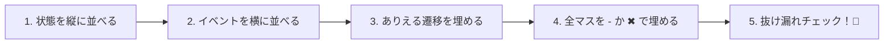

# 第07章：状態遷移表（Transition Table）を作る📋✨

この章は **「抜け漏れを“表”で一撃発見する」** のがゴールだよ〜！🕵️‍♀️💖
状態機械って、図（矢印）もいいけど、**表にすると急にミスが見える**んだよね😳✨

---

## 1) 状態遷移表ってなに？🤔📋

**縦＝状態（State）**、**横＝イベント（Event）**、**交差するマス＝どうなる？（次の状態 or 禁止）**
…っていう「仕様の一覧表」だよ📝✨

### 遷移表が強い理由💪🔥

* **全状態×全イベント**を見渡せる → “想定外”が減る🧯
* 「このイベント、今の状態で押されたらどうする？」に即答できる😼
* 後でコードに落とす時に、仕様がブレにくい🧠✨

---

## 2) まずは“記号ルール”を決めよう🧷✨

遷移表は、マスに何を書くかを先に決めるとラクだよ😊

おすすめルール（初心者向け）👇

* **次状態を書く**：例）`Open`
* **そのまま（変化なし）**：`-`（無視する）
* **禁止**：`✖`（エラー/ログ/無視、どれにするかは後で決める）

> まず作って、あとで埋めれば勝ち！

---

## 3) 手順：遷移表を作る5ステップ🏃‍♀️💨

### Step 0：題材を決める🎮

第6章の「ドア🚪」をそのまま使うと超スムーズ！

* 状態：`Closed / Open / Locked`
* イベント：`OPEN / CLOSE / LOCK / UNLOCK`

---

### Step 1：状態（State）を縦に並べる🧱

「今どういう状況？」の種類を並べるよ✨

例：

* Closed（閉まってる）
* Open（開いてる）
* Locked（鍵かかってる）

---

### Step 2：イベント（Event）を横に並べる📣

「何が起きる？」を並べるよ✨（ユーザー操作が多い）

例：

* OPEN（開ける）
* CLOSE（閉める）
* LOCK（鍵かける）
* UNLOCK（鍵あける）

---

### Step 3：まず “正しい遷移だけ” を埋める✅✨

いきなり全部埋めないでOK！
「普通にありえるやつ」から書くと進む😊

---

### Step 4：残りを「-」か「✖」で埋める🧯

ここが遷移表のキモ！
空欄を残すと、実装で事故る💥（“未定義イベント”問題）

---

### Step 5：抜け漏れチェック🔍✨

チェックのコツはこの3つ！

* **空欄が残ってない？**（残ってたら要対応）
* **到達できない状態ない？**（どこからも行けない状態）
* **戻れない状態ない？**（詰み状態＝デッドエンド）

---

## 4) 例題：ドアの遷移表 v1（基本形）🚪📋✨

| 状態＼イベント | OPEN | CLOSE  | LOCK   | UNLOCK |
| ------- | ---- | ------ | ------ | ------ |
| Closed  | Open | -      | Locked | ✖      |
| Open    | -    | Closed | ✖      | ✖      |
| Locked  | ✖    | ✖      | -      | Closed |

### この表から分かること😳✨

* **Locked で OPEN が来たら？** → ✖（禁止）
* **Open で LOCK が来たら？** → ✖（鍵は閉まってないと掛けられないよね🔑）
* **Closed で CLOSE が来たら？** → `-`（変化なし＝無視）

---

## 5) 「✖（禁止）」をどう扱う？3つの作戦🚫🎛️

禁止遷移（ありえないイベント）って、実装で扱いを決めないとグダる😵‍💫
初心者向けに、よくある3パターン👇

1. **無視する（- と同じ扱い）**

   * UIの連打とかに強い🧸
   * でも不具合に気づきにくいかも💦
2. **エラーにする（例外 or Resultで返す）**

   * バグを早期発見できる🧯✨
   * ただしユーザー体験は考える必要あり
3. **ログだけ出す（おすすめバランス）**

   * “起きた事実”が残る🔍
   * 本番運用でも痛くなりにくい😊

この教材の流れ的には、まず **「ログ出す」** が扱いやすいよ〜📝✨（あとで方針を強めてもOK！）

---

## 6) AI（Copilot / Codex）で遷移表を爆速レビュー🤖💖

### 6-1. 抜け漏れ指摘プロンプト🕵️‍♀️

「状態とイベントはこれ。遷移表を作ったけど、穴と矛盾を指摘して！」が最強✨

例👇（コピペして使える）

* 状態：Closed/Open/Locked
* イベント：OPEN/CLOSE/LOCK/UNLOCK
* 遷移表：（表を貼る）
* お願い：

  1. 空欄や曖昧なマスを列挙して
  2. 禁止が妥当かもチェックして
  3. “必要そうな追加イベント”があれば提案して

---

### 6-2. “追加イベント”を出してもらうプロンプト💡

初心者がやりがちな漏れ＝「例外イベント」抜けがち😇

例👇

* 「この状態機械に、現実的に必要なイベント（タイムアウト・キャンセル・失敗など）候補を10個出して。初心者にも分かる理由付きで」

---

## 7) ミニ演習🎓✨（手を動かすと一気に身につく！）

### 演習A：ドア表を自分で作ってみよ🚪✍️

1. いったん空欄ありで作る
2. 次に `- / ✖` で全部埋める
3. 「Locked → Open に戻すには何イベント必要？」を説明してみる💬

---

### 演習B：フォーム送信の“超ミニ”遷移表📨✨

状態：`Idle / Editing / Submitting / Success / Error`
イベント：`EDIT / SUBMIT / RESOLVE / REJECT / RETRY`

まずは **“雰囲気”でOK**！ v1を作るだけで勝ち😊💖
（第30章の総合演習でガッツリ育てるよ〜🌱）

---

## 8) 次章へのつながり🧭✨

* 第8章：この表を **矢印の図（状態遷移図）** にして直感強化🗺️
* 第9章：**全状態×全イベント**で“抜け漏れゼロ化”へ🧯✨

---

## 9) 2026年1月20日時点のミニ環境メモ🧩🛠️

この章の作業自体はバージョン依存ほぼ無いけど、教材前提の「最新」を押さえると安心なのでメモだけ👇😊

* TypeScript の最新リリースは **5.9.3**（GitHub Releases 上で Latest 表示）だよ✨ ([GitHub][1])
* VS Code は **1.108（Release date: 2026-01-08）** が公開されてるよ🧡 ([Visual Studio Code][2])
* Node.js は **v24 系が Active LTS**、直近だと **Node.js 24.13.0 (LTS) が 2026-01-13 に更新**されてるよ🔐 ([Node.js][3])
* 状態機械ライブラリの例としては **XState v5.25.0（tag）** あたりが確認できるよ📦（表→設定に落とし込みやすい系） ([GitHub][4])

---

次は、同じ内容を **図（丸と矢印）** にして「パッと分かる化」しよ〜！🧭💖

[1]: https://github.com/microsoft/typescript/releases "Releases · microsoft/TypeScript · GitHub"
[2]: https://code.visualstudio.com/updates "December 2025 (version 1.108)"
[3]: https://nodejs.org/en/about/previous-releases "Node.js — Node.js Releases"
[4]: https://github.com/statelyai/xstate/tags "Tags · statelyai/xstate · GitHub"
