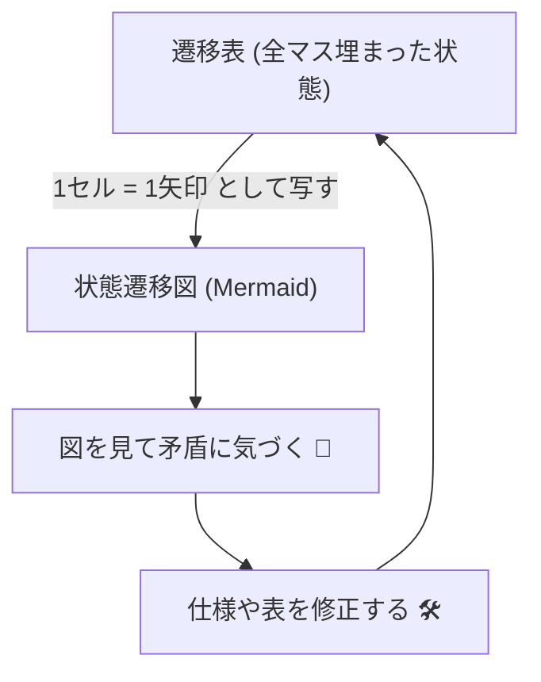
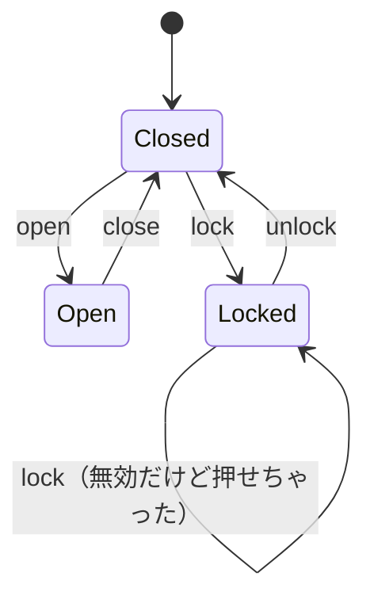
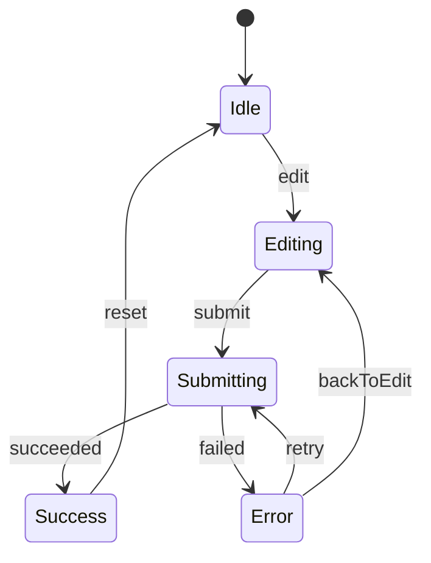

# 第08章：状態遷移図（State Diagram）で直感を強化🧭

この章は「矢印で見た瞬間にわかる！」を作る回です😊
文章や遷移表（表）だけだと、どうしても “全体の流れ” が頭に入りにくいんだよね…💭
そこで **状態遷移図**（丸と矢印の図）を描いて、理解とレビュー速度を一気に上げます🚀💕

---

## 8.1 状態遷移図って、何がうれしいの？😳✨

状態遷移図があると、こんな良いことが起きます👇

* **全体のルートが一発で見える**👀（成功ルート／失敗ルート／戻り道）
* **「抜け」や「変な矢印」が目で見つかる**🔍（孤立状態、戻れない状態など）
* **チームで会話しやすい**🗣️（“この矢印いらなくない？” がすぐ言える）
* **後から仕様が増えても崩れにくい**🏗️（図を直せば影響範囲が見える）

そして重要ポイント👇
状態遷移図は「お絵描き」じゃなくて、**仕様の圧縮表示**です📌✨
（遷移表と同じ情報を、脳に優しい形で並べる…みたいな！🧠💗）

---

## 8.2 いきなり描かない！遷移表→遷移図の変換手順📋➡️🗺️

おすすめ手順はこれです😊✨

1. **状態を確定**（丸の候補）🟦
2. **イベントを確定**（矢印のラベル）🏷️
3. **遷移表を v1 で作る**（穴があってOK）📋
4. **遷移表をそのまま図に写す**（1セル=1本の矢印）➡️
5. **図を見て「気持ち悪いところ」を直す**（戻れない・分岐が変など）🛠️

> コツ：**図で悩むより、表を図に“写経”**が最短です✍️😊

---

## 8.3 VS Codeで描くなら、どれが楽？🧰✨

この章では「すぐ描けて、貼れて、共有しやすい」を優先します💕

### ① Mermaid（いちばん手軽）🧜‍♀️✨

Markdownにテキストで書けて、そのままプレビューできます。
VS Code拡張「Markdown Preview Mermaid Support」は **Mermaid 11.12.0 対応**と明記されています📌 ([Visual Studio Marketplace][1])
Mermaidの状態遷移図は `stateDiagram-v2` を使います🧭 ([mermaid.ai][2])

### ② PlantUML（UMLっぽくしたい派）🌿

VS Code拡張「PlantUML」が有名で、プレビューやエクスポート機能があります🖼️ ([Visual Studio Marketplace][3])

### ③ XState Inspector（動かしながら図を見る派）🔎⚡

あとで実装に入ると「実行中の状態が光る」みたいな可視化ができます✨
Inspector は statecharts.io で提供されています🧩 ([statecharts.io][4])

この章のハンズオンは **Mermaidでいきます**🧜‍♀️💕

---

## 8.4 Mermaidで「ドア状態機械」を図にする🚪➡️✨

### ✅ まずは題材（超ミニ）

状態：`Closed / Open / Locked`
イベント：`open / close / lock / unlock`

### ✅ Mermaidの状態遷移図コード（コピペOK）✍️

Mermaidでは開始/終了に `[*]` を使えます🧭 ([mermaid.ai][2])

#### 👀 図にした瞬間に見えること

* `Locked --> Locked` が **変**かも？😳
  → 「無効イベントは“無視”にする？“エラー”にする？“ログ”にする？」って議論が生まれます🧯✨
* `Open` から `lock` できないのが仕様なら、**禁止遷移**として扱い方を決める必要がある👮‍♀️

---

## 8.5 VS Codeでプレビューする手順（Mermaid）🪄

やることはこれだけ😊

1. 拡張機能で **“Markdown Preview Mermaid Support”** を入れる📦 ([Visual Studio Marketplace][1])
2. `state-diagram.md` を作る📝
3. さっきの `mermaid` ブロックを貼る✍️
4. Markdownプレビューを開く（右上のプレビューアイコン）👀✨

> これで “図が自動レンダリング” されます🎉

---

## 8.6 図レビューのチェックリスト✅🕵️‍♀️

状態遷移図を見たら、ここを機械的にチェックすると強いです💪✨

### 状態（丸）のチェック🟦

* 孤立してない？（矢印が1本もない状態）🏝️
* 入ってくる矢印がない状態がある？（到達不能）🚫
* 出ていく矢印がない状態がある？（詰み状態）🧱
* “終端” を作るなら、ちゃんと終端っぽい？（Success/Cancelledなど）🏁

### 遷移（矢印）のチェック➡️

* イベント名がバラけてない？（`submit` と `send` と `post` が混在😵‍💫）
* 同じイベントが状態ごとに意味変わってない？（`click` が全部違う動き…）🌀
* 戻り道はある？（Errorからどう復旧する？）🔁

---

## 8.7 よくある失敗あるある😵‍💫➡️解決🛠️

### ❌ 失敗1：状態が“画面の気分”になって増えすぎる📈

例：`SlightlyLoading` / `SuperLoading` みたいに増殖…😂
✅ 対策：まずは **業務の状態**（送信中/成功/失敗）を優先して、UIは後で整理🎀

### ❌ 失敗2：イベントが “操作” と “結果” で混ざる🍲

例：`submit`（操作）と `success`（結果）が同列でぐちゃぐちゃ
✅ 対策：ラベルの語感を揃える

* 操作：`SubmitClicked` / `CancelClicked` 🖱️
* 結果：`RequestSucceeded` / `RequestFailed` 📡

### ❌ 失敗3：エラー状態が「Error」1個で全部入る🧨

✅ 対策：まずは1個でOK！その代わり **“次にできる行動”** を明確に
（Retryできる？戻れる？閉じる？）🔁↩️❎

---

## 8.8 演習：フォーム送信を「矢印で」設計してみよ🎓💌

### お題（最小）📌

状態：`Idle → Editing → Submitting → Success / Error`
イベント例：`Edit` `Submit` `Succeeded` `Failed` `Retry` `Reset`

### ① まず図だけ作る（表はあと）🗺️

Mermaidでこんな感じを作ってみてね👇

### ② チェックしてみて✅

* Error から **復旧ルートが2本ある**（retry / backToEdit）😊
* Success から **次の行動がある**（resetで初期化）✨
* “Submitting中にsubmit連打” はどうする？（無視？禁止？ログ？）🔁💥

---

## 8.9 AI活用プロンプト（この章で使えるやつ）🤖✨

コピペ用に置いとくね💕

* 「この状態遷移図、**到達不能状態**や**詰み状態**がないかチェックして」🔍
* 「イベント名の命名を、**操作**と**結果**で揃えた案を出して」🏷️
* 「禁止遷移を、**無視/エラー/ログ**の3方針で比較して」🚫🧯
* 「この遷移図から、遷移表（状態×イベント）を作って」📋
* 「フォーム送信の状態機械に **Cancel/Timeout** を足すなら、状態と遷移案を出して」⏳❎

---

## 8.10 まとめ🎀✨

* 状態遷移図は、仕様を “目でわかる形” に圧縮する道具🧭
* まず遷移表→図の写経で作ると爆速✍️
* MermaidならMarkdownに置けて、ドキュメントが腐りにくい🧜‍♀️ ([mermaid.ai][2])

次の章（第9章）は、この図と表を使って **抜け漏れを機械的に潰す**フェーズに入ります🕵️‍♀️🔥

[1]: https://marketplace.visualstudio.com/items?itemName=bierner.markdown-mermaid&utm_source=chatgpt.com "Markdown Preview Mermaid Support"
[2]: https://mermaid.ai/open-source/syntax/stateDiagram.html?utm_source=chatgpt.com "State diagrams | Mermaid"
[3]: https://marketplace.visualstudio.com/items?itemName=jebbs.plantuml&utm_source=chatgpt.com "PlantUML"
[4]: https://statecharts.io/?utm_source=chatgpt.com "Statecharts.io"
