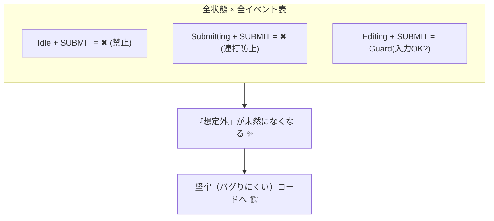

# 第09章：抜け漏れチェック術（“全状態×全イベント”）🕵️‍♀️

〜「想定外ルート」を先に潰して、バグを減らす章だよ〜💣→🧯

---

## 1) この章のゴール🎯✨


この章が終わると、あなたは…👇

* 状態一覧 × イベント一覧の **“総当たり表”** を作って🧠📋
* **「このイベント、ここで来たらどうするの？」** を全部決められる✅
* その結果、**“想定外ルート”が実装前に見える** ようになる👀✨

ポイントはこれだけ👇
**「起こりうる全イベントを、全状態で受けたらどうなるか？」**
を **表で潰す**！🧾✨




---

## 2) まず大前提：抜け漏れは「悪」じゃなくて「普通」🙂🌸

初心者のうちは特に、設計の最初に抜け漏れがあるのは自然だよ〜！
大事なのは、**抜け漏れを“見つけられる仕組み”** を持つこと💪✨
その最強ツールが、今日やる **「全状態×全イベント表」** です📋🕵️‍♀️

---

## 3) 失敗しがちなポイントあるある😱（先に知って勝つ）

抜け漏れが起きる典型パターンはだいたいこれ👇

1. **“成功ルート”しか設計してない**（失敗・キャンセル・タイムアウト忘れ）💥
2. **システム側イベントを忘れる**（通信成功/失敗、APIの返事など）📡
3. **状態が変わった後のボタン連打**（二重送信）🖱️🖱️
4. **例外ルートが「とりあえず無視」になってる**（後で事故る）🔥

だからこの章では、**禁止遷移の方針（無視/エラー/ログ）** も決め切るよ🧯✨

---

## 4) ステップ0：イベントを「3種類」に分類しよう📣🧩


イベントって、混ぜると漏れるので、まず分類🧠✨

* **ユーザー操作系**：クリック、入力、送信、戻る、キャンセル…🧑‍💻
* **システム発生系**：通信成功、通信失敗、検証結果…🖥️
* **時間系**：タイムアウト、一定時間経過、リトライ待ち…⏱️

この分類をするだけで、**“失敗・タイムアウト忘れ”** が激減するよ😊✨

---

## 5) 例題：フォーム送信ミニ（第30章の予告編）📨✨

ここではミニ構成でやるね！（本番は後で豪華になる🎉）

### 状態（State）候補🚦

* Idle（何もしてない）
* Editing（入力中）
* Submitting（送信中）
* Success（成功）
* Error（失敗）

### イベント（Event）候補🎫

* START_EDIT（入力開始）
* CHANGE（入力変更）
* SUBMIT（送信ボタン）
* RESOLVE（送信成功）
* REJECT（送信失敗）
* RESET（最初に戻す）

---

## 6) 本題：「全状態×全イベント表」を作る📋✨


やり方はシンプル！

### 手順A：表を作る🧾

* 行：状態（Idle / Editing / …）
* 列：イベント（START_EDIT / CHANGE / …）
* マス：起きたときの扱いを書く

### 手順B：マスは3種類の書き方だけにする🧠✨

1. **遷移する**：次の状態を書く（例：Editingへ）➡️
2. **禁止（Forbidden）**：× を置く（あとで方針を決める）🚫
3. **条件つき**：Guard（条件）を書く（例：入力OKならSubmittingへ）🛡️

---

## 7) サンプル：ざっくり “総当たり表”🕵️‍♀️📋

（読みやすさ優先で、ここでは代表的に書くね😊）

* Idle

  * START_EDIT → Editing ✅
  * CHANGE → ×（Idleで入力変更って何？）🚫
  * SUBMIT → ×（何も入力してないのに送信？）🚫
  * RESOLVE/REJECT → ×（送信してないのに結果来るの変）🚫
  * RESET → Idle（そのまま）🙂

* Editing

  * START_EDIT → Editing（そのまま）🙂
  * CHANGE → Editing（Context更新だけ）✅
  * SUBMIT → Submitting（ただし入力OKが条件！）🛡️➡️
  * RESOLVE/REJECT → ×（送信してないのに結果来るの変）🚫
  * RESET → Idle ✅

* Submitting

  * SUBMIT → ×（二重送信）🚫
  * CHANGE → ×（送信中に編集できる？ 仕様で決める）🤔
  * RESOLVE → Success ✅
  * REJECT → Error ✅
  * RESET → × or Idle（キャンセル扱い？仕様次第）🤔

* Success

  * RESET → Idle ✅
  * SUBMIT/CHANGE → ×（成功画面で編集？）🚫

* Error

  * RESET → Idle ✅
  * SUBMIT → Submitting（“再送信”として許可するなら）🔁✅
  * CHANGE → Editing（エラーから編集に戻すなら）✅

この表を作ると一気に出てくるよ👇
**「SubmittingでCHANGEは許可？禁止？」**
**「SubmittingでRESETはキャンセル？無視？」**
…みたいな “仕様の穴” がドバドバ出る😆🕳️✨

---

## 8) 禁止遷移（Forbidden）をどう扱う？3つの基本方針🚫✨


ここ、超大事！！（実務で差がつくところ🔥）

### 方針①：無視（No-op）🙂

* 状態は変えない（そのまま）
* 例：送信中にSUBMITが来た → “何もしない”
* UIだと自然なこと多い👀✨（ボタン連打対策）

### 方針②：ログだけ残す🔍

* 状態は変えない
* でも「ありえない入力が来た」を残す
* 後で原因調査がラク💖

### 方針③：エラーにする（例外 or Error state）🚨

* **「それが来たらバグ」** という扱い
* 例：IdleでRESOLVEが来た → 通信管理が壊れてる可能性
* 開発中は強めに止めると早く直せる💪

おすすめはこう👇（迷ったらこれ！）

* **ユーザー操作の禁止**：まずは「無視 or 軽くログ」🙂🔍
* **システムイベントの禁止**：ログ強め、場合によりエラー🚨
* **絶対に起きちゃダメ**：開発中は例外で落として気づく🔥

---

## 9) 抜け漏れチェックの“追加テク”6選🧠✨


表ができたら、さらに強くするチェックだよ🕵️‍♀️

### ✅チェック1：初期状態から「到達できない状態」ない？🗺️

Success や Error が “矢印ゼロ” なら怪しいかも👀

### ✅チェック2：「行き止まり状態」ない？🚧

その状態に入ったら、二度と抜けない…😇
（わざとならOK！でも意図を明文化してね📝）

### ✅チェック3：「戻り道」ある？🔁

Errorからどう復帰する？
Reset？Retry？Editingに戻す？
ここが曖昧だとUXが死ぬ🥲

### ✅チェック4：「同じイベント名」なのに意味ブレてない？🌀

SUBMIT が “送信開始” と “再送信” を兼ねると混乱しがち。
必要なら RETRY に分けちゃうのも手👍

### ✅チェック5：二重送信・連打対策ある？🖱️🖱️

Submitting 中の SUBMIT を禁止にしているか（or 無視）✅

### ✅チェック6：エラー原因の持ち方（Context）イメージできてる？🧠

Error state に入ったとき、何を表示する？
（message / code / requestId など）
この後の章で育てるけど、今から意識できると強い✨

---

## 10) TypeScriptで「抜け漏れに気づきやすくする」小ワザ🧩✅


TypeScriptは判別可能ユニオン＋網羅チェックができるよ（公式ハンドブックにも例がある）([typescriptlang.org][1])
ここでは“超ミニ”だけ紹介するね😊

```ts
type State =
  | { kind: "idle" }
  | { kind: "editing" }
  | { kind: "submitting" }
  | { kind: "success" }
  | { kind: "error"; message: string };

type Event =
  | { type: "START_EDIT" }
  | { type: "CHANGE"; field: string; value: string }
  | { type: "SUBMIT" }
  | { type: "RESOLVE" }
  | { type: "REJECT"; message: string }
  | { type: "RESET" };

function assertNever(x: never): never {
  throw new Error("Unhandled: " + JSON.stringify(x));
}
```

* switch で Event を分岐して、最後に assertNever を置くと
  **イベントが増えたのに処理を書き忘れた**とき気づきやすい💡
  （この“網羅”の考え方が、第9章の「総当たり表」と相性抜群なの！✨）

ちなみに現時点の TypeScript は 5.9 系が最新として案内されてるよ([typescriptlang.org][2])
（型チェックで守る作戦、めちゃ相性いいよ〜🛡️）

---

## 11) AI活用コーナー🤖💖（この章で使うと爆速！）


GitHub Copilot Chat は VS Code など対応IDEで使えるよ([GitHub Docs][3])
ここでは「レビュー役」にして使うのが超おすすめ😊

### 使えるプロンプト例💬✨

* 「この状態一覧とイベント一覧で、全状態×全イベントの表を埋めて。禁止遷移も提案して」🧾
* 「禁止遷移の扱い方を、無視/ログ/エラーの3案で、どれをどこに使うべきか理由つきで」🧠
* 「到達不能状態や行き止まり状態がないかチェックして」🕵️‍♀️
* 「Submitting中の仕様（編集可能？キャンセル可能？）の現実的な案を3つ」⏳

### AIの回答で気をつけること⚠️

AIはたまに、**イベントを勝手に増やす** or **仕様を決め打ち**しがち！
だからあなたはこう返すのが◎👇

* 「それは“提案”としてOK。採用/不採用を分けて表にして」✅

---

## 12) ミニ演習🎓🌸（10分で強くなる）

次の問いに答えてね😊✨

### お題：Submitting中に CHANGE が来たら？🤔


選択肢はだいたいこの3つ👇

1. 禁止（×）にして無視🙂
2. 禁止（×）にして「編集は送信後にしてください」表示📣
3. 許可（○）して「送信中に編集できる」仕様にする（ただし複雑）🧠

**おすすめはどれ？理由も一言で！**💬✨
（“初心者が事故りにくい”観点でね🧯）

---

## 13) まとめ🎀✨

* **全状態×全イベント** の表を作ると、仕様の穴が見える🕳️👀
* 禁止遷移は **無視 / ログ / エラー** の方針を決めるのが大事🚫🔍🚨
* 表が完成すると、実装もテストも一気にラクになる📦🧪✨

次の章（第10章）では、ここで増えがちな状態を **「粒度調整」** してスッキリさせるよ⚖️🌸

[1]: https://www.typescriptlang.org/docs/handbook/unions-and-intersections.html?utm_source=chatgpt.com "Handbook - Unions and Intersection Types"
[2]: https://www.typescriptlang.org/download/?utm_source=chatgpt.com "How to set up TypeScript"
[3]: https://docs.github.com/en/copilot/get-started/features?utm_source=chatgpt.com "GitHub Copilot features"
