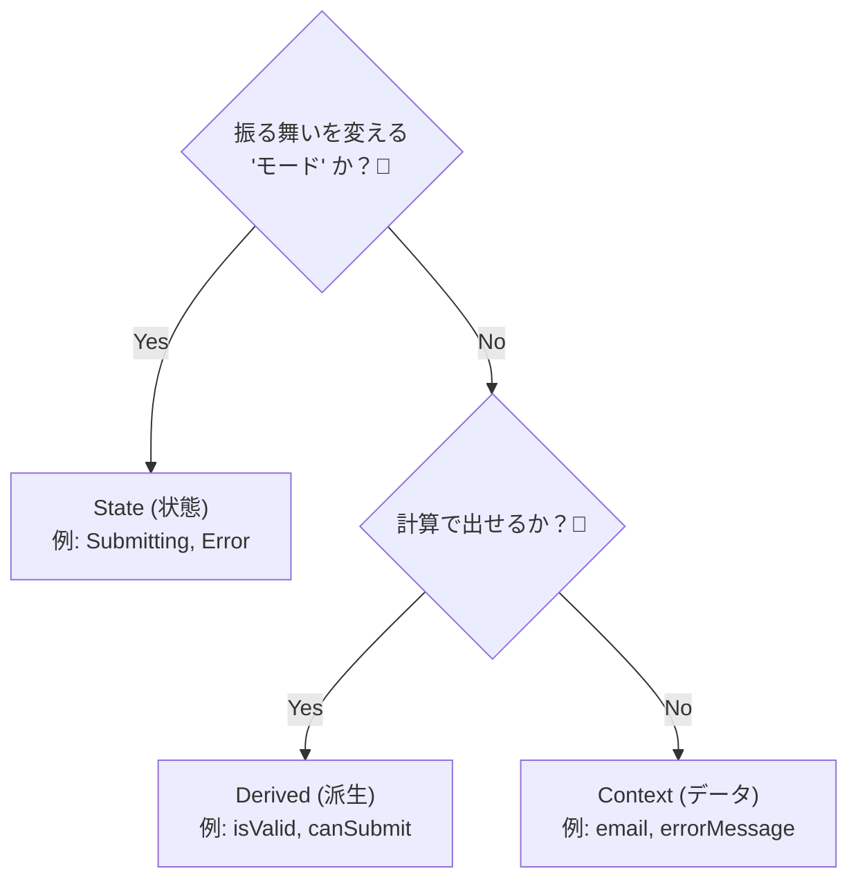

# 第10章：状態の粒度（細かすぎ/粗すぎ）⚖️

〜「状態が増えすぎて地獄😵‍💫」も「粗すぎてif地獄😱」も、ここで卒業しよ〜🎓💕

---

## この章でできるようになること🎯


* 「それ、状態にする？それともデータ？」を迷いにくくなる🧠✨
* **細かすぎて爆発💥**するのを防ぎつつ、**粗すぎてバグる🐛**のも防げる
* **UIの状態**と**業務（ドメイン）の状態**を混ぜないコツがわかる🧩

---

## まず結論：粒度のコツは「3つに分けて考える」🧺✨


状態機械で迷うのって、だいたいここ👇

### ✅ ① State（状態）＝「今、なにができるか」が変わる“モード”🚦

* 状態が変わると **許されるイベント（操作）が変わる**
* 状態が変わると **やるべき振る舞いが変わる**

例：

* `Editing` のときだけ `SUBMIT` が許される
* `Submitting` のときは `CHANGE_FIELD` を受け付けない（または制限する）

### ✅ ② Context（データ）＝状態の中で持つ“情報”🧠

「状態は同じだけど、判断材料として必要なデータ」

* 入力値、エラー理由、requestId…など

（XStateでも “contextは状態機械が持つデータ” って位置づけで、全状態から参照できるよ〜って整理されてるよ📦） ([Stately][1])

### ✅ ③ Derived（派生）＝“計算で出せるもの”🧮

* `isValid` とか `canSubmit` とか
* 「入力値から毎回計算できる」なら **状態にしない**のがスッキリ✨

---

## 粗すぎる状態のサイン😱（ifが戻ってくるやつ）


こんな匂いがしたら「状態が粗すぎ」かも👇

* 状態は `Idle/Busy/Done` みたいに3つしかないのに、ガードやifがめちゃ多い😵‍💫
* `isLoading` とか `hasError` とか boolean が増殖して、組み合わせが地獄🧟‍♀️
* 「この組み合わせ、ありえないよね？」が出てくる（例：`done` なのに `isLoading=true`）💥

✅ 対処：
**booleanで表してる“モード”を State に格上げ**するのが効くよ✨
（例：`isLoading` → `Submitting` 状態にする）

---

## 細かすぎる状態のサイン😵‍💫（状態が増えすぎるやつ）


逆に、こうなったら「細かすぎ」寄り👇

* `EditingEmpty / EditingInvalidEmail / EditingInvalidPassword / ...` みたいに状態名が長文📛
* 状態遷移表が巨大で、更新が怖い😨
* 「ちょっと仕様が増えた」だけで状態が10個増える💣

✅ 対処：
**“入力内容の違い”は Context / Derived に寄せる**のが効くよ✨

* エラーの種類 → `context.errors`
* `canSubmit` → 派生計算（関数で出す）

---

## 超重要：UI状態 と 業務状態 を混ぜないコツ🧩✨


ここ混ぜると、状態が爆発しやすい💥

### 💻 UI状態（画面の都合）

* 入力中、モーダル開いてる、トースト表示中、ボタン無効…など

### 🏢 業務状態（アプリの意味）

* 注文作成中、送信中、承認待ち、確定、キャンセル…など

**おすすめの整理**👇

* 業務の流れは「業務状態機械」
* 画面の見せ方は「UI状態（必要なら別の小さい機械）」

レイヤー分け（責務分離）で見通しが良くなるよ〜って考え方は、UI設計の整理でもよく出てくるやつだよ🧱 ([martinfowler.com][2])

---

## 例題：フォーム送信で「粒度の違い」を体感しよ📨✨

### ❌ 粗すぎ例：boolean地獄🥲

```ts
type State = {
  status: "idle" | "done";
  isLoading: boolean;
  hasError: boolean;
};
```

これ、**ありえない組み合わせ**が作れちゃうのが弱点💥

* `status:"done"` なのに `isLoading:true` とか

---

### ❌ 細かすぎ例：状態名が増殖🧟‍♀️

```ts
type StateTag =
  | "editing_empty"
  | "editing_partial"
  | "editing_invalid_email"
  | "editing_invalid_password"
  | "editing_valid"
  | "submitting"
  | "success"
  | "error_timeout"
  | "error_validation"
  | "error_server";
```

「入力の細かい違い」まで状態にすると、すぐ増える😵‍💫

---

### ✅ ちょうどいい例：モードはState、詳細はContext/Derivedへ🌸

ポイントはこれ👇

* **モード（許される操作が変わるもの）**だけ State にする
* 入力値やエラー詳細は Context へ
* `canSubmit` みたいなものは Derived（関数）へ

```ts
type Context = {
  name: string;
  email: string;
  errorMessage?: string;
};

type State =
  | { tag: "editing"; ctx: Context }
  | { tag: "submitting"; ctx: Context; requestId: string }
  | { tag: "success"; ctx: Context }
  | { tag: "error"; ctx: Context; retryable: boolean };

type Event =
  | { type: "CHANGE_FIELD"; field: "name" | "email"; value: string }
  | { type: "SUBMIT" }
  | { type: "SUCCESS" }
  | { type: "FAIL"; message: string; retryable: boolean }
  | { type: "RESET" };

const canSubmit = (ctx: Context) =>
  ctx.name.trim().length > 0 && ctx.email.includes("@");
```

✨これだと

* 「送信中は入力をどうする？」みたいなルールが **状態で明確**
* バリデーションの細かい差は **データと計算**で扱える

---

## 粒度を決める“超実戦ルール”5つ🖐️✨


迷ったらこれで判定しよ〜😊

1. **イベント（操作）が変わるなら State** 🚦
2. **画面の主役が変わるなら State** 🎭
3. **数値/文字列/リスト等の“情報”なら Context** 📦
4. **毎回計算で出せるなら Derived** 🧮
5. **ありえない組み合わせが出るなら、State設計を見直す** 🚫




---

## 状態が増えすぎたときの“整理の順番”🧹✨


「うわ、増えた😨」ってなったらこの順で削ると効くよ👇

### Step 1：状態を「名前の種類」で色分け🎨

* **モード系**（editing/submitting/success…）→ State候補
* **理由系**（invalidEmail/timeout…）→ Context候補
* **表示系**（showToast/modalOpen…）→ UI側へ分離候補

### Step 2：「分ける？統合する？」の判断⚖️

* 統合しても **許されるイベントが同じ**なら統合しがち✅
* 逆に、同じ名前でも **許されるイベントが違う**なら分けがち✅

### Step 3：それでも爆発しそうなら「階層/並行」を検討🪜🧵

Statechartsの考え方だと、**階層（親子）**や**並行（独立領域）**で“状態爆発”を抑えられるよ〜って整理があるよ📉✨ ([Stately][3])
（この教材だと後ろの章でやるやつ！ここでは「そういう逃げ道がある」だけ覚えとけばOK🙆‍♀️）

---

## AI活用コーナー🤖💖（粒度調整が爆速になるやつ）

コピペで使えるプロンプト例だよ✨

* 「この状態一覧、細かすぎるので統合案を3パターン。メリデメ付きで！」
* 「この項目は State / Context / Derived のどれ？理由も！」
* 「禁止遷移になりそうな組み合わせを洗い出して！」
* 「状態名とイベント名を統一感ある英語に整えて！」

---

## ミニ演習（10分）🧪✨

### 演習A：仕分けゲーム🃏


次を **State / Context / Derived** に分類してみてね😊

* 入力中
* 送信中
* メール未入力
* 送信ボタン押せるか
* サーバーエラー理由（timeout / 500）

✅ 目安：

* 「メール未入力」→ Context（email）から出せる / DerivedでもOK
* 「送信ボタン押せるか」→ Derived
* 「送信中」→ State

### 演習B：ありえない組み合わせ探し🔍

次の設計、変じゃない？を1つ見つけて、直してみよ💪

```ts
type State = {
  mode: "editing" | "success";
  isSubmitting: boolean;
};
```

ヒント：`mode:"success"` で `isSubmitting:true` とか…ありえる？🥲
→ `submitting` を State にしたくなるよね✨

---

## ちょい最新ネタ📌（2026っぽい話）

* TypeScriptの最新リリースノート（5.9）では、`tsc --init` の更新や `--module node20` 対応など、開発体験まわりのアップデートがまとまってるよ🧰✨ ([typescriptlang.org][4])
* さらに “TypeScript 7 native preview” みたいな「コンパイラをネイティブ化して高速化🔥」の流れも進んでるよ（大規模プロジェクトほど効く）🚀 ([Microsoft Developer][5])

（※この章の粒度の考え方自体は、ツールが進化してもずっと使える基礎だよ〜💖）

---

## まとめ🎀

* **State = モード（許される操作が変わる）**
* **Context = 情報（判断材料）**
* **Derived = 計算で出せるもの**
* 粗すぎると if が増える😱／細かすぎると状態が爆発😵‍💫
* UIと業務を混ぜないだけで、かなりスッキリする🧩✨

---

次の章（イベント設計📣）に行く前に、今のあなたの例題（フォーム送信）で「State/Context/Derived」を一回仕分けしておくと、めちゃ進みやすくなるよ〜😊💖

[1]: https://stately.ai/docs/context "Context"
[2]: https://martinfowler.com/articles/modularizing-react-apps.html?utm_source=chatgpt.com "Modularizing React Applications with Established UI Patterns"
[3]: https://stately.ai/blog/2021-01-20-you-dont-need-a-library-for-state-machines?utm_source=chatgpt.com "You don't need a library for state machines"
[4]: https://www.typescriptlang.org/docs/handbook/release-notes/typescript-5-9.html "TypeScript: Documentation - TypeScript 5.9"
[5]: https://developer.microsoft.com/blog/typescript-7-native-preview-in-visual-studio-2026 "TypeScript 7 native preview in Visual Studio 2026 - Microsoft for Developers"
