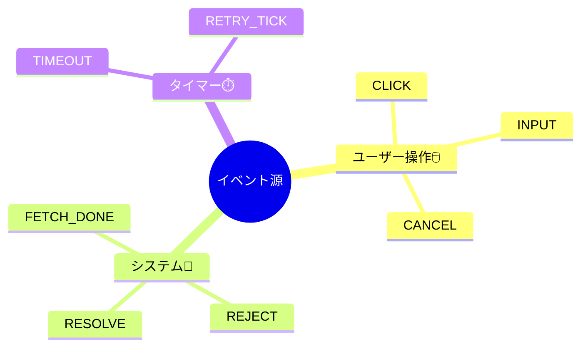

# 第11章：イベント設計（命名と分類）📣

（状態機械が“読みやすくて壊れにくい”設計になる、いちばん効く章だよ〜！🥰）

---

## 1) 今日のゴール🎯

この章が終わったら、あなたは…✨

* 「何をイベントにするか？」が迷わなくなる🧭
* イベント名が統一されて、仕様がスッと読めるようになる📚
* イベントの“種類”が整理できて、バグの入り口が減る🧯
* TypeScriptでイベントを型にして、事故をコンパイルで止められる🚫✅

---

## 2) そもそもイベントって何？🧠💡

イベントは一言でいうと…

**「起きたこと（事実）」** だよ📌✨
「こうしたい（命令）」じゃなくて、「こうなった（事実）」に寄せるのがコツ！

### ✅ 良いイベント（事実）例👍

* `form.submit`（送信が押された）
* `request.succeeded`（通信が成功した）
* `timer.timeout`（タイムアウトした）

### ❌ ちょい危険なイベント（命令っぽい）例⚠️

* `goToSubmitting`（状態を変えろ、みたいな命令）
* `setSuccess`（成功状態にしろ、みたいな命令）
* `updateEverything`（なんでも屋）

イベントが命令っぽいと、状態機械が「ただの操作パネル」になって、後から破綻しやすいよ〜🥺💦

---

## 3) イベントはまず3種類に分ける🧺✨


第11章のメインはここ！
イベントはまず **“発生源”** で分類すると、設計が一気にラクになるよ😊

### A. ユーザー操作イベント🖱️👩‍💻

ユーザーの操作で起きる
例：クリック、入力、キャンセル…など

* `form.change`
* `form.submit`
* `form.cancel`

### B. システム発生イベント🖥️📡

アプリ内部や外部APIの結果で起きる
例：成功、失敗、検証結果…など

* `request.succeeded`
* `request.failed`
* `validation.failed`

### C. タイマー系イベント⏱️⌛

時間経過で起きる
例：タイムアウト、リトライ待ち終了…など

* `timer.timeout`
* `timer.retryElapsed`

この3分類だけで、「イベント一覧」がスッキリして、漏れチェックもしやすくなるよ〜🔍✨




---

## 4) 命名ルール：迷わない“型”を作ろう🧱💕

### 4.1 「名前は仕様」📜✨

イベント名が整うと、状態遷移が **文章みたいに読める** ようになる😊

おすすめの形はこれ👇
**`<ドメイン/対象>.<動詞>`**（ドット区切りが読みやすい！）

例：

* `form.submit`
* `form.change`
* `request.succeeded`
* `request.failed`
* `timer.timeout`

XStateでもイベントは **`type` を持つイベントオブジェクト**で表現されるよ（`type` は文字列、必要なら追加データを載せる）📦✨ ([Stately][1])

---

## 5) Payload（追加データ）は“最小で強い”が正義💪📦

イベントは「起きたこと」だけじゃ足りないことがあるよね。
そのときは **payload（追加データ）** を載せる！

XStateのドキュメントでも、イベントは `type` に加えて必要なデータを同じオブジェクトに入れる形が基本だよ📦 ([Stately][1])

### ✅ payload設計のコツ5つ📝✨

1. **必要最低限だけ**（盛りすぎるとメンテ地獄😵‍💫）
2. **Contextと二重管理しない**（同じ値を2か所に持つのは事故る💥）
3. **「識別に必要なID」は載せる**（例：`requestId`）🪪
4. **エラーは“分類”して持つ**（あとでリトライ設計が超ラク）🚑
5. **シリアライズできる形が安心**（ログやテストが簡単）🧾

---

## 6) 例題：フォーム送信のイベント一覧を作ろう📨✨

題材（最終ゴールに近いやつ）だよ😊
状態はざっくり：`Idle → Editing → Submitting → Success / Error`

### 6.1 イベント候補（分類つき）🧺

**ユーザー操作🖱️**

* `form.change`（入力が変わった）
* `form.submit`（送信した）
* `form.cancel`（キャンセルした）
* `form.reset`（リセットした）

**システム📡**

* `request.succeeded`（送信成功）
* `request.failed`（送信失敗）
* `validation.failed`（入力チェック失敗）

**タイマー⏱️**

* `timer.timeout`（タイムアウト）
* `timer.retryElapsed`（リトライ待ち終了）

ここまで作るだけで、「設計できてる感」めっちゃ出るよ〜🎉💖

---

## 7) TypeScriptでイベントを“型”にする🎫✨（超おすすめ）

イベントが増えてきても破綻しないために、**判別可能ユニオン**にしちゃおう😊
（XState v5でも `setup({ types })` で events の型を設定できるよ〜✨） ([Stately][2])

```ts
type FormField = 'email' | 'password';

type RequestError =
  | { kind: 'network'; message?: string }
  | { kind: 'validation'; field: FormField; message: string }
  | { kind: 'server'; status: number; message?: string };

export type Event =
  | { type: 'form.change'; field: FormField; value: string }
  | { type: 'form.submit' }
  | { type: 'form.cancel' }
  | { type: 'form.reset' }
  | { type: 'validation.failed'; field: FormField; message: string }
  | { type: 'request.succeeded'; requestId: string }
  | { type: 'request.failed'; requestId: string; error: RequestError }
  | { type: 'timer.timeout'; requestId: string };
```

### 7.1 「型がある」と何が嬉しいの？😍

* `type` の打ち間違いが消える🧹
* payloadの渡し忘れが減る✅
* `switch (event.type)` が安全になる🛡️

---

## 8) よくある事故パターン集😱💥（回避しよ！）

### ❌ 事故①：イベント名が“UI依存”すぎる

* `buttonClicked`
  → ボタンが変わったら死ぬ😂
  ✅ `form.submit` みたいに **意味** に寄せる

### ❌ 事故②：イベントが万能すぎる

* `update` / `change` / `doIt`
  → 中身が読めない闇🕳️
  ✅ 「対象 + 動詞」で分ける（`form.change`, `profile.update`）

### ❌ 事故③：イベントが命令になってる

* `setSubmitting`, `goToSuccess`
  ✅ 「起きたこと」にする（`form.submit`, `request.succeeded`）

---

## 9) チェックリスト✅✨（この章のゴール確認）

イベント一覧を見て、これが全部YESならかなり強い💪💖

* [ ] イベントは「起きたこと」になってる？📌
* [ ] 3分類（ユーザー/システム/タイマー）に分けられてる？🧺
* [ ] 命名が統一されてる？（`対象.動詞`）🧱
* [ ] payloadは必要最小限？📦
* [ ] `type` の型がついてる？🎫
* [ ] 「万能イベント」がいない？😵‍💫

---

## 10) AI活用プロンプト集🤖✨（コピペOK）

### 10.1 イベント候補を出してもらう📣

「この仕様から、ユーザー操作/システム/タイマーに分類して、`対象.動詞`形式でイベント名候補を列挙して。payload案も最小で。」

### 10.2 命名の統一チェック🧹

「このイベント一覧、命名の粒度が揃ってるかレビューして。統一ルールを提案して、リネーム案も出して。」

### 10.3 “命令イベント”検出🚨

「このイベント名の中で、命令っぽくて危ないものを指摘して、事実ベースに直した名前を提案して。」

---

## まとめ🎀

イベント設計が上手くなると、状態機械は一気に“設計っぽく”なるよ😊✨
特に **分類（3種類）＋命名ルール（対象.動詞）＋payload最小** だけで、読みやすさが爆上がり📈💖

次の第12章では、このイベントが「行ける/行けない」を決める **ガード（Guard）** に繋がっていくよ〜🛡️✨

---

※ちなみにTypeScriptは2025年後半に **5.9系** が公開されていて（5.9.3など）、次の大きな節目として **TypeScript 6.0（ブリッジ）** や **TypeScript 7（ネイティブ化の進捗）** の公式発表も出てるよ📣（周辺事情として覚えておくと安心！） ([Microsoft for Developers][3])

[1]: https://stately.ai/docs/transitions?utm_source=chatgpt.com "Events and transitions"
[2]: https://stately.ai/docs/setup?utm_source=chatgpt.com "Setup"
[3]: https://devblogs.microsoft.com/typescript/announcing-typescript-5-9/?utm_source=chatgpt.com "Announcing TypeScript 5.9"
