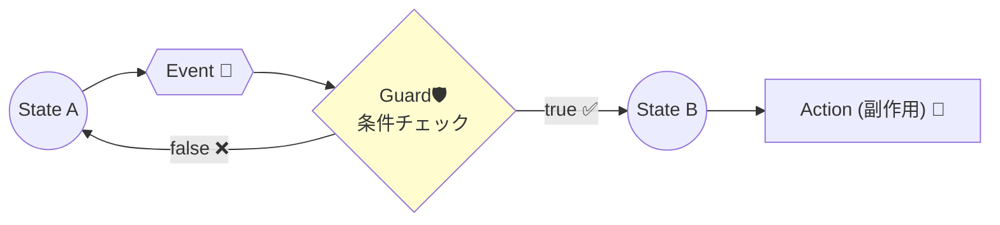

# 第12章：ガード（Guard）で“行ける/行けない”を守る🛡️

「ボタン押されたけど、まだ入力が足りない…😖」
「このユーザー、権限ないのに進めちゃった…😱」
…みたいな“やっちゃダメ”を、**状態機械のルールとしてキレイに閉じ込める**のがガードだよ〜！🧸💕

---

## 🆕 2026-01-20 時点メモ（軽く最新確認）📌

* TypeScript の GitHub Releases 上の Latest は **5.9.3**（Oct 1, 2025）だよ🧡 ([GitHub][1])
* VS Code は「December 2025 release」として **v1.108（Release date: 2026-01-08）** が出てるよ✨ ([Visual Studio Code][2])

（バージョンが何であっても、この章の“ガードの考え方”はそのまま強いよ💪🌸）

---

## 1) ガードってなに？🚧➡️🚦


**ガード（Guard）＝「その遷移、していい？」を判定する条件**だよ😊✨
ざっくり言うと、**遷移の門番**🛡️

* ガードが `true` 👉 遷移してOK ✅
* ガードが `false` 👉 その遷移は起きない（別の遷移を探す or 何もしない）🚫

XState のドキュメントでも、ガードは「イベント処理のときにチェックされる条件関数」って説明されてるよ🧠✨ ([Stately][3])
用語集的にも「遷移に宣言され、true のときだけ遷移する」って定義だね📚 ([Statecharts][4])




---

## 2) なんでガードが大事なの？💖

ガードがないと、条件分岐がこうなる👇😵‍💫

* 画面側に if が増える
* API 前後に if が増える
* 状態のあちこちで同じ条件を見始める
* いつの間にか “仕様” が散らかって、抜け漏れ祭り🎆😱

ガードを使うと、条件は **「遷移」** に集まるので…

✅ **仕様が読みやすい**（表や図にそのまま書ける）
✅ **抜け漏れに気づきやすい**
✅ **テストしやすい**（ガード関数だけテストできる）

---

## 3) ガードに入れていいもの / ダメなもの🙅‍♀️✅

### ✅ ガードに入れていい（おすすめ）🌟

* 入力が揃ってる？（必須項目OK？）📝
* 権限ある？（role が admin？）🔑
* 在庫ある？（stock > 0？）📦
* すでに送信中じゃない？（二重送信防止）🧯

👉 **「今ある情報で、true/false がすぐ決まる」**ものが向いてるよ😊

### 🙅‍♀️ ガードに入れない（事故りやすい）💥

* API を呼ぶ（副作用）📡❌
* ログを書く（副作用）🪵❌
* ランダムや時刻に依存（テストつらい）🎲⏰❌
* 重い計算を入れる（見通し悪化）🧱❌

ガードはできるだけ **“純粋関数っぽく”**（読むだけ・判定だけ）にすると安定するよ🧁✨

---

## 4) ガードの命名ルール（地味に超効く）🧠✨

おすすめはこの3つ💕

* `canSubmit`（〜できる？）
* `isValidEmail`（〜は正しい？）
* `hasPermission`（〜を持ってる？）

ポイント👇

* **否定形は避ける**（`notInvalid` みたいなの地獄😇）
* **短い1ルール**にする（“なんでも判定関数”にしない）

---

## 5) 例題：フォーム送信のガード設計📨✨（超実務っぽい！）

「送信ボタン押した！」イベントが来たときに…

* 入力OK 👉 `Submitting` へ
* 入力NG 👉 遷移しない（または `Editing` に留まる）

ここでガードが活躍するよ🛡️💕

### 5-1) まずは型を用意しよ〜🧩

```typescript
type State = "Editing" | "Ready" | "Submitting" | "Success" | "Error";

type Event =
  | { type: "INPUT_CHANGED"; field: "email" | "password"; value: string }
  | { type: "SUBMIT_CLICKED" }
  | { type: "API_OK" }
  | { type: "API_FAIL"; message: string };

type Context = {
  email: string;
  password: string;
  // 「今の入力はOK？」を毎回計算してもいいけど、
  // ここでは分かりやすく errors を持つ例にするよ😊
  errors: {
    email?: string;
    password?: string;
  };
};
```

---

### 5-2) ガード関数を作る🛡️✨

```typescript
function canSubmit(ctx: Readonly<Context>): boolean {
  const hasNoErrors = Object.keys(ctx.errors).length === 0;
  const hasEmail = ctx.email.trim().length > 0;
  const hasPassword = ctx.password.trim().length > 0;

  return hasNoErrors && hasEmail && hasPassword;
}
```

💡ここ大事！

* `Readonly` にして「判定しかしないよ」感を出すと事故りにくい😊
* **“今ある情報だけ”**で true/false を返してるよね✅

---

### 5-3) 「遷移定義」にガードをくっつける💞

「イベントごとに、遷移候補を並べて、上から順にガードを見る」方式が分かりやすいよ〜😊✨

```typescript
type Transition = {
  target: State;
  guard?: (ctx: Readonly<Context>, ev: Readonly<Event>) => boolean;
};

type TransitionTable = {
  [S in State]?: Partial<Record<Event["type"], Transition[]>>;
};

const transitions = {
  Ready: {
    SUBMIT_CLICKED: [
      { target: "Submitting", guard: (ctx) => canSubmit(ctx) },
      // guard が false のときはここに落ちる（＝遷移しない/または別の状態へ）
      { target: "Editing" },
    ],
  },
  Submitting: {
    API_OK: [{ target: "Success" }],
    API_FAIL: [{ target: "Error" }],
  },
} satisfies TransitionTable;
```

`satisfies` を使うと「型チェックはするけど、推論は壊さない」感じで気持ちいいよ🫶
TypeScript の公式ドキュメントでも `satisfies` の説明があるよ📘 ([TypeScript][5])

---

### 5-4) 遷移を実行する関数（超ミニ）🚀

```typescript
function nextState(
  state: State,
  ctx: Context,
  ev: Event
): State {
  const candidates = transitions[state]?.[ev.type] ?? [];

  for (const t of candidates) {
    if (!t.guard || t.guard(ctx, ev)) return t.target;
  }

  // 候補がない / 全部 guard NG のときは「状態維持」
  return state;
}
```

これで、`Ready` で `SUBMIT_CLICKED` が来ても、`canSubmit` が false なら `Submitting` に行けない！🛡️✨
（この章のゴール達成〜！🎉🎉）

---

## 6) ガードが false のとき、どうする？（設計の分かれ道）🧭✨

ここはチームやプロダクト方針が出るとこだよ😊
よくある3パターン👇

### A) 何もしない（状態維持）🧘‍♀️

* いちばん安全
* でも「なぜ反応しない？」が分かりにくいことも😖

### B) 別の状態へ（例：Editing に戻す）↩️

* UI 的に分かりやすい
* “戻し先”が設計に増える

### C) 「無効操作」用の状態/通知を用意する🔔

* 親切だけど、状態やアクション設計が必要
* これは次章（アクション）とセットで強い💪✨

この章では B までできれば十分だよ〜🌸

---

## 7) ガード設計チェックリスト✅🧡

実装前にこれ見て〜！👀✨

* [ ] ガードは **true/false だけ**を返してる？
* [ ] **副作用**（API/ログ/保存）入ってない？
* [ ] 条件が長すぎない？（長いなら分割できる？）
* [ ] 名前が `can/is/has` 系で読みやすい？
* [ ] “同じ条件” をあちこちにコピペしてない？

---

## 8) ミニ演習（手を動かすと一気に定着するよ🧪✨）

### 演習1：ログインのガードを作ろう🔐

状態はこんなイメージ👇

* `Editing`（入力中）
* `Ready`（入力OK）
* `Submitting`（送信中）

やること📝

1. `canLogin(ctx)` を作る（email/password 必須 + errors 空）
2. `Ready` の `SUBMIT_CLICKED` にガード付き遷移を付ける
3. ガードNGなら `Editing` に戻す（または状態維持でもOK）

---

## 9) AI活用プロンプト集（コピペOK）🤖✨

Copilot / Codex に投げるならこんな感じが便利だよ〜🌷

* 「この仕様から、ガード候補を `canXxx` 命名で列挙して🛡️」
* 「ガード関数に副作用が混ざってないかレビューして🔍」
* 「遷移表に guard を入れる形の TypeScript 例を作って（satisfies 使用）🧩」
* 「guard が false のときの UX を 3案出して、メリデメも添えて😊」

---

## まとめ🌸✨

* ガードは **“遷移していいか？”** を守る門番🛡️ ([Stately][3])
* 条件分岐を散らさず、**遷移に集約**できるのが最強ポイント💪
* ガードは **副作用なし・短く・命名きれい** が勝ち🏆
* `satisfies` を使うと、遷移表を型で守りやすい🧩 ([TypeScript][5])

---

次の第13章は、いよいよ「遷移したときに何するの？」＝**アクション（Action）**だよ🧰✨
ガードで“行ける/行けない”を決めて、アクションで“やること”を整理すると、めちゃ気持ちよく設計できるよ〜！🎀

[1]: https://github.com/microsoft/typescript/releases "Releases · microsoft/TypeScript · GitHub"
[2]: https://code.visualstudio.com/updates "December 2025 (version 1.108)"
[3]: https://stately.ai/docs/guards?utm_source=chatgpt.com "Guards - Condition function"
[4]: https://statecharts.dev/glossary/guard.html?utm_source=chatgpt.com "Guard - Glossary"
[5]: https://www.typescriptlang.org/docs/handbook/release-notes/typescript-5-0.html?utm_source=chatgpt.com "Documentation - TypeScript 5.0"
