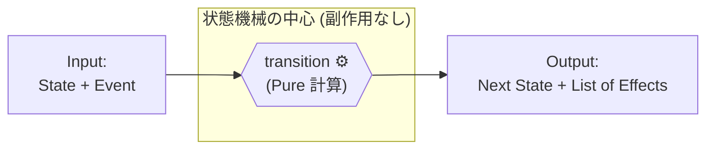

# 第13章：アクション（Action）で“遷移時の処理”を決める🧰

この章は **「状態が変わる瞬間に、何をする？」** をスッキリ整理する回だよ〜😊🌸
状態機械が強くなる分かれ道はここ！💪✨（雑にすると、また if 地獄に戻っちゃう😇）

---

## 1) この章のゴール🎯💖

* 「遷移するときに起きる処理（アクション）」を **棚卸し**できる📦✨
* 「その処理、状態機械の中でやる？外でやる？」を **迷わず決められる**🧠✅
* TypeScriptで **壊れにくい書き方**（Effect方式）で実装できる🧑‍💻🌈




---

## 2) まず用語をふわっと整理🧸📌

### ✅ Guard（ガード）🛡️

「遷移していい？」の **条件チェック**。
例：未入力なら送信しない、など✋

### ✅ Action（アクション）🧰

「遷移したときにやること」
例：ログを書く、API開始、通知、保存、画面メッセージ更新…など📣💾🌐

ここで超大事なのが…👇

> **状態変更（State/Contextの更新）** と **副作用（I/O）** をゴチャ混ぜにしない🧯✨

副作用っていうのは、API呼び出し・Storage保存・ログ出力・通知・タイマー開始みたいな「外の世界に触るやつ」だよ🌍⚡

---

## 3) アクション設計の“鉄板ルール”3つ🥇✨

### ルール①：状態遷移の中心は「できれば純粋」に🍰

理想はこれ👇

* **中心**：`今の状態 + イベント → 次の状態 + やりたいこと(Effect)`
* **外側**：Effectを見て、API叩いたりログ書いたり実行する

こうすると…
✅ テストが爆速で簡単🧪✨
✅ 実装が読みやすい👀
✅ バグの場所がすぐ分かる🔍

> ちなみに最近のTypeScript 5.9は「副作用のコントロール」を意識した `import defer`（モジュールの副作用実行を遅らせる）も入ってて、こういう“副作用を管理する発想”と相性がいいよ〜📦✨ ([TypeScript][1])

---

### ルール②：Actionは「名前」が9割📛💖

良い名前は、読んだ瞬間に目的が伝わる😊

* ✅ `logTransition`
* ✅ `startSubmitRequest`
* ✅ `showErrorMessage`
* ✅ `persistDraft`

逆にふわっとしたのは事故る😇

* ❌ `doProcess`
* ❌ `handleThing`
* ❌ `update`

---

### ルール③：Actionの置き場所は3択で決める🎛️✨


アクションって「いつ起きる？」で分けるとスッキリするよ👇

1. **遷移アクション（Transition）**：イベントを受けて状態が変わる瞬間
2. **入場アクション（Entry）**：ある状態に入った瞬間
3. **退場アクション（Exit）**：ある状態を出る瞬間

初心者はまず **遷移アクション中心** でOK🙆‍♀️✨
（Entry/Exitは、状態が増えてきたら強い💪）

---

## 4) まずは棚卸し！「アクション台帳」を作ろう📒✨

おすすめはこの3列で書くこと😊🖊️

* **何をする？（目的）**
* **いつ？（どの遷移/どの状態）**
* **副作用？（外に出す？）**

例（フォーム送信の世界）👇

| 目的✨           | いつ？⏱️                  | 副作用？🌍                    |
| ------------- | ---------------------- | ------------------------- |
| 送信開始ログを書く🪵   | `Editing + SUBMIT`     | ✅副作用（外）                   |
| API送信を開始する🌐  | `Editing + SUBMIT`     | ✅副作用（外）                   |
| 送信中メッセージを表示🧾 | `Submittingに入った`       | UIなら外（or 表示用データをContextへ） |
| 成功トースト表示🎉    | `Submitting + RESOLVE` | ✅副作用（外）                   |
| エラー表示🚨       | `Submitting + REJECT`  | 表示用データをContextへ + UI表示は外  |

ポイント：
**UIの表示そのもの**（DOM操作/トースト表示）は基本「外」へ。
中心は「表示すべき情報」をContextに入れるのがきれい✨🧠

---

## 5) TypeScriptで“安全に”書く：Effect方式（超おすすめ）🍰🧪

ここからは「状態遷移は純粋、やりたいことはEffectとして返す」の王道パターンだよ😊✨

### 5-1) 型を用意する🧩

```ts
type State =
  | { kind: "Editing" }
  | { kind: "Submitting"; requestId: string }
  | { kind: "Success" }
  | { kind: "Error"; message: string };

type Event =
  | { type: "SUBMIT" }
  | { type: "RESOLVE" }
  | { type: "REJECT"; reason: string }
  | { type: "EDIT" };

type Effect =
  | { type: "Log"; message: string }
  | { type: "CallSubmitApi"; requestId: string }
  | { type: "ShowToast"; message: string };

type TransitionResult = {
  state: State;
  effects: Effect[];
};
```

---

### 5-2) 遷移関数（Reducerっぽいやつ）を書く🚦

```ts
function transition(state: State, event: Event): TransitionResult {
  switch (state.kind) {
    case "Editing": {
      switch (event.type) {
        case "SUBMIT": {
          const requestId = crypto.randomUUID();
          return {
            state: { kind: "Submitting", requestId },
            effects: [
              { type: "Log", message: `submit start: ${requestId}` },
              { type: "CallSubmitApi", requestId },
            ],
          };
        }
        case "EDIT":
        case "RESOLVE":
        case "REJECT":
          return { state, effects: [] };
      }
    }

    case "Submitting": {
      switch (event.type) {
        case "RESOLVE":
          return {
            state: { kind: "Success" },
            effects: [{ type: "ShowToast", message: "送信できたよ🎉" }],
          };
        case "REJECT":
          return {
            state: { kind: "Error", message: event.reason },
            effects: [{ type: "Log", message: `submit failed: ${event.reason}` }],
          };
        case "SUBMIT":
        case "EDIT":
          return { state, effects: [] };
      }
    }

    case "Success":
    case "Error": {
      // ここは例として雑に。必要ならイベントで戻せるように設計するよ😊
      return { state, effects: [] };
    }
  }
}
```

この形だと、中心は **計算だけ**。
APIは叩いてない！ログも書いてない！偉い！👏✨

---

### 5-3) Effectを実行する“外側”を書く🌿

```ts
type Deps = {
  log: (msg: string) => void;
  submitApi: (requestId: string) => Promise<void>;
  toast: (msg: string) => void;
};

async function runEffects(effects: Effect[], deps: Deps) {
  for (const e of effects) {
    switch (e.type) {
      case "Log":
        deps.log(e.message);
        break;
      case "CallSubmitApi":
        await deps.submitApi(e.requestId);
        break;
      case "ShowToast":
        deps.toast(e.message);
        break;
    }
  }
}
```

これで、状態機械は **「何をしたいか」** だけを返して、
実行は外でやってくれる💖✨

---

## 6) よくある事故パターン集😱🧯

### ❌ 事故①：遷移関数の中でAPI叩く🌐💥

* テストしにくい
* 失敗時に状態が中途半端
* リトライが地獄

→ ✅ **Effectで返して外で実行**！

---

### ❌ 事故②：アクションがContextを直接いじりまくる🧟‍♀️

どこで何が変わったか分からなくなるやつ😇

→ ✅ Contextの更新も「遷移の中心」で明示する

---

### ❌ 事故③：副作用が“importした瞬間”に走る🔥

例えば、モジュールのトップレベルで初期化が走ってログや通信が起きる、みたいなやつ💣
最近のTypeScript 5.9は `import defer` で「副作用の実行タイミングを遅らせる」方向の仕組みも出てきてるよ（対応ランタイム等は注意）📦✨ ([TypeScript][1])

---

## 7) テストが一気に楽になる🧪🎉（Effect方式のご褒美）

遷移関数が純粋だと、テストはこうなる👇

```ts
import { describe, it, expect } from "vitest";

describe("transition", () => {
  it("Editing + SUBMIT -> Submitting and effects", () => {
    const res = transition({ kind: "Editing" }, { type: "SUBMIT" });
    expect(res.state.kind).toBe("Submitting");
    expect(res.effects.some(e => e.type === "CallSubmitApi")).toBe(true);
  });
});
```

「APIが飛んだか？」じゃなくて、
**“飛ばすべきEffectが出たか？”** を見るのがコツ😊✨

---

## 8) AI活用プロンプト集🤖🌸（そのままコピペOK）

### ✅ アクション棚卸し

* 「この仕様の状態遷移ごとに、必要なアクション候補を一覧化して。副作用かどうかも分類して」

### ✅ 置き場所レビュー

* 「このアクションは Transition / Entry / Exit のどこに置くのが自然？理由つきで3案」

### ✅ Effect設計レビュー

* 「Effectの型定義が増えすぎないように整理して。統合できるものがあれば提案して」

### ✅ 禁止遷移時の方針

* 「禁止遷移が来たとき、無視/エラー/ログのどれが良い？ユーザー体験も含めて比較して」

---

## 9) 章末まとめ📌💖

* Actionは「遷移時にやること」🧰
* でも、**中心は計算（純粋）**、**副作用は外** が超おすすめ🍰✨
* まずは「アクション台帳」で棚卸し📒
* TypeScriptでは **Effect方式**がテスト最強🧪🎉

---

## ちょい最新メモ🗞️✨（本日時点の動き）

* 安定版の最新は TypeScript 5.9.3（npmのLatest表示）だよ📦 ([npm][2])
* そして次世代として、TypeScript 6/7（Goでのネイティブ化）が早期2026目標として言及されてる（編集体験や性能改善が主目的）🚀 ([InfoWorld][3])

---

次の第14章は「副作用って何？（純粋/非純粋の分離）」💥➡️🌼
今日のAction整理ができてると、ここがめちゃ気持ちよく進むよ〜😊💖

[1]: https://www.typescriptlang.org/docs/handbook/release-notes/typescript-5-9.html "TypeScript: Documentation - TypeScript 5.9"
[2]: https://www.npmjs.com/package/typescript?utm_source=chatgpt.com "typescript"
[3]: https://www.infoworld.com/article/4100582/microsoft-steers-native-port-of-typescript-to-early-2026-release.html "Microsoft steers native port of TypeScript to early 2026 release | InfoWorld"
