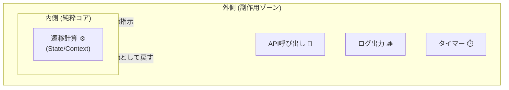

# 第14章：副作用って何？（純粋/非純粋の分離）💥➡️🌼

## 0) この章のゴール🎯✨

この章を終えたら…👇

* 「これは副作用？それとも純粋？」を見分けられるようになる👀
* 状態機械の“中心（コア）”をテストしやすい形にできる🧪💕
* 「副作用は外側へ」が自然にできるようになる🚪✨

---

## 1) 副作用（Side Effect）ってなに？🤔💭


めちゃ雑に言うと…

**「関数が値を返す以外に、外の世界に影響しちゃうこと」** だよ🌍💥

たとえば👇

* 🌐 API呼び出し（fetch）
* 💾 localStorage / DB への保存
* ⏱️ setTimeout / setInterval
* 🧭 画面遷移（URL変更）
* 📣 console.log / ログ送信 / 分析イベント送信
* 🎲 Math.random / 🕰️ Date.now（毎回結果が変わる＝外部依存）

Reduxの世界でも「Reducerは副作用NG（純粋であるべき）」ってハッキリ書かれてるよ🧼✨（`Date.now()` や API、タイマーもNG例に入ってる） ([Redux][1])

---

## 2) なんで分けるの？（分けないと何がつらい？）😵‍💫💦


### ✅ 分けると嬉しいこと（超重要）💖

1. **テストがラク**🧪✨

   * 純粋な中心だけなら、入力→出力を見るだけでOK
2. **バグが減る**🧯

   * “いつ”“どこで”APIが飛ぶかが明確になる
3. **実装の変更に強い**🏗️

   * fetch→axios、localStorage→IndexedDB…みたいな入れ替えが外側だけで済む
4. **設計がキレイ**🫧

   * 状態機械が「仕様（遷移）」に集中できる

---

## 3) 「純粋（Pure）」ってどういう状態？🧼✨


純粋な関数はこんな感じ👇

* 同じ入力なら、**絶対に同じ出力**
* 外部のもの（時刻・乱数・グローバル変数・I/O）に依存しない
* 関数の外を変更しない（書き換えない）

つまり状態機械の中心は、理想はこう👇

> **(state, event, context) → nextState（＋必要なら“やることの指示”）**

---

## 4) 状態機械における「副作用の正しい置き場所」🏠✨

### 🧠 イメージ：ドーナツ構造🍩


* 🍩真ん中（コア）＝純粋：遷移の計算
* 🍩外側（殻）＝副作用：API/保存/タイマーなど




XStateみたいなライブラリだと、遷移に紐づく “Actions” を「fire-and-forget の effects」として扱う説明があるよ🔥 ([Stately][2])
（この教材ではまず「コアは純粋」を軸に、外側に副作用を寄せる練習をするね☺️）

---

## 5) 実装して体で覚える💪✨：「純粋な遷移 + Effect（やること指示）」方式


この章では、**遷移関数は純粋**にして、
必要な副作用は **Effect（命令のメモ）として返す** 方式でいくよ📝✨

---

## 6) ミニ例題：フォーム送信マシン📨✨（副作用を外に出す練習）

### 6-1) 状態・イベント・Effectを用意しよう🧩

```ts
// state
type State =
  | { tag: "Editing"; draft: string }
  | { tag: "Submitting"; draft: string }
  | { tag: "Success" }
  | { tag: "Error"; message: string };

// event
type Event =
  | { type: "CHANGE"; value: string }
  | { type: "SUBMIT" }
  | { type: "API_OK" }
  | { type: "API_NG"; message: string }
  | { type: "RESET" };

// effect = 副作用の「指示書」(まだ実行しない！)
type Effect =
  | { type: "POST_FORM"; payload: { draft: string } }
  | { type: "LOG"; message: string };
```

### 6-2) 純粋な遷移関数（ここに fetch を書かない！）🧼✨


```ts
type TransitionResult = { next: State; effects: Effect[] };

function transition(state: State, event: Event): TransitionResult {
  switch (state.tag) {
    case "Editing": {
      switch (event.type) {
        case "CHANGE":
          return { next: { tag: "Editing", draft: event.value }, effects: [] };

        case "SUBMIT":
          return {
            next: { tag: "Submitting", draft: state.draft },
            effects: [
              { type: "LOG", message: "submit clicked" },
              { type: "POST_FORM", payload: { draft: state.draft } },
            ],
          };

        default:
          return { next: state, effects: [] };
      }
    }

    case "Submitting": {
      switch (event.type) {
        case "API_OK":
          return { next: { tag: "Success" }, effects: [{ type: "LOG", message: "api ok" }] };

        case "API_NG":
          return { next: { tag: "Error", message: event.message }, effects: [{ type: "LOG", message: "api ng" }] };

        default:
          return { next: state, effects: [] };
      }
    }

    case "Error": {
      if (event.type === "RESET") return { next: { tag: "Editing", draft: "" }, effects: [] };
      return { next: state, effects: [] };
    }

    case "Success": {
      if (event.type === "RESET") return { next: { tag: "Editing", draft: "" }, effects: [] };
      return { next: state, effects: [] };
    }
  }
}
```

👀ポイント：

* ここには **fetch / localStorage / Date.now** が一切ない✨
* 代わりに「POST_FORMしてね」という **Effect** を返してる📩

---

## 7) 外側でEffectを実行する（ここが副作用ゾーン）🌋➡️🌿

※ 次章（第15章）で本格的にやるけど、先に“空気”だけ掴もうね☺️

```ts
type Deps = {
  postForm: (draft: string) => Promise<void>;
  log: (msg: string) => void;
};

// 例：effectを実行して、結果を Event として返す（マシンに戻す）
async function runEffects(effects: Effect[], deps: Deps): Promise<Event[]> {
  const out: Event[] = [];

  for (const e of effects) {
    if (e.type === "LOG") {
      deps.log(e.message);
    }
    if (e.type === "POST_FORM") {
      try {
        await deps.postForm(e.payload.draft);
        out.push({ type: "API_OK" });
      } catch (err: any) {
        out.push({ type: "API_NG", message: String(err?.message ?? err) });
      }
    }
  }

  return out;
}
```

---

## 8) テストが急に簡単になる🧪💕（Vitestで“中心だけ”検証）


Vitest 4 が出ていて、移行ガイドやカバレッジの説明も更新されてるよ📘✨ ([vitest.dev][3])

### ✅ 純粋な transition のテスト例

```ts
import { describe, it, expect } from "vitest";

describe("transition", () => {
  it("Editing + SUBMIT -> Submitting and POST_FORM effect", () => {
    const s = { tag: "Editing", draft: "hello" } as const;
    const r = transition(s, { type: "SUBMIT" });

    expect(r.next).toEqual({ tag: "Submitting", draft: "hello" });
    expect(r.effects).toEqual([
      { type: "LOG", message: "submit clicked" },
      { type: "POST_FORM", payload: { draft: "hello" } },
    ]);
  });
});
```

💡ここ、気持ちいいポイント😍

* ネットワークもタイマーも関係なく、秒でテストできる⚡

---

## 9) よくある事故パターン集😱（ここ踏みがち！）

### ❌ 事故1：transitionの中でfetchしちゃう🌐💥

* テストが重くなる
* エラーが状態遷移と混ざって地獄👹

### ❌ 事故2：Date.now / Math.random をコアで使う🕰️🎲

Reduxの注意でも「non-pure関数はNG例」って言ってるやつ！ ([Redux][4])
✅ 対策：

* `now` を Event に載せる（例：`{type:"TICK", now:number}`）
* 乱数も「生成した値」を Event に載せて渡す

### ❌ 事故3：ログ/分析を散らかす📣💥

✅ 対策：

* LOGもEffectにする（今回みたいに）
* 実行場所を1箇所に集約✨

---

## 10) ワーク（3段階）✍️✨

### 🌱 Lv1（判定ゲーム）

次のうち「副作用」を選んでね👇

* A: `state.tag === "Editing"` を読む
* B: `localStorage.setItem(...)`
* C: `Date.now()`
* D: `transition(state, event)` が `next` を返す

👉答え：B / C が副作用（または非純粋）だよ💾🕰️✨

### 🌿 Lv2（Effectを増やす）

`Effect` に `SAVE_DRAFT` を追加して、`CHANGE` のたびに
「下書きを保存してね💾」って指示を返すようにしてみよう！

### 🌳 Lv3（失敗をイベントに戻す）

`runEffects` から返す `API_NG` に、

* `message` だけじゃなく
* `code`（例：`"NETWORK" | "VALIDATION" | "UNKNOWN"`）
  も付けてみよう🚨✨

---

## 11) AI活用プロンプト集🤖💖（コピペでOK）

* 「この関数の中に副作用があるか指摘して。理由も」
* 「この処理を“純粋な遷移”と“Effect実行”に分割して」
* 「Effectの型（union）を提案して。命名は統一感ある英語で」
* 「transitionのテストケースを、抜けが出にくい観点で追加して」

---

## 12) おまけ：2026年1月20日時点の“最新寄り”メモ📝✨

* TypeScriptは 5.9 が公式リリースとして案内されていて、ドキュメントも更新されてるよ📘 ([Microsoft for Developers][5])
* TypeScriptの“ネイティブ化”に向けた TypeScript 7 のプレビュー情報も出てる（VS 2026 など）🚀 ([Microsoft Developer][6])
* Node.jsは v24 が Active LTS、v25 が Current として更新されてるよ🟩 ([Node.js][7])

---

## まとめ🎉✨

* **副作用＝外の世界に触ること**（API/保存/タイマー/時刻/乱数も！）💥
* **状態機械の中心は純粋に**すると、テストも保守も一気にラク🧪💕
* **副作用はEffectとして“指示”にして外へ**🚪✨

次の第15章では、この「外側（I/O境界）」をもっとキレイに切るよ〜！🍩💖

[1]: https://redux.js.org/style-guide/?utm_source=chatgpt.com "Redux Style Guide"
[2]: https://stately.ai/docs/actions?utm_source=chatgpt.com "Actions"
[3]: https://vitest.dev/blog/vitest-4?utm_source=chatgpt.com "Vitest 4.0 is out!"
[4]: https://redux.js.org/usage/structuring-reducers/prerequisite-concepts?utm_source=chatgpt.com "Prerequisite Reducer Concepts"
[5]: https://devblogs.microsoft.com/typescript/announcing-typescript-5-9/?utm_source=chatgpt.com "Announcing TypeScript 5.9"
[6]: https://developer.microsoft.com/blog/typescript-7-native-preview-in-visual-studio-2026?utm_source=chatgpt.com "TypeScript 7 native preview in Visual Studio 2026"
[7]: https://nodejs.org/en/about/previous-releases?utm_source=chatgpt.com "Node.js Releases"
